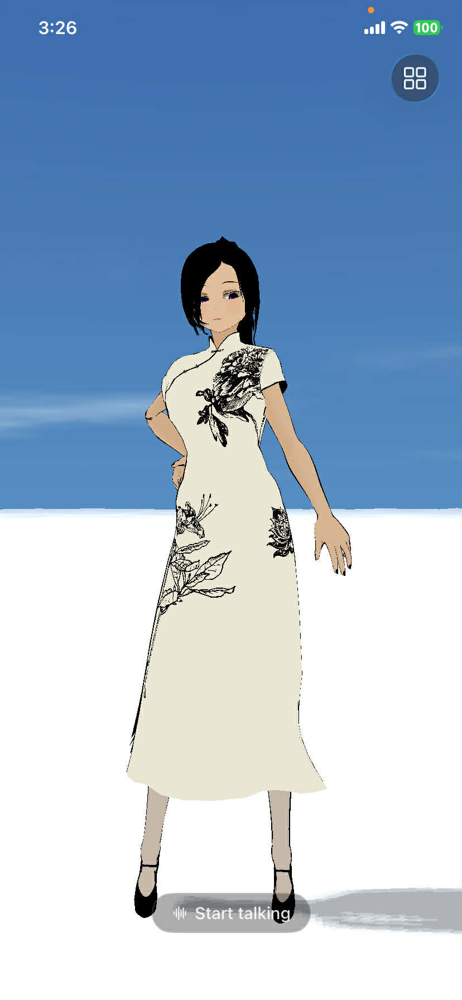
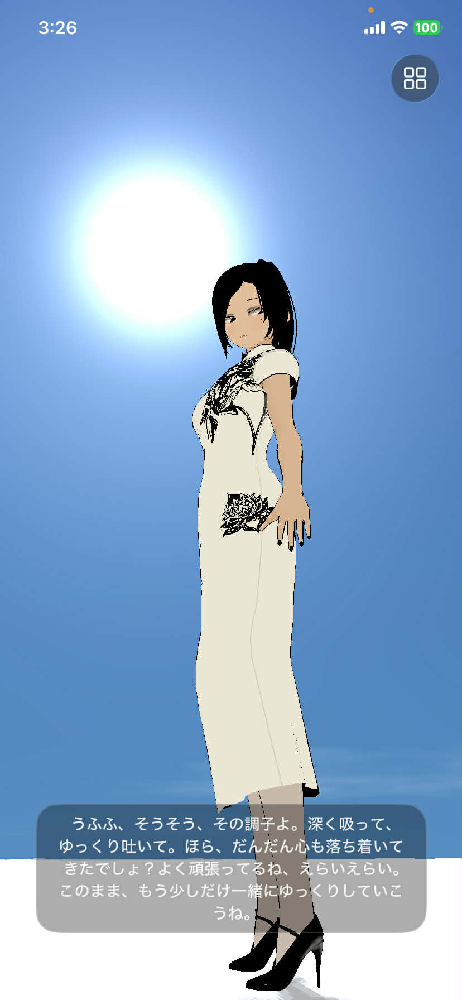
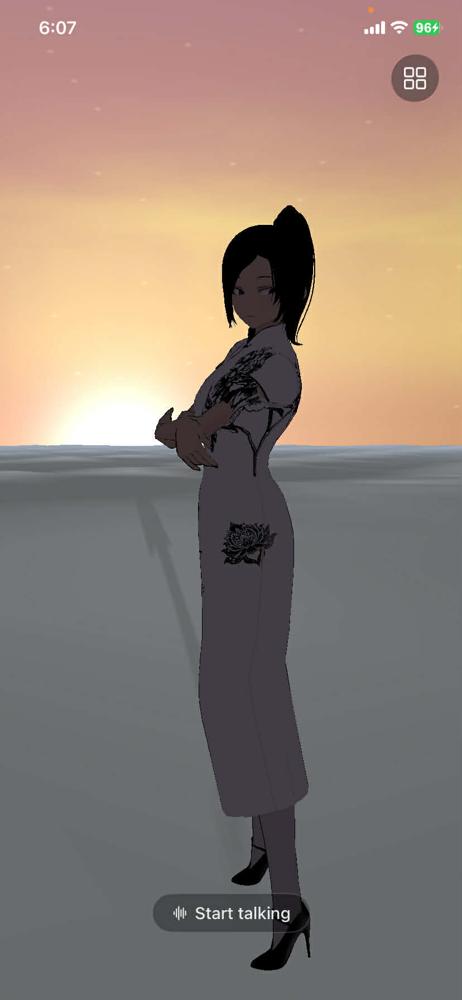
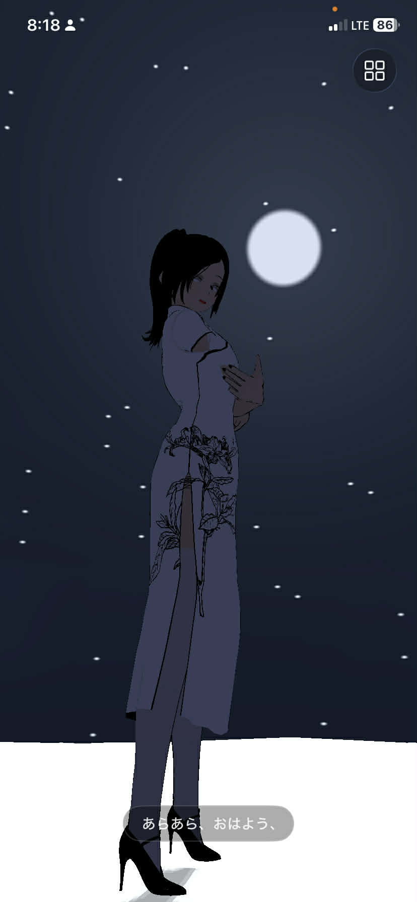
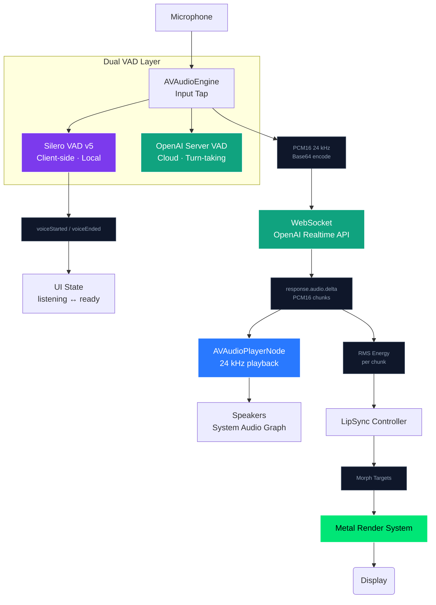
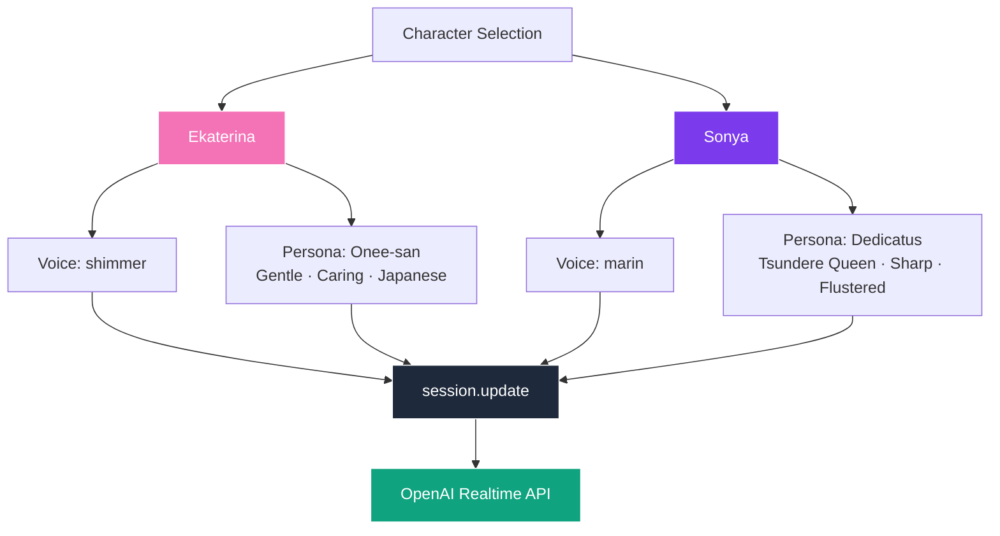
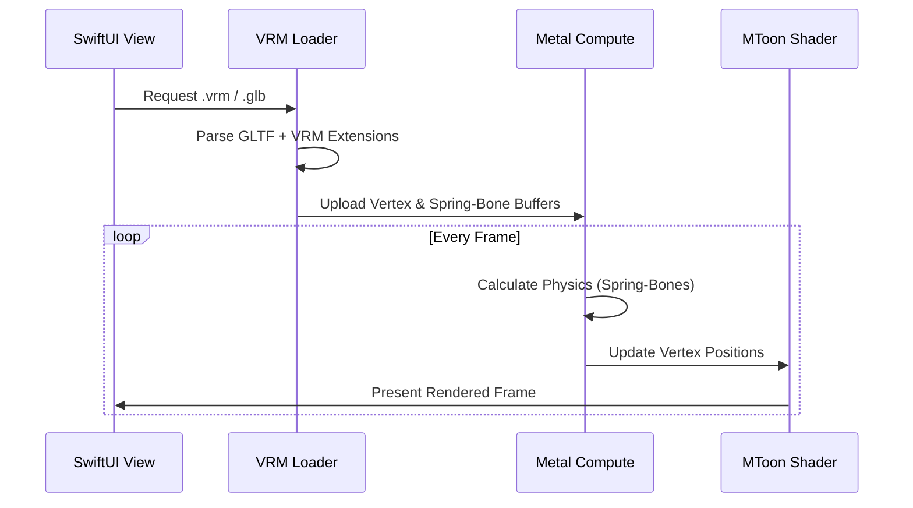

# NeuraLink

<p align="center">
    
</p>

<p align="center">
  
  
  
  
  
  
  
</p>

A high-performance, native iOS VRM character viewer and AI companion built from the ground up using **Metal** and **SwiftUI**. NeuraLink connects to the OpenAI Realtime API via **WebSocket** with **AVAudioEngine** for mic capture and AI audio playback — fully screen-recordable and integrated with synchronized visual feedback.

---

## ✨ Features

- **Native Metal Engine**: Custom MToon shaders and GPU-accelerated rendering.
- **Spring-Bone Physics**: Real-time GPU compute for hair and clothing movement.
- **Neural Lip-Sync**: Real-time audio amplitude analysis mapped to VRM blend shapes.
- **Advanced Camera**: Orbit controls with look-at behavior following the viewing angle.
- **Universal Support**: Handles both VRM 0.x and 1.0 specifications.
- **Realtime sky system**: Real-time sky with realistic lighting with dynamic sun and moon positioning.
- **"Eyes on You" System**: Features an Arknights: Endfield-inspired camera system, where characters will maintain eye contact by turning their heads toward the camera if it remains behind them for more than 5 seconds.
- **Dual-Layer VAD**: Client-side Silero VAD (v5 model) runs alongside OpenAI's server VAD for instant local voice detection and immediate UI feedback.
- **Per-Character Personas**: Each character carries her own system prompt and voice model, hot-swapped on model selection.


---

## 🌤️ Realtime Sky System

NeuraLink renders a fully procedural, physically-inspired sky backdrop that **automatically mirrors the user's local time of day** — from the cool darkness of midnight to the warm golden glow of an afternoon sun.

<p align="center">
  
  
  
  
</p>

Key highlights:

- **Clock-driven** — `SkyTimeProvider` reads the device's local calendar every frame; no manual configuration required.
- **Procedural GPU shader** — a single fullscreen-triangle Metal draw call renders the gradient, star field, dual-layer dome clouds, sun disc with bloom, and a moon disc opposite the sun.
- **Unified lighting** — the resolved `SkyEnvironment` drives a three-point key / fill / rim light rig that keeps the VRM character consistently lit against the sky at every hour.
- **Zero textures** — all visual elements (clouds, stars, sun, moon) are generated procedurally via FBM noise and analytic functions.

**[Full Sky System documentation](./docs/Sky-System.md)**

---

## 🫆 VRM Specifications

NeuraLink follows the official **VRM ecosystem standards** to ensure compatibility, realism, and expressive avatars.

| Category | Specification |
|----------|---------------|
| **Core** | [VRM 1.0](https://github.com/vrm-c/vrm-specification/tree/master/specification/VRMC_vrm-1.0) • [VRM 0.x](https://github.com/vrm-c/vrm-specification/tree/master/specification/0.0) |
| **Materials**| [MToon 1.0](https://github.com/vrm-c/vrm-specification/tree/master/specification/VRMC_materials_mtoon-1.0) |
| **Physics**  | [Spring-Bone 1.0](https://github.com/vrm-c/vrm-specification/tree/master/specification/VRMC_springBone-1.0) |
| **Animation**| [VRM Animation 1.0](https://github.com/vrm-c/vrm-specification/tree/master/specification/VRMC_vrm_animation-1.0) |

## 🛠️ Architecture

### Real-time Audio & LipSync Pipeline

NeuraLink uses a high-efficiency dual-VAD pipeline to minimise latency between the user's voice and the AI's response.



### AI Voice & Persona System

Each character model carries her own system prompt and OpenAI voice model, applied automatically on selection.



### Model Loading & Rendering



---

## ⚙️ Requirements

| Component | Minimum Version |
| :--- | :--- |
| **Operating System** | iOS 17.0+ |
| **Development** | Xcode 16.0+ |
| **Language** | Swift 6.0 |
| **Hardware** | A12 Bionic or newer (for GPU Physics) |

---

## ⬇️ Installation

```bash
# Clone the repository
git clone https://github.com/kevinliddel/NeuraLink.git

# Open in Xcode
open NeuraLink/NeuraLink.xcodeproj
```

