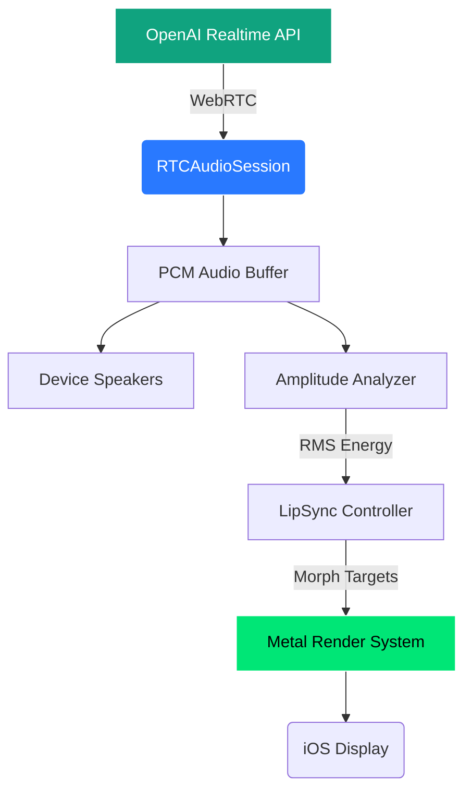
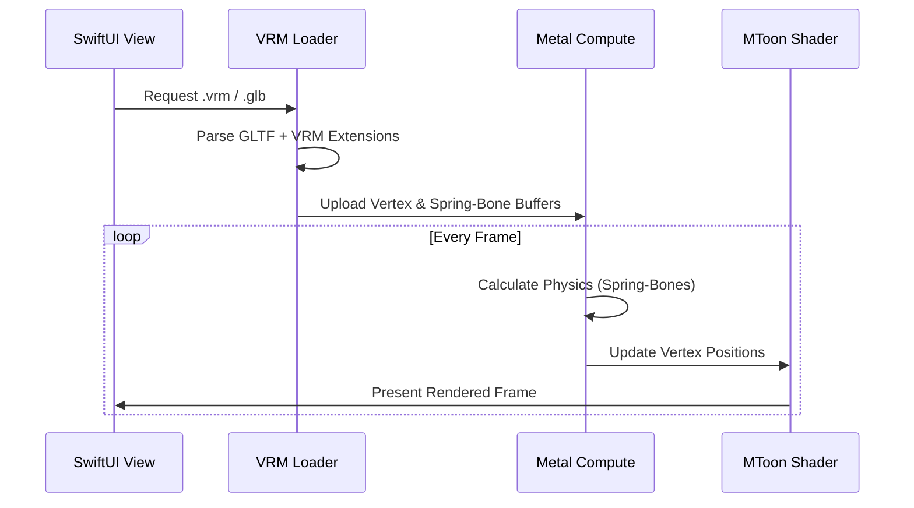

# 🌌 NeuraLink

<p align="center">
  
  
  
</p>

A high-performance, native iOS VRM character viewer and AI companion built from the ground up using **Metal** and **SwiftUI**. NeuraLink integrates state-of-the-art WebRTC audio streaming for real-time AI interaction with synchronized visual feedback.

---

## ✨ Features

- **Native Metal Engine**: Custom MToon shaders and GPU-accelerated rendering.
- **Spring-Bone Physics**: Real-time GPU compute for hair and clothing movement.
- **Neural Lip-Sync**: Real-time audio amplitude analysis mapped to VRM blend shapes.
- **Advanced Camera**: Orbit controls with look-at behavior following the viewing angle.
- **Universal Support**: Handles both VRM 0.x and 1.0 specifications.
- **Arknight inspired turn back at the camera**: When you rotate the camera to look behind the character, the character will turn her head to look at you after 5 seconds.


---

## 🫆 VRM Specifications

NeuraLink follows the official **VRM ecosystem standards** to ensure compatibility, realism, and expressive avatars.

| Category | Specification |
|----------|---------------|
| **Core** | [VRM 1.0](https://github.com/vrm-c/vrm-specification/tree/master/specification/VRMC_vrm-1.0) • [VRM 0.x](https://github.com/vrm-c/vrm-specification/tree/master/specification/0.0) |
| **Materials**| [MToon 1.0](https://github.com/vrm-c/vrm-specification/tree/master/specification/VRMC_materials_mtoon-1.0) |
| **Physics**  | [Spring-Bone 1.0](https://github.com/vrm-c/vrm-specification/tree/master/specification/VRMC_springBone-1.0) |
| **Animation**| [VRM Animation 1.0](https://github.com/vrm-c/vrm-specification/tree/master/specification/VRMC_vrm_animation-1.0) |

## 🛠️ Architecture

### Real-time Audio & LipSync Pipeline

NeuraLink uses a high-efficiency pipeline to ensure zero-latency synchronization between the AI's voice and the character's mouth movements.



### Model Loading & Rendering



---

## ⚙️ Requirements

| Component | Minimum Version |
| :--- | :--- |
| **Operating System** | iOS 17.0+ |
| **Development** | Xcode 16.0+ |
| **Language** | Swift 6.0 |
| **Hardware** | A12 Bionic or newer (for GPU Physics) |

---

## ⬇️ Installation

```bash
# Clone the repository
git clone https://github.com/kevinliddel/NeuraLink.git

# Open in Xcode
open NeuraLink/NeuraLink.xcodeproj
```

