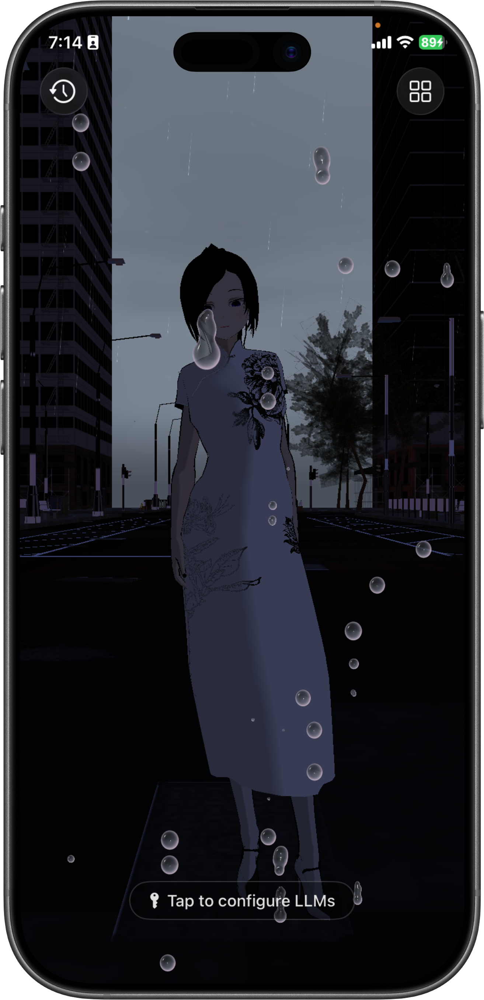
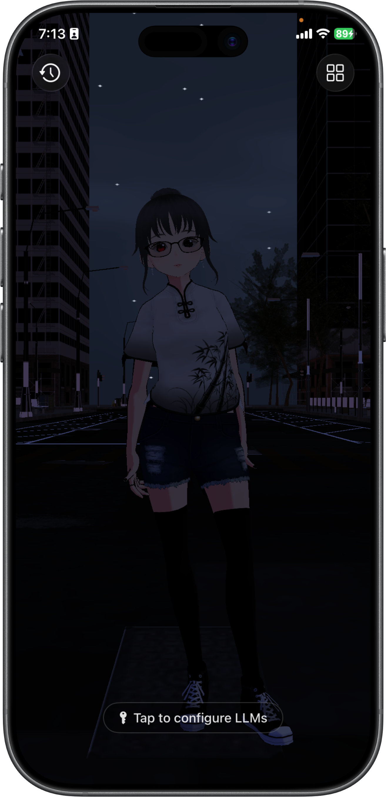
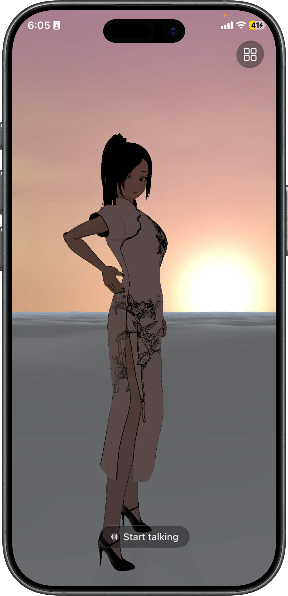
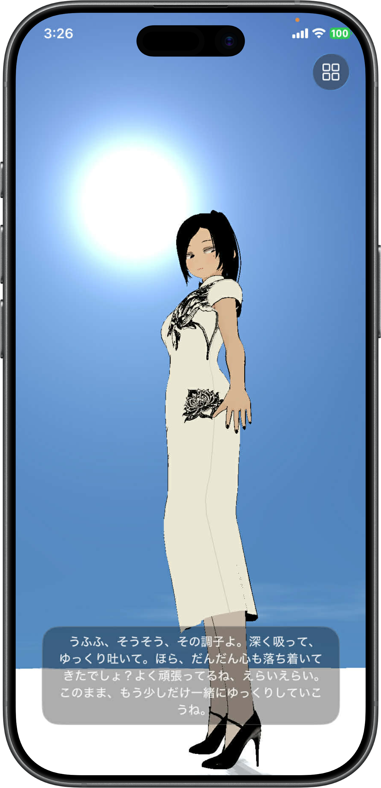
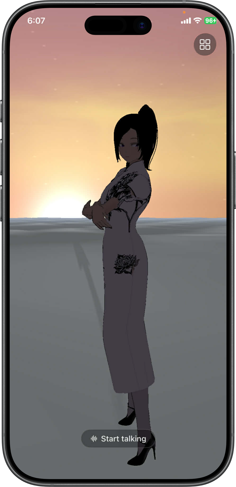
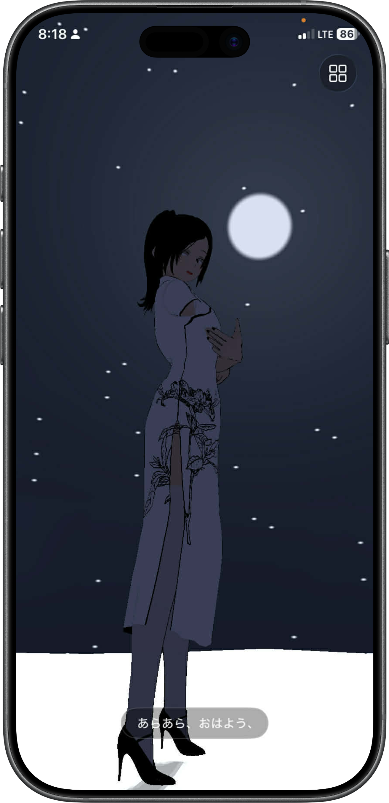
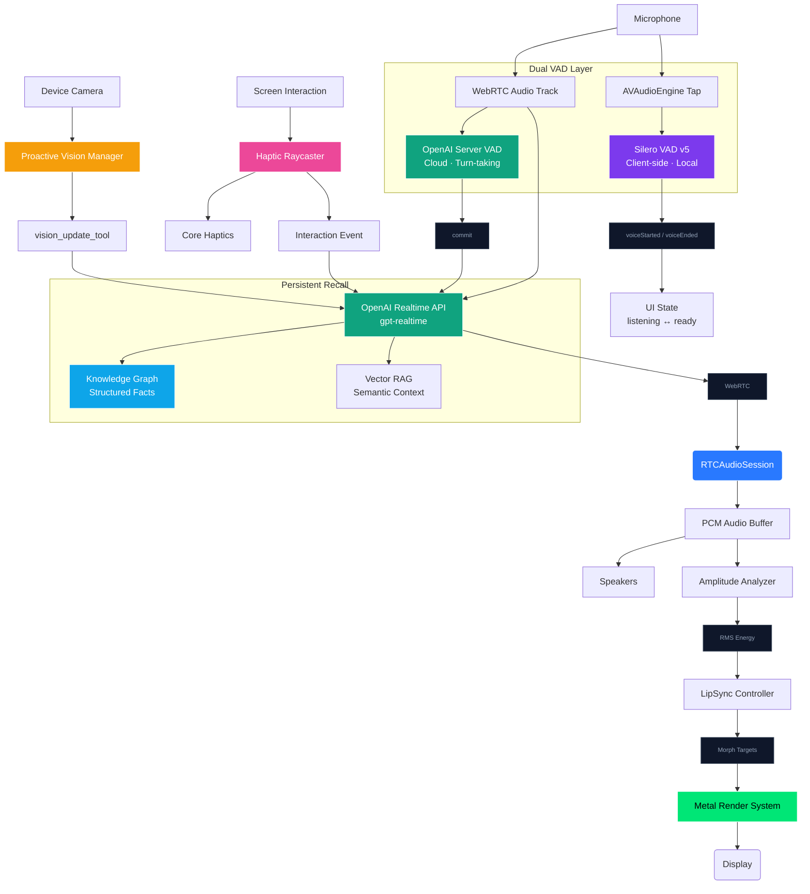
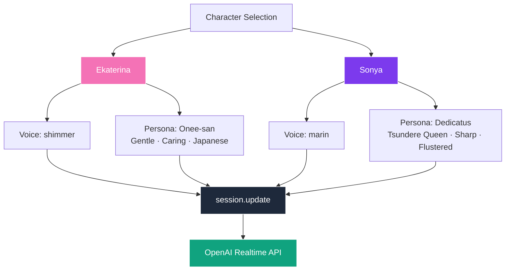
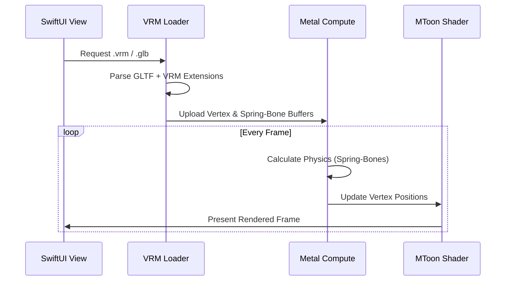

# NeuraLink

<p align="center">
    
    
</p>

<p align="center">
  
  
  
  
  
  
  
  
  
  
  
  <a href="https://deepwiki.com/kevinliddel/NeuraLink"></a>
</p>

A high-performance, native iOS VRM character viewer and AI companion built from the ground up using **Metal** and **SwiftUI**. NeuraLink connects to the OpenAI Realtime API via **WebRTC** for ultra-low latency mic capture and AI audio playback.

---

## ✨ Features

<table>
  <tr>
    <td><strong>Native Metal Engine</strong><br/>Custom MToon shaders and GPU-accelerated rendering.</td>
    <td><strong>Spring-Bone Physics</strong><br/>Real-time GPU compute for hair and clothing movement.</td>
  </tr>
  <tr>
    <td><strong>Procedural Rain System</strong><br/>Fully shader-driven 3D rain streaks with synchronized 2D lens splashing and realistic weather cycles.</td>
    <td><strong>Realtime Sky System</strong><br/>Real-time sky with realistic lighting and dynamic sun and moon positioning. See <a href="./docs/Sky_System.md">Sky System Documentation</a></td>
  </tr>
  <tr>
    <td><strong>Proactive Vision</strong><br/>Periodically captures frames to "see" the user's world and comment on it autonomously.</td>
    <td><strong>Interactive Photoshoot</strong><br/>The AI can strike poses, look at the camera, and hide the UI for clean screenshots.</td>
  </tr>
  <tr>
    <td><strong>Semantic Memory</strong><br/>Knowledge Graph remembers structured facts about the user (likes, names, job) to maintain long-term relationships. See <a href="./docs/RAG.md">RAG Documentation</a></td>
    <td><strong>Neural Lip-Sync</strong><br/>Real-time audio amplitude analysis mapped to VRM blend shapes. See <a href="./docs/LipSync.md">Lip-Sync Documentation</a> and <a href="./docs/Openai_Realtime_Chat.md">Realtime Audio Documentation</a></td>
  </tr>
  <tr>
    <td><strong>"Eyes on You" System</strong><br/>Arknights: Endfield-inspired camera tracking — characters maintain eye contact by turning their heads toward the camera after 5 seconds.</td>
    <td><strong>Physical Interaction</strong><br/>Direct 3D raycasting lets the user "touch" or "pat" the character with haptic feedback.</td>
  </tr>
  <tr>
    <td><strong>Advanced Camera</strong><br/>Orbit controls with look-at behavior following the viewing angle.</td>
    <td><strong>Dual-Layer VAD</strong><br/>Client-side Silero VAD (v5) alongside OpenAI's server VAD for instant local voice detection and immediate UI feedback.</td>
  </tr>
  <tr>
    <td><strong>Per-Character Personas</strong><br/>Each character carries her own system prompt and voice model, hot-swapped on model selection.</td>
    <td><strong>Fully Offline AI</strong><br/>On-device pipeline: whisper.cpp (STT) on CPU and Llama-3.2 / LLM-jp-3 (LLM) via llama.cpp on the Metal GPU or CPU. See <a href="./docs/Local_SLM_Model.md">On-Device LLM docs</a></td>
  </tr>
</table>


---

## 🌤️ Realtime Sky System

NeuraLink renders a fully procedural, physically-inspired sky backdrop that **automatically mirrors the user's local time of day** — from the cool darkness of midnight to the warm golden glow of an afternoon sun.

<p align="center">
  
  
  
  
</p>

Key highlights:

- **Clock-driven** — `SkyTimeProvider` reads the device's local calendar every frame; no manual configuration required.
- **Procedural GPU shader** — a single fullscreen-triangle Metal draw call renders the gradient, star field, dual-layer dome clouds, sun disc with bloom, and a moon disc opposite the sun.
- **Unified lighting** — the resolved `SkyEnvironment` drives a three-point key / fill / rim light rig that keeps the VRM character consistently lit against the sky at every hour.
- **Zero textures** — all visual elements (clouds, stars, sun, moon) are generated procedurally via FBM noise and analytic functions.

**[Full Sky System documentation](./docs/Sky_System.md)**

---

## 🌧️ Procedural Rain System

NeuraLink features a high-performance 3D rain system that runs entirely on the GPU, providing atmospheric depth without sacrificing frame rate.

- **Synced Effects**: Environment rain streaks (3D) and lens splashing (2D) are perfectly synchronized.
- **Weather Cycles**: Rain doesn't just "turn on"—it fades in and out based on a state-machine driven `RainController` that mimics natural weather patterns.
- **Zero CPU overhead**: Particle positions and falling animations are computed procedurally in the vertex shader using high-resolution timing.

---

## 🤖 Tool Calling

The AI companion isn't just for chat—she can help you manage your day by interacting with native iOS applications.

- **Live Weather**: Get real-time weather reports powered by Open-Meteo.
- **App Integration**: Open Maps, Camera, Photos, or Settings via voice command.
- **Productivity**: Create reminders, take notes, and search the web without leaving the app.
- **Entertainment**: Search and play music directly in Apple Music.

**[Full Tool Calling documentation](./docs/Function_Call.md)**

---

## 🫆 VRM Specifications

NeuraLink follows the official **VRM ecosystem standards** to ensure compatibility, realism, and expressive avatars.

| Category | Specification |
|----------|---------------|
| **Core** | [VRM 1.0](https://github.com/vrm-c/vrm-specification/tree/master/specification/VRMC_vrm-1.0) • [VRM 0.x](https://github.com/vrm-c/vrm-specification/tree/master/specification/0.0) |
| **Materials**| [MToon 1.0](https://github.com/vrm-c/vrm-specification/tree/master/specification/VRMC_materials_mtoon-1.0) |
| **Physics**  | [Spring-Bone 1.0](https://github.com/vrm-c/vrm-specification/tree/master/specification/VRMC_springBone-1.0) |
| **Animation**| [VRM Animation 1.0](https://github.com/vrm-c/vrm-specification/tree/master/specification/VRMC_vrm_animation-1.0) |

## 🛠️ Architecture

### Real-time Audio & LipSync Pipeline

NeuraLink uses a high-efficiency dual-VAD pipeline to minimise latency between the user's voice and the AI's response.


```mermaid
graph TD
    MIC[Microphone]
    CAM[Device Camera]
    TOUCH[Screen Interaction]

    MIC --> WebRTC[WebRTC Audio Track]
    MIC --> Tap[AVAudioEngine Tap]
    
    CAM --> Vision[Proactive Vision Manager]
    Vision --> FrameUpdate[vision_update_tool]
    FrameUpdate --> API

    TOUCH --> Raycast[Haptic Raycaster]
    Raycast --> Haptic[Core Haptics]
    Raycast --> Interact[Interaction Event]
    Interact --> API

    subgraph VAD [Dual VAD Layer]
        Tap --> Silero[Silero VAD v5\nClient-side · Local]
        WebRTC --> ServerVAD[OpenAI Server VAD\nCloud · Turn-taking]
    end

    subgraph Memory [Persistent Recall]
        API --> Facts[Knowledge Graph\nStructured Facts]
        API --> Vectors[Vector RAG\nSemantic Context]
    end

    Silero --> VoiceEvent[voiceStarted / voiceEnded]
    VoiceEvent --> UIState[UI State\nlistening ↔ ready]
    ServerVAD --> Commit[commit]
    Commit --> API

    WebRTC --> API[OpenAI Realtime API\ngpt-realtime]
    API --> WebRTCLink[WebRTC]
    WebRTCLink --> RTC(RTCAudioSession)
    RTC --> Buffer[PCM Audio Buffer]
    Buffer --> Output[Speakers]
    Buffer --> Analyzer[Amplitude Analyzer]
    Analyzer --> RMSEnergy[RMS Energy]
    RMSEnergy --> Controller[LipSync Controller]
    Controller --> MorphTargets[Morph Targets]
    MorphTargets --> Metal[Metal Render System]
    Metal --> Screen(Display)

    style Silero fill:#7c3aed,stroke:#fff,color:#fff
    style ServerVAD fill:#10a37f,stroke:#fff,color:#fff
    style API fill:#10a37f,stroke:#fff,color:#fff
    style Metal fill:#00e676,stroke:#fff,color:#000
    style RTC fill:#2979ff,stroke:#fff,color:#fff
    style Vision fill:#f59e0b,stroke:#fff,color:#fff
    style Raycast fill:#ec4899,stroke:#fff,color:#fff
    style Facts fill:#0ea5e9,stroke:#fff,color:#fff
    style VoiceEvent fill:#0f172a,stroke:#334155,color:#94a3b8,font-size:11px
    style Commit fill:#0f172a,stroke:#334155,color:#94a3b8,font-size:11px
    style WebRTCLink fill:#0f172a,stroke:#334155,color:#94a3b8,font-size:11px
    style RMSEnergy fill:#0f172a,stroke:#334155,color:#94a3b8,font-size:11px
    style MorphTargets fill:#0f172a,stroke:#334155,color:#94a3b8,font-size:11px
```

### AI Voice & Persona System

Each character model carries her own system prompt and OpenAI voice model, applied automatically on selection.


```mermaid
graph TD
    Select[Character Selection]

    Select --> Ekaterina[Ekaterina]
    Select --> Sonya[Sonya]

    Ekaterina --> EV[Voice: shimmer]
    Ekaterina --> EP[Persona: Onee-san\nGentle · Caring · Japanese]

    Sonya --> SV[Voice: marin]
    Sonya --> SP[Persona: Dedicatus\nTsundere Queen · Sharp · Flustered]

    EV --> Session[session.update]
    EP --> Session
    SV --> Session
    SP --> Session

    Session --> OpenAI[OpenAI Realtime API]

    style Ekaterina fill:#f472b6,stroke:#fff,color:#fff
    style Sonya fill:#7c3aed,stroke:#fff,color:#fff
    style OpenAI fill:#10a37f,stroke:#fff,color:#fff
    style Session fill:#1e293b,stroke:#fff,color:#fff
```

### Model Loading & Rendering


```mermaid
sequenceDiagram
    participant App as SwiftUI View
    participant Loader as VRM Loader
    participant GPU as Metal Compute
    participant Render as MToon Shader

    App->>Loader: Request .vrm / .glb
    Loader->>Loader: Parse GLTF + VRM Extensions
    Loader->>GPU: Upload Vertex & Spring-Bone Buffers
    loop Every Frame
        GPU->>GPU: Calculate Physics (Spring-Bones)
        GPU->>Render: Update Vertex Positions
        Render->>App: Present Rendered Frame
    end
```

---

## ⚙️ Requirements

| Component | Minimum Version |
| :--- | :--- |
| **Operating System** | iOS 17.0+ |
| **Development** | Xcode 16.0+ |
| **Language** | Swift 6.0 |
| **Hardware** | A12 Bionic or newer (for GPU Physics) |

---

## ⬇️ Installation

```bash
# Clone the repository
git clone https://github.com/kevinliddel/NeuraLink.git
cd NeuraLink

# Initialize submodules (required for llama.cpp)
git submodule update --init --recursive

# Open in Xcode
open NeuraLink.xcodeproj

# Setup Local AI Backend (Optional)
# If you intend to use the llama.cpp backend, ensure stale SPM references are purged:
ruby purge_spm.rb
```

---

## 🧩 Proof of Concept

[Proof-of-Concept](https://github.com/user-attachments/assets/2dc35314-fa8e-4b78-8507-b88d96d8c420)


## ֎ Offline AI
NeuraLink features a high-performance local AI pipeline that runs **entirely on your device** via llama.cpp — on the Metal GPU (6 GB+ devices) or the CPU (4 GB tier). No cloud, no Apple Neural Engine.

- **whisper.cpp**: Multi-lingual speech-to-text via `whisper.xcframework` running the `ggml-base` model on the CPU.
- **llama.cpp**: Metal/CPU inference for Llama-3.2-1B (English) and LLM-jp-3 1.8B (Japanese), shipped as single-file GGUF.
- **Memory-resident by design**: models are quantized to fit in RAM on 4 GB devices, so weights aren't streamed from flash.

For the full architecture — engine selection, the shared C++ bridge, memory residency, and cold-start latency — see:
- [On-Device LLM Architecture](./docs/Local_SLM_Model.md)

---

## ֎ Offline AI Voices

When running in **Offline Mode** (Local LLM), the system selects a TTS engine per persona — **VOICEVOX** for the Japanese model (LLM-jp-3), **OpenVoice** (MeloTTS + tone-color converter, ONNX, 22.05 kHz) for every other persona, and Apple's **AVSpeechSynthesizer** as the last-resort fallback.

### 🗣️ Local SLMs voice
The selector logic, per-persona voice picker, and end-to-end audio pipelines (LLM → text chunks → engine → PCM buffers → AVAudioPlayerNode) are documented separately:

- [LLM_VOICE](./docs/LLM_VOICE.md) — full architecture with mermaid diagrams comparing the local-LLM TTS path against the OpenAI Realtime audio path.

#### Improving the AVSpeechSynthesizer fallback
When the system falls through to the iOS speech synthesizer (no VOICEVOX model, no OpenVoice assets), iOS uses compact voices (`q=1`) which can sound robotic. To improve fidelity:

1.  Open **Settings** on your iPhone.
2.  Navigate to **Accessibility** → **Read & Speak** → **Voices**.
3.  Select your language (e.g., **English**).
4.  Find the voice you wish to use (e.g., **Shelley**, **Ava**, or **Matilda**) and tap the download icon for the **Enhanced** or **Premium** version.
5.  Once downloaded, the system will automatically jump from `q=1` to `q=2`, providing a dramatically more lifelike experience.

### 🛠️ Implementation Details
- [TTSEngineSelector.swift](./NeuraLink/Data/DataSources/TTS/TTSEngineSelector.swift) — engine resolution per persona + model (Japanese / LLM-jp-3 → VOICEVOX, else OpenVoice, System TTS fallback).
- [LocalLLMManager+TTS.swift](./NeuraLink/Data/DataSources/LocalLLM/LocalLLMManager+TTS.swift) — chunked synthesis pipeline that pumps engine PCM buffers into the playback graph.

---

## 🔒 Security & Privacy

NeuraLink is designed for the realistic threat model of a **lost, stolen, or filesystem-dumped iPhone** — not a runtime debugger on a jailbroken device. Every piece of on-disk state has a defense layer matched to its sensitivity, and conversation content stays out of release-build system logs.

| Layer | What it protects | How |
|---|---|---|
| **Keychain (Secure Enclave-derived)** | OpenAI API key, SQLCipher page key, KV-cache HMAC key | `kSecAttrAccessibleAfterFirstUnlockThisDeviceOnly` — unreadable from a cold-boot extraction. Never iCloud-synced, never restored to a different device. |
| **iOS Data Protection** | Conversation DB, personas, local-LLM prompts, transient audio | `.completeUntilFirstUserAuthentication` on `Application Support/private/` — unreadable until the user unlocks the device once after boot. |
| **SQLCipher (opt-in)** | Per-message page-level crypto on the conversation DB | AES-CBC + HMAC pages keyed from a 32-byte Keychain secret. Off by default; flag-gated as the foundation for a future passphrase mode. |
| **HMAC integrity** | Persistent KV cache blobs | HMAC-SHA256 over `(blob ‖ filename)` with a 32-byte Keychain key. A tampered blob fails verification and falls back to a cold prefill. |
| **Sensitive logging** | Chat transcripts, persona prompts, RAG memory bodies | `nlLogSensitive` marks payloads as `.private` so they're redacted in observer-readable Console.app captures (TestFlight testers, MDM log capture). Release builds compile out all `nlLog` calls entirely. |
| **Transient files** | None for STT | whisper.cpp consumes in-memory 16 kHz float samples directly — no audio is written to disk (any legacy `whisper_<UUID>.wav` files are swept on upgrade). |

**Explicitly out of scope** (closing these would require a different threat model): runtime debugger on a jailbroken device, server-side compromise at OpenAI, screen-recording leaks, side-channel attacks on the Apple Neural Engine.

**[Full security architecture](./docs/APP_SECURITY.md)** — covers the storage inventory, Keychain layout, HMAC binding rationale, and the full threat model.

---

## ⚖️ License

NeuraLink is released under the **MIT License** — you are free to use, modify, and distribute this software for any purpose. See [LICENSE](./LICENSE) for the full text.