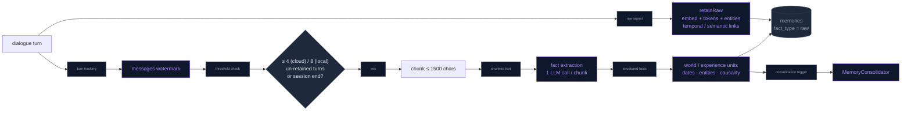
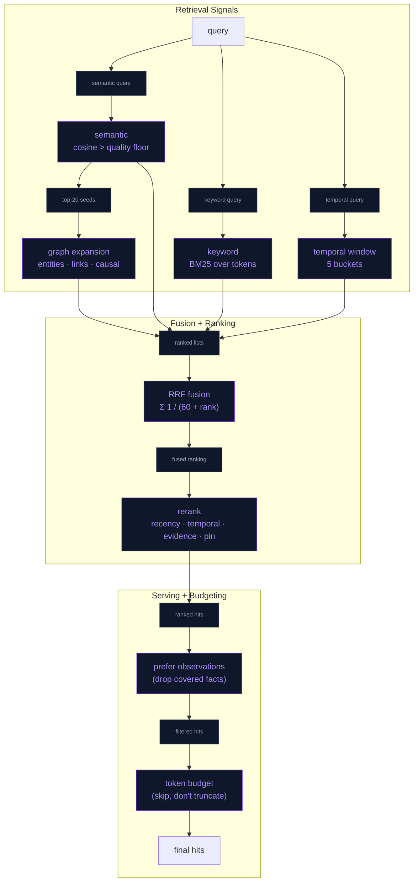

# Agentic Memory (Hindsight-style)

NeuraLink's long-term memory was a single-signal RAG: every turn was embedded, and retrieval was `cosine × recency` over one flat table. This document describes the replacement, an on-device port of the architecture behind [Hindsight](https://hindsight.vectorize.io/) (Vectorize; paper *"Hindsight is 20/20: Building Agent Memory that Retains, Recalls, and Reflects"*, arXiv 2512.12818). The old entry points (`RAGManager.store / fetchContext / storeFact / fetchFacts`) still exist as a facade so callers did not change.

Everything runs on the phone: SQLite (optionally SQLCipher), Apple `NLEmbedding` vectors, `NLTagger` entities, and one small LLM call per background step (OpenAI `gpt-5.6-luna` via `OpenAIChatClient`, or the local model via `runSilentGeneration`). Recall itself never calls an LLM.

## What changed, in one table

| Concern | Before | Now |
|---|---|---|
| Memory types | one table, `source` tag | `raw` dialogue, `world` facts, `experience` (what the assistant did), `observation` (consolidated belief) + mental models |
| Ingest | embed every turn | same (no-LLM `raw` path) **plus** batched LLM fact extraction with dates, entities and causal links |
| Retrieval | cosine ≥ floor × recency | four arms (semantic, BM25, entity-graph, temporal) → RRF fusion → boosted rerank → token budget |
| Prompt grounding | all KG facts dumped, top-3 cosine facts | zero-LLM mental-model block (stable, KV-cache friendly) + per-turn hybrid recall |
| Agentic lookup | none | `search_memory` tool: the model decides when to query memory mid-conversation |
| Consolidation | none | background CREATE/UPDATE/DELETE of observations with a cosine dedup guard |
| Local models | fact extraction disabled for both shipped tiers | enabled through the same orchestrator, with the strict `LocalLLMFactExtractor` gates |

## Files

All under `NeuraLink/Data/DataSources/Memory/Agentic/` unless noted.

| File | Role |
|---|---|
| `MemoryUnit.swift` | `MemoryUnit`, `MemoryFactType`, `MemoryEntity`, `MemoryLink`, `MentalModel`, `ExtractedFact` |
| `MemoryStore+Units.swift` | schema migration (`migrateAgenticMemoryIfNeeded`), unit CRUD |
| `MemoryStore+Entities.swift` | `memory_entities`, `memory_unit_entities`, `memory_links` |
| `MemoryStore+MentalModels.swift` | `mental_models` CRUD |
| `MemoryTextIndex.swift` | tokeniser (NLTokenizer + light stemming) and Okapi BM25 |
| `MemoryTemporalParser.swift` | query → time window; fact `when` → absolute span |
| `MemoryEntityExtractor.swift` | NLTagger names + capitalised-word fallback; always adds `user` |
| `MemoryRecall.swift` | the four arms, RRF, rerank, budget, bullet formatting |
| `MemoryFactExtraction.swift` | cloud JSON prompt/parser; local labeled-line prompt/parser |
| `MemoryRetain.swift` | raw path, structured facts, batched LLM extraction, link building, session-end flush |
| `MemoryConsolidator.swift` | observation maintenance |
| `MemoryMentalModels.swift` | standing questions, delta refresh, prompt block |
| `MemoryReflect.swift` | retrieval ladder (`evidence`) and one-call `reflect` |
| `MemoryLLM.swift` | `MemoryLLM` protocol + `LiveMemoryLLM` router (cloud / local / none) |
| `MemoryDisposition.swift` | per-character skepticism / literalism / empathy, verbalised for prompts |
| `../RAGManager.swift` | facade over retain + recall |
| `Domain/Entities/Skills/SearchMemorySkill.swift` | the `search_memory` tool |
| `Presentation/Views/AI/MemoryInsightsSection.swift` | "What X knows" + observations in the Memory sheet |

## Schema

`memories` gained: `fact_type`, `context`, `tokens`, `mentioned_at`, `occurred_start`, `occurred_end`, `proof_count`, `source_ids`, `consolidated_at`. Legacy rows are back-filled once (`source='fact'` → `world`, everything else `raw`; tokens computed). New tables: `memory_entities` (canonical name, NOCASE unique, mention count), `memory_unit_entities`, `memory_links` (`temporal | semantic | entity | caused_by`, weight), `mental_models` (`character`, `slug`, `question`, `content`, `is_stale`, `last_memory_id`). Unit-side rows cascade on delete; `MemoryStore.clear()` wipes the side tables too.

Temporal semantics follow Hindsight: `occurred_*` = when it happened (extracted, nullable), `mentioned_at` = when it was said (the recency anchor), `timestamp` = ingestion.

## Retain



* **Raw path** (`MemoryRetain.retainRaw`): what the old `store()` did, plus links. Temporal links join same-type units within 24 h with weight `max(0.3, 1 − Δh/24)` (cap 20); semantic links join the nearest units with cosine ≥ 0.7 (cap 10).
* **LLM path** (`maybeRetain`): triggered from `ChatTimelineStore.logAIMessage` (both engines) and flushed on `SessionLifecycle.sessionDidEnd`. Cloud models get Hindsight's structured extraction (`what / when / who / type / caused_by`, JSON; relative dates converted to absolute using the message dates; `"user"` always included; coreference like *"Emily (user's roommate)"*). Local 1–2B models get the proven line-per-fact prompt and pass through `LocalLLMFactExtractor.parseFacts`' quality gates; their facts are timeless and about the user only.
* **Structured facts** (`retainFact`): `remember_fact` tool calls and the legacy `storeFact` become entity-linked world facts so the graph arm can reach them.

## Recall (TEMPR port)



Fusion is plain RRF, except that when the query names a time ("last weekend",
"in March 2025") the temporal arm's contributions are weighted ×2 in rank space
(Hindsight's per-strategy recall boost): an explicit time reference is stronger
evidence than a loose semantic neighbour. Inside the window, units are ranked
by **span specificity** first (a two-day event inside a weekend window beats a
whole-year fact that overlaps every window), then similarity, then recency,
and then spread across five time buckets. There is deliberately no similarity
floor inside a window: sentence embeddings rate "what did I do last weekend?"
against a hike *lower* than against "signed up for a marathon".

Rerank boosts, mirroring Hindsight's multiplicative form: `(1 + 0.8·w·(recency − 0.5)) × (1 + 0.2·(temporal − 0.5)) × (1 + 0.1·(proof − 0.5)) × (pinned ? 1.15 : 1)`, where `recency = exp(−ageDays / halfLife)`, `temporal` is proximity to the window midpoint (0.5 when the query has no window) and `proof` is `log(1 + proof_count)/log(11)` for observations (0.5 otherwise). `w`, `halfLife` and the semantic floor are the existing `MemorySettings` tunables; the "Memory Quality" slider now only gates the semantic arm, so keyword/entity/temporal hits can still surface a memory whose embedding is weak (or zero, on the simulator).

`MemoryRecallQuery` carries `factTypes`, `maxResults`, `tokenBudget` (≈ 4 chars/token) and `preferObservations`.

### Embedding backends

`EmbeddingService` routes through an `EmbeddingBackend`: Apple's `NLEmbedding`
(default, always available, English-strong) or `GGUFEmbeddingBackend`, which
runs **EmbeddingGemma-300M Q8_0** (official ggml-org GGUF, 768-dim, 100+
languages, 334 MB) through the new `llama_embed_bridge` (mean pooling,
L2-normalised, `llama_encode` on an embeddings-only context). The model is an
opt-in download from the Memory page ("Multilingual recall"), pinned by size
and SHA-256 in `RemoteAssetRegistry.embeddingModel` and fetched from the
model's own repo via `remoteURL`. It loads lazily and unloads after 60 s
idle to keep the 4 GB tier's headroom. Queries and documents use Gemma's
documented prefixes (`task: search result | query:` / `title: none | text:`).

Every vector is stored with its backend id (`memories.vector_model`); the
semantic arm, semantic links and the dedup guard only compare vectors from
the active backend, and `EmbeddingMigrator` re-embeds stale rows in batches
of 50 at background priority (resumable, no-progress guard). Switching back
to NL keeps the file on disk. A backend that cannot produce a probe vector
is never activated, so memories keep being stored with NL.

Why not the smaller multilingual-e5-small: its public GGUF conversions
predate a llama.cpp metadata requirement (`bert model needs to define token
type count`) and fail to load on the vendored build; the f16 conversion that
does load separates a matching from an unrelated fact by only 0.10 cosine
versus 0.26 for Gemma.

### Embedding calibration

Cosine scales differ per embedding model, so `EmbeddingCalibration` maps the
nominal Memory Quality slider and the internal floors onto the active
backend. For Apple's `NLEmbedding` the harness measured question ↔ correct
fact at 0.21–0.22 and question ↔ best unrelated fact at 0.15–0.18, so the
nominal 0.5 becomes an effective 0.20 (`queryFloorScale 0.4`); fact ↔ nearest
fact sits at p10 0.45 / p50 0.59 / p90 0.66, so semantic links use 0.62 and the
observation dedup guard 0.9. Before this calibration the semantic arm was
effectively dead: nothing cleared 0.5.

EmbeddingGemma (harness run on the simulator, 2026-09-26): question ↔ matching
fact ≈ 0.58, question ↔ unrelated ≈ 0.32, fact ↔ nearest fact p10 0.45 / p50
0.60 / p90 0.64. Calibration: floor = 0.1 + 0.6 × nominal (0.5 → 0.40), link
floor 0.6, dedup 0.9. Harness result with Gemma: recall@5 1.00, MRR 0.86
(NL: 0.82), multi-session MRR 1.00. Run it yourself with
`env TEST_RUNNER_NL_EMBED_GGUF=/path/embeddinggemma-300M-Q8_0.gguf xcodebuild test …`
(the test is skipped when the variable is absent).

The BM25 tokeniser folds inflections onto one key (`likes/liked/like → lik`,
`movies/movie → movi`, `cities/city → citi`), strips possessives, and maps a
small table of family and everyday synonyms (`mum/mom → mother`,
`kids → child`, `phone → iphone`) before stemming, because companion memory
is mostly about people.

## Observations (consolidation)

After every retain batch, `MemoryConsolidator.consolidatePending` takes un-consolidated world/experience facts in batches (8 cloud / 3 local), pools related observations via recall, and asks the LLM for labeled-line actions:

```
CREATE: <text>
UPDATE O<id>: <complete new text>
DELETE O<id>
```

Rules in the prompt are Hindsight's: prefer update over create, one observation per facet, update state changes concisely while keeping history, never delete event records, never compute numbers, delete only when contradicted. Guards on our side: only pooled ids may be updated/deleted, at most one update per id, a CREATE whose embedding is ≥ 0.97 cosine to an existing observation becomes an update (merge), and `proof_count` / `source_ids` accumulate the batch facts that support the belief. Facts are marked consolidated even when the model returns nothing, so a bad batch never wedges the queue. Any change flags mental models stale.

## Mental models

Two standing questions: a global **user profile** and a per-character **relationship** note (`MemoryMentalModels.ensureDefaults`). Refresh is delta-mode: only when stale *and* `MAX(memories.id)` moved since the last refresh; evidence comes from recall (observations preferred, ≤ 900 tokens) and one LLM call answers in ≤ 80 words or `UNKNOWN`. Reading is a DB read: `promptBlock(character:)` goes into the **stable** system prefix on both engines (local: KV-cache-safe because it only changes after background consolidation; OpenAI: session instructions).

## Reflect and the `search_memory` tool

`MemoryReflect.evidence(for:character:)` is Hindsight's retrieval ladder without an LLM: fresh mental models → observations → raw facts/dialogue, descending only while evidence is thin. The `search_memory` tool returns that evidence to the Realtime model, which is told to call it before answering anything that depends on the past. `reflect(question:)` adds one synthesis call (with the character's disposition) for callers that need a finished answer. Local tool calling stays limited to `remember_fact`; the local path gets the same recall per turn in Tier 3 instead.

## Memory banks

`memories.bank` scopes knowledge per character (Hindsight's memory-bank
isolation, scaled down): world facts and user turns are shared (`""`) because
they are about the user; assistant turns, experiences and observations carry
the character slug that produced them, and mental models were already per
character. Recall reads every bank while "Characters share memories" is on
(default); off, it reads the shared bank plus the active character's
(`MemoryBanks.readable`). Consolidation therefore never merges one
character's observations into another's when sharing is off.

## Disposition

`MemoryDisposition` (skepticism / literalism / empathy, 1–5, per character in `UserDefaults`) is rendered as sentences and appended to the consolidation, mental-model and reflect prompts, never to recall. Neutral (3/3/3) adds nothing. Edited in Persona settings → "Memory Personality" (`DispositionSection`); a change also refreshes the live Realtime instructions.

## Prompt integration

* **Local** (`LocalLLMMemoryHierarchy`): Tier 1 system prefix gains the mental-model block; Tier 3 is now hybrid recall over knowledge units with a 180-token budget (`[Relevant memories]`).
* **OpenAI** (`OpenAIRealtimeManager+SessionConfig`): instructions gain the mental-model block, a 500-token recall block for the persona, the KG list (unchanged) and the `search_memory` usage rule.

## Budgets and device behaviour

| Step | LLM calls | When |
|---|---|---|
| raw retain | 0 | every turn, detached background task |
| recall | 0 | every local turn / session start / tool call |
| fact extraction | 1 per ≤ 1500-char chunk | every 4 (cloud) or 8 (local) turns, and at session end |
| consolidation | 1 per batch (≤ 4 batches/run) | after extraction stored something |
| mental-model refresh | 1 per stale model | after consolidation changed something |

Local extraction reuses `runSilentGeneration`, which is serialised with user-facing generation; the larger local batch amortises the cost. The JP tier is excluded (`LiveMemoryLLM.tier`), matching the existing "no Tier 3 for LLM-jp" rule.

## Testing

`NeuraLinkTests/AgenticMemoryTests.swift` covers the tokeniser/BM25, temporal parser, entity extractor, both extraction parsers, consolidation parsing/prompts, RRF/budget/observation-preference, keyword + temporal arms without vectors, and a store round trip (retain → links → recall → consolidate → mental model → reflect ladder) using a scripted `MemoryLLM` stub.

### Evaluation harness

`NeuraLinkTests/MemoryEvalTests.swift` runs `MemoryEvalRunner` over
`MemoryEvalFixture` (both in `Agentic/Eval/`, DEBUG-only in the app target so
the device run shares them): 24 LongMemEval-style cases with dated sessions,
the facts extraction should yield, optional consolidation actions, and
questions typed `single_hop | multi_session | temporal | knowledge_update |
preference`, each with `expect` (fact keys that count, or an observation
consolidated from them) and `avoid` (a superseded or out-of-window fact that
must not outrank the answer). It reports recall@5, MRR and avoid-precision
per type, plus fact ↔ fact cosine quantiles for calibration, as a Swift
Testing attachment on every run:

```
xcrun xcresulttool export attachments --path <xcresult> --output-path <dir>
```

Simulator baseline (fixture v1, 2026-09-26): recall@5 1.00, MRR 0.82, avoid
precision 0.88. CI fails below 0.93 / 0.70 per type / 0.80. On a device,
launch with `-nl.debug.memoryEval YES` to run the same fixture and print the
report to the persistent log.

## Not ported (deliberately)

Cross-encoder reranking (no on-device model; rank-seeded passthrough instead), spreading activation beyond one hop, per-bank visibility tags, directives, knowledge pages, the 10-iteration agentic reflect loop (one ladder pass + one synthesis call instead).
