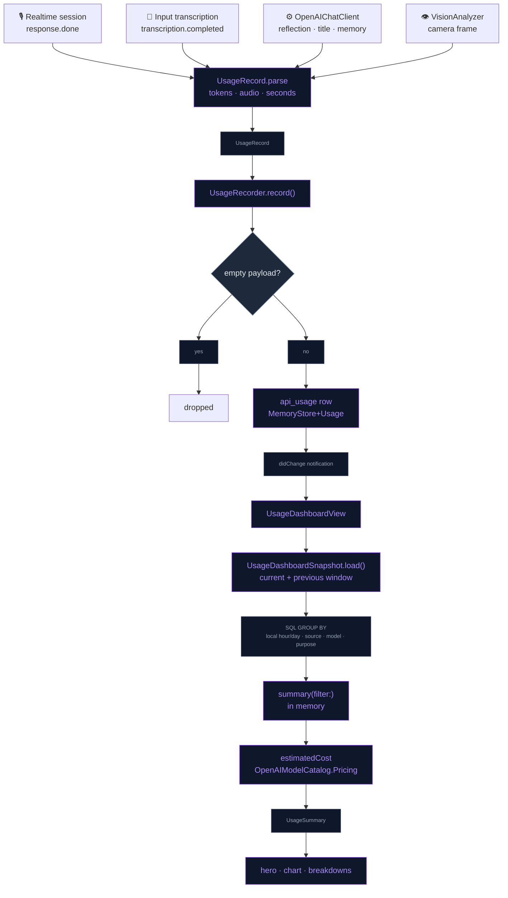

# API Usage Dashboard

A dedicated page, modelled on the OpenAI platform's usage view, that shows how
much of your OpenAI API the app consumes: estimated spend, tokens and requests
per hour or per day, filterable by source and model. Every number comes from
the `usage` object OpenAI returns with each call, recorded on this device.

## What gets metered

Each OpenAI call made from the app writes one row to the `api_usage` table,
through `UsageRecorder.record(_:)`:

| Source | Where it is captured | Purpose tag |
|---|---|---|
| **Voice** | Realtime `response.done` (`OpenAIRealtimeManager+Handlers`) | `conversation` |
| **Transcription** | Realtime `conversation.item.input_audio_transcription.completed` | `transcription` |
| **Background** | `OpenAIChatClient.complete` (Chat Completions) | `reflection`, `title`, `memory` |
| **Vision** | `VisionAnalyzer.analyze` (Chat Completions with an image) | `vision` |

A row stores input, output, cached-input, audio-input and audio-output tokens,
plus `audio_seconds` for duration-billed transcription models (`whisper-1`,
`gpt-live-transcribe`, `gpt-realtime-whisper` report seconds, not tokens).
Transcription is metered even when the transcript is then dropped as noise,
because the call was still billed. Rows older than 400 days are pruned on the
first write of each launch.

## Spend estimate

`UsageRecord.estimatedCost` prices a row with the list price attached to its
model in `OpenAIModelCatalog` (`Pricing`: text in/out, audio in/out, per
minute). Text tokens are the input/output totals minus their audio share.
Cached-input discounts are not applied, so the estimate errs slightly high. A
model with no catalog price counts as $0. The OpenAI invoice stays the source
of truth, and the page says so.

## The page

AI Settings → **Usage**. Top to bottom:

- **Range tabs**: Today (hourly bars) · 7D · 30D · 90D (daily bars). A range
  always covers whole local days ending today.
- **Spend hero card**: estimated spend for the range, the change against the
  previous window of equal length ("▲ 12 % vs previous 7 days"), and tiles for
  tokens, requests and the daily (or, for Today, per-hour) average.
- **Live voice session**: shown only while a Realtime session is metering, with
  a pulsing dot and its running spend and tokens.
- **Filters**: source chips (All · Voice · Transcription · Background · Vision)
  and a model dropdown listing the models seen in the range. Picking a source
  clears a model filter that no longer matches.
- **Chart**: stacked bars per source, switchable between Spend and Tokens.
  Dragging across the bars snaps to an hour/day and reads out its total and its
  per-source split; at rest the header shows the peak. The legend lists only
  the sources present, with their totals.
- **By model / By feature**: ranked rows with a share bar, request count and
  input/output split. Tapping a model row toggles it as the model filter.
- **Footer + menu**: how the numbers are measured, a link to
  platform.openai.com/usage, and "Clear usage history" (confirmation required;
  it only deletes the local record).

The Usage row in settings shows today's spend and tokens, and it refreshes live.

## Flow

## Files

| File | Role |
|---|---|
| `Domain/Entities/APIUsage.swift` | `UsageSource`, `UsageRecord` (payload parsing + spend estimate), `UsageBucket` |
| `Data/DataSources/Memory/MemoryStore+Usage.swift` | `api_usage` insert, bucketed reads, prune/clear; `UsageRecorder` |
| `Data/DataSources/Memory/MemoryStore.swift` | `api_usage` schema + time index |
| `Data/DataSources/OpenAI/OpenAIModelCatalog.swift` | `Pricing` per model, `pricing(for:)` |
| `Data/DataSources/OpenAI/OpenAIRealtimeManager+Handlers.swift` | Voice and transcription capture |
| `Data/DataSources/OpenAI/OpenAIChatClient.swift` | Background capture, `purpose:` tag |
| `Data/DataSources/VisionAnalyzer.swift` | Vision capture |
| `Presentation/Views/AI/Usage/UsageDashboardModel.swift` | Ranges, filters, `UsageSummary` aggregation, formatting |
| `Presentation/Views/AI/Usage/UsageDashboardView.swift` | The page + `UsageNavigationRow` settings entry |
| `Presentation/Views/AI/Usage/UsageChartCard.swift` | Swift Charts stacked bars with drag selection |
| `Presentation/Views/AI/Usage/UsageDashboardCards.swift` | Hero, stat tiles, filter bar, breakdowns, live session card |

## Integration notes

- **No account API.** OpenAI's organization usage endpoints need an admin key,
  and the app only holds a project key, so the dashboard reflects this device's
  calls only. The same key used elsewhere won't appear here.
- **Buckets are local time.** The SQL groups by
  `strftime(…, created_at, 'unixepoch', 'localtime')`; `created_at` is Unix
  seconds so range filters are plain comparisons.
- **Prices live next to model ids.** When a model is added to the catalog, give
  it a `pricing:` entry; `APIUsageTests.catalogPricing` fails otherwise.
- **The live meter stays.** `RealtimeUsageMeter` still feeds the `[Cost]` log
  line and the live session card; the per-response rows are what persist.

## Known device-test items

- Confirm the transcription `usage` shape per model on device (token-billed vs
  `duration`), especially `gpt-live-transcribe`.
- Compare a day's estimate against platform.openai.com/usage to calibrate the
  list prices.
