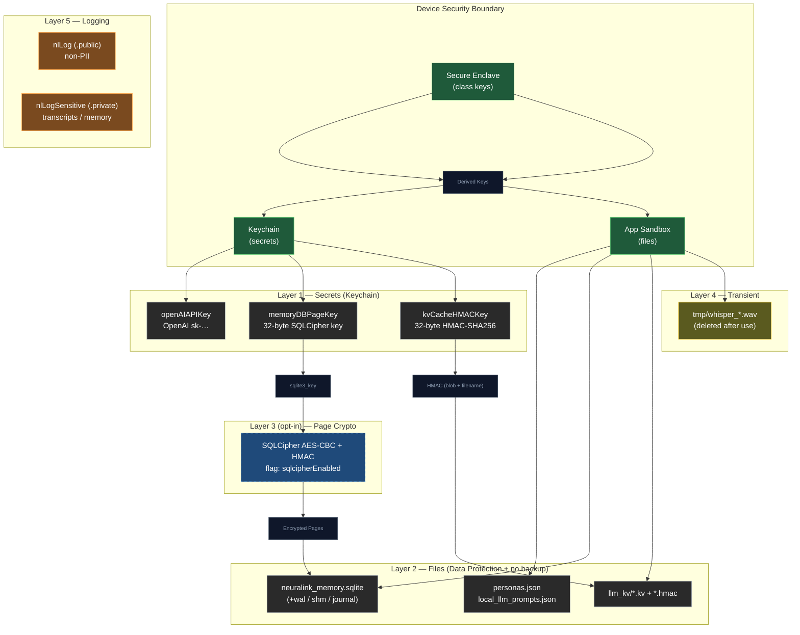

# NeuraLink App Security

---

## 1. Threat model

Everything in this document is built against one primary adversary:

> **An attacker with physical access to a powered-off, lost, or stolen device** who attempts a filesystem dump (jailbreak, passcode bypass, leaked iCloud / iTunes backup).

Secondary threats covered:

- A malicious tester or third party hooking up Console.app to a TestFlight / Ad-hoc build to scrape transcripts from system logs.
- Tampering with on-disk state (KV cache substitution) to inject hidden behavior into the next session.

**Out of scope** (intentionally — closing these would require very different mitigations):

- Runtime debugger attached to an *unlocked, jailbroken* device.
- Server-side compromise at OpenAI. By design OpenAI sees plaintext to run the model — no client-side mitigation possible without changing providers.
- Screen-recording / screenshot leaks of visible chat UI.
- Side-channel attacks on Apple Neural Engine / GPU.

---

## 2. Defense layers



**Reading the diagram:** every secret traces back to either the Secure Enclave (Keychain items) or the app sandbox (files protected by iOS Data Protection). Files inherit class keys from the Secure Enclave; secrets in the Keychain *are* derived via the Secure Enclave. The opt-in SQLCipher layer adds page-level crypto on top of file-level protection for the conversation DB — useful as a precondition for the future passphrase mode.

---

## 3. The two primitives everything is built on

### 3.1 `SecureStore` — Keychain wrapper

**File:** [NeuraLink/Core/Security/SecureStore.swift](../NeuraLink/Core/Security/SecureStore.swift)

Stateless `enum` namespace wrapping `kSecClassGenericPassword`. Every item is bound to:

- `kSecAttrAccessible = kSecAttrAccessibleAfterFirstUnlockThisDeviceOnly`
  - **Unreadable from a cold-boot extraction** until the user unlocks the device once after boot.
  - **Never** synced via iCloud Keychain.
  - **Never** restored to a different device — a fresh install on a new phone starts without the secret, by design.

**API surface (use these, don't reinvent):**

```swift
try SecureStore.set("sk-…", for: .openAIAPIKey)
try SecureStore.get(.openAIAPIKey)              // -> String?
try SecureStore.set(data, for: .memoryDBPageKey)  // Data overload
try SecureStore.getData(.memoryDBPageKey)         // -> Data?
try SecureStore.delete(.openAIAPIKey)
try SecureStore.getOrCreateRandom(.memoryDBPageKey, bytes: 32)  // CSPRNG on first call
```

**Adding a new secret:** add a case to `SecureKey`, then add its `service` + `account` strings to the two `switch`es. Keep the strings stable — changing them orphans the existing Keychain item on every user's device.

### 3.2 `ProtectedStorage` — file Data Protection helper

**File:** [NeuraLink/Core/Security/ProtectedStorage.swift](../NeuraLink/Core/Security/ProtectedStorage.swift)

Stateless `enum`. Owns the `Application Support/private/` directory and the API for applying `.completeUntilFirstUserAuthentication` to any file.

```swift
let dir = try ProtectedStorage.privateApplicationSupportURL()  // lazily creates + marks isExcludedFromBackup
try ProtectedStorage.protect(fileURL)                          // explicit per-file class (idempotent)
```

The chosen protection class is `.completeUntilFirstUserAuthentication`:

- Files are unreadable until the user unlocks the device once after boot.
- After that, files remain readable for the rest of the boot cycle (including while the screen is dimmed/locked).
- We use this class instead of `.complete` because background-ish features (proactive vision) need to read DB state while the screen is locked — `.complete` would break them. The app has no `UIBackgroundModes`, so post-first-unlock is the conservative match.

---

## 4. Storage inventory

Every piece of on-disk state, where it lives, how it's protected, who reads it.

| Asset | Location | Protection | Encryption | Backup-eligible? | Code |
|---|---|---|---|---|---|
| OpenAI API key | Keychain | `kSecAttrAccessibleAfterFirstUnlockThisDeviceOnly` | n/a (Keychain native) | No | [OpenAISettings.swift](../NeuraLink/Data/DataSources/OpenAI/OpenAISettings.swift) |
| Conversation DB | `Application Support/private/neuralink_memory.sqlite` | `.completeUntilFirstUserAuthentication` | Optional SQLCipher (off by default) | **No** (excluded) | [MemoryStore.swift](../NeuraLink/Data/DataSources/Memory/MemoryStore.swift) |
| Personas | `Application Support/private/personas.json` | `.completeUntilFirstUserAuthentication` | n/a | **No** (excluded) | [PersonaStore.swift](../NeuraLink/Data/Repositories/PersonaStore.swift) |
| Local LLM prompts | `Application Support/private/local_llm_prompts.json` | `.completeUntilFirstUserAuthentication` | n/a | **No** (excluded) | [LocalLLMPromptStore.swift](../NeuraLink/Data/DataSources/LocalLLMPromptStore.swift) |
| KV cache + HMAC sidecar | `Application Support/llm_kv/<config>_<persona>.kv{,.hmac}` | `.completeUntilFirstUserAuthentication` | HMAC-SHA256 integrity (32-byte Keychain key) | Yes (no isExcludedFromBackup) | [LocalLLMKVCache.swift](../NeuraLink/Data/DataSources/LocalLLM/LocalLLMKVCache.swift) |
| Whisper transcription input | `tmpDirectory/whisper_<UUID>.wav` | `.completeUntilFirstUserAuthentication` | n/a (deleted after one transcribe call) | **No** (tmp is auto-excluded) | [LocalWhisperManager.swift](../NeuraLink/Data/DataSources/LocalWhisperManager.swift) |

**On `kvCacheHMACKey`:** the KV cache lives at `Application Support/llm_kv/` rather than `Application Support/private/` so that legacy data from pre-Phase-5 installs doesn't need a relocation migration (KV blobs are regenerable; a failed integrity check just triggers cold prefill on the next launch). The protection class is still applied to the directory.

---

## 5. Keychain layout

| `SecureKey` case | Service | Account | Bytes | Created when | Consumer |
|---|---|---|---|---|---|
| `.openAIAPIKey` | `com.neuralink.openai` | `apiKey` | variable (user-supplied `sk-…`) | User pastes in Settings | `OpenAISettings.apiKey`, `OpenAIRealtimeManager`, `VisionAnalyzer`, `PersonaSettingsView` |
| `.memoryDBPageKey` | `com.neuralink.memory` | `dbPageKey` | 32 (CSPRNG) | First SQLCipher conversion or first encrypted-DB open | `MemoryStore+SQLCipher.keyDatabase`, `MemoryStore+SQLCipher.convertPlaintextToSQLCipher` |
| `.kvCacheHMACKey` | `com.neuralink.localllm` | `kvCacheHMACKey` | 32 (CSPRNG) | First `signIntegrity` call after Phase 5 install | `LocalLLMKVCache.signIntegrity`, `LocalLLMKVCache.verifyIntegrity` |

Two design decisions worth knowing:

- **Distinct `service` per consumer** so future per-attribute access policies can evolve independently (e.g. if we ever want `memoryDBPageKey` to require biometric unlock, we don't have to migrate `openAIAPIKey`).
- **`…ThisDeviceOnly`** ensures a new phone doesn't inherit secrets via iCloud Keychain. The user re-enters the API key on new device by design; SQLCipher and HMAC keys are regenerated and the dependent data is rebuilt from scratch (chat DB stays encrypted-but-unreadable until cleared; KV cache cold-prefills on next launch).

---

## 6. Migration flags

We use one-shot `UserDefaults` flags for one-time upgrade tasks. Each flag is set only after the corresponding migration succeeds, so a failure causes the migration to retry on the next launch instead of silently dropping data.

| Flag | Phase | What it gates |
|---|---|---|
| `com.neuralink.migration.apiKeyKeychain.v1` | 1 | Copy legacy `UserDefaults` API key to Keychain, then delete the `UserDefaults` entry |
| `com.neuralink.migration.dbRelocate.v1` | 2a | Atomic move of `Documents/neuralink_memory.sqlite` (+ siblings) → `Application Support/private/` with rollback on partial failure |
| `com.neuralink.security.sqlcipherActive.v1` | 2b | Realised state of the SQLCipher conversion. Distinct from the user-intent flag below |
| `com.neuralink.migration.whisperDocsCleanup.v1` | 4 | Sweep legacy `Documents/whisper_*.wav` files left by pre-Phase-4 builds |

There are also two **user-intent feature flags**, separate from migration flags:

| Flag | Default | Effect when set |
|---|---|---|
| `com.neuralink.security.sqlcipherEnabled` | `false` | On next launch, convert the plaintext conversation DB into a SQLCipher-encrypted DB via `sqlcipher_export`. Once the realised flag (`sqlcipherActive.v1`) is set, `sqlite3_key` is called after every `sqlite3_open` |

**To opt into SQLCipher today** (no UI yet — Phase 7 work):
```bash
xcrun simctl spawn booted defaults write <bundle-id> com.neuralink.security.sqlcipherEnabled -bool YES
```
Next app launch performs the one-shot conversion. Verify with: a hex dump of the DB file should *not* start with `SQLite format 3\0`.

---

## 7. Conversation DB — the two layers

The conversation DB ([neuralink_memory.sqlite](../NeuraLink/Data/DataSources/Memory/MemoryStore.swift)) gets two independent layers of protection:

### Layer A (always on) — iOS Data Protection
- Path: `Application Support/private/neuralink_memory.sqlite`
- Class: `.completeUntilFirstUserAuthentication`
- `isExcludedFromBackupKey = true` on the parent directory → file never appears in iCloud / iTunes backup
- Defeats: cold-boot filesystem dump, casual `Files.app` browse, iCloud backup leak

### Layer B (opt-in) — SQLCipher page-level encryption
- Built on the **prebuilt SQLCipher.swift v4.16.0 xcframework** via SPM (`https://github.com/sqlcipher/SQLCipher.swift.git`)
- Build setting: `SQLITE_HAS_CODEC=1` in `GCC_PREPROCESSOR_DEFINITIONS` (Debug + Release at project level)
- Source: `import SQLCipher` replaces `import SQLite3` in [MemoryStore.swift](../NeuraLink/Data/DataSources/Memory/MemoryStore.swift) + [MemoryStore+Queries.swift](../NeuraLink/Data/DataSources/Memory/MemoryStore+Queries.swift)
- Keying: `sqlite3_key(db, key, 32)` immediately after `sqlite3_open`, with `key` = `SecureStore.getOrCreateRandom(.memoryDBPageKey, bytes: 32)`
- Sanity check after keying: `PRAGMA cipher_version` must return a non-empty string — proves we linked against SQLCipher and not the system SQLite
- Defeats Layer A scenarios + a bypass of iOS Data Protection itself (e.g. hypothetical class-key leak)

The two-flag state machine (`sqlcipherEnabled` = intent, `sqlcipherActive.v1` = realised) means a failed conversion attempt retries on the next launch instead of corrupting half the DB.

---

## 8. KV cache integrity

**File:** [MemoryStore+SQLCipher.swift](../NeuraLink/Data/DataSources/Memory/MemoryStore+SQLCipher.swift) is for the DB. The KV cache lives in [LocalLLMKVCache.swift](../NeuraLink/Data/DataSources/LocalLLM/LocalLLMKVCache.swift).

Every `.kv` blob saved to `Application Support/llm_kv/` gets a sibling `.kv.hmac` sidecar containing:

```
HMAC-SHA256(K, blob_bytes || filename_bytes)
```

where `K` is `SecureStore.getOrCreateRandom(.kvCacheHMACKey, bytes: 32)`. Including the filename binds the MAC to the file's identity so an attacker can't swap blobs across personas / model configurations (e.g. drop a `qwen7b_*.kv` into a `llama1b_*.kv` slot).

**Load path** ([LocalLLMManager.tryRestoreKVCache](../NeuraLink/Data/DataSources/LocalLLM/LocalLLMManager.swift)):

1. If no `.kv` exists → nothing to verify, nothing to purge (fresh install).
2. Call `LocalLLMKVCache.verifyIntegrity(at:)`. This:
   - Reads the blob and sidecar
   - Fetches `K` from the Keychain
   - Recomputes the HMAC and compares using `HMAC.isValidAuthenticationCode` (constant-time)
3. On `true` → `llmEngine.loadKVCache(from:)` runs as usual; warmup is fast.
4. On `false` (mismatch, missing sidecar, missing key, read error) → `LocalLLMKVCache.purge(at:)` removes both files; warmup falls through to a cold prefill (~17 s on iPhone 11, but correct).

**Pre-Phase-5 upgrade case:** existing users have `.kv` files with no sidecar. First launch after upgrade fails verification → purge → one cold prefill → re-save with HMAC. After that, every save is signed.

---

## 9. Logging

**File:** [NeuraLinkLogger.swift](../NeuraLink/Core/Utils/NeuraLinkLogger.swift)

Two functions, identical signatures, different privacy:

| Function | `privacy:` qualifier on body | Use for |
|---|---|---|
| `nlLog(...)` | `.public` | Operational diagnostics: timestamps, status codes, file paths, counts, durations |
| `nlLogSensitive(...)` | `.private` | Conversation transcripts, persona system prompts, RAG memory bodies, user-supplied text |

Both are **no-ops in Release** via `#if DEBUG`, so no transcript content can land in production logs even if a `nlLog` is mistakenly used for sensitive content. The `.private` qualifier is the second line of defense — it ensures that in DEBUG, TestFlight, or Ad-hoc builds, `Console.app` shows `<private>` for the body unless the device is paired with a developer profile that has the "Enable Private Data" entitlement (which Xcode itself does, so step-debugging still works).

**Pattern for log lines that mix metadata and content:** split into two calls, metadata public, content private. Example from [RAGManager.swift](../NeuraLink/Data/DataSources/Memory/RAGManager.swift):

```swift
nlLog("[RAGManager] Stored new memory (source=\(source), \(text.count) chars)", level: .info)
nlLogSensitive("[RAGManager] Memory body: \(text)", level: .info)
```

A Console.app reader sees the metadata ("did we store anything?") without the content. A developer in Xcode sees both.

**Audit acceptance criterion:** `log stream --predicate 'subsystem == "com.dedicatus.NeuraLink"'` on a Release device shows zero transcript content (because all `nlLog*` are no-ops in Release).

---

## 10. Network transport

- All OpenAI endpoints use HTTPS (`api.openai.com`).
- WebRTC media uses DTLS-SRTP (mandatory in libwebrtc).
- ATS defaults apply — no `NSAllowsArbitraryLoads` in [Info.plist](../Info.plist), TLS ≥1.2 required.
- The OpenAI master `sk-…` key is sent **only** to `https://api.openai.com/v1/realtime/client_secrets` to mint an ephemeral session token. The ephemeral token (not the master key) is what WebRTC and the data channel use thereafter.
- WebRTC peer connection uses Google STUN servers for NAT traversal; standard practice, exposes only the public IP that any HTTP request to a third party would also expose.

**No certificate pinning today.** Adding it would protect against compromised root CAs in the device's trust store but has ops risk (OpenAI cert rotation). Not in v1; revisit if the threat model expands.

---

## 11. Test coverage

| Suite | File | What it validates |
|---|---|---|
| `AITests` | [AITests.swift](../NeuraLinkTests/AITests.swift) | OpenAISettings round-trip → Keychain |
| `MemoryTests` | [MemoryTests.swift](../NeuraLinkTests/MemoryTests.swift) | MemoryStore insert/fetch through the new protected path |
| `SQLCipherTests` | [SQLCipherTests.swift](../NeuraLinkTests/SQLCipherTests.swift) | Round-trip with the keychain key; unkeyed open fails; on-disk header is not the plaintext SQLite magic |
| `LocalLLMKVCacheTests` | [LocalLLMKVCacheTests.swift](../NeuraLinkTests/LocalLLMKVCacheTests.swift) | Sign-verify round-trip; tampered blob/sidecar fail; missing sidecar fails; purge idempotent |

**Two test patterns to know:**

- **`.serialized` trait** on suites that touch `SecureKey.<random-on-first-use>` items. Without it, Swift Testing's default parallel execution races on first-use `getOrCreateRandom` calls and the second concurrent test trashes the first's key.
- **`.disabled(if: !<keychain available>)`** at the suite level. The CI runner has no Keychain Access Group entitlement so `SecItemAdd` returns `errSecMissingEntitlement (-34018)`. We skip these suites on CI (visible as skipped in the test report); production / local-simulator paths run them in full. To run them on CI in the future, add a `keychain-access-groups` entitlement to the test target.

---

## 12. Extending the system

### Adding a new Keychain secret

1. Add a case to `SecureKey` in [SecureStore.swift](../NeuraLink/Core/Security/SecureStore.swift) with a stable `service` + `account` mapping.
2. Use `SecureStore.set/get/delete` (String) or `set/getData/getOrCreateRandom` (Data) at the call site.
3. Never store the same secret in `UserDefaults` "as a backup" — that defeats the whole point.

### Adding a new protected file

1. Resolve a URL inside the directory `ProtectedStorage.privateApplicationSupportURL()`.
2. Write atomically (`Data.write(to:options: .atomic)`).
3. Call `ProtectedStorage.protect(url)` after every write (belt-and-suspenders — files inside the dir inherit the class on creation, but explicit is safer).
4. If you have existing data in `UserDefaults` or `Documents/`, write a one-shot migration with its own `com.neuralink.migration.<name>.vN` flag. Reuse the rollback-on-failure pattern from `MemoryStore.relocateLegacyDBIfNeeded`.

### Logging something new

- Operational fact? `nlLog`.
- User content? `nlLogSensitive`.
- Mixed? Split into two calls (metadata via `nlLog`, content via `nlLogSensitive`).

---

## 13. What's still on the table

For a true zero-knowledge mode: the user picks a passphrase, PBKDF2-SHA256 derives the SQLCipher page key from it, the key is never persisted (kept only in memory, forgotten on background, re-prompted on foreground). This is the only configuration that survives a fully compromised device + Keychain dump. Deferred until there's user demand — the current opt-in SQLCipher mode is the load-bearing precondition.

Other things deferred to future work:

- **AES-GCM encryption of KV cache blobs** (in addition to HMAC). Useful only if iOS Data Protection itself is bypassed; same threat-model bracket as SQLCipher.
- **Keychain Access Group entitlement for the test target** so `SQLCipherTests` / `LocalLLMKVCacheTests` actually run on CI instead of being skipped.
- **Certificate pinning** on `api.openai.com`.

---

## 14. Quick reference: file map

| Path | Role |
|---|---|
| [NeuraLink/Core/Security/SecureStore.swift](../NeuraLink/Core/Security/SecureStore.swift) | Keychain wrapper |
| [NeuraLink/Core/Security/ProtectedStorage.swift](../NeuraLink/Core/Security/ProtectedStorage.swift) | iOS Data Protection helper |
| [NeuraLink/Core/Utils/NeuraLinkLogger.swift](../NeuraLink/Core/Utils/NeuraLinkLogger.swift) | `nlLog` + `nlLogSensitive` |
| [NeuraLink/Data/DataSources/Memory/MemoryStore.swift](../NeuraLink/Data/DataSources/Memory/MemoryStore.swift) | Conversation DB path + relocation migration |
| [NeuraLink/Data/DataSources/Memory/MemoryStore+SQLCipher.swift](../NeuraLink/Data/DataSources/Memory/MemoryStore+SQLCipher.swift) | SQLCipher feature flag + keying + conversion |
| [NeuraLink/Data/DataSources/Memory/MemoryStore+Queries.swift](../NeuraLink/Data/DataSources/Memory/MemoryStore+Queries.swift) | `import SQLCipher` |
| [NeuraLink/Data/DataSources/Memory/RAGManager.swift](../NeuraLink/Data/DataSources/Memory/RAGManager.swift) | Split metadata/content logging |
| [NeuraLink/Data/Repositories/PersonaStore.swift](../NeuraLink/Data/Repositories/PersonaStore.swift) | Personas → protected JSON |
| [NeuraLink/Data/DataSources/LocalLLMPromptStore.swift](../NeuraLink/Data/DataSources/LocalLLMPromptStore.swift) | Local LLM prompts → protected JSON |
| [NeuraLink/Data/DataSources/LocalWhisperManager.swift](../NeuraLink/Data/DataSources/LocalWhisperManager.swift) | `tmpDirectory` + defer-delete + legacy sweep + private logs |
| [NeuraLink/Data/DataSources/LocalLLM/LocalLLMKVCache.swift](../NeuraLink/Data/DataSources/LocalLLM/LocalLLMKVCache.swift) | KV cache path + HMAC sign/verify/purge |
| [NeuraLink/Data/DataSources/LocalLLM/LocalLLMManager.swift](../NeuraLink/Data/DataSources/LocalLLM/LocalLLMManager.swift) | KV cache load/save with integrity check |
| [NeuraLink/Data/DataSources/OpenAI/OpenAISettings.swift](../NeuraLink/Data/DataSources/OpenAI/OpenAISettings.swift) | API key → Keychain + one-shot migration |
| [NeuraLink/Data/DataSources/OpenAI/OpenAIRealtimeManager+Handlers.swift](../NeuraLink/Data/DataSources/OpenAI/OpenAIRealtimeManager+Handlers.swift) | Transcript log sites → `nlLogSensitive` |
