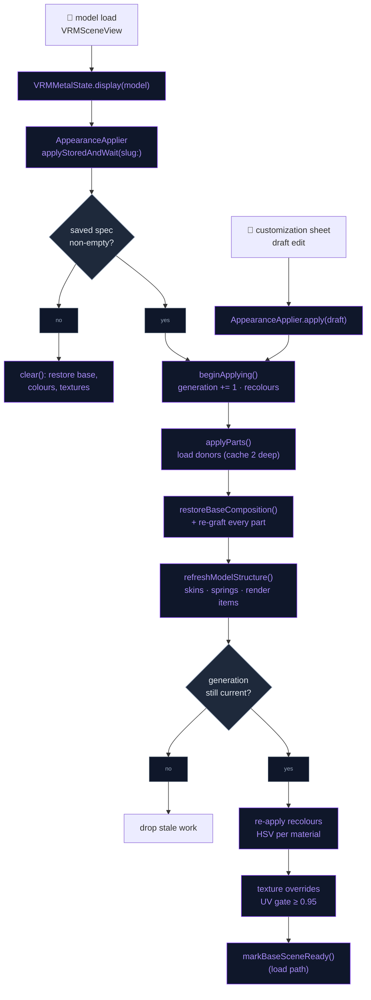
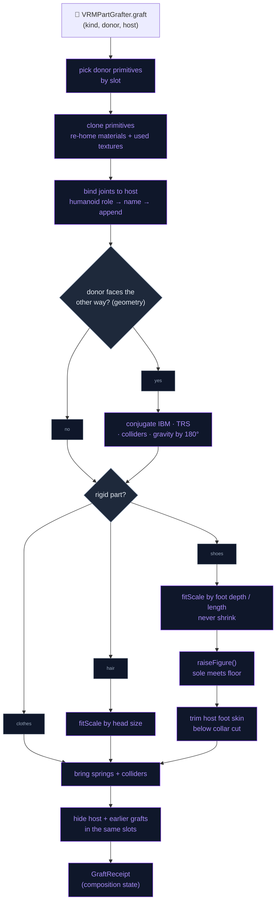
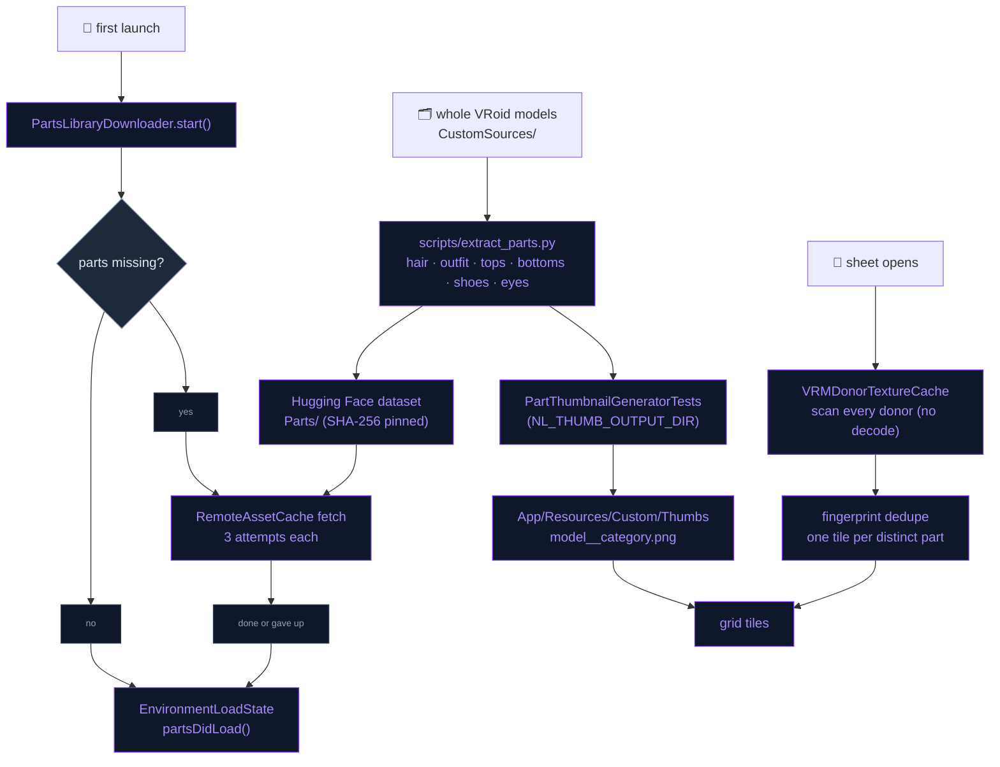

# Character Customization

Characters can be restyled live on the scene. The user can recolour hair,
eyes and clothes, borrow eye textures from other characters, and swap whole
parts: hairstyles, full outfits, or single garments (top, bottom, shoes).
Parts are grafted from the other characters in the app and from a downloaded
parts library. It works because every VRoid export shares two things:

- a stable material-name vocabulary (`*_Hair_00_HAIR`, `*_Tops_*`,
  `*_EyeIris_00_EYE`, …),
- the `J_Bip_*` humanoid skeleton.

Everything is a non-destructive overlay, saved per character and re-applied
on load. Nothing is written back to a model file, and there is no export
path.

## Opening the customizer

There are two entry points, both for the character currently on screen:

- long-press a card in the model picker → **Customize Appearance**
  (`ModelSelectionOverlay.onCustomize`),
- **Customize Appearance** in that character's settings
  (`AppearanceSettingsSection`). It dismisses the settings sheet first.

`CharacterCustomizationCoordinator.isPresented` drives an overlay hosted by
`ContentView`. The overlay sits over the live Metal scene, so the renderer
*is* the preview.

## The sheet

`CharacterCustomizationView` is an edge-to-edge bottom sheet:

- a grab handle to resize it; it can be pulled shorter, never taller than
  the default,
- an icon-over-label **category rail**,
- a scrolling **grid** of picture tiles. The first tile is "Original", and
  the selected tile gets an accent ring and a check badge,
- a collapsible **colour** section,
- a **Reset / Save** footer.

Edits change a draft `AppearanceSpec` that `AppearanceApplier` applies
immediately:

- **Save** persists the draft.
- **Close** restores the saved look (or clears it when nothing was saved).
- **Reset** clears everything.

| Category | Donor pick does | Colour sliders act on |
|---|---|---|
| Hair | Grafts hair + back hair | `hair`, `hairBack` |
| Outfit | Grafts the donor's **body skin and every garment** | tops, bottoms, shoes, one-piece, accessory |
| Top | Grafts tops + one-piece | `tops`, `onepiece` |
| Bottom | Grafts bottoms | `bottoms` |
| Shoes | Grafts shoes (library parts only) | `shoes` |
| Eyes | Borrows iris / white / highlight / extra **textures** | `eyeIris`, `eyeHighlight` |

**Exclusive picks**: Outfit and the single garments describe the same region
of the body (`AppearancePartKind.supersedes`). Picking one clears the other.

**Outfit vs single garments**: Outfit brings the donor's body skin along,
which is the faithful option, because VRoid deletes the skin its own outfit
hides. A single garment leaves the host's skin alone. If the new garment
covers less than the old one, it can expose a carved-away gap.

**Donor list** (`refreshDonors`): the tiles come from the parts library plus
every other registered character (bundled and imported).

- Characters are not offered as **shoe** donors. VRoid paints socks and
  stockings into the outfit material, so a shoe lifted off a whole character
  arrives without its legwear. Library shoe parts carry it.
- Every donor is scanned concurrently.
- Donors whose part has the same **fingerprint** collapse into one tile. The
  fingerprint is the slot + SHA-256 of the texture bytes + index count, so
  one school uniform worn by several models is one tile.

## Recolouring

A recolour is an **HSV shift** in the fragment shader, not a tint. A tint can
only darken, and VRoid irises and hair need real hue changes.

- `SlotRecolor` holds hue −180…180°, saturation ×0…2 and brightness ×0.5…1.5.
- `AppearanceMaterialLayer` keys the shift by material index, and
  `buildMaterialUniforms` feeds it into block 13 of `MToonMaterialUniforms`.
- `nl_applyRecolor` applies it to both base **and** shade colour, so the
  shadow side follows.
- The colour section offers one-tap hue presets (swatches preview the
  rotation on the part's current colour) above the exact sliders.

## Borrowing eye textures

The Eyes tab copies base-colour textures from a donor's matching slots.

- **Scan**: `VRMDonorTextureCache` inventories a donor's GLB without loading
  the model. It maps materials to slots, hashes the texture bytes, reads UV
  footprints and records each image's byte range. The whole library scans in
  well under a second, at a few KB per donor.
- **Compatibility gate**: a donor slot is offered only when the target
  slot's rasterized UVs are covered by the donor's UV footprint plus painted
  texels, at ≥ **0.95** (`UVCoverageMask`, 64×64). Face, eye-white and mouth
  UVs match across VRoid models, but the small eye parts differ. Highlight
  and eyeline are separate islands, so they stay gated.
- **Swap**: images are decoded straight, not premultiplied
  (`PNGStraightDecoder`), because ImageIO premultiplies on iOS. The new
  `MTLTexture` is swapped *inside* the shared `VRMTexture`. VRoid samples the
  same image as MToon's shade texture, so the shadow side follows. Originals
  are remembered for an exact reset.

## Grafting parts

`VRMPartGrafter.graft(kind, from: donor, donorSlug:, onto: host)` appends a
donor part to the host's plain arrays.

1. **Pick** donor primitives by slot (`AppearancePartKind.slots`).
2. **Clone** them shallowly (GPU buffers shared), and re-home their
   materials plus only the textures they use.
3. **Bind** a new skin to **host** nodes:
   - humanoid bones by **role** first (`humanoidRole(ofNode:)`), so a rig
     with other bone names still binds,
   - then role-less helpers such as `J_Adj_*` by name,
   - everything else (hair chains, skirt bones) is appended under its mapped
     ancestor with the donor's local TRS.
4. **Physics**: bring the donor's springs and collider groups for appended
   bones. Colliders on body bones resolve by role or name, so hair still
   collides with the head.
5. **Hide** the host's primitives in those slots, and any previously grafted
   ones, via `VRMModel.hiddenPrimitives`.

**Joint usage**: VRoid merges a body into one vertex array sliced per
primitive by indices. Joint usage (`VRMPrimitive.referencedJoints`) and
extents (`forEachRestPosition`) therefore always walk the index buffer.

**Orientation**: the renderer yaws VRM 0.x models 180°. When the donor faces
the opposite way from the host, every bone-local quantity is conjugated by
that yaw: inverse bind matrices, appended TRS, collider offsets, gravity.
The facing is read from the part's **geometry**
(`VRMPartGrafter+Orientation`), not its header, because one library part
declares 1.0 while laid out as 0.x.

**Composition and undo** (`VRMModel+Composition`): the first graft takes a
snapshot of the base arrays. Any change restores the snapshot, then
re-grafts every active part. This gives an exact, order-independent undo.
After that, `VRMRenderer.refreshModelStructure()` does four things:

- re-runs skin palette setup,
- rebuilds the spring GPU buffers (without re-expanding chains),
- invalidates the render-item cache,
- sets `requestPhysicsReset`, because the bone list changed identity.

`VRMRenderer.loadModel` re-allocates spring buffers when
`springBoneBuffersMatchSprings` is false. A graft appends chains, and filling
buffers sized for the base model would overrun them.

### Fitting rigid parts

Clothes are skinned across the whole humanoid and follow the host's
proportions on their own. Their scale is always 1. Hair and shoes are rigid
on one bone, so they are fitted with `fitScale`, clamped to ×0.72–1.4. The
scale applies only to joints in `fitAnchorBones`.

- **Hair** rides `head`. It is scaled by the host/donor head size: the face
  bbox diagonal, or `NL_headSize` in a hair part's document `extras`.
- **Shoes** ride the feet and toes. They are scaled by whichever of foot
  **depth** (ankle to sole, read from the shoe the host already wears) or
  foot **length** demands more, and are never shrunk.
  - **Grounding**: `raiseFigure` lifts the host's root nodes so the shoe's
    sole meets the floor. Wearing heels makes you taller. Sliding the shoe
    instead would pull its cavity off the foot. `lowerFigure` undoes the
    lift on restore.
  - **Skin trim**: VRoid leaves a whole foot in the merged body primitive,
    shaped for its own shoe. `VRMPartGrafter+SkinTrim` gives that primitive
    a narrower index buffer that drops triangles fully below a cut line. The
    cut sits just under the shoe's collar (the highest band still at full
    depth, found from 40k samples), capped at 80% of the host's own foot
    depth. The full buffer stays on the primitive (`untrimmedIndices`) and is
    restored with the composition.
- Every measurement is taken in **bind space** (`bindPosition(of:)`, from the
  inverse bind matrix), never from animated `node.worldPosition`. The idle
  animation is already playing when a saved look is applied.

## Parts library

`scripts/extract_parts.py` cuts whole VRoid models into minimal part VRMs:
`<model>__hair`, `__outfit`, `__tops`, `__bottoms`, `__shoes` and `__eyes`.
Each file keeps:

- only that part's primitives (re-indexed),
- their materials and textures (bytes verbatim, so fingerprints are stable),
- the full skeleton and springs,
- a trimmed VRM extension.

Unnamed materials get a slot from the following sources, in order:

1. the glTF name,
2. the VRM 0.x property name,
3. the sampled image names,
4. an exclusively-hair mesh name,
5. the body band they occupy (ankles → shoes, hips/legs → bottoms, above the
   waist → tops).

Recovered slots are written under canonical names (`NL_Tops_01_CLOTH`, …).

- **Delivery**: the 68 files (~225 MB) live in the Hugging Face dataset under
  `Parts/`. They are reached through `RemoteAssetRegistry.libraryPart(stem)`
  and pinned by size + SHA-256.
- **Manifest**: `PartsLibrary` lists `RemoteAssetRegistry.libraryPartStems`.
  Donor slugs are `lib:<stem>`, and library parts never appear in the
  character picker.
- **First-launch download**: `PartsLibraryDownloader` fetches missing parts
  (3 attempts each) and gates the loading screen through
  `EnvironmentLoadState.partsReady`. It releases the gate on success **or**
  failure: a missing library costs outfits, never the app.
- **Tile pictures** ship pre-rendered: 79 PNGs in
  `App/Resources/Custom/Thumbs/`, named `<model>__<category>.png`, covering
  the library and the bundled characters. The picker therefore looks
  complete before any part arrives. Imported characters' tiles are rendered
  once at runtime by `VRMPartThumbnailRenderer`, then cached by
  `PartThumbnailStore`:
  - private renderer with catalogue lighting,
  - transparent background,
  - framed on the part's own bounds,
  - one donor at a time, never while a graft is in flight.

## Saved looks

- **Storage**: `AppearanceSpec` (schema 2: `recolors`, `textures`, `parts`)
  is stored as JSON in the `character_appearance` table, keyed by the
  lowercased slug (`MemoryStore+Appearance`, `AppearanceStore` facade).
  Unknown slots and kinds from newer builds are skipped on decode. Deleting
  an imported character cascades to its row.
- **Apply on load**: `VRMSceneView` calls `state.display(model)`, then
  `await AppearanceApplier.applyStoredAndWait(slug:to:)`, then
  `markBaseSceneReady()`. The character is never revealed in its original
  clothes first.
- **Apply order**: parts (donor models load asynchronously, cached two deep
  by slug+part, and only the part's textures are decoded) → recolours
  (re-applied after grafts append materials) → texture overrides.
- **Stale work**: a generation counter drops async work left over from a
  previous pick or character.

## Flow

### Applying a look

### One graft

### Parts library

## Files

| File | Role |
|---|---|
| `Domain/Entities/Appearance/VRoidMaterialSlot.swift` | Prefix-agnostic slot classifier over VRoid material names |
| `Domain/Entities/Appearance/AppearanceSpec.swift` | `SlotRecolor`, `DonorTextureRef`, `AppearancePartKind` (slots, anchors, supersedes, floor/trim flags), tolerant Codable spec |
| `Core/Engine/VRM/Appearance/AppearanceMaterialLayer.swift` | Per-material HSV recolours + texture overrides with exact reset |
| `Core/Engine/VRM/Appearance/AppearanceTextureFactory.swift` | Straight-alpha texture upload for borrowed images |
| `Core/Engine/VRM/Appearance/PNGStraightDecoder.swift` | Non-premultiplied PNG decode |
| `Core/Engine/VRM/Appearance/UVCoverageMask.swift` | 64×64 UV coverage masks for the texture gate |
| `Core/Engine/VRM/Appearance/VRMPartGrafter.swift` | Graft: pick, clone, bind, springs, hide, fit scale |
| `Core/Engine/VRM/Appearance/VRMPartGrafter+Orientation.swift` | Geometry-based donor facing |
| `Core/Engine/VRM/Appearance/VRMPartGrafter+SkinTrim.swift` | Shoe fit, grounding (`raiseFigure`/`lowerFigure`), host foot trim |
| `Core/Engine/VRM/Appearance/VRMModel+Composition.swift` | Base snapshot, restore + re-graft, `humanoidRole(ofNode:)` |
| `Core/Engine/VRM/Appearance/VRMModel+SlotBounds.swift` | Index-following rest bounds, `bindPosition(of:)`, head/foot reference sizes |
| `Core/Engine/VRM/Appearance/VRMModel+SlotNames.swift` | Material → slot lookup on a loaded model |
| `Core/Engine/VRM/Appearance/VRMRenderer+Refresh.swift` | `refreshModelStructure()` after a graft or restore |
| `Core/Engine/VRM/Appearance/VRMPartThumbnailRenderer.swift` | Offscreen tile renderer (catalogue lighting, transparent, part-framed) |
| `Core/Engine/VRM/Shaders/MToonCommon.metal` | `nl_applyRecolor` |
| `Data/DataSources/Characters/Appearance/AppearanceApplier.swift` | Spec → renderer state (parts → colours → textures), donor cache, generation counter |
| `Data/DataSources/Characters/Appearance/VRMDonorTextureCache.swift` | Decode-free donor inventory, fingerprints, lazy masks |
| `Data/DataSources/Characters/Appearance/PartsLibrary.swift` | Manifest of library parts (`lib:<stem>`) |
| `Data/DataSources/Characters/Appearance/PartsLibraryDownloader.swift` | First-launch download + loading-screen gate |
| `Data/DataSources/Characters/Appearance/PartThumbnailStore.swift` | Bundled tile lookup + runtime render cache |
| `Data/DataSources/Assets/RemoteAssetRegistry+Parts.swift` | Part stems + size/SHA-256 pins |
| `Data/DataSources/Memory/MemoryStore+Appearance.swift` | `character_appearance` table |
| `Data/Repositories/AppearanceStore.swift` | `@Observable` facade over the table |
| `Presentation/Views/Characters/Customization/CharacterCustomizationView.swift` | The sheet: rail, grid, colour, Reset/Save, donor list |
| `Presentation/Views/Characters/Customization/CustomizationCategory.swift` | Tabs → part kind / texture slots / recolour slots |
| `Presentation/Views/Characters/Customization/CustomizationItemGrid.swift` | Tile grid |
| `Presentation/Views/Characters/Customization/CustomizationColorSection.swift` | Hue presets + sliders |
| `Presentation/Views/Characters/Customization/CustomizationTheme.swift` | Sheet look and metrics |
| `Presentation/Views/Characters/Customization/CharacterCustomizationCoordinator.swift` | Presentation flag |
| `Presentation/Views/AI/PersonaSettingsView+Appearance.swift` | "Customize Appearance" in character settings |
| `Presentation/Views/Overlays/ModelSelectionOverlay.swift` | Long-press "Customize Appearance" |
| `../scripts/extract_parts.py` | Cuts whole models into part VRMs |

## Integration notes

- **Asset pins**: re-uploading any `Parts/` file requires updating its pin in
  `RemoteAssetRegistry+Parts.swift`. Regenerating parts also changes
  fingerprints, so re-run the thumbnail generator:
  `TEST_RUNNER_NL_THUMB_OUTPUT_DIR=… xcodebuild test -only-testing:NeuraLinkTests/PartThumbnailGeneratorTests`.
- **No reloads**: customization never reloads the model. Everything is
  applied on top of `display()`, so switching tabs is instant.
- **VRoid guideline**: the app imports VRM and never exports a combined
  model. No save-as-VRM or share path exists for customized characters.
- **Tests**:
  - `VRMPartGraftTests` and `VRMGraftCompatibilityTests` cover role binding,
    spec-version pairs, colliders, spring buffers, repeated swaps, and hair
    and shoe fit.
  - `UVCoverageTests`, `AppearanceSpecTests`, `AppearanceStoreTests` and
    `PartsLibraryTests` cover the texture gate, the spec, storage and the
    library.
  - `ShoeGraftDiagnostic` (`NL_SHOE_DIAG_DIR`) reports the exposed foot per
    host×donor pair and renders each pair from the front and the side.

## Troubleshooting

| Symptom | Usual cause |
|---|---|
| Garment tile or bounds show the whole figure | Something read a primitive's raw vertex array instead of following its index buffer (VRoid merges the body into one array) |
| Grafted part lands wrong only after a pose | A measurement used animated `node.worldPosition`. Graft measurements must be in bind space |
| Hair floats off the origin on an imported model | Humanoid map missing or wrong on that rig, so bones fell back to append |
| Scattered or missing hair after several swaps | Spring buffers not re-allocated for the appended chains (`springBoneBuffersMatchSprings`) |
| A diagnostic render "passes" unchanged | Setting `node.rotation` needs `updateLocalMatrix()`; compare render hashes, not pictures |
| Shoe gap or buried foot | Set `NL_NO_SKIN_TRIM` to compare without the trim; run `ShoeGraftDiagnostic` for per-pair exposure |

## Known device-test items

- Recolour hair, eyes and clothes on Ekaterina (VRM 0.x) and Sonya (VRM 1.0).
  Switch characters with a saved look and back. Confirm Close restores and
  Reset clears.
- Shoe fit is measured on the bundled characters (26 host×donor pairs, worst
  1.7% of the foot exposed). An imported model with other proportions can
  still show the foot through a borrowed shoe.
- First install waits on ~225 MB of parts on top of the environment before
  the loading screen releases.
- The footer under "Customize Appearance" in character settings still
  mentions skin tone. Skin recolour is no longer offered.
