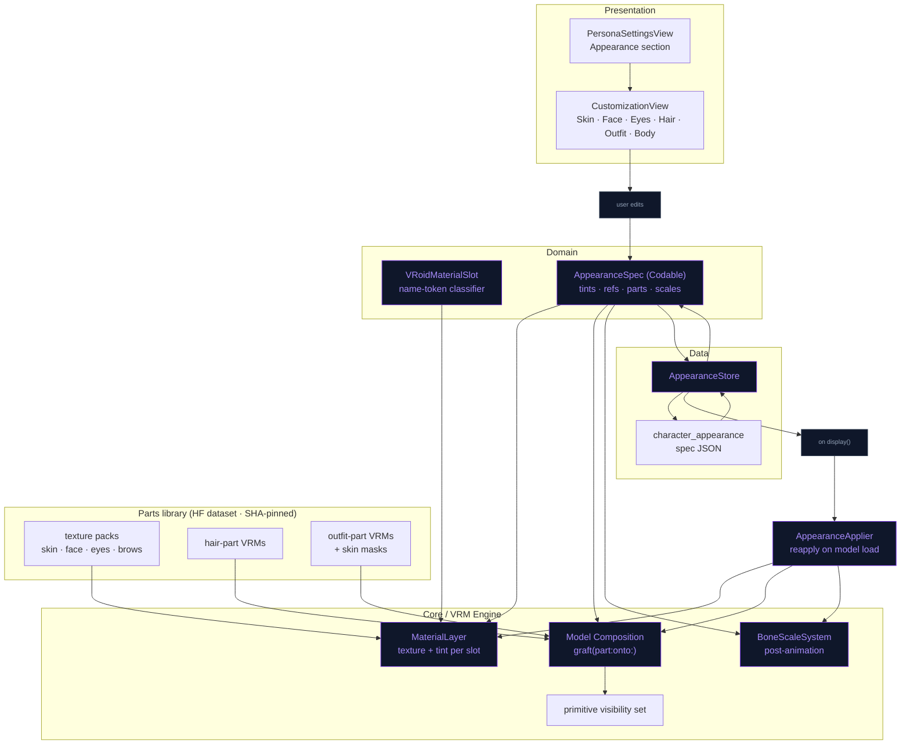

# Character Customization — Plan

Reference: [ReForge-Mode/Unity_VRoid_Character_Customization](https://github.com/ReForge-Mode/Unity_VRoid_Character_Customization)
(Unity + UniVRM). Written 2026-09-26. Status: **Phase 0 + Tier A + UI/persistence
+ Tier B (hair & outfit grafts from registry characters) built 2026-09-26** (lint +
build + unit tests green on simulator; device pass pending). Tier C not started.

## Verdict

Yes. The Unity project is not doing anything Unity-specific; it exploits two
properties of every VRoid Studio export, and NeuraLink's hand-written Metal
engine exposes exactly the seams needed to do the same thing (and more) in Swift.

What the Unity project actually does (its four scripts, ~250 lines total):

| Unity script | Technique | NeuraLink equivalent |
|---|---|---|
| `CopyMaterials.cs` | Copies materials between models by **VRoid material-name suffix** (skips the `N00_000_00_` prefix). Face / eyes / skin / clothes are four filtered passes over the same list. | Swap `VRMMaterial.baseColorTexture` + factors per *slot* on the live model. No reload. |
| `ShowHairSets.cs` | Hair-only VRMs (one per donor) parented under every whole-body model; `SetActive` toggles the chosen one. | Graft a hair-part `VRMModel` onto the host skeleton by bone name; hide the host's own hair primitives. |
| `ShowModel.cs` | One whole-body VRM per outfit (Dress / Hoodie / Uniform); show one, re-run material copies. | Outfit-part graft on a full-skin base body (better), or whole-body swap (fallback, already works today). |
| `ChangeOnSliderValue.cs` | Slider UI → index into donor list. | SwiftUI `CharacterCustomizationView` over the live Metal scene. |

Two VRoid facts make this work and both were verified against our files
(`Ekaterina.vrm` VRoid 2.3 / VRM 0.x, `Sonya.vrm` VRoid 2.3.1 / VRM 1.0,
`Dedicatus.vrm` VRoid 1.x / VRM 0.x):

1. **Material names are a stable slot vocabulary.** Every model carries
   `*_Face_00_SKIN`, `*_Body_00_SKIN`, `*_EyeIris_00_EYE`, `*_EyeWhite_00_EYE`,
   `*_EyeHighlight_00_EYE`, `*_FaceBrow_00_FACE`, `*_FaceEyeline_00_FACE`,
   `*_FaceMouth_00_FACE`, `*_HairBack_00_HAIR`, `*_Hair_00_HAIR*`, `*_Tops_*`,
   `*_Bottoms_*`, `*_Shoes_*`, `*_Onepiece_*`, `Accessory_*`. The prefix varies
   (`N00_` in 2.x, `F00_`/`M00_` in 1.x), the tokens do not. The engine already
   keys render order on these tokens (`VRMRenderer+RenderItems.swift`, `DepthBiasCalculator`).
2. **Face and body share a UV atlas across models.** The face-skin sub-mesh has
   the same triangle count on Ekaterina and Sonya (12 696 indices) and the same
   for eye-white (1 584); body-skin index counts differ only because VRoid deletes
   skin hidden under the outfit at export. So skin / face / eye / brow / mouth
   textures are interchangeable between VRoid models. Clothing textures are only
   interchangeable between the *same* garment template (same item id in the name).

Why it is easier here than in Unity: there are no GameObjects or prefabs. A
`VRMModel` is plain arrays (`meshes`, `materials`, `textures`, `nodes`, `skins`,
`springBone`) and the renderer reads them live, so composition is index
bookkeeping plus a few system re-inits.

## Scope tiers

| Tier | What the user gets | Works on | Effort |
|---|---|---|---|
| **A — Material layer** | Skin tone, face texture set, eye iris / white / highlight, brows, eyeline, mouth, hair colour, outfit colour tint | Every VRoid model incl. user imports | M |
| **B — Part transplant** | Hair styles, outfits, accessories (glasses etc.) from a parts library | Bundled characters fully; imports: hair yes, outfits best-effort | L |
| **C — Shape** | Height, head size, limb length, shoulder width, bust (bone scale) | Every model | M |
| **UI + persistence** | Customization screen, per-character saved look, reset | — | M |

Not feasible without authored assets, stated up front: **face-shape sliders**.
VRoid bakes its face parameters into the mesh; exported models carry only the
57 expression morphs (`Fcl_*`), no shape morphs. Face *variants* can still ship
as Tier B parts (the Face mesh is its own skin, transplantable like hair).

Order: **Phase 0 spike → A → UI/persistence → B (hair) → B (outfits) → C**.
Tier A alone already gives a visible, shippable feature.

## Engine seams (verified 2026-09-26)

| Need | Seam | Notes |
|---|---|---|
| Swap a texture live | `VRMMaterial.baseColorTexture: VRMTexture?` is `public var`; the draw reads `.mtlTexture` every frame (`VRMRenderer+DrawCall.swift:132`) | No geometry rebuild. `TextureLoader.createTexture(from:)` makes an `MTLTexture` from any `CGImage`. |
| Tint a material live | `VRMExpressionController.setBaseMaterialColor / getMaterialColorOverride` → `mtoonUniforms.baseColorFactor` at `VRMRenderer+DrawCall.swift:236` | Expression system owns this today. Tier A adds a separate appearance layer multiplied in at the same site, so expression tints keep working. Shade colour must be tinted too (`VRMMToonMaterial.shadeColorFactor`) or the shadow side keeps the old hue. |
| Address materials by slot | `VRMMaterial.name`, `RenderItem.materialName` | Existing heuristics in `VRMRenderer+RenderItems.swift:80-206` are render-order oriented; Tier A introduces one shared classifier and points them at it. |
| Bone scale | `VRMNode.scale` folded into `localMatrix` (`VRMGeometry+Node.swift:135`) → skin palette | Must be applied **after** `AnimationPlayer` writes TRS (`AnimationPlayer.swift:132-159`) and before `VRMSkinningSystem.updateJointMatrices`. |
| Morph names | `GLTFMeshExtras.targetNames` decoded (`GLTFParser.swift:119`) but never used; targets are named `target_N` (`VRMGeometry.swift:208`) | One-line plumbing fix; needed so a grafted Face part can rebind expressions by `Fcl_*` name. |
| Load a part file | `VRMModel.load` requires a VRM extension + humanoid `validate()` | VRoid part exports keep the full `J_Bip_*` skeleton, so they load as-is. Add a `VRMLoadingOptions.isPart` flag to skip spring GPU init and lookAt. |
| Reload path | `VRMSceneView.loadModel()` → `VRMMetalState.display()` → `VRMRenderer.loadModel()` | Appearance is applied *after* `display()`, never by reloading, so switching tabs in the UI is instant. |
| Re-init after graft | `skinningSystem.setupForSkins`, `initializeSpringBoneGPUSystem`, render-item cache invalidation (`VRMRenderer+Lifecycle.swift:75-79`) | All exist; wrap them in one `renderer.refreshModelStructure()`. |
| Persistence | `MemoryStore` DDL (`MemoryStore.swift:193-280`), slug = filename stem = persona id | New table beside `character_ai`; cascade-delete with imported characters (`MemoryStore+ImportedCharacters.swift:168`). |
| Asset delivery | `RemoteAssetRegistry` SHA-256 pins (see memory: re-uploading requires pin update) | Parts library ships the same way as the environment GLBs. |
| Licence gate | `VRMMeta.modify` parsed for 1.0 (`VRMExtensionParser.swift:242`); 0.x has no modify field | Policy below. |

## Licence and VRoid guideline

VRoid's guideline forbids apps that "create 3D models by combining meshes and/or
textures"; the Unity author got written confirmation that this only applies when
the app **exports**. NeuraLink imports VRM and never exports a model, so Tier B
is in the same position. Rules for the code:

- Bundled characters and the parts library: full customization (our assets).
- Imported VRM 1.0 with `meta.modify == .prohibited`: Tier A tints/textures and
  Tier C allowed (non-destructive, in-app only), Tier B grafts **disabled** with an
  explanation in the UI. Any other value: everything allowed.
- Imported VRM 0.x: no modify flag exists; treat as allowed but show the licence
  name (`VRMMeta` already carries it) in the customization screen header.
- No export, share, or "save as VRM" path is ever added by this feature.

## Phase 0 — Spike (S, ~1 day) — validates the two load-bearing assumptions

> ✅ **Test 1 done 2026-09-26, offline** (scratchpad `uvcheck.py`, stronger than
> the device check below): per-corner UVs of the face-skin, eye-white, mouth and
> back-hair sub-meshes are **bit-identical** between Ekaterina and Sonya; body
> IoU 0.90 (differs only where each outfit deleted hidden skin); Dedicatus
> (VRoid 1.x) face/body UVs sit inside the 2.x layout (0.99). The small eye
> parts are **not** shared (iris 0.94 / highlight 0.07 / eyeline 0.62 / brow 0.89
> IoU), which is why Tier A gates texture borrowing with a runtime UV-coverage
> check instead of trusting the slot. Test 2 (part exports) still needs VRoid
> Studio — required before Tier B only.

1. Python, in scratchpad (no app code): extract Sonya's `Face_00_SKIN`,
   `EyeIris`, `Body_00_SKIN` PNGs and write them into a copy of `Ekaterina.vrm`
   and of `Dedicatus.vrm`; open on device via the import flow. Pass = no UV
   mismatch on face/body across VRoid 1.x and 2.x generations.
2. VRoid Studio: export one **hair-only** VRM (set every face/body/outfit texture
   fully transparent, tick *Delete transparent meshes* on export) and one
   **outfit-only** VRM the same way, plus one **base body with no outfit**. Confirm
   they load through `VRMModel.load` unchanged (humanoid present) and record
   their skin joint counts (must stay ≤ 255 per skin, `VRMGeometry.swift:147-178`).
3. Write down the VRoid Studio recipe in `docs/CHARACTER_PARTS_AUTHORING.md`.

Stop here if (1) fails: the plan degrades to "whole-body swap + tint only".

## Phase A — Material layer (M, ~4 days) — ✅ CODE DONE 2026-09-26, device check pending

Built as planned with two deviations worth knowing:
- **Recolour is an HSV shift in the fragment shader**, not a base-colour tint:
  a tint can only darken, and VRoid irises/hair need real hue changes. New
  16-byte block 13 in `MToonMaterialUniforms` (now 224 bytes; mirrored in
  `MToonCommon.metal` + `SkinnedShader.metal`), applied to base AND shade
  colour in `mtoon_fragment_v2` (`nl_applyRecolor`). Fed per material index
  from `VRMRenderer.appearanceLayer` in `buildMaterialUniforms`.
- **Texture donors are the other characters in the registry** (bundled +
  imported), scanned straight out of their GLB without loading a model
  (`VRMDonorTextureCache`) — the Unity "copy from premade model N" idea with
  zero new assets. A texture pack pipeline is still open for later.
- Donor gate: `UVCoverageMask` (64×64) — target = rasterized UVs of the slot's
  primitives (read back from the shared-storage vertex buffers), donor = painted
  texels; applied when ≥ 0.97 covered. Body skin uses a *colour* mask because the
  renderer draws it opaque and VRoid keeps skin colour under its alpha-0 outfit
  holes — which also forced a straight (non-premultiplied) PNG decoder
  (`PNGStraightDecoder`): ImageIO premultiplies on iOS and would have painted
  those regions black on the recipient.
- Texture overrides swap the `MTLTexture` inside the shared `VRMTexture` object
  so the MToon shade-multiply reference (VRoid `_MainTex` == `_ShadeTexture`)
  follows the base colour.
- The existing render-order heuristics were **not** refactored onto the new
  classifier (kept out of scope to avoid a behaviour change); `VRoidMaterialSlot`
  is additive.

**Domain**
- `Domain/Entities/VRoidMaterialSlot.swift` — enum `faceSkin, bodySkin, eyeIris,
  eyeWhite, eyeHighlight, eyeExtra, brow, eyeline, eyelash, mouth, hairBack, hair,
  tops, bottoms, shoes, onepiece, accessory, other` + `static func classify(materialName:)`
  (token match, prefix-agnostic, case-insensitive). Unit-tested against all three
  real VRMs the way `VRM0HumanoidMappingTests` tests Ekaterina.
- `Domain/Entities/AppearanceSpec.swift` — `Codable`, `schemaVersion`,
  `tints: [VRoidMaterialSlot: RGBA]`, `textures: [VRoidMaterialSlot: PartRef]`,
  `hairPart: PartRef?`, `outfitPart: PartRef?`, `boneScales: [VRMHumanoidBone: SIMD3<Float>]`.
  `PartRef` = library id + sha256 (so a missing/updated asset is detectable).

**Engine** (`Core/Engine/VRM/Appearance/`, new folder)
- `AppearanceMaterialLayer` — owns `originalTextures: [Int: VRMTexture?]` and
  `originalFactors` per material index so *Reset* is exact; `apply(spec:to model:)`
  sets `baseColorTexture` and multiplies `baseColorFactor` + `mtoon.shadeColorFactor`;
  the draw site reads `appearanceTint[materialIndex]` next to the expression
  override (one extra dictionary lookup, no new uniform).
- Hair colour: VRoid hair textures are greyscale-ish with colour in the material
  factor, so a tint slider is enough (same as VRoid Studio's own hair-colour UI).
  Skin tone: tint `faceSkin` and `bodySkin` together, plus `mouth` slot lightly.
- Point the existing name heuristics in `VRMRenderer+RenderItems.swift` and
  `DepthBiasCalculator` at the classifier (behaviour-preserving refactor, pinned by
  a render-order test).

**Assets** — texture packs as PNG sets in an HF dataset asset (`parts/textures/<pack>/…`),
pinned in `RemoteAssetRegistry`; a starter pack bundled in-app so the feature
works offline on first launch. Sources: our own VRoid projects only.

## Phase UI + persistence (M, ~4 days) — ✅ CODE DONE 2026-09-26, device check pending

Built: `character_appearance` table + `MemoryStore+Appearance` + `AppearanceStore`
facade (cascade on imported-character delete); `AppearanceApplier` re-applies the
stored spec right after `VRMMetalState.display()` in both load paths of
`VRMSceneView`; `CharacterCustomizationView` bottom panel (tabs Skin · Face · Eyes ·
Hair · Outfit, slot chips, Hue/Saturation/Brightness sliders, donor swatch row with
"Original", Reset All / Cancel / Save) hosted by `ContentView` via
`CharacterCustomizationCoordinator`; entry points = long-press "Customize
Appearance" on a picker card and an "Appearance" row in PersonaSettingsView (active
character only). Not built: thumbnail refresh on save, tutorial step, Body tab
(Tier C).

Device checklist: recolour on skin/hair/eyes on Ekaterina + Sonya; borrow Sonya's
face onto Ekaterina (offered) and confirm iris/brow swaps are hidden (gated);
switch character with a saved look and back; Cancel restores; delete an
imported character clears its row.

- `MemoryStore` DDL: `character_appearance(character TEXT PRIMARY KEY, spec TEXT
  NOT NULL, updated_at REAL)`; `MemoryStore+Appearance.swift` upsert/read/delete;
  cascade in the imported-character delete. Facade `Data/Repositories/AppearanceStore.swift`
  (`@Observable @MainActor`, same `lastUpdated` bump pattern as `ImportedCharacterStore`).
- `AppearanceApplier` (Data/DataSources/Characters): called from
  `VRMMetalState.display()` after `renderer.loadModel`, reads the spec for the
  slug and applies all tiers; also re-applies after any future reload.
- `Presentation/Views/Characters/CharacterCustomizationView.swift` — full-screen
  overlay on the live scene (the renderer *is* the preview); segmented tabs
  Skin · Face · Eyes · Hair · Outfit · Body; horizontal swatch/thumbnail rows via the
  existing `ModelCard` look; camera framing per tab (`setupCamera` seam, face
  close-up for Face/Eyes); **Save / Reset** as separate `.borderless` buttons
  (see memory: stacked buttons in a Form fire together). Unsaved edits revert on
  dismiss by re-applying the stored spec.
- Entry points: "Appearance" row in `PersonaSettingsView`; long-press action on
  `ModelCard` in `ModelSelectionOverlay`.
- Thumbnail refresh on save through `VRMRenderer+Capture.swift` (bundled
  characters keep their PNG; imported ones overwrite `characters/<slug>.png`).
- Tutorial: one added step only if the entry point is visible in the tour path.

## Phase B — Part transplant (L, ~8 days; hair first, outfits second) — ✅ CODE DONE 2026-09-26 (registry donors), device check pending

Built against the characters already in the app instead of a parts library —
exactly the Unity project's model: every other character is a donor.
- `VRMPartGrafter.graft(kind, from: donor, donorSlug:, onto: host)`: picks donor
  primitives by slot (hair = hair+hairBack, outfit = bodySkin+tops+bottoms+shoes+
  onepiece+accessory), shallow-clones them (GPU buffers shared), re-homes
  materials + only the textures they use, builds a skin whose joints resolve to
  HOST nodes — humanoid / `J_Adj_*` bones by name, everything else appended with
  its unmapped ancestors and all descendants (chain ends carry no weights) —
  and brings the donor springs/collider groups that drive appended bones.
  Host primitives in the part's slots go into `VRMModel.hiddenPrimitives`.
- **Cross-version fix**: the renderer yaws VRM 0.x models 180°, so when host
  and donor differ every bone-local quantity is conjugated by that yaw
  (IBM' = R·IBM, appended TRS, collider offsets, gravity). Pinned by
  `VRMPartGraftTests` on Ekaterina (0.x) ← Sonya (1.0).
- `VRMModel+Composition`: one snapshot of the base arrays; changing any part =
  restore + re-graft all active parts (order-independent, exact undo).
  `VRMRenderer.refreshModelStructure()` re-runs skin palette setup + spring GPU
  buffers (`initializeSpringBoneGPUSystem(expandChains: false)` — re-expanding
  0.x chains would duplicate them) + render-item cache.
- Gotcha found by the test: VRoid 2.x merges all body primitives into ONE vertex
  array, so "which joints does this primitive use" must walk its index buffer,
  not the vertex buffer (`VRMPrimitive.referencedJoints`).
- Donor models load fully (`VRMModel.load` with device, ~1–2 s) and are cached
  one deep in `AppearanceApplier`; released on panel close. Grafted buffers stay
  alive only through the host's arrays.
- Texture gate corrected: compatibility = target UV ⊂ (donor UV footprint ∪
  painted texels) ≥ 0.95. Alpha-only was wrong for eye parts (an iris texture is
  meant to be transparent outside the disc) — Sonya→Ekaterina iris/brows/face/
  body now pass; highlight/eyeline (different islands) stay gated.
- Outfit graft = donor body skin + clothes together, so the body under the new
  outfit is the donor's (consistently masked). Face stays the host's; the Skin
  tab can copy the donor's face texture to match tone.
- Panel redesigned: five tabs (Hair · Outfit · Face · Eyes · Skin), 96-pt donor
  cards with names, a collapsible colour section, 48-pt Reset/Cancel/Save.
Still open from the original plan: shipped parts library (hair-only / outfit-only
exports), face variants, `targetNames` plumbing (not needed for hair/outfit).

**Loader**
- `VRMLoadingOptions.isPart`: skips spring GPU init, lookAt, expression
  registration; still runs texture/material/mesh/skin build.
- Plumb `targetNames` → `VRMMorphTarget.name`.

**Composition** — `Core/VRMModel+Composition.swift`
- `graft(part: VRMModel, kind: .hair | .outfit | .face, onto host: VRMModel) -> GraftReceipt`
  1. Node map: for every part skin joint, resolve host node by **bone name**
     (`J_Bip_*` / `J_Adj_*` / `J_Sec_*` standard); unresolved joints (hair chains
     `J_Sec_Hair*`, `HairJoint-*`, `J_Opt_*`) are **appended** to `host.nodes` and
     re-parented under the resolved host parent (hair → `head`), keeping their
     local TRS. Node count guard: `≤ 255` joints per skin after remap.
  2. Append part `textures`, `materials`, `meshes` with index offsets; rewrite
     `primitive.materialIndex`; create a new `VRMSkin` with remapped joints and the
     **part's own inverse bind matrices** (they map vertices into joint-local
     space, so host bone *positions* are honoured; only bone-*length* differences
     distort, and bundled parts are authored on one base body so there are none).
  3. Append the part's `VRMSpring`s / colliders with node indices remapped
     (0.x parts are already normalised into `VRMSpringBone` by the loader).
  4. Visibility: `host.hiddenPrimitives` (new `Set<PrimitiveKey>`) gets every host
     primitive whose slot is `hair`/`hairBack` (hair graft) or
     `tops/bottoms/shoes/onepiece/accessory` (outfit graft). `buildRenderItems`
     skips hidden primitives; `VRMRenderer+Outline` likewise.
  5. Receipt records every appended index range so `ungraft(receipt)` restores the
     host exactly (arrays truncated, hidden set cleared) — no reload on part change.
- `renderer.refreshModelStructure()` = invalidate render-item cache →
  `setupForSkins` → `initializeSpringBoneGPUSystem` → `warmupPhysics`.

**Outfits on a full-skin base body**
- Bundled characters gain a `<name>_base.vrm` (no outfit, full skin) used only
  when an outfit part is selected; the original file stays the default so
  nothing changes for users who never customize.
- Each outfit part ships a `skinmask.png`; the applier multiplies it into the
  body-skin alpha and flips that material to `MASK` — the same mechanism VRoid
  uses at export to remove skin under clothes (see memory: "black outfit panels"),
  so no poke-through and no z-fighting.
- Imported characters: hair grafts allowed (head-local, exact); outfit grafts
  offered but labelled "may not fit perfectly" because their base body is masked
  under the original outfit and proportions differ.

**Face variants** (optional, last): the Face mesh is skin 0 with 57 `Fcl_*`
morphs; a face part graft rebinds expressions by morph *name* through
`registerCustomExpression` / preset re-registration in `VRMRenderer+Lifecycle`.

## Phase C — Shape (M, ~3 days)

- `VRMBoneScaleSystem` (Animation/): per-frame, after `AnimationPlayer.update`
  and before skinning, multiplies `node.scale` for configured humanoid bones.
  Presets exposed as sliders: height (hips + spine chain uniform), head size
  (`head` uniform — hair inherits), leg length (upper/lower leg Y), arm length,
  shoulder width (`shoulder` X), bust (`J_Sec_*Bust*` uniform, VRoid-specific).
- Scale-aware physics: spring `hitRadius` and collider radii multiply by the
  parent-chain scale (`setColliderRadius` seam); hips-height ratio retarget in
  `VRMAnimationLoader` already handles stride/bob for height.
- Camera framing: `setupCamera` reads the head node world position, so it follows
  height automatically.

## Test plan

Pinned so far (2026-09-26): `VRoidMaterialSlotTests` (names from both VRoid
generations + real bundled material lists), `AppearanceSpecTests`,
`AppearanceStoreTests` (incl. cascade), `UVCoverageTests` (mask math, orientation,
straight PNG decode, Sonya→Ekaterina face/eye-white/mouth compatible, body
correctly gated at 0.96).

Side fix (outside the feature, flagged for review): the heavier VRM-loading
tests made a pre-existing crash reproducible 3/3 — `NLEmbedding.vector(for:)`
called concurrently from the main thread and a background recall
(`NLEmbeddingBackend.embed`) segfaults inside libBNNS. `vectorLock` now
serializes that one call; the full unit target went from 334/345 (crash) to
345/345.

- `VRoidMaterialSlotTests` — classification against the material lists of all
  three real VRMs (bundled + `Dedicatus.vrm` fixture if licence allows; else a
  name-list fixture).
- `AppearanceSpecTests` — Codable round-trip, schema migration, unknown slot tolerance.
- `AppearanceStoreTests` — SQL CRUD + cascade on imported-character delete.
- `AppearanceMaterialLayerTests` — apply then reset restores original texture
  identity and factors bit-exactly.
- `VRMCompositionTests` — graft/ungraft invariants: node/skin/material counts,
  joint ≤ 255, every remapped joint resolves, spring node indices in range,
  hidden set contents; run on real hair part fixture from Phase 0.
- `VRMBoneScaleOrderTests` — scale survives an animation tick.
- Existing render-order and retarget tests must stay green (heuristic refactor).
- Device passes (per memory: ask for a side-by-side VRoid Hub screenshot first):
  A on Ekaterina + Sonya + one import; B hair on all three; B outfit on bundled;
  C on Sonya with the `appear` VRMA playing.
- `swiftlint --strict` + full scheme build + tests before each phase closes.

## Risks

| Risk | Mitigation |
|---|---|
| Face/body UV drift between VRoid Studio major versions | Phase 0 test 1 decides before any Swift is written. |
| Memory: extra textures + part meshes on iPhone 11 baseline | Parts are 1–2 MB; ungraft frees buffers; texture packs load on demand and are dropped on character switch. |
| Spring GPU buffers rebuilt on every hair change | Rebuild only on graft/ungraft, not on tint changes; `warmupPhysics` hides the settle. |
| Mixed spec versions (0.x host + 1.0 part) | Both are normalised to the same `VRMMaterial` / `VRMSpringBone` model at load; add a test for each pairing. |
| Third-party model licences | Gate above; never export. |
| Heuristic refactor changes render order | Pin current order with a test before touching it. |
