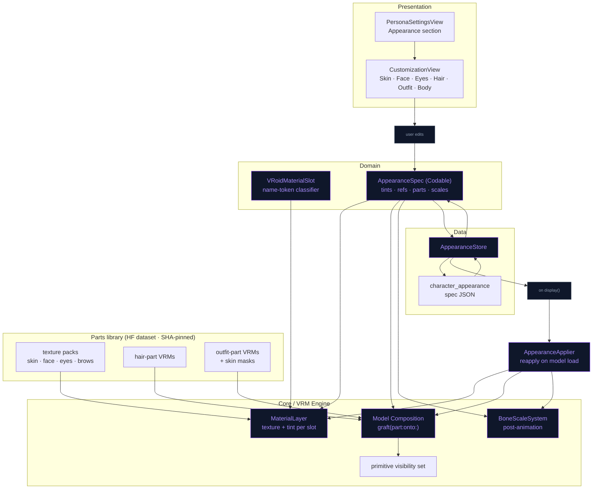

# Character Customization — Plan

Reference: [ReForge-Mode/Unity_VRoid_Character_Customization](https://github.com/ReForge-Mode/Unity_VRoid_Character_Customization)
(Unity + UniVRM). Written 2026-09-26. Status: **Phase 0 + Tier A + UI/persistence
+ Tier B (hair & outfit grafts from registry characters) built 2026-09-26** (lint +
build + unit tests green on simulator; device pass pending). Tier C not started.

## Verdict

Yes. The Unity project is not doing anything Unity-specific; it exploits two
properties of every VRoid Studio export, and NeuraLink's hand-written Metal
engine exposes exactly the seams needed to do the same thing (and more) in Swift.

What the Unity project actually does (its four scripts, ~250 lines total):

| Unity script | Technique | NeuraLink equivalent |
|---|---|---|
| `CopyMaterials.cs` | Copies materials between models by **VRoid material-name suffix** (skips the `N00_000_00_` prefix). Face / eyes / skin / clothes are four filtered passes over the same list. | Swap `VRMMaterial.baseColorTexture` + factors per *slot* on the live model. No reload. |
| `ShowHairSets.cs` | Hair-only VRMs (one per donor) parented under every whole-body model; `SetActive` toggles the chosen one. | Graft a hair-part `VRMModel` onto the host skeleton by bone name; hide the host's own hair primitives. |
| `ShowModel.cs` | One whole-body VRM per outfit (Dress / Hoodie / Uniform); show one, re-run material copies. | Outfit-part graft on a full-skin base body (better), or whole-body swap (fallback, already works today). |
| `ChangeOnSliderValue.cs` | Slider UI → index into donor list. | SwiftUI `CharacterCustomizationView` over the live Metal scene. |

Two VRoid facts make this work and both were verified against our files
(`Ekaterina.vrm` VRoid 2.3 / VRM 0.x, `Sonya.vrm` VRoid 2.3.1 / VRM 1.0,
`Dedicatus.vrm` VRoid 1.x / VRM 0.x):

1. **Material names are a stable slot vocabulary.** Every model carries
   `*_Face_00_SKIN`, `*_Body_00_SKIN`, `*_EyeIris_00_EYE`, `*_EyeWhite_00_EYE`,
   `*_EyeHighlight_00_EYE`, `*_FaceBrow_00_FACE`, `*_FaceEyeline_00_FACE`,
   `*_FaceMouth_00_FACE`, `*_HairBack_00_HAIR`, `*_Hair_00_HAIR*`, `*_Tops_*`,
   `*_Bottoms_*`, `*_Shoes_*`, `*_Onepiece_*`, `Accessory_*`. The prefix varies
   (`N00_` in 2.x, `F00_`/`M00_` in 1.x), the tokens do not. The engine already
   keys render order on these tokens (`VRMRenderer+RenderItems.swift`, `DepthBiasCalculator`).
2. **Face and body share a UV atlas across models.** The face-skin sub-mesh has
   the same triangle count on Ekaterina and Sonya (12 696 indices) and the same
   for eye-white (1 584); body-skin index counts differ only because VRoid deletes
   skin hidden under the outfit at export. So skin / face / eye / brow / mouth
   textures are interchangeable between VRoid models. Clothing textures are only
   interchangeable between the *same* garment template (same item id in the name).

Why it is easier here than in Unity: there are no GameObjects or prefabs. A
`VRMModel` is plain arrays (`meshes`, `materials`, `textures`, `nodes`, `skins`,
`springBone`) and the renderer reads them live, so composition is index
bookkeeping plus a few system re-inits.

## Scope tiers

| Tier | What the user gets | Works on | Effort |
|---|---|---|---|
| **A — Material layer** | Skin tone, face texture set, eye iris / white / highlight, brows, eyeline, mouth, hair colour, outfit colour tint | Every VRoid model incl. user imports | M |
| **B — Part transplant** | Hair styles, outfits, accessories (glasses etc.) from a parts library | Bundled characters fully; imports: hair yes, outfits best-effort | L |
| **C — Shape** | Height, head size, limb length, shoulder width, bust (bone scale) | Every model | M |
| **UI + persistence** | Customization screen, per-character saved look, reset | — | M |

Not feasible without authored assets, stated up front: **face-shape sliders**.
VRoid bakes its face parameters into the mesh; exported models carry only the
57 expression morphs (`Fcl_*`), no shape morphs. Face *variants* can still ship
as Tier B parts (the Face mesh is its own skin, transplantable like hair).

Order: **Phase 0 spike → A → UI/persistence → B (hair) → B (outfits) → C**.
Tier A alone already gives a visible, shippable feature.

## Engine seams (verified 2026-09-26)

| Need | Seam | Notes |
|---|---|---|
| Swap a texture live | `VRMMaterial.baseColorTexture: VRMTexture?` is `public var`; the draw reads `.mtlTexture` every frame (`VRMRenderer+DrawCall.swift:132`) | No geometry rebuild. `TextureLoader.createTexture(from:)` makes an `MTLTexture` from any `CGImage`. |
| Tint a material live | `VRMExpressionController.setBaseMaterialColor / getMaterialColorOverride` → `mtoonUniforms.baseColorFactor` at `VRMRenderer+DrawCall.swift:236` | Expression system owns this today. Tier A adds a separate appearance layer multiplied in at the same site, so expression tints keep working. Shade colour must be tinted too (`VRMMToonMaterial.shadeColorFactor`) or the shadow side keeps the old hue. |
| Address materials by slot | `VRMMaterial.name`, `RenderItem.materialName` | Existing heuristics in `VRMRenderer+RenderItems.swift:80-206` are render-order oriented; Tier A introduces one shared classifier and points them at it. |
| Bone scale | `VRMNode.scale` folded into `localMatrix` (`VRMGeometry+Node.swift:135`) → skin palette | Must be applied **after** `AnimationPlayer` writes TRS (`AnimationPlayer.swift:132-159`) and before `VRMSkinningSystem.updateJointMatrices`. |
| Morph names | `GLTFMeshExtras.targetNames` decoded (`GLTFParser.swift:119`) but never used; targets are named `target_N` (`VRMGeometry.swift:208`) | One-line plumbing fix; needed so a grafted Face part can rebind expressions by `Fcl_*` name. |
| Load a part file | `VRMModel.load` requires a VRM extension + humanoid `validate()` | VRoid part exports keep the full `J_Bip_*` skeleton, so they load as-is. Add a `VRMLoadingOptions.isPart` flag to skip spring GPU init and lookAt. |
| Reload path | `VRMSceneView.loadModel()` → `VRMMetalState.display()` → `VRMRenderer.loadModel()` | Appearance is applied *after* `display()`, never by reloading, so switching tabs in the UI is instant. |
| Re-init after graft | `skinningSystem.setupForSkins`, `initializeSpringBoneGPUSystem`, render-item cache invalidation (`VRMRenderer+Lifecycle.swift:75-79`) | All exist; wrap them in one `renderer.refreshModelStructure()`. |
| Persistence | `MemoryStore` DDL (`MemoryStore.swift:193-280`), slug = filename stem = persona id | New table beside `character_ai`; cascade-delete with imported characters (`MemoryStore+ImportedCharacters.swift:168`). |
| Asset delivery | `RemoteAssetRegistry` SHA-256 pins (see memory: re-uploading requires pin update) | Parts library ships the same way as the environment GLBs. |
| Licence gate | `VRMMeta.modify` parsed for 1.0 (`VRMExtensionParser.swift:242`); 0.x has no modify field | Policy below. |

## Licence and VRoid guideline

VRoid's guideline forbids apps that "create 3D models by combining meshes and/or
textures"; the Unity author got written confirmation that this only applies when
the app **exports**. NeuraLink imports VRM and never exports a model, so Tier B
is in the same position. Rules for the code:

- Bundled characters and the parts library: full customization (our assets).
- Imported VRM 1.0 with `meta.modify == .prohibited`: Tier A tints/textures and
  Tier C allowed (non-destructive, in-app only), Tier B grafts **disabled** with an
  explanation in the UI. Any other value: everything allowed.
- Imported VRM 0.x: no modify flag exists; treat as allowed but show the licence
  name (`VRMMeta` already carries it) in the customization screen header.
- No export, share, or "save as VRM" path is ever added by this feature.

## Phase 0 — Spike (S, ~1 day) — validates the two load-bearing assumptions

> ✅ **Test 1 done 2026-09-26, offline** (scratchpad `uvcheck.py`, stronger than
> the device check below): per-corner UVs of the face-skin, eye-white, mouth and
> back-hair sub-meshes are **bit-identical** between Ekaterina and Sonya; body
> IoU 0.90 (differs only where each outfit deleted hidden skin); Dedicatus
> (VRoid 1.x) face/body UVs sit inside the 2.x layout (0.99). The small eye
> parts are **not** shared (iris 0.94 / highlight 0.07 / eyeline 0.62 / brow 0.89
> IoU), which is why Tier A gates texture borrowing with a runtime UV-coverage
> check instead of trusting the slot. Test 2 (part exports) still needs VRoid
> Studio — required before Tier B only.

1. Python, in scratchpad (no app code): extract Sonya's `Face_00_SKIN`,
   `EyeIris`, `Body_00_SKIN` PNGs and write them into a copy of `Ekaterina.vrm`
   and of `Dedicatus.vrm`; open on device via the import flow. Pass = no UV
   mismatch on face/body across VRoid 1.x and 2.x generations.
2. VRoid Studio: export one **hair-only** VRM (set every face/body/outfit texture
   fully transparent, tick *Delete transparent meshes* on export) and one
   **outfit-only** VRM the same way, plus one **base body with no outfit**. Confirm
   they load through `VRMModel.load` unchanged (humanoid present) and record
   their skin joint counts (must stay ≤ 255 per skin, `VRMGeometry.swift:147-178`).
3. Write down the VRoid Studio recipe in `docs/CHARACTER_PARTS_AUTHORING.md`.

Stop here if (1) fails: the plan degrades to "whole-body swap + tint only".

## Phase A — Material layer (M, ~4 days) — ✅ CODE DONE 2026-09-26, device check pending

Built as planned with two deviations worth knowing:
- **Recolour is an HSV shift in the fragment shader**, not a base-colour tint:
  a tint can only darken, and VRoid irises/hair need real hue changes. New
  16-byte block 13 in `MToonMaterialUniforms` (now 224 bytes; mirrored in
  `MToonCommon.metal` + `SkinnedShader.metal`), applied to base AND shade
  colour in `mtoon_fragment_v2` (`nl_applyRecolor`). Fed per material index
  from `VRMRenderer.appearanceLayer` in `buildMaterialUniforms`.
- **Texture donors are the other characters in the registry** (bundled +
  imported), scanned straight out of their GLB without loading a model
  (`VRMDonorTextureCache`) — the Unity "copy from premade model N" idea with
  zero new assets. A texture pack pipeline is still open for later.
- Donor gate: `UVCoverageMask` (64×64) — target = rasterized UVs of the slot's
  primitives (read back from the shared-storage vertex buffers), donor = painted
  texels; applied when ≥ 0.97 covered. Body skin uses a *colour* mask because the
  renderer draws it opaque and VRoid keeps skin colour under its alpha-0 outfit
  holes — which also forced a straight (non-premultiplied) PNG decoder
  (`PNGStraightDecoder`): ImageIO premultiplies on iOS and would have painted
  those regions black on the recipient.
- Texture overrides swap the `MTLTexture` inside the shared `VRMTexture` object
  so the MToon shade-multiply reference (VRoid `_MainTex` == `_ShadeTexture`)
  follows the base colour.
- The existing render-order heuristics were **not** refactored onto the new
  classifier (kept out of scope to avoid a behaviour change); `VRoidMaterialSlot`
  is additive.

**Domain**
- `Domain/Entities/VRoidMaterialSlot.swift` — enum `faceSkin, bodySkin, eyeIris,
  eyeWhite, eyeHighlight, eyeExtra, brow, eyeline, eyelash, mouth, hairBack, hair,
  tops, bottoms, shoes, onepiece, accessory, other` + `static func classify(materialName:)`
  (token match, prefix-agnostic, case-insensitive). Unit-tested against all three
  real VRMs the way `VRM0HumanoidMappingTests` tests Ekaterina.
- `Domain/Entities/AppearanceSpec.swift` — `Codable`, `schemaVersion`,
  `tints: [VRoidMaterialSlot: RGBA]`, `textures: [VRoidMaterialSlot: PartRef]`,
  `hairPart: PartRef?`, `outfitPart: PartRef?`, `boneScales: [VRMHumanoidBone: SIMD3<Float>]`.
  `PartRef` = library id + sha256 (so a missing/updated asset is detectable).

**Engine** (`Core/Engine/VRM/Appearance/`, new folder)
- `AppearanceMaterialLayer` — owns `originalTextures: [Int: VRMTexture?]` and
  `originalFactors` per material index so *Reset* is exact; `apply(spec:to model:)`
  sets `baseColorTexture` and multiplies `baseColorFactor` + `mtoon.shadeColorFactor`;
  the draw site reads `appearanceTint[materialIndex]` next to the expression
  override (one extra dictionary lookup, no new uniform).
- Hair colour: VRoid hair textures are greyscale-ish with colour in the material
  factor, so a tint slider is enough (same as VRoid Studio's own hair-colour UI).
  Skin tone: tint `faceSkin` and `bodySkin` together, plus `mouth` slot lightly.
- Point the existing name heuristics in `VRMRenderer+RenderItems.swift` and
  `DepthBiasCalculator` at the classifier (behaviour-preserving refactor, pinned by
  a render-order test).

**Assets** — texture packs as PNG sets in an HF dataset asset (`parts/textures/<pack>/…`),
pinned in `RemoteAssetRegistry`; a starter pack bundled in-app so the feature
works offline on first launch. Sources: our own VRoid projects only.

## Phase UI + persistence (M, ~4 days) — ✅ CODE DONE 2026-09-26, device check pending

Built: `character_appearance` table + `MemoryStore+Appearance` + `AppearanceStore`
facade (cascade on imported-character delete); `AppearanceApplier` re-applies the
stored spec right after `VRMMetalState.display()` in both load paths of
`VRMSceneView`; `CharacterCustomizationView` bottom panel (tabs Skin · Face · Eyes ·
Hair · Outfit, slot chips, Hue/Saturation/Brightness sliders, donor swatch row with
"Original", Reset All / Cancel / Save) hosted by `ContentView` via
`CharacterCustomizationCoordinator`; entry points = long-press "Customize
Appearance" on a picker card and an "Appearance" row in PersonaSettingsView (active
character only). Not built: thumbnail refresh on save, tutorial step, Body tab
(Tier C).

Device checklist: recolour on skin/hair/eyes on Ekaterina + Sonya; borrow Sonya's
face onto Ekaterina (offered) and confirm iris/brow swaps are hidden (gated);
switch character with a saved look and back; Cancel restores; delete an
imported character clears its row.

- `MemoryStore` DDL: `character_appearance(character TEXT PRIMARY KEY, spec TEXT
  NOT NULL, updated_at REAL)`; `MemoryStore+Appearance.swift` upsert/read/delete;
  cascade in the imported-character delete. Facade `Data/Repositories/AppearanceStore.swift`
  (`@Observable @MainActor`, same `lastUpdated` bump pattern as `ImportedCharacterStore`).
- `AppearanceApplier` (Data/DataSources/Characters): called from
  `VRMMetalState.display()` after `renderer.loadModel`, reads the spec for the
  slug and applies all tiers; also re-applies after any future reload.
- `Presentation/Views/Characters/CharacterCustomizationView.swift` — full-screen
  overlay on the live scene (the renderer *is* the preview); segmented tabs
  Skin · Face · Eyes · Hair · Outfit · Body; horizontal swatch/thumbnail rows via the
  existing `ModelCard` look; camera framing per tab (`setupCamera` seam, face
  close-up for Face/Eyes); **Save / Reset** as separate `.borderless` buttons
  (see memory: stacked buttons in a Form fire together). Unsaved edits revert on
  dismiss by re-applying the stored spec.
- Entry points: "Appearance" row in `PersonaSettingsView`; long-press action on
  `ModelCard` in `ModelSelectionOverlay`.
- Thumbnail refresh on save through `VRMRenderer+Capture.swift` (bundled
  characters keep their PNG; imported ones overwrite `characters/<slug>.png`).
- Tutorial: one added step only if the entry point is visible in the tour path.

## Phase B — Part transplant (L, ~8 days; hair first, outfits second) — ✅ CODE DONE 2026-09-26 (registry donors), device check pending

Built against the characters already in the app instead of a parts library —
exactly the Unity project's model: every other character is a donor.
- `VRMPartGrafter.graft(kind, from: donor, donorSlug:, onto: host)`: picks donor
  primitives by slot (hair = hair+hairBack, outfit = bodySkin+tops+bottoms+shoes+
  onepiece+accessory), shallow-clones them (GPU buffers shared), re-homes
  materials + only the textures they use, builds a skin whose joints resolve to
  HOST nodes — humanoid / `J_Adj_*` bones by name, everything else appended with
  its unmapped ancestors and all descendants (chain ends carry no weights) —
  and brings the donor springs/collider groups that drive appended bones.
  Host primitives in the part's slots go into `VRMModel.hiddenPrimitives`.
- **Cross-version fix**: the renderer yaws VRM 0.x models 180°, so when host
  and donor differ every bone-local quantity is conjugated by that yaw
  (IBM' = R·IBM, appended TRS, collider offsets, gravity). Pinned by
  `VRMPartGraftTests` on Ekaterina (0.x) ← Sonya (1.0).
- `VRMModel+Composition`: one snapshot of the base arrays; changing any part =
  restore + re-graft all active parts (order-independent, exact undo).
  `VRMRenderer.refreshModelStructure()` re-runs skin palette setup + spring GPU
  buffers (`initializeSpringBoneGPUSystem(expandChains: false)` — re-expanding
  0.x chains would duplicate them) + render-item cache.
- Gotcha found by the test: VRoid 2.x merges all body primitives into ONE vertex
  array, so "which joints does this primitive use" must walk its index buffer,
  not the vertex buffer (`VRMPrimitive.referencedJoints`).
- Donor models load fully (`VRMModel.load` with device, ~1–2 s) and are cached
  one deep in `AppearanceApplier`; released on panel close. Grafted buffers stay
  alive only through the host's arrays.
- Texture gate corrected: compatibility = target UV ⊂ (donor UV footprint ∪
  painted texels) ≥ 0.95. Alpha-only was wrong for eye parts (an iris texture is
  meant to be transparent outside the disc) — Sonya→Ekaterina iris/brows/face/
  body now pass; highlight/eyeline (different islands) stay gated.
- Outfit graft = donor body skin + clothes together, so the body under the new
  outfit is the donor's (consistently masked). Face stays the host's; the Skin
  tab can copy the donor's face texture to match tone.
- Panel redesigned: five tabs (Hair · Outfit · Face · Eyes · Skin), 96-pt donor
  cards with names, a collapsible colour section, 48-pt Reset/Cancel/Save.
**Parts library added 2026-09-26** (`App/Resources/Custom`, 14 VRoid models, ~263 MB,
flattened into the bundle root by the synchronized group): `PartsLibrary` lists every
bundled .vrm/.glb that isn't a playable character (donor slug `lib:<stem>`); they never
appear in the character picker. Picker cards now show a **rendered picture of the part**
(`VRMPartThumbnailRenderer`: private VRMRenderer, no sky/terrain, other primitives hidden,
framed on head/torso from the humanoid bones, MSAA-aware offscreen pass, cached as PNG by
fingerprint in `PartThumbnailStore`, generated one donor at a time). **Dedupe**: each
donor scan carries a per-part fingerprint (slot + SHA-256 of the texture bytes + index
count; body skin excluded from the outfit), so the same school uniform on different
models is one card (`school_uniform` ≡ `school_uniform_2`, `_3` distinct — pinned).
Older UniGLTF 1.x exports name materials "VRM/MToon": slots come from the VRM 0.x
materialProperties names, and as a last resort from an exclusive "Hair…" mesh name
(`boy_uniform.glb` has no names at all → hair only, no outfit).
**Performance round 2026-09-26** (device feedback: panel took ages, library "loading
infinitely"): donor scans no longer decode any texture — they hash bytes, read UV
footprints and record the image byte range (~KB per donor, all 14 scanned in parallel on
panel open); painted-area masks decode lazily per image hash only for texture-borrow
gating; part loads pass `VRMLoadingOptions.textureIndexFilter` so a hair graft decodes
only the hair's textures (the scan records which); donor models cache two deep keyed by
slug+part; library card pictures are **pre-rendered and bundled**
(`App/Resources/Custom/Thumbs/<fingerprint>.png`, produced by the env-gated
`PartThumbnailGeneratorTests` — re-run it when Custom/ changes:
`TEST_RUNNER_NL_THUMB_OUTPUT_DIR=… xcodebuild test -only-testing:NeuraLinkTests/PartThumbnailGeneratorTests`);
runtime thumbnail rendering remains only for imported characters and never runs while a
graft is in flight.
**Part files 2026-09-26**: `scripts/extract_parts.py` cuts every whole model in
`CustomSources/` (git-ignored, 255 MB) into `App/Resources/Custom/Parts/<model>__hair.vrm`,
`__outfit.vrm`, `__face.vrm` — minimal VRMs (only that part's primitives with vertices
re-indexed, its materials/textures, the full skeleton so node indices stay valid, springs,
trimmed VRM extension; morph targets dropped). Texture bytes + index counts are verbatim,
so fingerprints — and the bundled thumbnails — are unchanged (pinned by
`thumbnailsMatchFingerprints`). A hair donor is now 1–3 MB instead of 15–28 MB. Bundle
size is NOT reduced (parts ≈ 254 MB: hair ≈ 51, outfit ≈ 107, face ≈ 118 — outfit and
face parts each carry full-res textures); dropping the face texture donors or
down-scaling their textures are the levers if app size matters. Cards are picture-only
(name kept as the accessibility label). Grafts from library parts are pinned on both a
VRM 1.0 host (Sonya) and a 0.x host (Ekaterina).
**Recovering unnamed parts 2026-09-27** (two models showed no clothes): the extractor now
resolves a slot from, in order, the glTF material name, the VRM 0.x materialProperty name,
**the names of the images the material samples** (VRoid writes `F00_000_Body_00_nml` even
when every material is called "VRM/MToon"), an exclusively-hair mesh name, and finally
**"anything else on a body mesh whose skin we identified is clothing"** — which is how VRoid
builds that mesh. Recovered slots are written into the part file under canonical names
(`NL_Tops_01_CLOTH` …) so the app's plain classifier reads them with no extra rules.
`boy_uniform` (no part names anywhere) now yields hair + outfit; its eye/brow/mouth
materials stay unidentifiable, so it deliberately produces no face donor — a face part now
requires skin AND an eye slot rather than rendering a blank mask. An outfit is accepted when
ANY garment slot is present, including shoes alone: `brownie` paints its clothes into the
body-skin texture and keeps only shoes as geometry, so its outfit is that skin plus shoes
(`DonorScan.hasPart(.outfit)` matches). All 14 models now yield hair and an outfit.
**Sheet redesign 2026-09-27**: the panel now reads like a character-creator catalogue —
edge-to-edge bottom sheet with a grab handle, an icon-over-label category rail, a scrolling
**grid** of light item tiles (two rows visible) with an accent ring + check badge on the
selection, a collapsible colour section offering one-tap hue swatches above the exact
sliders, and a two-button footer (Reset / Save; the close button dismisses). Look lives in
`CustomizationTheme`; the grid and colour halves are their own files to stay under the
file-length limit. Thumbnails are rendered **transparent** so the light tile supplies the
background and a part reads as a cut-out catalogue item. Picture files are now named after
the part they show — `<model>__<category>.png` (`casual__hair.png`,
`school_uniform_2__outfit.png`), mirroring the part files, resolved by
`PartThumbnailStore.thumbnailName(base:category:)`; fingerprints still do the dedupe.
**Per-garment tabs 2026-09-27**: `AppearancePartKind` gained `.tops` (top + one-piece),
`.bottoms` and `.shoes` beside `.outfit`, and the extractor writes `__tops/__bottoms/__shoes`
part files. Tabs are now Hair · Outfit · Top · Bottom · Shoes · Face · Eyes · Skin. **Outfit**
still swaps the whole look INCLUDING the donor's body skin, which is the faithful option
because VRoid deletes the skin its own outfit hides; a single-garment swap leaves the host's
skin alone, so a new garment that covers less than the old one can expose a carved-away gap.
Single garments are declared after `outfit` in `allCases`, and the grafter now hides
previously-grafted primitives in the same slots as well as the host's own, so a garment pick
overrides a whole-outfit pick (pinned by `garmentOverridesOutfit`). Part tabs no longer
require the host to already own the slot — a graft can add what it lacks. Eyes thumbnails
render the eyes alone (no face behind them), and garment thumbnails frame on the part file's
own bounding box, which *is* the garment.
Bundle cost: parts 266 MB → **332 MB** (the single garments duplicate their textures). If
that matters, the levers are dropping the whole-look Outfit files or down-scaling library
part textures to 1024 (both change fingerprints, so thumbnails regenerate).
**Face and Skin dropped 2026-09-27** (user: not worth customizing): those two tabs are gone,
`__face.vrm` donors are replaced by much smaller `__eyes.vrm` (iris/white/highlight/extra
plus eyeline and lashes so the picture reads as eyes), and the dead `VRoidSlotGroup` enum
from the first UI went with them. Tabs are now **Hair · Outfit · Top · Bottom · Shoes ·
Eyes**. Note this also removed the skin-tone recolour, which lived on the Skin tab — it can
come back as a colour-only control if wanted. Parts: 346 MB → **251 MB**.
**Cross-rig binding fix 2026-09-27** (user: a grafted hairstyle lost meshes on an imported
model): donor bones were matched to the host **by bone name**, which only works because every
bundled model uses VRoid's `J_Bip_*` vocabulary — an imported rig that names its bones
anything else failed to match, so the chain was appended instead of bound and the hair hung
off the model origin instead of the head. Binding is now **humanoid-role first**
(`VRMModel.humanoidRole(ofNode:)` reverses the donor's humanoid map, then the host's map gives
the node for the same role), with the name match kept only for role-less helper bones like
VRoid's `J_Adj_*`. Secondary bones still never bind — those names DO collide across VRoid
models while meaning different bones. Also fixed: spring **colliders** sit on body bones the
part itself doesn't weight, so they were absent from the graft's node map and silently dropped,
leaving hair to pass through the head; they now resolve by role/name too. Pinned by
`VRMGraftCompatibilityTests` (role binding over ~45 bones, whole-hair grafts onto both spec
versions with textures intact and bones near the head, collider survival). A sweep of all 14
hair donors × both hosts showed no primitive loss, so the bundled pairs were never the failing
case — the bug only reproduces on a differently-named rig.
Thumbnails render at 512 instead of 256: tiles are ~288 px on a 3x screen and the median
cropped picture was 254 px, so they were being upscaled.
**Root cause of the broken grafted hair 2026-09-27**: `SpringBoneBuffers` are sized at model
load for that model's spring-joint count. A graft APPENDS chains, so filling those buffers
afterwards writes past the end — reproduced as a hard `SIGBUS` inside
`populateSpringBoneData`, and in the app as scattered/missing hair after swapping a few times.
`VRMModel.springBoneBuffersMatchSprings` now reports the mismatch, `VRMRenderer.loadModel`
re-allocates before populating, and `refreshModelStructure` additionally sets
`requestPhysicsReset` because the bone list changed identity and every carried-over
position/velocity referred to a different bone. Pinned by `springBuffersTrackTheGraft` and
`repeatedSwapsStayConsistent` (two rounds of the picker's restore → re-graft cycle). An
offscreen render of that same cycle now comes out clean for hair, and hair+outfit together.
Thumbnail follow-ups: the `.hair` subject shows hair ONLY (a whole character used as a donor
was rendering its head, unlike the part files), garments render from the whole-look file with
the body behind them and are framed on the garment's own rest bounds
(`VRMModel.restBounds(ofSlots:)`) — a shoe on its own was a dark hollow shell. The runtime
picture cache directory is versioned so older cached tiles are not reused.
**Nameless garments split by body band 2026-09-27** (user: boy_uniform should have a top and
a bottom, not one blob): a clothing material with no usable name is now assigned from the band
it occupies — shoes at the ankles, bottoms around hips and legs, tops above the waist — which
is how VRoid lays a body mesh out whatever it calls the pieces. `boy_uniform` (zero material
names anywhere) now yields tops + bottoms + shoes as well as the whole outfit. **Gotcha**: VRoid
merges a whole body into ONE position accessor and slices it per primitive with indices, so a
per-material extent must follow the indices; reading the accessor alone reports the entire model
for every material (that bug put all four of boy_uniform's garments in "bottoms"). A single
garment whose geometry spans more than 65% of the model height is rejected as a garment — some
models carry their whole look on one material that happens to be named "Shoes" (brownie). It
stays available under Outfit. Parts: 251 MB → **225 MB**.
Thumbnail lighting and angle: the scene takes its ambient from the sky, which this offscreen
renderer has none of, so the 0.05 default left every face turned away from the three front
lights at pure black — a shoe's sole read as a punched-out hole. `applyCatalogueLighting()`
raises ambient to 0.42 and adds a bounce travelling upward; shoes are also framed from a raised,
looking-down angle (`Subject.elevation`) so the camera never looks into the opening where VRoid
deleted the foot.
**Why Ekaterina's hair looked broken 2026-09-27** — and it was never a mesh loss. Her hair
grafts complete and lands in exactly the right place; **her head is 20% smaller than Sonya's**
(face bbox diagonal 0.292 vs 0.350). Hair is rigid on the head, so unlike clothes — which are
skinned across the whole humanoid and adapt on their own — it keeps the donor's size, and a
style cut for a small head leaves a bigger host's scalp poking straight through it. Rendered,
that reads as a bald head with a few floating strands, which is exactly what the screenshot
showed. `VRMPartGrafter` now fits a hair graft to the head it moves to: scale =
hostHeadSize / donorHeadSize (bbox diagonals, clamped 0.72–1.4), applied to the grafted inverse
bind matrices and to the appended bones' local translations, and **only** to joints that ride
the head — strands weighted to chest or shoulder bones keep the body's scale. Head size comes
from the model's own face geometry, or, for a hair part file that keeps no face, from
`NL_headSize` in the part's document `extras` (written by the extractor; `GLTFDocument` now
decodes document extras). Library parts measure within a few percent of Sonya, so working
combinations are untouched. Pinned by `hairFitsTheNewHead` and `partsRecordTheirHeadSize`.
Still open: `targetNames` plumbing (not needed for any current part).

**Anchor fitting, generalised to shoes (2026-09-27)** — head fitting turned out
to be one case of a general rule: a *rigid* part sits on one bone and keeps the
donor's size, so it only fits if that bone is the same size on both bodies.
`AppearancePartKind.fitAnchorBones` now names those bones per kind — hair rides
`head`, shoes ride `leftFoot`/`rightFoot`/`leftToes`/`rightToes`, clothes name
none — and `VRMPartGrafter.fitScale` measures the matching proxy:
`referenceHeadSize` for hair, `referenceFootLength` (foot→toes world distance)
for shoes. The scale applies to inverse bind matrices and appended-bone
translations, and only to joints inside the anchor set, so a shoe's ankle cuff
scales with the foot while nothing above it moves. Clamped to 0.72–1.4 and
skipped entirely when either measurement is missing. Ekaterina's foot measures
0.0966 against Sonya's 0.1274 — a 32% difference, the same order as the 20%
head difference that caused the visible hair break, so the same fix was needed.
Foot length was chosen over eye spacing or ankle width because it is the only
proxy that stayed stable across all bundled and library models. Clothes stay at
scale 1 on purpose: they are skinned across the whole skeleton and already
follow the host's proportions, so scaling them would break what works. Pinned by
`shoesFitTheNewFoot` and `clothesAreNotResized`.

**Garment tiles, and the bundled characters' own tiles (2026-09-27)** — the
picker offers the other bundled characters as donors, and their tiles for Top,
Bottom and Shoes showed the whole figure. Root cause was not the framing but
`VRMModel.restBounds(ofSlots:)`, which walked each primitive's raw vertex array.
VRoid merges an entire body into ONE array sliced per primitive by indices, so
every garment on it reported the whole model's box — the third time that trap has
bitten this feature, after the two in the extractor. `VRMPrimitive` now has one
sampler, `forEachRestPosition(budget:)`, that follows the index buffer, and both
`restHeightRange` and `restBounds` go through it. Pinned by
`slotBoundsFollowTheIndices`.

Two follow-on fixes fell out of looking at the re-rendered sheet. The crop is now
taken from the garment's box projected through the same camera rather than from
whatever came out opaque, because the body is drawn behind a garment on purpose
(a lone shoe is a dark hollow shell) and it runs head to toe. And that crop is
letterboxed into the square tile instead of grown to a square: a T-posed shirt is
as wide as the model's wingspan, so squaring its box reached from the head to the
feet and put the whole character back. Outfit tiles additionally cut at the neck,
because VRoid's body mesh carries a scalp cap painted near-black to hide under
the hair, which reads as a floating black head once the hair is off.

Ekaterina's and Sonya's tiles are now pre-rendered into `Custom/Thumbs` by the
generator test, which walks `VRMModelRegistry` after the parts library, so no
tile waits on a whole character being loaded and rendered on device. 79 pictures
now ship (68 library + 11 character). Ekaterina's hair tile is a black
silhouette; that is faithful, her hair base texture is RGB 0.1.

**Feet through shoes, and why no scale fixed it (2026-09-28)** — a borrowed
shoe let the host's heel and the sides of her foot through. Measured on Sonya
against a donor shoe of the SAME rig foot length (0.1274 vs 0.1275, so the fit
scale was 1.0), her foot skin reached 0.048 further back and 0.022 wider on each
side: the shell is a different SHAPE, not a different size, and growing it enough
to swallow the foot would leave a clown shoe. Ekaterina never showed it because
her foot is 32% shorter, so donor shells happen to cover it.
VRoid leaves a whole foot in the body mesh, modelled for the shoe that character
shipped with. The body is one merged primitive, so the foot cannot be hidden on
its own. `VRMPartGrafter+SkinTrim` instead keeps the vertices and gives the
primitive a narrower index buffer with the triangles under the shoe left out,
cutting at 70% of the shoe's height so a rim of skin still plugs the collar and
it doesn't read as a hole. The full buffer is kept on the primitive
(`VRMPrimitive.untrimmedIndices`) and `restoreBaseComposition` puts it back,
because the snapshot holds the same object and restoring the array alone would
not. Gated by `AppearancePartKind.trimsHostSkinUnderneath` (shoes only for now;
outfits are the obvious next user). Pinned by `shoeTrimsTheFootBeneathIt`.

Also fixed on the way: `VRMPartThumbnailRenderer` rebuilt the hidden-primitive
set from scratch, so a picture of a grafted model revealed what the graft had
hidden and showed two pairs of shoes. It now starts from the model's existing
hidden set.

**Grounding: shoes met the foot but not the floor (2026-09-28)** — with the foot
trimmed, the shoes were still misaligned VERTICALLY. A shoe is rigid on the foot
bone, so it keeps whatever ankle-to-sole drop the donor authored; on a host whose
ankle sits at a different height it sinks or floats. Measured with CPU skinning:
soles landed up to 63 mm under Sonya's floor and 37 mm above Ekaterina's.
`VRMPartGrafter.groundOffset` now computes the donor's ankle-to-sole drop, scales
it with the fit, and lifts the part until its sole meets the host's own floor
(the sole of the host's shoes, else its bare feet). The lift is world-space but an
inverse bind matrix applies BEFORE the joint's world matrix, so it goes in as
`world⁻¹ · T · world` per anchor bone, and only for the real anchor bones — an
appended bone's world matrix isn't built yet. Capped at 120 mm so a bad
measurement can't bury a shoe. Gated by `AppearancePartKind.standsOnTheFloor`.
Pinned by `shoesMeetTheFloor`. Every one of the 12 host×donor pairs now lands
within 6 mm of the floor.

MEASUREMENT TRAP that cost a round here: `restBounds` returns REST-POSE vertex
positions, and grafted geometry keeps the DONOR's vertices — it is placed
entirely by its inverse bind matrices. So a rest-space box of a grafted part is
identical no matter what the graft did with it, and the tell was that the same
donor on two different hosts produced byte-identical boxes. Anything about where
grafted geometry ENDS UP has to be CPU-skinned
(`joint.worldMatrix · inverseBindMatrix · vertex`). The skin-trim cut line had
the same flaw and only worked because both models are VRoid-proportioned with
the floor near zero; it is now computed in the host's frame from the grounded
sole plus the scaled shoe height.

**Trim depth, and the diagnostic that lied twice (2026-09-28)** — a side-on
screenshot showed the foot still not fully inside a low sneaker. The cut was at
70% of the shoe's height, which left a band of ankle and heel outside it. It is
now 95%: a triangle is only dropped when ALL THREE corners are below the line,
so the straddling ones stay and the leg still plugs the collar, which means the
line can sit that high without leaving a hole to see into.

Every sheet this had been judged on was FRONT-facing and slightly elevated —
exactly the angle that hides a heel left outside a shoe. The diagnostic now
renders each pair from the side too, and it took two corrections to make that
real: `updateWorldTransform` reads the CACHED `localMatrix`, so setting a node's
`rotation` does nothing, and the rest-pose cache was keyed on the first model's
nodes while every combination loads a fresh one, so eleven of twelve were never
turned. Both were caught by hashing each side render against its front render
rather than by trusting the picture — worth keeping: A RENDER THAT SILENTLY
DIDN'T CHANGE LOOKS EXACTLY LIKE A RENDER THAT PASSED.

**Saved look applied before the reveal (2026-09-28)** — the character appeared in
its original clothes and was re-dressed a beat later on launch, because
`display(model)` revealed it and `applyStored` grafted asynchronously afterwards.
`AppearanceApplier.applyStoredAndWait` now awaits the whole pipeline, and
`markBaseSceneReady()` moved out of `VRMMetalState.display` into the two
`VRMSceneView` call sites, after the look is on. "Base scene ready" now means the
avatar is ready to SHOW, not that its geometry is uploaded. The 600 s reveal
backstop in ContentView still covers a hang.

**Parts library moved off the device (2026-09-28)** — 68 part files weigh 225 MB,
which took the installed app to 638 MB. They now live in the same Hugging Face
dataset as the environment GLBs, under `Parts/`, reached through
`RemoteAssetRegistry.libraryPart(stem)` and pinned by size + SHA-256 like
everything else (all 68 were verified byte-identical to the local copies before
the pins were taken). `PartsLibrary` is a manifest over
`RemoteAssetRegistry.libraryPartStems` rather than a bundle scan, which also
means a part that fails to arrive reports a failure instead of silently
vanishing from the picker, and `Item.resolvedURL()` fetches on first use.
`PartsLibraryDownloader` brings the set down on first launch and gates the
loading screen through `EnvironmentLoadState.partsReady`, releasing it whether
the download succeeded or gave up — a missing library costs the extra outfits,
never the app. The thumbnails (9.7 MB) still ship, so the picker looks complete
before anything arrives. Bundled custom assets: 224 MB → 9.7 MB.

NOTE the trade-off: first install now waits on ~225 MB of parts on top of the
environment. The environment's own pattern gates only on the SELECTED scene and
prefetches the rest in the background; moving parts to that shape is a one-line
change to `isReady` if the wait proves too long on device.

**Sheet resize stability (2026-09-27)** — the grabber first used a local-space
`DragGesture`, which feeds back on itself: resizing the grid moves the handle,
which moves the gesture's own origin, which changes the translation, which
resizes again. The handle now reads `coordinateSpace: .global`, anchors on the
height captured at drag start rather than the live height, and applies each
update inside a `Transaction` with `disablesAnimations`, so no implicit
animation competes with the next frame's drag value. The hit area is 26pt tall
with a 1pt `minimumDistance` so the drag starts on contact.

**Loader**
- `VRMLoadingOptions.isPart`: skips spring GPU init, lookAt, expression
  registration; still runs texture/material/mesh/skin build.
- Plumb `targetNames` → `VRMMorphTarget.name`.

**Composition** — `Core/VRMModel+Composition.swift`
- `graft(part: VRMModel, kind: .hair | .outfit | .face, onto host: VRMModel) -> GraftReceipt`
  1. Node map: for every part skin joint, resolve host node by **bone name**
     (`J_Bip_*` / `J_Adj_*` / `J_Sec_*` standard); unresolved joints (hair chains
     `J_Sec_Hair*`, `HairJoint-*`, `J_Opt_*`) are **appended** to `host.nodes` and
     re-parented under the resolved host parent (hair → `head`), keeping their
     local TRS. Node count guard: `≤ 255` joints per skin after remap.
  2. Append part `textures`, `materials`, `meshes` with index offsets; rewrite
     `primitive.materialIndex`; create a new `VRMSkin` with remapped joints and the
     **part's own inverse bind matrices** (they map vertices into joint-local
     space, so host bone *positions* are honoured; only bone-*length* differences
     distort, and bundled parts are authored on one base body so there are none).
  3. Append the part's `VRMSpring`s / colliders with node indices remapped
     (0.x parts are already normalised into `VRMSpringBone` by the loader).
  4. Visibility: `host.hiddenPrimitives` (new `Set<PrimitiveKey>`) gets every host
     primitive whose slot is `hair`/`hairBack` (hair graft) or
     `tops/bottoms/shoes/onepiece/accessory` (outfit graft). `buildRenderItems`
     skips hidden primitives; `VRMRenderer+Outline` likewise.
  5. Receipt records every appended index range so `ungraft(receipt)` restores the
     host exactly (arrays truncated, hidden set cleared) — no reload on part change.
- `renderer.refreshModelStructure()` = invalidate render-item cache →
  `setupForSkins` → `initializeSpringBoneGPUSystem` → `warmupPhysics`.

**Outfits on a full-skin base body**
- Bundled characters gain a `<name>_base.vrm` (no outfit, full skin) used only
  when an outfit part is selected; the original file stays the default so
  nothing changes for users who never customize.
- Each outfit part ships a `skinmask.png`; the applier multiplies it into the
  body-skin alpha and flips that material to `MASK` — the same mechanism VRoid
  uses at export to remove skin under clothes (see memory: "black outfit panels"),
  so no poke-through and no z-fighting.
- Imported characters: hair grafts allowed (head-local, exact); outfit grafts
  offered but labelled "may not fit perfectly" because their base body is masked
  under the original outfit and proportions differ.

**Face variants** (optional, last): the Face mesh is skin 0 with 57 `Fcl_*`
morphs; a face part graft rebinds expressions by morph *name* through
`registerCustomExpression` / preset re-registration in `VRMRenderer+Lifecycle`.

## Phase C — Shape (M, ~3 days)

- `VRMBoneScaleSystem` (Animation/): per-frame, after `AnimationPlayer.update`
  and before skinning, multiplies `node.scale` for configured humanoid bones.
  Presets exposed as sliders: height (hips + spine chain uniform), head size
  (`head` uniform — hair inherits), leg length (upper/lower leg Y), arm length,
  shoulder width (`shoulder` X), bust (`J_Sec_*Bust*` uniform, VRoid-specific).
- Scale-aware physics: spring `hitRadius` and collider radii multiply by the
  parent-chain scale (`setColliderRadius` seam); hips-height ratio retarget in
  `VRMAnimationLoader` already handles stride/bob for height.
- Camera framing: `setupCamera` reads the head node world position, so it follows
  height automatically.

## Test plan

Pinned so far (2026-09-26): `VRoidMaterialSlotTests` (names from both VRoid
generations + real bundled material lists), `AppearanceSpecTests`,
`AppearanceStoreTests` (incl. cascade), `UVCoverageTests` (mask math, orientation,
straight PNG decode, Sonya→Ekaterina face/eye-white/mouth compatible, body
correctly gated at 0.96).

Side fix (outside the feature, flagged for review): the heavier VRM-loading
tests made a pre-existing crash reproducible 3/3 — `NLEmbedding.vector(for:)`
called concurrently from the main thread and a background recall
(`NLEmbeddingBackend.embed`) segfaults inside libBNNS. `vectorLock` now
serializes that one call; the full unit target went from 334/345 (crash) to
345/345.

- `VRoidMaterialSlotTests` — classification against the material lists of all
  three real VRMs (bundled + `Dedicatus.vrm` fixture if licence allows; else a
  name-list fixture).
- `AppearanceSpecTests` — Codable round-trip, schema migration, unknown slot tolerance.
- `AppearanceStoreTests` — SQL CRUD + cascade on imported-character delete.
- `AppearanceMaterialLayerTests` — apply then reset restores original texture
  identity and factors bit-exactly.
- `VRMCompositionTests` — graft/ungraft invariants: node/skin/material counts,
  joint ≤ 255, every remapped joint resolves, spring node indices in range,
  hidden set contents; run on real hair part fixture from Phase 0.
- `VRMBoneScaleOrderTests` — scale survives an animation tick.
- Existing render-order and retarget tests must stay green (heuristic refactor).
- Device passes (per memory: ask for a side-by-side VRoid Hub screenshot first):
  A on Ekaterina + Sonya + one import; B hair on all three; B outfit on bundled;
  C on Sonya with the `appear` VRMA playing.
- `swiftlint --strict` + full scheme build + tests before each phase closes.

## Risks

| Risk | Mitigation |
|---|---|
| Face/body UV drift between VRoid Studio major versions | Phase 0 test 1 decides before any Swift is written. |
| Memory: extra textures + part meshes on iPhone 11 baseline | Parts are 1–2 MB; ungraft frees buffers; texture packs load on demand and are dropped on character switch. |
| Spring GPU buffers rebuilt on every hair change | Rebuild only on graft/ungraft, not on tint changes; `warmupPhysics` hides the settle. |
| Mixed spec versions (0.x host + 1.0 part) | Both are normalised to the same `VRMMaterial` / `VRMSpringBone` model at load; add a test for each pairing. |
| Third-party model licences | Gate above; never export. |
| Heuristic refactor changes render order | Pin current order with a test before touching it. |
