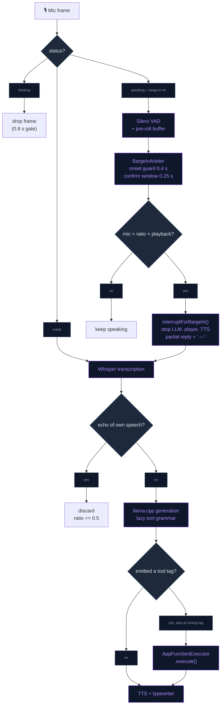
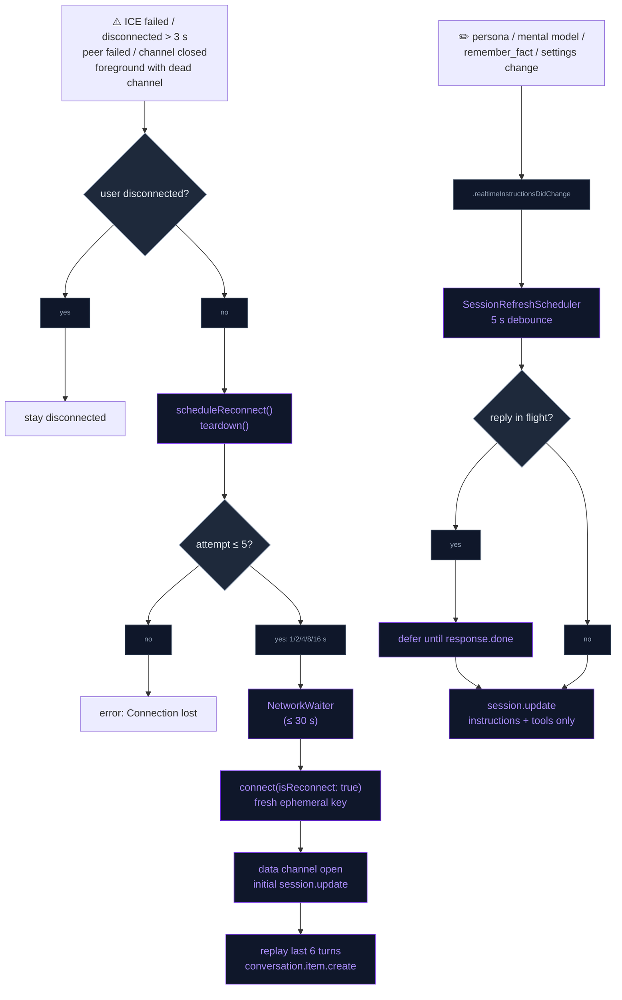
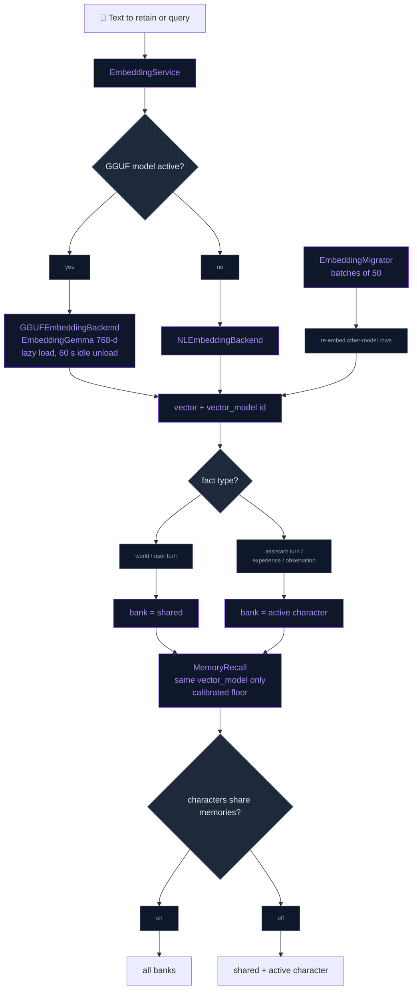

# Chat & LLM

The conversation layer on both backends: the **local path** (Llama 3.2 1B /
LLM-jp 1.8B via llama.cpp) gets grammar-constrained tool calls and barge-in; the
**OpenAI Realtime path** reconnects by itself, refreshes its instructions
mid-session and uses a curated per-role model choice with token metering; and the
**chat and memory layer** adds history search, an on-device multilingual
embedding model, an evaluation harness, and per-character disposition and memory
banks. Voice chat is voice-only (there is no typed input).

## Grammar-constrained local tool calls

Local replies stay free-form speech. A **lazy GBNF grammar** engages only once
the model emits `<tool` (trigger pattern `[\s\S]*?(<tool)`); from then on
sampling is constrained to a valid `<tool name="…">{…}</tool>` call, so a 1–2B
model cannot produce malformed JSON.

- **One source of truth.** `ToolGrammarBuilder` turns the curated local tool set
  (`ToolGrammarBuilder.localToolNames`: `remember_fact`, `search_memory`,
  `get_weather`, `create_reminder`, `play_music`) from the `AppFunctionTool`
  schemas into both the grammar and the one-line-per-tool prompt block, so
  prompt and grammar never disagree. Supported property types: `string`,
  `string` + `enum`, `number`, `integer`, `boolean`; required keys come first in
  schema order, optional keys may follow. A tool with any other property type is
  skipped.
- **Bridge.** `llama_bridge_set_tool_grammar` / `llama_bridge_clear_tool_grammar`
  rebuild the sampler chain as lazy-grammar → penalties → top_k → top_p → temp →
  dist. Prompt-lookup decoding (PLD) is bypassed while a grammar is active, so the
  grammar's accept bookkeeping only runs in the standard loop.
- **Install once per load.** `GGUFLlamaEngine+ToolGrammar` installs the grammar
  when the model loads (no per-turn sampler swap). `LLMEngineProtocol.setToolGrammar`
  defaults to a no-op, so the JP engine is untouched.
- **Early stop.** The token callback stops generation as soon as the text ends
  with `</tool>`.
- **Dispatch.** At end of generation `LocalLLMManager+Engine` parses the first
  tool block; if its name is in the curated set it runs through
  `AppFunctionExecutor.shared.execute` and is logged to the timeline. The result
  is typed and spoken, except for silent bookkeeping tools
  (`ChatTimelineStore.isSilentTool`, e.g. recall and fact-filing). Tool blocks
  are stripped from the transcript.
- **Prompt.** The `.llama1b` default prompts in `LocalLLMPromptStore` embed the
  generated tool block.

## Barge-in on the local path

The user can interrupt the assistant mid-reply. While `.speaking`, mic frames
reach Silero VAD instead of being dropped; `.thinking` keeps the plain mic gate
(nothing is playing, so there is no loop risk and first-token latency is
unaffected).

- **Two-signal arbiter** (`BargeInArbiter`, pure value type). A Silero voice
  start opens a candidate only if playback has run ≥ 0.4 s (TTS onset guard).
  Over the next 0.25 s the arbiter averages mic RMS and playback RMS; it commits
  only when mic ≥ 0.01 (silence floor) and mic > 1.5 × playback, otherwise it
  rejects.
- **Interrupt** (`interruptForBargeIn`): stops the LLM, the player node and the
  active TTS engine, clears the TTS/tag buffers and pending UI action, ends the
  typewriter, appends " —" to the partial transcript, and moves to `.listening`
  with the 0.5 s pre-roll kept so the first syllable survives.
- **Echo guard** (`BargeInEchoGuard`). After an interruption, a transcript that
  is empty or whose words overlap ≥ 80 % with the assistant's last 12 words is
  treated as our own speech leaking back: it is discarded, status returns to
  `.ready`, and the energy ratio rises by 0.5 for the rest of the session.
- **Setting.** Autonomy → "Interrupt while speaking (local)"
  (`OpenAISettings.isLocalBargeInEnabled`). Defaults on for devices with ≥ 5 GB
  RAM, off on the 4 GB tier.

## Realtime auto-reconnect with context resume

A dropped WebRTC session recovers on its own instead of sitting in a dead
`.ready` state.

- **Failure detection.** ICE `.failed`; ICE `.disconnected` that persists past a
  3 s grace; peer connection `.failed`; data channel closed while connected; and
  a foreground return whose data channel is no longer open.
- **Backoff** (`ReconnectPolicy`): 1, 2, 4, 8, 16 s, at most 5 attempts. Each
  attempt tears down the transport, waits up to 30 s for the network
  (`NetworkWaiter`), then reconnects (minting a fresh ephemeral key). Status
  shows `.reconnecting(attempt:)` — "Reconnecting… (n)" in the overlay. After the
  last attempt the session ends with "Connection lost".
- **User intent wins.** `disconnect()` (user action / OpenAI toggled off) sets
  `userRequestedDisconnect` and cancels any pending reconnect; `teardown()`
  releases the transport without touching reconnect bookkeeping.
- **Context resume.** When the data channel reopens after a reconnect, the last
  6 dialogue turns of the active conversation are replayed as
  `conversation.item.create` items (user → `input_text`, assistant → `text`). No
  `response.create` is sent; the user speaks next.
- **Single send path.** `send(_:)` serialises every data-channel event and drops
  (with a log) anything sent while the channel is not open.

## Mid-session instruction refresh

Instructions aren't frozen at connect. Anything that feeds them posts
`.realtimeInstructionsDidChange` (`OpenAIRealtimeManager.postInstructionsChanged`),
and the manager re-sends `session.update` with **instructions + tools only**
(never `voice`, which the API rejects once audio is in flight). Both the initial
update and the refresh use `buildSessionInstructions()`.

- **Scheduler** (`SessionRefreshScheduler`): 5 s debounce, so a burst of edits
  produces one update; if a reply is in flight (`.thinking` / `.speaking`) the
  refresh is deferred and flushed on `response.done`.
- **Triggers:** persona prompt save, mental-model refresh (when content
  changed), `remember_fact`, the User Settings Done button, disposition edits,
  photo memories, follow-up planning and the Siri "remember" intent.

## Model selection and cost logging

AI Settings → **Models** (`ModelsSettingsView`) has one section per role, each a
fixed, curated dropdown (`ModelPickerRow` over `DropDownSelector`); there is no
free-text model entry. The screen is disabled while OpenAI is off.

| Role | Setting | Used by |
|---|---|---|
| Voice model | `OpenAISettings.realtimeModel` | Ephemeral-key mint in the handshake |
| Transcription model | `OpenAISettings.transcriptionModel` | Input transcription in `session.update` |
| Background text model | `OpenAISettings.textModel` | `OpenAIChatClient` (memory extraction, summaries, chat titles, reflections) |

- **Catalog.** The lists live in `OpenAIModelCatalog.swift`: realtime models,
  transcription models, and a text list covering GPT-4 and GPT-5 family models
  that support function calling and vision. The first entry of each list is the
  role's default. See that file for the current ids.
- **Stored values.** Choices persist in UserDefaults. An unset, blank or no
  longer catalogued id falls back to the role's default, so a stale id never
  reaches OpenAI.
- **Reasoning effort.** A catalog entry can carry a `reasoning_effort`, which
  `OpenAIChatClient` sends for GPT-5-family reasoning models. This keeps short
  background calls (chat titles at 16 tokens, reflection at 160) from spending
  their whole completion budget on reasoning and returning nothing.
- **Applying a voice-model change.** A realtime model change reconnects the
  session when AI Settings is closed with Done; the other roles apply on their
  next call.
- **Cost logging.** `RealtimeUsageMeter` accumulates `usage` from every
  `response.done` (input/output, audio, cached tokens) and logs one
  `[Cost] realtime …` line at teardown; `OpenAIChatClient` logs
  `[Cost] text model=… in=… out=…` per call. Every metered call is also
  stored and charted on the Usage dashboard — see [API_USAGE.md](API_USAGE.md).
  Catalog entries carry list prices for its spend estimate.

## Chat history search

A search field at the top of `ChatHistorySidebar` filters conversations by title
or message text (150 ms debounce) through `ConversationStore.conversations(matching:)`
(SQL `LIKE`). While a query is active each row previews the first matching
message (`MemoryStore.firstMessage(conversationID:matching:)`) as a 90-character
snippet centred on the match (`MemoryStore.snippet`). No results shows
"No chats mention "…"".

## On-device GGUF embedding model

Memory vectors can come from **EmbeddingGemma-300M Q8_0** (768-dim, multilingual)
instead of Apple's English-strong `NLEmbedding`.

- **Opt-in.** Memory page → "Multilingual recall" (`MemoryEmbeddingModelRow`)
  downloads the ~334 MB model through `RemoteAssetRegistry.embeddingModel`
  (SHA-256 pinned) and activates it. Turning it off reverts to NLEmbedding; the
  file stays on disk. At launch `restorePreferredBackend()` re-attaches the model
  if it is already downloaded (it never downloads on its own).
- **Backends.** `EmbeddingBackend` has two implementations: `NLEmbeddingBackend`
  (`"nl"`) and `GGUFEmbeddingBackend` (`"embeddinggemma-300m-q8"`), which uses
  EmbeddingGemma's query/document prompt prefixes, loads lazily through
  `LlamaEmbedBridge` (separate llama.cpp handle, 512 ctx, 2 threads,
  L2-normalised output) and unloads after 60 s idle. `EmbeddingService` routes to
  the active backend; a GGUF backend is only activated after a successful probe
  embedding, otherwise NL stays in use.
- **Like with like.** Every vector stores its backend id in
  `memories.vector_model`, and recall only compares vectors from the active
  backend. `EmbeddingMigrator` re-embeds rows from another backend in the
  background (batches of 50, 200 ms pause, resumable).
- **Calibration** (`EmbeddingCalibration`). Each backend maps the nominal Memory
  Quality slider to its own cosine floor and has its own semantic-link floor and
  observation dedup threshold, so the slider keeps its meaning across models.
  Values come from the memory evaluation harness.

## Memory evaluation harness

A LongMemEval-style fixture (`MemoryEvalFixture`) is played through retain →
consolidate → recall with a scripted LLM (`MemoryEvalRunner`), so results are
deterministic. It scores recall@5, MRR and avoid precision per question type.
`NeuraLinkTests/MemoryEvalTests` fails CI below the ratcheted floors (overall
recall 0.93 with Apple embeddings available, 0.90 without, e.g. on an erased CI
simulator; 0.70 per type; avoid precision 0.80); the report is attached to the
test run. Every unit it inserts is deleted afterwards. The DEBUG launch argument
`-nl.debug.memoryEval YES` runs the same fixture on a device with real embeddings.

## Disposition UI and per-character memory banks

- **Memory Personality** (`DispositionSection` in Persona settings): three 1–5
  sliders — Skepticism, Literalism, Empathy — with a "Reset to neutral" button.
  The section's info popover shows the exact `promptDescription` the sliders
  produce. Values are saved per character and post an instruction refresh.
  They steer consolidation, mental models and reflect, not what is recalled.
- **Banks** (`memories.bank`, policy in `MemoryBanks`). World facts and the
  user's raw turns go into the shared bank (`""`) because they are about the
  user; assistant raw turns, experiences and observations carry the active
  character's bank. `MemoryRetain`, `MemoryConsolidator` and `MemoryRecall`
  apply it.
- **"Characters share memories"** (Memory page,
  `MemorySettings.charactersShareMemories`, default on). On: recall reads every
  bank. Off: recall reads only the shared bank plus the active character's.

## Flow

### Local turn: tool call and barge-in

### Realtime session: reconnect and instruction refresh

### Memory: embedding and bank routing

## Files

| File | Role |
|---|---|
| `Core/Bridge/llama_bridge.h` / `.cpp` | `set/clear_tool_grammar`; lazy-grammar sampler chain; PLD bypass while a grammar is active |
| `Data/DataSources/LocalLLM/ToolGrammarBuilder.swift` | Curated local tool set → GBNF grammar + prompt block |
| `Data/DataSources/GGUF/Llama/GGUFLlamaEngine+ToolGrammar.swift` | Installs the tool grammar once per model load |
| `Data/DataSources/GGUF/Llama/GGUFLlamaEngine+Generate.swift` | Stops generation at `</tool>` |
| `Data/DataSources/LocalLLM/LocalLLMManager+Engine.swift` | Parses and dispatches local tool calls through `AppFunctionExecutor` |
| `Data/DataSources/LocalLLMPromptStore.swift` | 1B default prompts embed the generated tool block; save posts an instruction refresh |
| `Data/DataSources/LocalLLM/LocalLLMManager+BargeIn.swift` | `BargeInArbiter`, `BargeInEchoGuard`, interrupt sequence |
| `Data/DataSources/LocalLLM/LocalLLMManager+Audio.swift` / `+VAD.swift` | Frames reach the VAD while speaking; voice-start and echo hooks |
| `Presentation/Views/AI/AutonomySettingsView.swift` | "Interrupt while speaking (local)" toggle |
| `Data/DataSources/OpenAI/OpenAIRealtimeManager+Reconnect.swift` | `ReconnectPolicy`, failure detection, `send(_:)`, context replay |
| `Data/DataSources/OpenAI/OpenAIRealtimeManager+SessionRefresh.swift` | `SessionRefreshScheduler`, `.realtimeInstructionsDidChange`, refresh `session.update` |
| `Data/DataSources/OpenAI/OpenAIModelCatalog.swift` | Curated per-role model lists, defaults, `reasoning_effort`, list prices; `RealtimeUsageMeter` |
| `Data/DataSources/OpenAI/OpenAISettings.swift` | Model selection per role; `isLocalBargeInEnabled` |
| `Data/DataSources/OpenAI/OpenAIChatClient.swift` | Background text calls on `textModel`, reasoning effort, `[Cost]` lines |
| `Presentation/Views/AI/ModelsSettingsView.swift` / `ModelPickerRow.swift` | Models screen: per-role dropdowns |
| `Presentation/Views/AI/AISettingsView.swift` | Reconnects on Done after a voice-model change |
| `Presentation/Views/AI/ChatHistorySidebar.swift` | Search field, debounce, snippet rows, empty state |
| `Data/DataSources/Memory/MemoryStore+Conversations.swift` | `firstMessage(conversationID:matching:)`, `snippet` |
| `Core/Bridge/llama_embed_bridge.h` / `.cpp` | C embedding API over llama.cpp |
| `Data/DataSources/GGUF/LlamaEmbedBridge.swift` | Swift wrapper for the embedding handle |
| `Data/DataSources/Memory/EmbeddingService.swift` | Router to the active backend, probe-gated activation, launch restore |
| `Data/DataSources/Memory/Agentic/EmbeddingBackend.swift` | `NLEmbeddingBackend`, `GGUFEmbeddingBackend` |
| `Data/DataSources/Memory/Agentic/EmbeddingCalibration.swift` | Per-backend query floor, link floor, dedup threshold |
| `Data/DataSources/Memory/Agentic/EmbeddingMigrator.swift` | Background re-embed of other-model rows |
| `Data/DataSources/Assets/RemoteAssetRegistry.swift` | `embeddingModel` asset + SHA-256 pin |
| `Presentation/Views/AI/MemoryInsightsSection.swift` | `MemoryEmbeddingModelRow` "Multilingual recall" toggle |
| `Data/DataSources/Memory/Agentic/Eval/MemoryEvalFixture.swift` / `MemoryEvalRunner.swift` | Evaluation fixture and runner, DEBUG only |
| `Presentation/Views/AI/PersonaSettingsView+Disposition.swift` | Memory Personality sliders |
| `Data/DataSources/Memory/Agentic/MemoryRecall.swift` | `MemoryBanks` policy, bank-filtered recall |
| `Data/DataSources/Memory/MemorySettings.swift` | `embeddingBackendID`, `charactersShareMemories` |

Tests (in `NeuraLinkTests/`): `ToolGrammarBuilderTests`, `BargeInTests`,
`RealtimeReconnectTests`, `SessionRefreshTests`, `OpenAIModelSettingsTests`,
`ChatSearchTests`, `MemoryEvalTests`, `MemoryBankTests`.

## Integration notes

- **Pure state machines.** `BargeInArbiter`, `ReconnectPolicy`,
  `SessionRefreshScheduler`, `ToolGrammarBuilder` and `RealtimeUsageMeter` are
  `nonisolated` value types, testable without audio, WebRTC or the main actor.
- **No new llama.xcframework.** Both bridge additions (tool grammar, embeddings)
  use symbols the prebuilt framework already exports; `common/json-schema-to-grammar`
  is not linked, which is why GBNF is generated in Swift.
- **Adding a local tool.** Add its name to `ToolGrammarBuilder.localToolNames`;
  prompt and grammar both follow. Every property must be one of the supported
  types or the tool is skipped. Each tool costs 1B prompt tokens.
- **Instruction inputs.** Any new input to the Realtime instructions must call
  `OpenAIRealtimeManager.postInstructionsChanged(reason:)`, or it only applies on
  the next connect.
- **Model ids.** Edit `OpenAIModelCatalog.swift` to add or retire a model; there
  is no in-app custom entry. A retired id silently falls back to the role default.
- **Embedding asset.** Re-uploading the EmbeddingGemma file requires updating
  its SHA-256 pin in `RemoteAssetRegistry`. Changing the model also means a new
  backend id, so stored vectors are re-embedded by the migrator.
- **Logs:** `֎ [FunctionCall]`, `[GGUFEngine] Tool grammar …`, `[BargeIn]`,
  `[AI Reconnect]`, `[AI Refresh]`, `[Cost]`, `[EmbeddingService]`,
  `[EmbeddingMigrator]`, `[MemoryEval]`.

## Troubleshooting

| Symptom | Likely cause |
|---|---|
| `[GGUFEngine] Tool grammar REJECTED` | GBNF failed to parse in llama.cpp; check `ToolGrammarBuilderTests` against the new schema |
| Local model never calls a tool | Non-1B model (JP engine has no grammar), or the tool is not in `localToolNames` / has an unsupported property type |
| Assistant interrupts itself on speaker | Speaker echo beats the 1.5× ratio; the echo guard raises the ratio per session. Turn barge-in off on that device |
| "Reconnecting…" loops then "Connection lost" | No network within 30 s per attempt, or key minting fails; see `[AI Reconnect]` lines |
| Background titles/reflections come back empty | A reasoning model without a `reasoning_effort` in its catalog entry spent the budget on reasoning |
| Recall got worse after enabling Multilingual recall | Migrator still re-embedding (only matching `vector_model` rows are compared until it finishes) |
| Eval test fails only on CI | Erased simulator has no `NLEmbedding`; the runner uses the 0.90 floor there. Reproduce with a throwaway `simctl create` device |

## Known device-test items

- Grammar-constrained tool calls: `[Bench]` prefill delta of the tool block and the tool-call hit-rate sweep
  on iPhone 11 (4 GB) and a 6 GB device.
- Barge-in: tuning of the energy ratio and onset guard (false barge-ins at 50 % / 100 %
  speaker volume, interruption latency) from the `[BargeIn]` mic vs playback RMS.
- Realtime auto-reconnect: airplane-mode toggle, 10-minute background, ephemeral-key expiry.
- On-device embedding model: embed latency per turn, resident memory and jetsam on the 4 GB tier.
