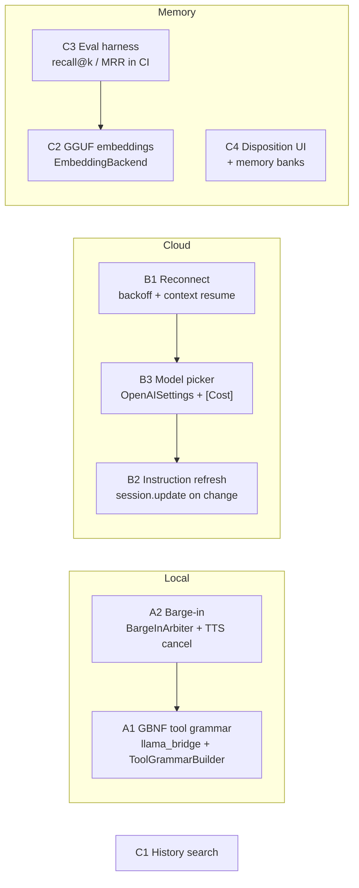

# Chat & LLM Improvement Plan

Scope agreed on 2026-09-25. Voice chat stays voice-only (no typed input), and the
local model tier stays Llama 3.2 1B / LLM-jp 1.8B (Gemma 4 E2B was tried; the 3D
environment + VRM render load leaves no headroom for it, unlike SynapLink).

Three tracks, eight items. Each item lists the seams it touches (file:line as of
today), the design, the tasks in order, and how it is verified. Follow
[SKILL.md](../SKILL.md): `swiftlint lint --strict`, `scripts/lint-cpp.sh` for any
bridge change, build, and the whole test scheme before finishing.

| # | Item | Track | Effort | Value |
|---|---|---|---|---|
| A1 | Grammar-constrained local tool calls | Local | M | High |
| A2 | Barge-in on the local path | Local | M | High |
| B1 | Realtime auto-reconnect + context resume | Cloud | M | High |
| B2 | Mid-session instruction refresh | Cloud | S | Med |
| B3 | Model choice + cost logging in settings | Cloud | S | Med |
| C1 | Chat history search | Chat | S | Med |
| C2 | On-device GGUF embedding model | Memory | M | High |
| C3 | Memory evaluation harness | Memory | M | High |
| C4 | Disposition UI + per-character memory banks | Memory | M | Med |

Recommended order: **C3 → C2** (measure first, then swap embeddings against the
numbers), **B1 → B3 → B2** (one Realtime PR family), **A2 → A1** (barge-in is
independent; grammar needs a bridge change and a device sweep), **C1**, **C4**.



---

## Track A — Local LLM

### A1. Grammar-constrained tool calls — `M`

**Problem.** Local tool calling is limited to `remember_fact` because 1–2B models
emit unreliable JSON (`LocalLLMManager+Engine.swift:172-194`). The parser only
runs at end of generation, accepts the first `<tool>` block, and drops anything
else (`LocalToolCallParser.swift:19-46`).

**Seams.**
- Sampler chain is fixed at handle creation: `llama_bridge.cpp:34-48`
  (`build_default_sampler`), built `:88`, freed `:105`; the speculative bridge
  duplicates it at `llama_bridge_spec.cpp:70-83`.
- The linked `llama.xcframework` already exports `llama_sampler_init_grammar`
  and `llama_sampler_init_grammar_lazy_patterns` (`llama.cpp/include/llama.h:1375,
  1394`; symbols confirmed in the arm64 dylib). `common/json-schema-to-grammar`
  is **not** compiled or linked (project links only the prebuilt framework;
  CI builds with `-DLLAMA_BUILD_TOOLS=OFF`), so JSON-schema→GBNF must be done on
  the Swift side.
- Generation loop: `llama_bridge.cpp:265-290` (`llama_sampler_sample` →
  `llama_sampler_accept`), PLD loop from `:296`; token callback may return
  `false` to stop (`llama_bridge.h:26-31`, Swift always returns `true` at
  `GGUFLlamaEngine+Generate.swift:72`).
- Tool instruction lives only in the `.llama1b` prompt branch:
  `LocalLLMPromptStore.swift:84-86`; JP prompt has none (`:117-130`).
- Tool schemas: `AppFunctionTool.swift` (13 tools, JSON-schema dictionaries).

**Design.**
1. **Lazy grammar, not whole-reply JSON.** Replies stay free-form speech; the
   grammar activates only after the trigger `<tool` appears
   (`llama_sampler_init_grammar_lazy_patterns` with `trigger_patterns =
   ["<tool"]`). Until then sampling is unconstrained, so the persona voice is
   untouched.
2. **Bridge API.** Add to `llama_bridge.h`:
   `bool llama_bridge_set_tool_grammar(handle, const char* gbnf, const char* root, const char* const* triggers, int n_triggers);`
   and `void llama_bridge_clear_tool_grammar(handle)`. Implementation rebuilds
   the chain (`grammar_lazy → penalties → top_k → top_p → temp → dist`) and
   swaps `h->sampler` under the existing bridge lock. Mirror in
   `llama_bridge_spec.cpp` or, simpler for v1, **disable PLD while a grammar is
   set** (`pld_enabled = false` when the grammar is installed) so the grammar
   sampler's `accept` bookkeeping only ever runs in the standard loop.
3. **GBNF generation in Swift.** New `Data/DataSources/LocalLLM/ToolGrammarBuilder.swift`
   turns a curated subset of `AppFunctionTool` schemas into GBNF:
   ```
   root      ::= "<tool name=\"" toolcall "</tool>"
   toolcall  ::= "get_weather\">" weather-obj | "create_reminder\">" reminder-obj | …
   weather-obj ::= "{" ws "\"city\"" ws ":" ws string ws "}"
   string    ::= "\"" ( [^"\\] | "\\" . )* "\""
   ```
   Supported property types: `string`, `string` with `enum`, `number`,
   `boolean`; required keys emitted in schema order; optional keys omitted in
   v1 (1B models rarely fill them). Unsupported schemas are skipped with a log.
4. **Curated local tool set** (prompt tokens are the scarce resource on 1B):
   `remember_fact`, `search_memory`, `get_weather`, `create_reminder`,
   `create_note`, `play_music`. One line per tool in the prompt, generated from
   the same builder so prompt and grammar can never disagree. Measure the
   prefill delta with `[Bench]` (`LlamaBridge.swift:191-199`); budget ≤ 60 tokens.
5. **Early stop.** In `GGUFLlamaEngine+Generate.swift` the token callback
   returns `false` once the accumulated text ends with `</tool>`; saves the
   tail tokens and keeps the tool turn snappy.
6. **Dispatch.** `LocalLLMManager+Engine.swift:178` drops the
   `tool.name == rememberFact` guard and routes any registered skill through
   `AppFunctionExecutor.shared.execute` (already the shared executor). Result
   handling stays "speak the result" (no second generation on 1B). For
   `search_memory`, the result is spoken as-is in v1; a follow-up can feed it
   back as a system message for a second, shorter generation on ≥ 6 GB devices.
7. **Persona prompt migration.** `LocalLLMPromptStore.effectivePrompt` appends
   the generated tool block after the stored persona text so user-edited
   prompts pick it up without a migration.

**Tasks.**
1. Bridge: `set/clear_tool_grammar`, PLD gating, C++ lint.
2. `LlamaBridge.swift` + `LLMEngineProtocol` (`setToolGrammar(_:)` optional,
   default no-op so the JP engine is unaffected).
3. `ToolGrammarBuilder` + `LocalToolPromptBuilder` (same source of truth).
4. Engine early stop; parser tolerance for a trailing partial `</tool>`.
5. Executor dispatch for all local tools; timeline logging unchanged.
6. Prompt store integration; remove the hard-coded `remember_fact` line.

**Verification.** Unit: GBNF output for each curated tool (golden strings),
enum/number/bool cases, unsupported schema skipped; parser round trip. Device:
20 scripted utterances per tool on iPhone 11 (4 GB) and a 6 GB device, log
`֎ [FunctionCall]` hit rate (target ≥ 90 % valid calls, 0 malformed JSON) and
`[Bench]` ttft/decode before vs after (accept ≤ 10 % prefill regression).

**Risks.** Grammar sampler cost per token on CPU (should be negligible for a
few-hundred-rule grammar; confirm with `[Bench]`). PLD off during tool-enabled
turns costs decode speed; revisit once the spec bridge supports the grammar.

### A2. Barge-in on the local path — `M`

**Problem.** The local path has no interruption: frames are dropped before the
VAD while `.thinking`/`.speaking` plus an 800 ms tail
(`LocalLLMManager+Audio.swift:141-151`), and `sileroVADDidDetectVoiceStart`
bails unless `.ready` (`LocalLLMManager+VAD.swift:19`). The OpenAI path already
lifts its gate on Silero voice start (`OpenAIRealtimeManager+VAD.swift:22-26`).
The gating exists for a real reason: a self-reply loop was observed on iPhone
11 despite `setVoiceProcessingEnabled(true)` (`+Audio.swift:130-140`).

**Seams.** Mic tap → `processCapturedAudio` (`+Audio.swift:129-178`); main-mixer
amplitude tap (`:58-61`) already measures playback level for lip-sync; TTS
scheduling `scheduleBuffer` (`+TTS.swift:84-118`) with `pendingTTSBuffers` /
`ttsGenerationDone`; `stop()` (`LocalLLMManager.swift:356-370`) cancels the LLM
and the player node but **not** the in-flight TTS engine call; typewriter
`TranscriptTypewriter.swift` (generation counter `:31`, `reset()` `:63`).

**Design.**
1. **Feed the VAD during `.speaking`, keep dropping during `.thinking`.**
   Nothing is playing while thinking, so the loop risk is zero there and the
   first-token latency is unaffected.
2. **Two-signal arbiter** (new pure type `BargeInArbiter`, `Data/DataSources/LocalLLM/`):
   commit an interruption only when (a) Silero reports voice start while
   `.speaking`, and (b) over the following 250 ms the mic RMS exceeds
   `k × playbackRMS` (k = 1.5, using the existing mixer-tap amplitude as the
   playback proxy), and (c) playback started ≥ 400 ms ago (TTS onset guard).
   Inputs are timestamps and RMS pairs, so it is unit-testable without audio.
3. **Interrupt sequence** (`LocalLLMManager.interruptForBargeIn()`):
   `llmEngine.stop()` → `playerNode.stop()` + reset `pendingTTSBuffers`,
   `ttsGenerationDone`, `inFlightSynthesis` → cancel the TTS engine (new
   `cancel()` requirement on the TTS engine protocol; VoiceVox/OpenVoice/System
   implementations drop queued work) → `transcriptTypewriter.endGeneration()`
   and truncate `state.aiTranscript` to what was revealed, appending " —" →
   log the partial assistant message to the timeline (so memory retain sees
   what was actually said) → `state.status = .listening`, start recording
   with the 0.5 s pre-roll ring buffer (`+Audio.swift:164-168`) so the first
   syllable is kept.
4. **Setting.** `MemorySettings`-style toggle on `OpenAISettings`
   (`isLocalBargeInEnabled`, default **on** for devices with ≥ 6 GB, **off** on
   the 4 GB tier until the iPhone 11 sweep passes). Surface it in the Autonomy
   settings next to the existing VAD toggle.
5. **Self-reply guard.** After an interruption, if Whisper's transcript is
   empty or matches the last 12 words of the assistant's own text (case-
   insensitive, `≥ 0.8` token overlap), treat it as echo: log `[BargeIn] echo
   rejected`, restore `.ready`, and raise `k` by 0.5 for the rest of the session.

**Tasks.** Arbiter + tests → TTS engine `cancel()` → interrupt sequence →
VAD/audio gating changes → setting + UI → echo guard → device sweep.

**Verification.** Unit: arbiter commits/ignores across the three conditions;
echo guard token-overlap cases. Device: on iPhone 11 and a 6 GB device, 20
interruptions each at speaker volume 50 % and 100 %, count false barge-ins
(target 0 at 50 %, ≤ 1 at 100 %) and interruption latency from speech onset
to TTS silence (target ≤ 400 ms) via `[BargeIn]` logs.

---

## Track B — OpenAI Realtime

### B1. Auto-reconnect with context resume — `M`

**Problem.** `didChange RTCIceConnectionState` and `didChange
RTCPeerConnectionState` only log (`+Handlers.swift:313-317, 343-347`); a dropped
connection leaves the app in a dead `.ready` state until the user toggles.

**Seams.** `connect()` (`OpenAIRealtimeManager.swift:97-119`), `disconnect()`
(`:122-136`, does not cancel `iceGatheringTimeout`), handshake
(`+Handshake.swift:16-185`), session update on data-channel open
(`+Handlers.swift:370-377`), five duplicated data-channel send sites
(`+SessionConfig.swift:142-145`, `+Events.swift:22-24, 41-45`,
`+Handlers.swift:255-259, 277-281`), `NetworkWaiter`
(`Core/Utils/NetworkWaiter.swift`), status enum
(`RealtimeChatState.swift:12-34`), chat history
(`MemoryStore+Conversations.swift:224` `fetchRecentMessages`).

**Design.**
1. **`send(_ event: [String: Any])` helper** on the manager; replace the five
   call sites. Returns `false` when the channel is not open so callers can
   queue.
2. **Failure detection.** ICE `.failed`/`.disconnected` (after a 3 s grace for
   `.disconnected`, which ICE recovers from on its own), peer-connection
   `.failed`, data channel `.closed` while status ≠ `.disconnected`, and a
   foreground return with a non-open channel (`UIApplication.willEnterForeground`).
3. **Backoff scheduler** (pure `ReconnectPolicy`: delays 1, 2, 4, 8, 16 s, max 5
   attempts, reset on a successful `response.done`). Each attempt: full
   `disconnect()` (extended to cancel `iceGatheringTimeout`) → wait for
   `NetworkWaiter` → `connect()`. New status `.reconnecting(attempt)` rendered
   as "Reconnecting…" in the overlay; after the last attempt → `.error("…")`.
   A user-initiated disconnect or OpenAI toggle-off cancels the loop.
4. **Context resume.** On the data channel reopening after a reconnect (not
   the first connect), `sendInitialSessionUpdate()` runs as today, then the
   last 6 dialogue messages of the active conversation are replayed as
   `conversation.item.create` events (`type: "message"`, role user/assistant,
   `input_text`/`text` content) before the mic gate is lifted, so the model
   keeps the thread. No `response.create` is sent; the user speaks next.
5. **Timeline.** Log a system-kind message "Connection dropped, reconnected"
   so transcripts explain any gap.

**Verification.** Unit: `ReconnectPolicy` schedule, reset and cancellation;
event helper queues when closed. Device: Airplane-mode toggle mid-conversation
(expect reconnect within ~5 s of network return and the model referring to the
pre-drop topic); background/foreground after 10 min; deliberate ephemeral-key
expiry (should mint a fresh key on reconnect, `+Handshake.swift:54-112`).

### B2. Mid-session instruction refresh — `S`

**Problem.** Instructions are assembled once in `sendInitialSessionUpdate()`
(`+SessionConfig.swift:23-150`). Mental models refreshed by consolidation,
persona prompt edits and autonomy toggles only apply on the next connect.

**Design.**
1. Extract `buildSessionInstructions() async -> String` from
   `sendInitialSessionUpdate()`; the initial update and the refresh share it.
2. `refreshSessionInstructions(reason:)` sends `session.update` with
   `instructions` and `tools` only (never `voice`, see the `cannot_update_voice`
   note `+SessionConfig.swift:77-82`). Debounced 5 s; deferred while status is
   `.thinking`/`.speaking` and flushed on `response.done` so a running reply
   is never re-instructed mid-sentence.
3. Triggers: a new `Notification.Name.memoryMentalModelsDidRefresh` posted
   from `MemoryMentalModels.refresh` when content changed; persona prompt save
   (`LocalLLMPromptStore.savePrompt` / `PersonaStore`); autonomy and user
   settings edits (`UserSettings.systemPromptContext` inputs); `remember_fact`
   (so the KG list is current within the same session).

**Verification.** Unit: a `SessionRefreshScheduler` state machine (debounce,
defer-while-speaking, flush). Device: change the persona prompt mid-session
and confirm the next reply reflects it; watch the log for exactly one
`session.update` per burst of edits.

### B3. Model choice and cost logging — `S`

**Problem.** Three hard-coded ids: realtime `"gpt-realtime-2.1-mini"`
(`+Handshake.swift:67`), transcription `"gpt-4o-transcribe"`
(`+SessionConfig.swift:109`), background text `OpenAIChatClient.defaultModel`
(`gpt-5.6-luna`). No usage/cost visibility.

**Design.**
1. `OpenAISettings` gains `realtimeModel`, `transcriptionModel`, `textModel`
   using the file's `@ObservationIgnored` backing-store pattern
   (`OpenAISettings.swift:11-21`), UserDefaults keys
   `com.neuralink.openai.model.{realtime,transcription,text}`, defaults = the
   current literals. Curated lists live in a small `OpenAIModelCatalog` enum
   (id, label, note) plus a "Custom…" entry backed by a text field.
2. `AISettingsView` gets a "Models" section between OpenAI and Autonomy using
   `DropDownSelector` (label above, per its doc comment), disabled when OpenAI
   is off. Changing the realtime model shows a "Reconnect to apply" note and
   reconnects on Done (`triggerConnectionIfNeeded`, `AISettingsView.swift:295-301`).
3. Call sites read the settings; `OpenAIChatClient.complete` keeps its `model`
   parameter but defaults to `OpenAISettings.shared.textModel`.
4. **Cost logging.** `response.done` carries `usage` (input/output/cached
   tokens, text vs audio). Accumulate per session in `RealtimeChatState`
   and log one `[Cost] session=… in=… out=… audio_in=… audio_out=…` line at
   disconnect; `OpenAIChatClient` logs `[Cost] text model=… in=… out=…` per
   call from `usage`. A session-total line in the settings footer ("This
   session: 12.3k tokens") is enough; no price table in-app (prices change).

**Verification.** Unit: settings default/persist/migration (unset ≠ empty);
catalog contains the current defaults. Device: switch models, confirm the
mint request body and `[Cost]` lines.

---

## Track C — Chat experience and memory

### C1. Chat history search — `S`

**Seams.** `ChatHistorySidebar.swift` has no filter state; `reload()` calls
`ConversationStore.shared.conversations()` (`:202-204`). The SQL already exists:
`ConversationStore.conversations(matching:)` (`ConversationStore.swift:72`) over
`MemoryStore.fetchConversations(matching:)` with a title-or-message `LIKE`
(`MemoryStore+Conversations.swift:86-114`).

**Design.** `@State searchText` + `.searchable(text:placement: .sidebar)` on the
list; debounce 150 ms; call `conversations(matching:)`. Row preview: when a
query is active, show the first matching message snippet (new
`MemoryStore.firstMessage(conversationID:matching:)`, `LIKE` with the match
centred in a 90-char window) instead of the last message. Empty-result state
"No chats mention '…'". Keep `LIKE` for v1; the BM25 tokens column is for memory
units, not messages, and `LIKE` on a few thousand rows is instant.

**Verification.** Unit: `firstMessage(matching:)` snippet centring; store test
with a marker string. Device: search with the sidebar open while a chat runs.

### C2. On-device GGUF embedding model — `M`

**Problem.** `EmbeddingService` uses Apple `NLEmbedding.sentenceEmbedding`
(`EmbeddingService.swift:14`): English-strong, weak for JP/mixed text, no
model on the simulator (zero vectors, `:44`), 512-dim `Double`. The semantic
arm, semantic links and the observation dedup guard all depend on it.

**Seams.** The bridge has no embeddings API (`llama_get_embeddings` and
`llama_pooling_type` are exported by the framework but unused). Model
downloads: `RemoteAssetRegistry` cases + `integrity` pins
(`RemoteAssetRegistry.swift:31-150`, cache actor `RemoteAssetCache`). Vectors
are stored as raw `Double` BLOBs (`MemoryStore+Units.swift:124-178`); recall
already drops dimension mismatches.

**Design.**
1. **Model.** `multilingual-e5-small` (Q8_0 GGUF, ~120 MB, 384-dim, EN/JP) as
   the default; `EmbeddingGemma-300M` (Q8, ~300 MB, 768-dim) as the opt-in
   "higher quality" choice on ≥ 6 GB devices. Both via a new
   `RemoteAssetRegistry.embeddingModel(EmbeddingModelID)` case with SHA-256
   pins (pinning is mandatory — see `docs/APP_SECURITY.md`).
2. **Bridge.** `llama_bridge_embed_create(model_path, n_ctx=512)`,
   `llama_bridge_embed(handle, text, out_f32, dim) -> int` (mean pooling,
   L2-normalised), `llama_bridge_embed_free`. Separate handle and context from
   the chat model; 2 threads; Metal on.
3. **Swift.** `EmbeddingBackend` protocol (`id`, `dimension`, `embed(_:)`),
   two implementations (`NLEmbeddingBackend`, `GGUFEmbeddingBackend`);
   `EmbeddingService` becomes the router with a lazy load and a 60 s idle
   unload (memory on the 4 GB tier alongside the 1B LLM + Whisper). Falls back
   to NL when the model is not downloaded.
4. **Schema.** `memories.vector_model TEXT NOT NULL DEFAULT 'nl'`; recall
   filters candidates to the active backend id (replacing the dimension
   check). A background `EmbeddingMigrator` re-embeds rows whose
   `vector_model` differs (batches of 50, idle only, resumable).
5. **Floor recalibration.** e5 cosine distributions sit higher than NL's; map
   the Memory Quality slider through a per-backend calibration
   (`floor = a + b × sliderValue`) chosen from the C3 harness so the slider
   keeps its meaning.
6. Semantic link floor (`MemoryRetain.semanticLinkFloor = 0.7`) and the dedup
   threshold (`MemoryConsolidator.dedupThreshold = 0.97`) become per-backend
   constants for the same reason.

**Verification.** C3 harness before/after (recall@5 and MRR per question
type; expect the multi-session and JP cases to move most). Unit: backend
routing, `vector_model` filtering, migrator resumability. Device: embed latency
per turn (`[Embed]` log, target ≤ 30 ms warm on iPhone 11), resident memory
delta with Instruments, no jetsam in a 10-minute session.

### C3. Memory evaluation harness — `M`

**Problem.** Nothing measures whether recall got better. Tuning happens by
feel.

**Design.** A LongMemEval-style fixture and a test that turns it into numbers.
1. `NeuraLinkTests/Fixtures/memory_eval_v1.json`: ~30 synthetic cases, each
   with 2–4 dated "sessions" (turns), the facts extraction should yield (so the
   test uses `StubMemoryLLM` and stays deterministic), the consolidation
   actions, and 1–3 questions tagged `single_hop | multi_session | temporal |
   knowledge_update | preference | abstention`, with the ids of the units that
   count as correct.
2. `MemoryEvalRunner` (test-target helper): clears a marker-scoped slice of
   the store, retains via `MemoryRetain(llm: stub)`, consolidates via
   `MemoryConsolidator(llm: stub)`, then runs `MemoryRecall.recall` per question
   with `maxResults 5` and computes recall@5, MRR, and abstention precision
   (questions whose correct answer is "nothing", where any hit above the floor
   is a false positive).
3. Reporting: one `[MemoryEval] type=… recall@5=… mrr=…` line per type and an
   overall line; assertions `recall@5 ≥ 0.80` overall and `≥ 0.70` per type so
   regressions fail CI. Thresholds start at the measured baseline minus 0.05
   and ratchet up.
4. Simulator caveat: NL vectors are zero there, so CI measures the keyword,
   graph and temporal arms; a DEBUG launch argument
   (`-nl.debug.memoryEval`) runs the same fixture on a device with real
   embeddings and prints the report to the persistent log
   (`PersistentLogSink`), which is how C2 is judged.

**Verification.** The harness is its own verification; add it to the existing
`AgenticMemoryTests` file family and keep the suite `.serialized`.

### C4. Disposition UI and per-character memory banks — `M`

**Seams.** `MemoryDisposition` (`MemoryDisposition.swift:16-70`, UserDefaults
per character, prompt-only). `PersonaSettingsView` is the per-character
settings surface. `memories` has no bank/character column
(`MemoryStore+Units.swift:17-20`); only `mental_models.character` exists.

**Design.**
1. **Disposition UI.** A "Memory personality" section in `PersonaSettingsView`
   with three 1–5 sliders (Skepticism, Literalism, Empathy) and a live preview
   of `promptDescription`; a "Reset to neutral" button. Saving posts the B2
   refresh notification so the next consolidation/mental-model pass uses it.
2. **Banks.** `memories.bank TEXT NOT NULL DEFAULT ''` + index. Policy: world
   facts and raw user turns are global (`''`) because they are about the
   user; `experience`, `observation` and assistant raw turns carry the active
   character as bank; mental models already do. `MemoryRecallQuery.bank`
   defaults to the active character, and recall returns `bank ∈ {'', active}`.
   Consolidation pools observations from the active bank only.
3. **Setting.** "Characters share memories" toggle in the Memory page Controls
   (default on). Off = strict per-bank recall (`bank == active` only, except
   world facts, which stay shared — the user's name does not change with the
   character).
4. Memory page: the hero card's stats reflect the active bank; the Insights
   list gets a small character chip when sharing is on.

**Verification.** Unit: bank filtering in recall and consolidation pooling;
migration back-fills `''`. Device: switch character mid-day and confirm the
relationship model and observations differ while the user profile is shared.

---

## Cross-cutting

- **File limits.** Several touched files are near the 495-line lint limit
  (`OpenAIRealtimeManager+Handlers.swift` 390, `LocalLLMManager+Engine.swift`
  258, `MemoryStore+Units.swift` 387). Put new logic in new files
  (`+Reconnect.swift`, `+BargeIn.swift`, `MemoryStore+Banks.swift`).
- **Concurrency.** The app target defaults to main-actor isolation; keep
  pure state machines (`BargeInArbiter`, `ReconnectPolicy`,
  `SessionRefreshScheduler`, `ToolGrammarBuilder`) as `nonisolated` value
  types so tests and background tasks use them without hops.
- **Bridge changes** (A1, C2) need `scripts/lint-cpp.sh` and a fresh
  `llama.xcframework` is **not** required — both use symbols already exported.
- **Device matrix.** Every local-path item is validated on iPhone 11 (4 GB)
  and one ≥ 6 GB device; the 4 GB tier decides defaults.
- **Docs.** Update `docs/AGENTIC_MEMORY.md` for C2/C3/C4, `docs/Function_Call.md`
  for A1, `docs/Openai_Realtime_Chat.md` for B1–B3, `docs/LLM_VOICE.md` for A2.
