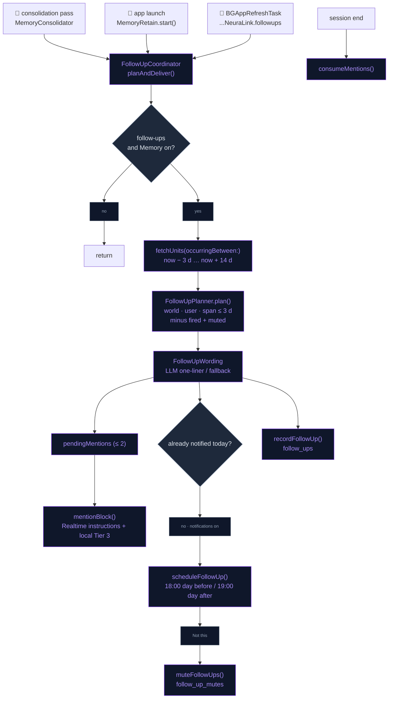
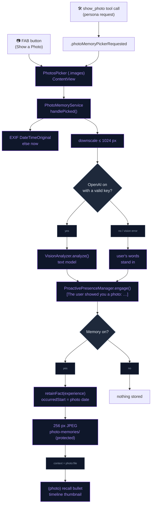

# Companion Depth

The companion acts on what memory already holds. Plans the user mentions with
a date get followed up: the day before and the day after, by notification or
in conversation. Photos the user shows are described once, reacted to in
character, and kept as dated memories with a small on-device thumbnail.

## Follow-ups on dated plans

Retain already extracts dated facts about the future ("User's mother turns 60
on 2026-04-14", "User has a dentist appointment on Friday").
`FollowUpCoordinator.planAndDeliver()` turns those into follow-ups. It runs
after every consolidation pass (`MemoryConsolidator.consolidatePending`), at
launch (`MemoryRetain.start`), and from a daily background refresh. It does
nothing unless **Autonomy → Presence → "Follow up on plans"**
(`PresenceSettings.followUpsEnabled`, default on) and Memory are both on.

- **Candidates**: `MemoryStore.fetchUnits(occurringBetween:and:includeUndated: false)`
  over `[now − 3 d, now + 14 d]`.
- **Planner** (`FollowUpPlanner.plan`, pure): keeps `world` facts that carry an
  `occurredStart`, span **≤ 3 days**, and list the `user` entity. Coarse spans
  ("in September") never fire. Each fact gets one of three kinds, using ISO
  calendar days:

  | Kind | When | Notification |
  |---|---|---|
  | `.today` | event spans today | none (conversation only) |
  | `.upcoming` | starts in 1–3 days | 18:00 the day before |
  | `.afterwards` | ended 1–2 days ago | 19:00 the day after |

  (unit, kind) pairs that already fired (`follow_ups`) and muted units
  (`follow_up_mutes`) are skipped. The results are sorted most imminent
  first.
- **Wording** (`FollowUpWording`): one `MemoryLLM` call (cloud or local, 60
  tokens). It asks for one warm, second-person sentence in the character's
  voice. If the tier is `.none`, or the reply is not 8–200 characters, a
  deterministic fallback is used instead ("Coming up soon: …", "Today's the
  day — …", "How did it go? …"). This keeps the feature working offline.
- **Notification**: at most **one per day**, tracked by a day key in
  `UserDefaults`. It is sent through
  `CompanionNotificationScheduler.scheduleFollowUp` as a communication
  notification with the character as sender, and it replaces any pending
  follow-up. The `NL_FOLLOWUP` category carries a **"Not this"** action,
  which calls `MemoryStore.muteFollowUps(unitID:)`, so that fact is never
  brought up again.
- **In conversation**: up to **2** pending mentions (an `.afterwards` one only
  when nothing else is queued). `mentionBlock()` renders them as
  `[Things to bring up naturally, once]`. This block is appended to the
  Realtime session instructions (`buildSessionInstructions`) and to the local
  Tier 3 facts block. `postInstructionsChanged(reason: "follow-ups")` pushes it
  into a running session. Mentions are cleared on `SessionLifecycle.sessionDidEnd`.
- **Background refresh**: `NeuraLinkApp.init` registers the `BGAppRefreshTask`
  `com.dedicatus.NeuraLink.followups` and re-submits it roughly every 12 h. This
  schedules a day-before notification even on days the app is not opened.
- **Memory page**: the hero card shows a **COMING UP** row with up to three
  upcoming or today items (fact text + date).

## Photo memories

The user can show the companion a picture from their library. To open the
system `PhotosPicker` (images only, no library permission needed), they can:

- tap the **"Show a Photo"** FAB button, or
- say "let me show you a picture". The model calls the `show_photo` tool,
  which posts `.photoMemoryPickerRequested`.

`PhotoMemoryService.handlePicked(data:userWords:)` then does four things.
Whatever the user said just before (`userTranscript`) goes along as their
words.

1. **Date**: reads the EXIF `DateTimeOriginal` as the photo's date, or uses
   now.
2. **Describe**: scales the photo down to ≤ 1024 px. When OpenAI is on with a
   valid key, `VisionAnalyzer.analyze` asks the image-capable **text model**
   (`OpenAISettings.textModel`, `max_completion_tokens`) for two sentences
   that name any people, places or events the user mentioned. Otherwise, or on
   a vision error, the user's own words stand in for the description.
3. **React**: `ProactivePresenceManager.engage(with: "[The user showed you a photo: …]")`
   on whichever engine is live (a Realtime interaction event or a local LLM
   turn).
4. **Remember** (only when Memory is on): stores an `experience` fact, "User
   showed <Character> a photo: … User said: …". Its `occurredStart/End` is
   the photo's date, and its entities are the user plus those found in the
   description and words. A 256 px JPEG thumbnail goes into the protected
   `App Support/photo-memories/`, and the unit's `context` is set to
   `photo:<file>`. The original photo is never copied.

Recall bullets prefix photo units with `(photo)`, so the model knows a
picture exists. The Memory timeline rows show the thumbnail in place of the
fact-type glyph.

## Flow

### Follow-ups

### Photo memories

## Files

| File | Role |
|---|---|
| `Data/DataSources/Memory/Agentic/FollowUpPlanner.swift` | `FollowUp`, the pure `FollowUpPlanner` (kinds, notification times), `FollowUpWording` (prompt + fallback), and `FollowUpCoordinator` (plan → word → deliver, pending mentions) |
| `Data/DataSources/Memory/Agentic/MemoryStore+FollowUps.swift` | `follow_ups` (fired unit+kind) and `follow_up_mutes` tables |
| `Data/DataSources/Memory/Agentic/MemoryStore+Timeline.swift` | `fetchUnits(occurringBetween:and:includeUndated:)`, the candidate query (shared with the Memory timeline) |
| `Core/Utils/CompanionNotificationScheduler.swift` | `scheduleFollowUp`, the `NL_FOLLOWUP` category; `CompanionNotificationPresenter` handles "Not this" |
| `App/NeuraLinkApp.swift` | Registers and re-submits the `com.dedicatus.NeuraLink.followups` background refresh |
| `Data/DataSources/PresenceSettings.swift` | `followUpsEnabled` |
| `Presentation/Views/AI/AutonomySettingsView.swift` | "Follow up on plans" toggle |
| `Presentation/Views/AI/MemoryInsightsSection.swift` | "COMING UP" row on the hero card |
| `Data/DataSources/OpenAI/OpenAIRealtimeManager+SessionConfig.swift` | Appends `mentionBlock()` to the session instructions |
| `Data/DataSources/LocalLLM/LocalLLMMemoryHierarchy.swift` | Appends `mentionBlock()` to the local Tier 3 block |
| `Data/DataSources/PhotoMemoryService.swift` | Picker hand-off, describe, react, remember, thumbnails |
| `Domain/Entities/Skills/ShowPhotoSkill.swift` | `show_photo` tool (opens the picker) |
| `Data/DataSources/AppFunctionTool.swift` | `showPhotoTool` schema |
| `App/ContentView.swift` | Hosts `.photosPicker` and listens for `.photoMemoryPickerRequested` |
| `Presentation/Components/ExpandableFABMenu.swift` | "Show a Photo" FAB button |
| `Data/DataSources/VisionAnalyzer.swift` | Image → description via the configured text model |
| `Data/DataSources/Memory/Agentic/MemoryRecall.swift` | `(photo)` marker on recall bullets |
| `Presentation/Views/AI/MemoryTimelineSection.swift` | Thumbnail in timeline rows |
| `../NeuraLinkTests/CompanionDepthTests.swift` | Planner kinds / spans / mutes, fallback wording, photo fact, vision request body |

## Integration notes

- **Info.plist**: `BGTaskSchedulerPermittedIdentifiers` lists
  `com.dedicatus.NeuraLink.followups`, and `UIBackgroundModes` includes
  `fetch`. `PhotosPicker` needs no library-read usage string.
- **Banks**: follow-ups come from shared `world` facts about the user. Photo
  memories are `experience` units, which land in the active character's bank
  through the normal `MemoryBanks` policy.
- **No double delivery**: a follow-up is recorded as fired when it is
  planned, whether or not it was notified, so later runs never repeat it.
- **Fixed delivery times**: follow-up notifications fire at fixed times
  (18:00 / 19:00), not through the reflection quiet-hours clamp. They need
  notification authorization (`.authorized` or `.provisional`).
- **Mid-session**: a photo memory also posts `postInstructionsChanged`, so the
  new experience reaches the Realtime prompt without a reconnect.
- **Privacy**: the photo goes to OpenAI once, to be described, and only when
  cloud mode is on. On the device, only the description and the 256 px
  thumbnail are kept.

## Known device-test items

- Seed "dentist tomorrow" (e.g. via Siri *Remember*). Confirm the 18:00
  notification and the next-day "how did it go" mention, and that "Not this"
  silences it.
- Show a photo of a named person, then ask about them next session. Confirm
  recall and the timeline thumbnail, and that nothing is stored with Memory
  off.
- Forgetting a photo unit deletes the row but not its thumbnail file. The
  file is orphaned in `photo-memories/`.
