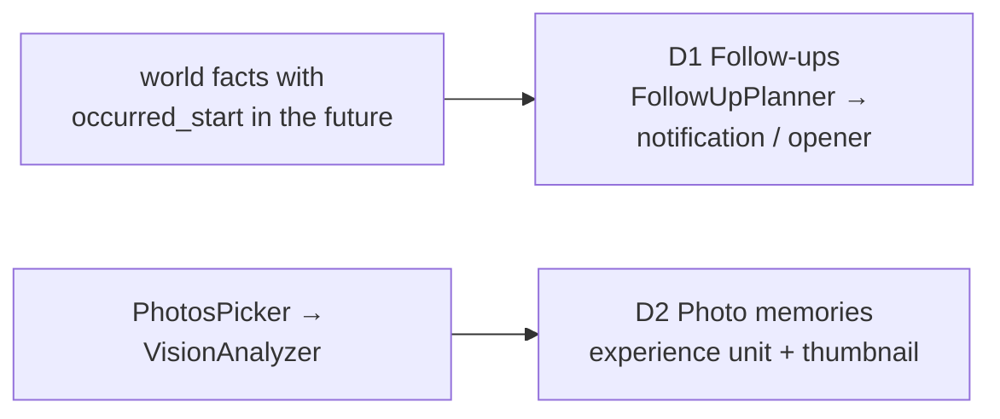

# Companion Depth — Plan

Goal: new companion behaviour built on data and pipelines that already
exist, rather than more plumbing. Two items (the speech-synced gesture
layer stays on hold in `LIVING_COMPANION_PLAN.md` Phase 5 until authored
VRMA clips exist).

| # | Item | Effort | Value |
|---|---|---|---|
| D1 | Character-initiated follow-ups from future-dated facts | M | High |
| D2 | Photo memories | M | Med |

Order: **D1 → D2**. D1 is the more visible "she remembers" moment and needs
no new permissions; D2 adds a Photos permission and a vision call.

Seams cited as file:line on 2026-09-26. Follow [SKILL.md](../SKILL.md).

---

## D1. Character-initiated follow-ups — `M`

**Problem.** Retain already extracts dated facts about the future — "User
signed up for the Berlin marathon in September", "User's mother turns 60
on 2026-04-14", "Atlas deadline moved to 2026-10-30" (all real cases in the
eval fixture) — and then does nothing with the date. A companion that
says "isn't your mum's birthday tomorrow?" is the payoff.

**Seams.**
- Facts: `MemoryUnit.occurredStart/End`, `factType == .world`,
  `MemoryStore.fetchUnits(factTypes:banks:)`; a store query for
  "occurred between" arrives with M3 (`MEMORY_OWNERSHIP_PLAN.md`) — D1 adds
  it if M3 is not done yet.
- Notification path: `CompanionNotificationScheduler.schedule(characterName:body:)`
  (`Core/Utils/CompanionNotificationScheduler.swift:84`) with its quiet-hours
  clamp (`effectiveDelay`, `:76`) and communication-notification content
  (`communicationContent`, `:158`); permission via `requestAuthorization`
  (`:60`); `PresenceSettings.isNotificationsEnabled`.
- In-conversation delivery: the opener mechanism —
  `MemoryStore.latestUnusedOpener(character:)` consumed by
  `ProactivePresenceManager.swift:129` at the absence greeting, and the
  proactive engagement tick (`ProactivePresenceManager.tick`, `:92`).
- Instruction refresh: `OpenAIRealtimeManager.postInstructionsChanged`
  (B2) so a follow-up can be mentioned mid-session.
- Eval: `MemoryEvalFixture` already contains future-dated facts to test
  the planner against.

**Design.**
1. **`FollowUpPlanner`** (Data/DataSources/Memory/Agentic, pure core +
   store wrapper). Input: world facts with an `occurredStart` in
   `[now − 1 d, now + 14 d]` that mention the user (entity `user`) and were
   not already followed up (`follow_ups` table: unit id, kind, fired at).
   Output: `FollowUp` values with a `kind`:
   - `.upcoming` — event in 1–3 days ("marathon on Sunday"),
   - `.today` — event today,
   - `.afterwards` — event ended 1–2 days ago ("how did the marathon go?").
   One follow-up per unit per kind; at most one notification per day and
   one in-conversation mention per session, most imminent first.
2. **Wording.** One LLM call per follow-up through `MemoryLLM` (cloud or
   local), constrained to one sentence in the character's voice, using the
   fact text and the kind; disposition applies. Deterministic fallback
   when the tier is `.none`: "Tomorrow: <fact>." / "How did it go — <fact>?"
   so the feature works offline.
3. **Delivery.**
   - *Notification* (Presence → Notifications on): scheduled for 18:00
     local the day before an `.upcoming` event and 19:00 the day after for
     `.afterwards`, through `CompanionNotificationScheduler.schedule` (which
     applies quiet hours). Body = the wording; the character appears as
     the sender (communication notification, already supported).
   - *In conversation*: the planner writes the wording as a pending opener
     (`companion_journal.opener` via a synthetic entry flagged `follow_up`,
     or a lighter `pending_openers` table) so the next session's greeting
     uses it; if a session is already running, post
     `.realtimeInstructionsDidChange` with a "Things to bring up" block
     (≤ 2 lines) appended in `buildSessionInstructions`, and on the local
     path inject the same block into Tier 3 for one turn.
4. **Scheduling.** `FollowUpPlanner.plan()` runs after consolidation
   (`MemoryConsolidator.consolidatePending`), at launch catch-up, and from
   a daily `BGAppRefreshTask` (`BGTaskScheduler`, identifier
   `com.dedicatus.NeuraLink.followups`) so the day-before notification is
   scheduled even if the app was not opened that day. Needs
   `BGTaskSchedulerPermittedIdentifiers` in `Info.plist`.
5. **Controls.** Autonomy → Presence: "Follow up on plans" toggle (default
   on when notifications are on) with an ⓘ; each notification's "Not
   this" action marks the unit `muted` so it is never mentioned again.
6. **Memory page.** Follow-ups appear as a small "Coming up" row in the
   hero card when any are pending ("Mum's 60th · Apr 14").

**Tasks.** `follow_ups` table + queries → planner core + tests →
wording generator (LLM + fallback) → notification scheduling →
opener/instruction delivery → BGAppRefresh + plist → toggle + mute →
hero-card row → docs (`LIVING_COMPANION_PLAN.md`, `AGENTIC_MEMORY.md`).

**Verification.** Unit: planner selects the right kinds and dates across
day boundaries (ISO calendar), respects mutes and the one-per-day cap,
fallback wording; scripted-LLM wording test. Device: seed a fact "dentist
on <tomorrow>" via `remember_fact`, confirm the 18:00 notification and the
next-day "how did it go" opener; confirm "Not this" silences it.

**Risks.** Coarse spans ("in 2026", "in September") must not fire — only
spans ≤ 3 days qualify. Recurring events (birthdays) recur only if the
fact says so; a `yearly` flag from the extractor is a follow-up feature.

---

## D2. Photo memories — `M`

**Problem.** The companion can see through the camera (`CameraSkill`,
`ProactiveVisionManager`) but cannot look at a photo the user already has,
and what it sees is never remembered.

**Seams.**
- Vision: `VisionAnalyzer.analyze(image:prompt:apiKey:)` with `gpt-4o`
  (`VisionAnalyzer.swift:15-19`); callers `CameraSkill.swift:32`,
  `ProactiveVisionManager.swift:112`; the camera frame path
  `CameraManager.captureCurrentFrame()` (`CameraManager.swift:75`).
- Delivery to the model: `sendProactiveVisionUpdate(description:)`
  (`OpenAIRealtimeManager+Handlers.swift:262-283`) sends a system item +
  `response.create`; local path has no equivalent yet.
- Memory: `MemoryRetain.retainFact(ExtractedFact(...))` with
  `factType: .experience`, `MemoryBanks` policy (experience → character
  bank), entities via `MemoryEntityExtractor`.
- Phone widget pattern for a UI card after a tool result
  (`PhoneWidgetManager.card(for:arguments:result:)`,
  `AppFunctionExecutor.swift:65`).
- Permissions: `Info.plist` has camera and microphone strings but no
  `NSPhotoLibraryUsageDescription`.

**Design.**
1. **Entry points.** (a) A `show_photo` tool (OpenAI Realtime + curated
   local set if the grammar budget allows) the model calls when the user
   says "let me show you a picture"; (b) a photo button on the chat overlay
   next to the camera action. Both open `PhotosPicker` (SwiftUI, no
   library permission needed for the picker) limited to images.
2. **Describe.** Downscale to ≤ 1024 px, call `VisionAnalyzer.analyze`
   with a prompt that asks for a short description *and* any people,
   places or events the user names in the same breath ("this is my sister
   at Lake Como"). The user's utterance is passed as context. Local tier:
   no vision model → the photo is stored with the user's own words only.
3. **React.** Realtime: `sendProactiveVisionUpdate`-style system item
   "[The user showed you a photo: …]" + `response.create`. Local: append
   the description as a one-turn system block (same slot as Tier 3).
4. **Remember.** Store an `experience` unit: "User showed <Character> a
   photo: <description>. <user words>" with `occurredStart` = photo
   creation date (from the asset metadata when available, else now),
   entities from the description + user words, and a **thumbnail** (256 px
   JPEG) saved under App Support `photo-memories/<unit id>.jpg` protected
   like the DB (`ProtectedStorage.protect`). The unit's `context` column
   holds the thumbnail file name; the photo itself is never copied.
5. **Surface.** The Memory page's Moments / Insights rows show the
   thumbnail when the unit has one; recall bullet lines mark it with
   "(photo)" so the model knows a picture exists; `search_memory` can find
   it by the people and places named.
6. **Privacy.** ⓘ on the button: "The photo is sent to OpenAI once to be
   described and is not stored; NeuraLink keeps a small thumbnail and the
   description on this device." No thumbnails when Memory is off.

**Tasks.** plist key + picker → downscale + analyze prompt → Realtime /
local delivery → experience unit + thumbnail store → Memory page thumbnail
→ tool schema (+ grammar entry if kept for local) → tests → docs
(`Function_Call.md`, `AGENTIC_MEMORY.md`, `APP_SECURITY.md`).

**Verification.** Unit: description → `ExtractedFact` builder (entities,
date from asset metadata, thumbnail path in `context`); thumbnail written
and deleted with the unit (`deleteUnit` hook). Device: show a photo of a
named person, ask about them next session, confirm recall and the
thumbnail in the Memory page; confirm nothing is stored when Memory is off.

**Risks.** Vision cost per photo on gpt-4o — one call per photo, no
retries. HEIC/Live Photos: use `PhotosPicker` with `.images` and load via
`loadTransferable(type: Data.self)`; orientation must be normalised before
downscaling.

---

## Cross-cutting

- Both items feed the same `[Companion State]` / instruction path and the
  B2 refresh, so a photo shown or a follow-up planned mid-session reaches
  the model without a reconnect.
- Both respect `MemoryBanks`: follow-ups come from shared user facts;
  photo memories are experiences in the active character's bank.
- Neither introduces a new target; D1 adds a background task identifier,
  D2 a Photos usage string.
