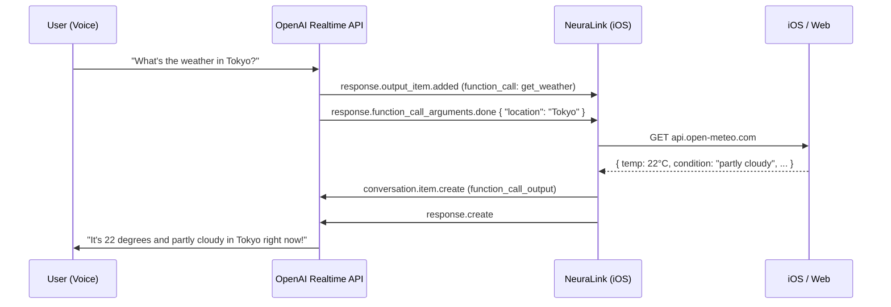

# 🤖 AI Function Calling

NeuraLink's AI companion can interact with native iOS apps directly from conversation. When you ask the character to check the weather, play music, set a reminder, or search the web, she calls a typed tool behind the scenes and speaks the result back to you — no app-switching required.

---

## How It Works

Function calling is built on the **OpenAI Realtime API's native tool system**. During session setup, NeuraLink declares a set of typed tools via `session.update`. When the AI decides a tool is needed, it streams arguments through the data channel and NeuraLink executes the action locally on-device.



---

## Available Tools

### 🌤️ `get_weather` — Current Weather

Fetches live weather data for any city using the [Open-Meteo API](https://open-meteo.com/) (free, no API key required).

**Trigger phrases:**
- *"What's the weather like in London?"*
- *"Is it raining in Seoul?"*
- *"How cold is it in New York?"*

**Returns:** Temperature, feels-like, humidity, wind speed, rain, and a plain-English condition description.

```swift
// Example tool arguments
{ "location": "Tokyo" }

// Example result returned to AI
"Current weather in Tokyo: partly cloudy. Temperature 22°C, feels like 20°C.
Humidity 68%, wind 14 km/h."
```

**Implementation:** `AppFunctionExecutor.fetchWeather(for:)` → geocoding via Open-Meteo, then current conditions using WMO weather codes.

---

### 🔍 `search_web` — Web Search

Opens Safari and navigates to a Google search (or a direct URL if the query starts with `http`).

**Trigger phrases:**
- *"Search for the best ramen in Tokyo"*
- *"Look up how to make croissants"*
- *"Open youtube.com"*

```swift
{ "query": "best ramen in Tokyo" }
// Opens: https://www.google.com/search?q=best+ramen+in+Tokyo
```

---

### 🎵 `play_music` — Apple Music

Searches Apple Music for a song, artist, album, or playlist and opens the result directly in the app.

**Trigger phrases:**
- *"Play some lo-fi hip hop"*
- *"Put on Taylor Swift"*
- *"Play the Blade Runner 2049 soundtrack"*

```swift
{ "query": "lo-fi hip hop" }
// Opens: music://music.apple.com/search?term=lo-fi+hip+hop
```

---

### 🔔 `create_reminder` — Reminders

Creates a reminder via **EventKit** using the system Reminders app. Requests permission the first time it's called.

**Trigger phrases:**
- *"Remind me to call mom"*
- *"Set a reminder to take my medicine"*
- *"Add 'buy groceries' to my reminders"*

```swift
{ "title": "Call mom", "notes": "Ask about the weekend" }
// Saved to the default Reminders list
```

**Permission required:** `NSRemindersUsageDescription` (already declared in `Info.plist`).

---

### 📝 `create_note` — Notes

Copies note content to the clipboard and opens the Notes app. If [Bear](https://bear.app) is installed, it creates the note there directly with a pre-filled title and body.

**Trigger phrases:**
- *"Take a note: meeting ideas for Monday"*
- *"Write this down: the WiFi password is NeuraLink2025"*
- *"Create a note about the book I just read"*

```swift
{ "title": "Meeting Ideas", "body": "Discuss new feature roadmap, Q3 goals..." }
// Bear: bear://x-callback-url/create?title=...&text=...
// Fallback: clipboard + mobilenotes://
```

---

### 📱 `open_app` — Launch App

Opens a built-in iOS app by name using URL schemes.

**Trigger phrases:**
- *"Open Maps"*
- *"Launch the Camera"*
- *"Go to Settings"*

| App name | URL Scheme |
|---|---|
| Maps | `maps://` |
| Photos | `photos-redirect://` |
| Calendar | `calshow://` |
| Settings | `App-Prefs:Root=General` |
| Camera | `camera://` |
| Clock | `clock-alarm://` |
| Health | `x-apple-health://` |
| FaceTime | `facetime://` |

---

## Architecture

```
AppFunctionTool.swift          — Tool schemas injected into session.update
AppFunctionExecutor.swift      — On-device execution of each tool
OpenAIRealtimeManager.swift    — Event loop: streams args, dispatches executor, sends result
```

### Event Flow in `OpenAIRealtimeManager`

| Event received | Action |
|---|---|
| `response.output_item.added` (type: `function_call`) | Start accumulating — capture `call_id` and `name` |
| `response.function_call_arguments.delta` | Append JSON argument fragment |
| `response.function_call_arguments.done` | Parse JSON → `AppFunctionExecutor.execute()` → send result |
| `conversation.item.create` + `response.create` | AI receives result and continues speaking |

### Adding a New Tool

1. **Declare the schema** in `AppFunctionTool.swift`:
```swift
static let myTool = "my_tool"

private static var myTool: [String: Any] {
    [
        "type": "function",
        "name": myTool,
        "description": "What this tool does and when to use it.",
        "parameters": [
            "type": "object",
            "properties": [
                "param": ["type": "string", "description": "..."],
            ],
            "required": ["param"],
        ],
    ]
}
```

2. **Add it to `all`**:
```swift
static var all: [[String: Any]] {
    [weatherTool, searchTool, musicTool, reminderTool, noteTool, openAppTool, myTool]
}
```

3. **Implement the executor** in `AppFunctionExecutor.swift`:
```swift
case AppFunctionTool.myTool:
    let param = arguments["param"] as? String ?? ""
    return await doMyThing(param)
```

> [!TIP]
> The result string you return is read aloud by the AI verbatim, so write it as a natural spoken sentence, not raw JSON.

---

## Permissions

| Tool | Permission required |
|---|---|
| `create_reminder` | `NSRemindersUsageDescription` |
| All others | None beyond standard networking / URL open |

> [!NOTE]
> All network calls (`get_weather`) are to public, unauthenticated endpoints. No data leaves the device except through the existing OpenAI Realtime WebRTC channel.
