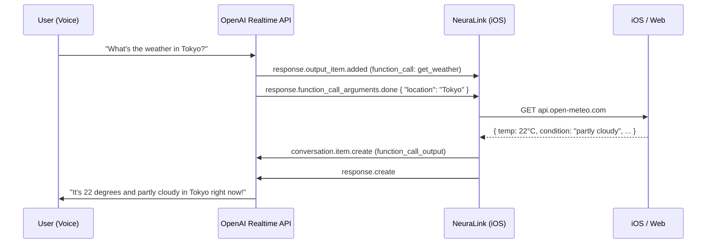

# 🤖 AI Function Calling

NeuraLink's AI companion can interact with native iOS apps directly from conversation. When you ask the character to check the weather, play music, set a reminder, or search the web, she calls a typed tool behind the scenes and speaks the result back to you — no app-switching required.

---

## How It Works

Function calling is built on the **OpenAI Realtime API's native tool system**. During session setup, NeuraLink declares a set of typed tools via `session.update` — under the GA schema, that's `session.tools` alongside `session.tool_choice` and the rest of the audio config (see [openai_realtime_chat.md](openai_realtime_chat.md) for the full session body shape). When the AI decides a tool is needed, it streams arguments through the data channel and NeuraLink executes the action locally on-device.

The function-call event names (`response.output_item.added`, `response.function_call_arguments.{delta,done}`, `response.done`) were **not** renamed in the GA migration — only the transcript events were. The flow in this doc applies to both beta and GA sessions.


```mermaid
sequenceDiagram
    participant User as User (Voice)
    participant AI as OpenAI Realtime API
    participant App as NeuraLink (iOS)
    participant OS as iOS / Web

    User->>AI: "What's the weather in Tokyo?"
    AI->>App: response.output_item.added (function_call: get_weather)
    AI->>App: response.function_call_arguments.done { "location": "Tokyo" }
    App->>OS: GET api.open-meteo.com
    OS-->>App: { temp: 22°C, condition: "partly cloudy", ... }
    App->>AI: conversation.item.create (function_call_output)
    App->>AI: response.create
    AI->>User: "It's 22 degrees and partly cloudy in Tokyo right now!"
```

---

## Available Tools

### 🎭 `set_emotion` — Avatar Facial Expression

Updates the VRM avatar's facial expression to reflect the AI's current emotional state. **Called by the model at the very start of every response, before speaking** — the most frequently-invoked tool in the system.

**Trigger phrases:** *(implicit — fires for every response based on tone)*

```swift
{ "emotion": "happy", "duration": 2.0 }
```

**Allowed emotions:** `happy`, `angry`, `sad`, `relaxed`, `surprised`, `shocked`, `shy`, `embarrassed`, `bored`, `confused`, `wink`, `neutral`.

**Fast-path handling.** Unlike all other tools, `set_emotion` is executed *immediately* on `response.function_call_arguments.done` instead of being deferred to `response.done`. Reason: the avatar must visibly react before audio playback starts, otherwise the expression lags the voice. The execution path is in [OpenAIRealtimeManager+Handlers.swift](../NeuraLink/Data/DataSources/OpenAI/OpenAIRealtimeManager+Handlers.swift) `handleIncomingJSON` — the `pendingFunctionName == AppFunctionTool.setEmotion` branch.

**No spoken acknowledgement.** The tool result is `"ok"`; the AI is instructed (in its system prompt) to never mention the emotion name in speech — the avatar shows it silently.

---

### 🌤️ `get_weather` — Current Weather

Fetches live weather data for any city using the [Open-Meteo API](https://open-meteo.com/) (free, no API key required).

**Trigger phrases:**
- *"What's the weather like in London?"*
- *"Is it raining in Seoul?"*
- *"How cold is it in New York?"*

**Returns:** Temperature, feels-like, humidity, wind speed, rain, and a plain-English condition description.

```swift
// Example tool arguments
{ "location": "Tokyo" }

// Example result returned to AI
"Current weather in Tokyo: partly cloudy. Temperature 22°C, feels like 20°C.
Humidity 68%, wind 14 km/h."
```

**Implementation:** `AppFunctionExecutor.fetchWeather(for:)` → geocoding via Open-Meteo, then current conditions using WMO weather codes.

---

### 🔍 `search_web` — Web Search

Opens Safari and navigates to a Google search (or a direct URL if the query starts with `http`).

**Trigger phrases:**
- *"Search for the best ramen in Tokyo"*
- *"Look up how to make croissants"*
- *"Open youtube.com"*

```swift
{ "query": "best ramen in Tokyo" }
// Opens: https://www.google.com/search?q=best+ramen+in+Tokyo
```

---

### 🎵 `play_music` — Apple Music

Searches Apple Music for a song, artist, album, or playlist and opens the result directly in the app.

**Trigger phrases:**
- *"Play some lo-fi hip hop"*
- *"Put on The Beatles"*
- *"Play the song Never Give up on Your Dreams from Two Steps from Hell"*

```swift
{ "query": "lo-fi hip hop" }
// Opens: music://music.apple.com/search?term=lo-fi+hip+hop
```

---

### 📷 `analyze_camera` — Camera Vision

Looks through the device camera and returns a natural-language description of what's in front of it. Backed by the [`ProactiveVisionManager`](../NeuraLink/Data/DataSources/ProactiveVisionManager.swift), which captures a frame and routes it to a vision model.

**Trigger phrases:**
- *"Can you see what I'm holding?"*
- *"Look at this and tell me what it is"*
- *"Describe what's in front of the camera"*

```swift
// All parameters optional — defaults to a general description
{ "focus": "describe the person" }
```

The result string is read aloud verbatim, so the executor returns it as a complete spoken sentence.

---

### 🔔 `create_reminder` — Reminders

Creates a reminder via **EventKit** using the system Reminders app. Requests permission the first time it's called.

**Trigger phrases:**
- *"Remind me to call mom"*
- *"Set a reminder to take my medicine"*
- *"Add 'buy groceries' to my reminders"*

```swift
{ "title": "Call mom", "notes": "Ask about the weekend" }
// Saved to the default Reminders list
```

**Permission required:** `NSRemindersUsageDescription` (already declared in `Info.plist`).

---

### 📝 `create_note` — Notes

Copies note content to the clipboard and opens the Notes app. If [Bear](https://bear.app) is installed, it creates the note there directly with a pre-filled title and body.

**Trigger phrases:**
- *"Take a note: meeting ideas for Monday"*
- *"Write this down: the WiFi password is NeuraLink2025"*
- *"Create a note about the book I just read"*

```swift
{ "title": "Meeting Ideas", "body": "Discuss new feature roadmap, Q3 goals..." }
// Bear: bear://x-callback-url/create?title=...&text=...
// Fallback: clipboard + mobilenotes://
```

---

### 📱 `open_app` — Launch App

Opens a built-in iOS app by name using URL schemes.

**Trigger phrases:**
- *"Open Maps"*
- *"Launch the Camera"*
- *"Go to Settings"*

| App name | URL Scheme |
|---|---|
| Maps | `maps://` |
| Photos | `photos-redirect://` |
| Calendar | `calshow://` |
| Settings | `UIApplication.openSettingsURLString` |
| Health | `x-apple-health://` |
| FaceTime | `facetime://` |

---

### 🧠 `remember_fact` — Semantic Memory

Stores structured facts about the user in the local Knowledge Graph. These facts are persistent across sessions and are injected into the AI's system prompt during initialization.

**Trigger phrases:**
- *"My name is Dedicatus"*
- *"I really love spicy food"*
- *"I work as a software engineer"*

```swift
{ "subject": "User", "predicate": "likes", "object": "Spicy Food" }
```

---

### 📸 `pose_for_photo` — Interactive Photoshoot

Directs the character to strike a specific pose for a screenshot. The AI will crossfade to the requested animation, look at the camera lens, and hide all UI overlays for 5 seconds.

**Trigger phrases:**
- *"Strike a cool pose for a photo!"*
- *"Give me a peace sign"*
- *"Wave for the camera"*

**Available poses:** `peace_sign`, `cool`, `relax`, `stretch`.

---

## Architecture

```
AppFunctionTool.swift          — Tool schemas injected into session.update
AppFunctionExecutor.swift      — On-device execution of each tool
OpenAIRealtimeManager.swift    — Event loop: streams args, dispatches executor, sends result
```

### Event Flow in `OpenAIRealtimeManager`

| Event received | Action |
|---|---|
| `response.output_item.added` (type: `function_call`) | Start accumulating — capture `call_id` and `name` |
| `response.function_call_arguments.delta` | Append JSON argument fragment |
| `response.function_call_arguments.done` | Finalize arguments and **defer execution** (except `set_emotion` — see below) |
| `response.done` | **Execute deferred call** → send result back to AI |
| `conversation.item.create` + `response.create` | AI receives result and continues speaking |

> [!TIP]
> Execution is intentionally deferred until `response.done`. This ensures that if the AI provides a verbal confirmation (e.g., "Sure, let me check that for you..."), the audio finishes playing before the app triggers the system tool or web search.

> [!NOTE]
> `set_emotion` is the one exception — it runs *immediately* on `response.function_call_arguments.done` so the avatar's expression updates before the spoken response begins. The fast-path branch lives in [`OpenAIRealtimeManager+Handlers.swift`](../NeuraLink/Data/DataSources/OpenAI/OpenAIRealtimeManager+Handlers.swift) `handleIncomingJSON`.

1. **Declare the schema** in `AppFunctionTool.swift`:
```swift
static let myTool = "my_tool"

private static var myToolDefinition: [String: Any] {
    [
        "type": "function",
        "name": myTool,
        "description": "What this tool does and when to use it.",
        "parameters": [
            "type": "object",
            "properties": [
                "param": ["type": "string", "description": "..."],
            ],
            "required": ["param"],
        ],
    ]
}
```

2. **Add it to `all`**:
```swift
static var all: [[String: Any]] {
    [
        emotionTool, weatherTool, searchTool, musicTool, reminderTool,
        noteTool, openAppTool, cameraTool, factTool, photoTool,
        myToolDefinition,
    ]
}
```

3. **Implement the executor** in `AppFunctionExecutor.swift`:
```swift
case AppFunctionTool.myTool:
    let param = arguments["param"] as? String ?? ""
    return await doMyThing(param)
```

> [!TIP]
> The result string you return is read aloud by the AI verbatim, so write it as a natural spoken sentence, not raw JSON.

---

## Permissions

| Tool | Permission required |
|---|---|
| `create_reminder` | `NSRemindersUsageDescription` |
| All others | None beyond standard networking / URL open |

> [!NOTE]
> All network calls (`get_weather`) are to public, unauthenticated endpoints. No data leaves the device except through the existing OpenAI Realtime WebRTC channel.
