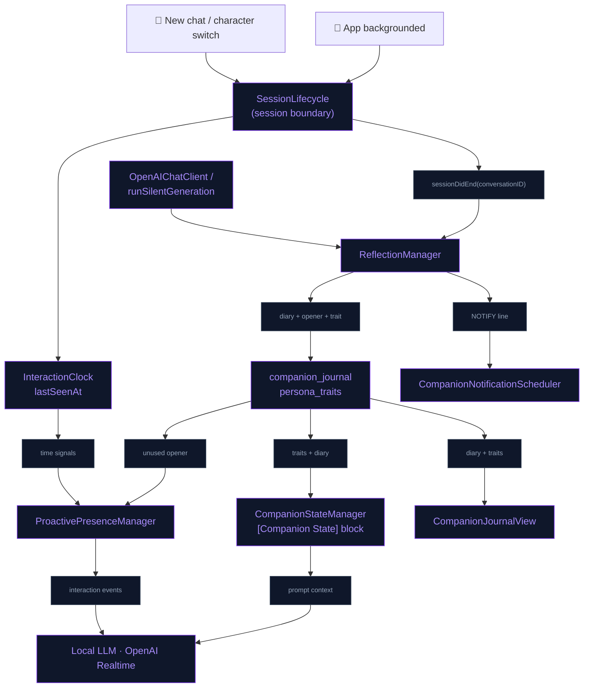
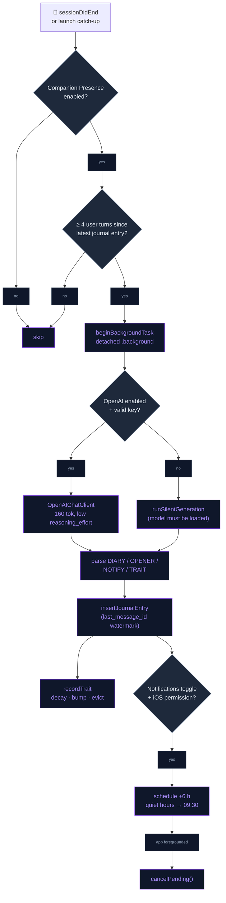
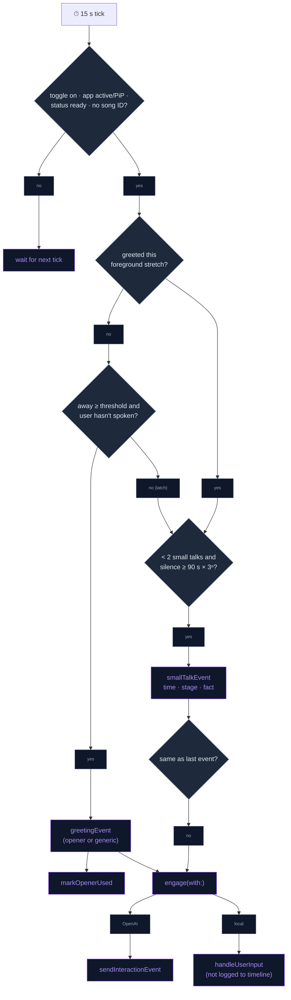

# Living Companion

The companion carries on between conversations. When a session ends it
reflects in private: it writes a diary line and saves an opener for next time.
It may also note a personality trait and schedule a gentle "thinking of you"
notification. When the user returns, it greets them with that opener, and it
breaks long silences on its own. It also hosts shared activities: co-listening
and mini-games. Everything it remembers or becomes can be seen and deleted in
the Journal sheet.

## Session boundaries

`SessionLifecycle` marks **session boundaries**. It posts
`SessionLifecycle.sessionDidEnd` (userInfo `conversationID`, `reason`) with the
active conversation id. Three things fire a boundary:

- **backgrounding** (`reason: "background"`), via
  `UIApplication.didEnterBackgroundNotification`,
- **new chat** (`ContentView.startNewChatSession`, `reason: "newChat"`),
- **character switch** (`VRMSceneView`, `reason: "characterSwitch"`).

Explicit callers post the boundary *before* they reset or stop the
conversation. A boundary does **not** reset the active conversation, so a
quick app switch never splits the chat history. It only stamps
`InteractionClock.lastSeenAt` and posts the notification. If no conversation
row exists yet, it does nothing, so empty sessions are never reflected on.
When "keep talking in background" is on and a voice session is live,
`BackgroundSessionKeeper` holds the session open. The boundary then fires
later, when the keeper ends the session (idle or battery guard).

## Interaction clock

`Core/Utils/InteractionClock.swift` is the one clock for "when did the user
last interact":

- `lastUserSpeechAt` is kept in memory for the current launch. Both user-turn
  sites feed it through `noteUserSpoke()`: `LocalLLMManager` and
  `OpenAIRealtimeManager+Handlers`. It drives silence detection.
- `lastSeenAt` is saved to UserDefaults on backgrounding. It drives the
  "hours since last seen" absence check.

All the maths uses the device's local `Date`. SQLite `messages.timestamp`
values are UTC strings, and they are never mixed into this arithmetic.

## Storage

`MemoryStore`'s single `createTableQuery` creates two tables. Their CRUD lives
in `MemoryStore+Journal.swift`.

```sql
companion_journal (id, character, conversation_id, diary, opener,
                   notification_line, notified, opener_used,
                   last_message_id, created_at)
persona_traits    (id, character, trait, weight, created_at, updated_at)
```

`companion_journal.conversation_id` deliberately has no foreign key.
`last_message_id` is the newest message a reflection covered, and it acts as
the **reflection watermark** (see End-of-session reflection). When the column is added during an
upgrade, it is backfilled to each conversation's current last message. This
stops the upgrade from re-reflecting conversations that already have entries.
Swift entities: `JournalEntry`, `PersonaTrait` (`Domain/Entities/CompanionJournal.swift`).

## Background text client

`Data/DataSources/OpenAI/OpenAIChatClient.swift` is the one-shot Chat
Completions client used by every background text call: titling, reflection,
memory retain, consolidation and mental models. It handles the bearer auth,
`max_completion_tokens` and the JSON parse. It returns `nil` on any failure,
and callers skip silently. The model is the user-selected
`OpenAISettings.textModel`. Two rules apply to GPT-5-family models:

- `temperature` is omitted, because they reject non-default values.
- A **low `reasoning_effort`** is sent. At the default "medium" effort, a
  small budget like reflection's 160 tokens was used up entirely by
  reasoning, and the reply came back empty.

The Realtime/WebRTC voice path is separate.

## End-of-session reflection

On a session boundary, `ReflectionManager` runs **one silent LLM pass** over
the conversation's last 16 spoken turns (tool calls are excluded). The model
answers with labelled lines:

```
DIARY:   one or two first-person sentences about the talk and how it felt
OPENER:  one warm line to greet the user with next time
NOTIFY:  ≤ 12-word push-notification invitation
TRAIT:   optional — a new habit/dynamic note, only if clearly revealed
```

Replies are parsed as labelled lines, not JSON, because 1–2B local models
can't be trusted to produce valid JSON. Content can wrap onto the next lines.
Unlabelled leading text counts as the diary, because the local prompt ends
with `DIARY:`. Each field is trimmed and capped (diary 300, opener 200,
notify 120, trait 100 chars). If no diary comes back, nothing is stored. The
prompt forbids inventing facts.

- **Routing**: if OpenAI is enabled and has a valid key, the call goes to
  `OpenAIChatClient` (160 tokens, temperature 0.6 where the model allows
  it). Otherwise it goes to `LocalLLMManager.runSilentGeneration` (160
  tokens). That path has no UI or TTS side effects and waits behind the
  engine's generation lock. It is skipped if the local model isn't loaded.
- **Guards**: the Companion Presence master switch must be on. The
  conversation must have **≥ 4 new spoken user turns since its latest
  journal entry** (`MemoryStore.unreflectedUserTurns`, which counts message
  ids above the `last_message_id` watermark). An `NSLock` in-flight set
  dedupes repeat calls. The active conversation survives backgrounding, so a
  long-running chat gets a fresh reflection, and a fresh notification,
  every time it grows by another 4 or more turns.
- **Background budget**: the pass runs in `Task.detached(priority: .background)`
  inside `beginBackgroundTask`, which gives it about 30 s after
  backgrounding.
- **Launch catch-up**: 8 s after launch, the newest recent conversation
  (≤ 7 days old, excluding the active one) that meets the ≥ 4-new-turns
  guard is reflected on. This covers cold kills, missed background windows
  and a freshly enabled feature. Only one conversation is caught up per
  launch, and its entry is credited to the currently selected character.
- **Output**: a `companion_journal` row, a widget snapshot refresh, the trait
  pool update (see Personality evolution), and, if notifications are on, a scheduled
  notification. When one is scheduled, the row is marked `notified`.

### Notifications

`CompanionNotificationScheduler` enforces the notification rules:

- **One pending max**: a fixed identifier means a new notification replaces
  the old one instead of stacking.
- **Delay**: 6 h after the session ends.
- **Quiet hours**: 22:00–09:00 local. A fire time inside that window moves
  to the next **09:30**.
- **Cancelled on return**: the pending notification is removed on every
  foreground return and on cold launch.
- **Content**: the title is "‹Name› has been thinking of you" and the body is
  the `NOTIFY` line. If the model left `NOTIFY` out, a generic line is used
  instead.

The notification is rewritten as a **communication notification**
(`INSendMessageIntent` with the character as sender). iOS then shows the
character's thumbnail as a circular avatar in place of the app icon. This
needs the `usernotifications.communication` entitlement. The thumbnail is
drawn onto an opaque gradient with a ring, because transparent VRM
thumbnails read badly inside the circle. `CompanionNotificationPresenter`
shows banners in the foreground (`.banner, .list, .sound`).

Authorization is alert + sound only, with no badge. It is requested the first
time the notification toggle is switched on.

## Personality evolution

- **One relationship curve**: `CompanionAffinity` drives both the UI meter
  and the prompt. The score weights shared days (45%), depth (35%: facts
  learned + reflection count) and volume (20%: turns, which saturate at
  150). Time apart cools it gently, down to a floor of 0.65×, and it is
  capped at 0.95. There are five stages: New, Acquaintances, Friends, Good
  Friends and Close. Each stage carries behaviour guidance, so the persona
  acts its stage.
- **Trait pool**: the optional `TRAIT:` line comes from the same reflection
  call, with no extra LLM call. On each reflection:
  1. Every trait for the character decays (×0.95).
  2. A case-insensitive match gets +1.0 weight.
  3. Otherwise, if the pool is full (5 per character), the weakest trait is
     evicted, and the new trait is inserted at weight 1.0.

  Traits must be 8–100 characters. They live only in `persona_traits` and
  are never copied into the fact stores.
- **Prompt block**: `CompanionStateManager.promptContext(characterName:compact:)`
  is the one hook shared by both engines: local `buildSystemContent` and the
  OpenAI session instructions. Its `[Companion State]` block holds:
  - relationship stage + guidance,
  - recent tone,
  - known preferences (up to 6),
  - up to 3 traits,
  - the carry-over line (see Cross-session carry-over).

  On `.llama1b` it is compact: 3 preferences and 2 traits. The JP (`llmJp3`)
  path leaves it out. When nothing is known, it returns `""`. It sits in the
  system prompt rather than in `LocalLLMPromptStore.effectivePrompt`, so it
  never overwrites a prompt the user has saved.
- **Journal UI**: tapping the relationship meter (`RelationshipMeterBarOverlay`)
  opens `CompanionJournalView`. It has four sections:
  - **Relationship**
  - **Personality**: traits, swipe to delete
  - **Diary**: newest first, swipe to delete
  - **Reset Personality**: after a confirmation, deletes the diary and all
    traits. Chat history and facts are kept.

## Proactive engagement

`ProactivePresenceManager` lets the companion speak first. It checks every
**15 s**. It works with either engine: it injects through
`OpenAIRealtimeManager.sendInteractionEvent` when the data channel is open,
and through `LocalLLMManager.handleUserInput(_, logToTimeline: false)`
otherwise.

- **Guards on every tick**: the Proactive Engagement toggle is on, and the app
  is active (or PiP is active). `status == .ready`, and the UI isn't hidden.
  No song recognition is running.
- **Absence greeting.** This fires at most once per foreground
  stretch. It needs `hoursSinceLastSeen ≥ absenceGreetingHours` (default
  6 h), and the user must not have spoken first. The greeting uses the latest
  **unused opener** from `companion_journal`, which is then marked
  `opener_used` exactly once. Without an opener, a generic warm greeting is
  used. Both versions include how long the user was away and the time of day.
- **Silence small talk.** This fires after `silenceSmallTalkSec`
  of silence (default 90 s), measured from the later of the last user speech
  and the last engagement. It fires at most **2 per session**. The wait
  triples each time (×3 backoff, so 90 s → 270 s), and an event identical to
  the previous one is skipped. It is seeded with the time of day, the
  relationship stage and one random remembered fact.
- **Time-of-day** is not a separate trigger. It is a descriptor inside the
  greeting and small-talk events: early morning, morning, afternoon, evening or late night.

`engage(with:)` is also the shared injection seam for photo memories and the
weekly recap.

## Shared activities

### Co-listening

A long-press on the Identify Song FAB, or `identify_song` with
`"mode": "session"`, turns recognition into a loop. It gets one persona
comment per track change and stops on its own. See
[`SONG_RECOGNITION.md`](SONG_RECOGNITION.md#co-listening-sessions).

### Mini-games

The `play_game` tool (`PlayGameSkill`) has two forms:

- `game`: `twenty_questions`, `trivia` or `word_chain`
- `action: "stop"`

It is a thin gate onto `GameSessionManager`, where the **rules live in code**.
The manager tracks the active game and the turn count. For 20 Questions it
also picks and holds the secret answer, since the LLM has no hidden state.
The tool result is a rules brief the model acts on. On the local path, a
per-turn `[Active Game]` reminder rides after the history, so the KV-cache
prefix is untouched. The reminder carries the turn number, the secret (20Q)
and a wrap-up nudge at the soft cap (20 / 10 / 15 turns). Game turns get
`maxTokens = 120` instead of the usual 60. Five turns past the soft cap, the
session ends itself.

## Cross-session carry-over

`CompanionStateManager.carryOverLine` adds one line to the Companion State
block, so no session starts cold, even with Companion Presence off:

1. **the latest reflection diary** (< 7 days, up to 200 chars): "Last
   session, you privately noted: …", else
2. **the closing exchange of the previous conversation** (< 48 h, up to 140
   chars), credited to whoever said it.

The guidance line tells the persona to "pick up threads… never act like a
stranger". The block is built when the session starts. That keeps it stable
within a session. The saved cross-launch KV cache misses whenever the diary
has changed, and warm-up then re-prefills.

## Flow

### Architecture



### Reflection and notification



### Proactive tick



## Files

| File | Role |
|---|---|
| `Data/DataSources/SessionLifecycle.swift` | Session boundaries; posts `sessionDidEnd` |
| `Core/Utils/InteractionClock.swift` | `lastUserSpeechAt` (per launch) + persisted `lastSeenAt` |
| `Domain/Entities/CompanionJournal.swift` | `JournalEntry` / `PersonaTrait` entities |
| `Data/DataSources/Memory/MemoryStore+Journal.swift` | Journal + trait CRUD, `unreflectedUserTurns` watermark count |
| `Data/DataSources/Memory/MemoryStore.swift` | Table DDL + `last_message_id` migration/backfill |
| `Data/DataSources/OpenAI/OpenAIChatClient.swift` | Shared one-shot Chat Completions client |
| `Data/DataSources/ReflectionManager.swift` | Reflection pass, labelled-line parser, trait pool, launch catch-up |
| `Core/Utils/CompanionNotificationScheduler.swift` | Scheduling, quiet hours, communication-style avatar, foreground presenter |
| `Data/DataSources/PresenceSettings.swift` | All presence toggles/thresholds (explicit-backing `@Observable`) |
| `Data/DataSources/Memory/CompanionAffinity.swift` | The single relationship curve + stage guidance |
| `Data/DataSources/Memory/CompanionStateManager.swift` | `[Companion State]` prompt block + carry-over line |
| `Presentation/Views/AI/CompanionJournalView.swift` | Journal sheet: relationship, traits, diary, reset |
| `Presentation/Views/AI/RelationshipMeterBarOverlay.swift` | Meter overlay; tap opens the Journal |
| `Data/DataSources/ProactivePresenceManager.swift` | Absence greeting + silence small talk loop; shared `engage(with:)` |
| `Presentation/Views/AI/AutonomySettingsView.swift` | Companion Presence / Proactive Engagement settings sections |
| `Data/DataSources/SongRecognitionManager+Session.swift` | Co-listening loop |
| `Data/DataSources/GameSessionManager.swift` | Mini-game state machine, secret, per-turn reminder |
| `Domain/Entities/Skills/PlayGameSkill.swift` | `play_game` tool |
| `App/NeuraLinkApp.swift` | Starts `SessionLifecycle`, `ReflectionManager`, `ProactivePresenceManager` |

## Integration notes

- **Settings** (AI Settings → Autonomy):
  - **Companion Presence** (master switch, off by default).
  - **"Thinking of you" notifications**, shown only when the master switch is
    on. Turning it on requests iOS permission. Turning either switch off
    cancels the pending notification.
  - **Proactive Engagement**, independent of the master switch. Without
    reflections, the greeting falls back to a generic welcome.
  - **Greet after time away** (1 / 6 / 12 / 24 h).
  - **Break silence after** (45 / 90 / 180 / 300 s).
- **Settings storage**: every `PresenceSettings` property uses the
  explicit `_x` backing with `access`/`withMutation`, never `didSet`. Under
  MainActor default isolation, `didSet` fires during init and overwrites the
  value read from UserDefaults.
- **Attribution**: conversations aren't scoped to a character in SQL.
  Reflections and catch-ups are credited to the character selected when they
  run.
- **Absence math** uses `InteractionClock` only. SQLite UTC timestamps are
  never mixed in.
- **KV cache**: the Companion State block is built when the session starts
  and stays the same through it. The game reminder rides after the history,
  so neither one breaks the warm prefix within a session.
- **4 GB devices**: reflection is one ≤ 160-token call made after the session
  has ended. It never loads a cold model in the background. If the engine
  isn't loaded, launch catch-up handles the conversation instead.
- **Trust**: reflection prompts forbid invented facts. Everything the
  companion remembers or becomes is visible and deletable in the Journal.

## Troubleshooting

### Why no "thinking of you" notification arrived

| Cause | Detail |
|---|---|
| Too early | Delivery is **6 h** after the session ends |
| Quiet hours | A fire time in 22:00–09:00 local is moved to the next **09:30** |
| User came back | The pending notification is **cancelled every time the app returns to the foreground** (and on cold launch) |
| Switches off | Needs **both** the Companion Presence master switch **and** the notification toggle |
| iOS permission | Missing or revoked permission logs `[Presence] NOT scheduling — notification permission missing`; check Settings → Notifications → NeuraLink |
| Too few new turns | Needs **≥ 4 spoken user turns since the conversation's latest journal entry**. A long chat is reflected on again each time it gains 4 or more new turns. |
| Empty OpenAI reply | GPT-5-family reasoning models at the default "medium" effort used the whole 160-token budget on reasoning. `OpenAIChatClient` sends a low `reasoning_effort`. A reply with no diary logs `[Reflection] Generation failed` and nothing is stored. |
| Local model not loaded | Local-only setups skip the pass. Launch catch-up retries on the next launch. |
| Background window missed | The ~30 s `beginBackgroundTask` window ran out. Launch catch-up retries on the next launch. |

**Testing without waiting 6 h**: add the Xcode scheme launch argument
`-nl.debug.presenceNotifDelaySec 60`. The notification then arrives after N
seconds, and quiet hours are skipped. End a session with ≥ 4 new turns, then
background the app. The logs `[Presence] Notification state (launch|foreground|scheduled)`
show the permission status and the pending fire date.

## Known device-test items

- Check on device that the communication-style avatar (character thumbnail
  instead of the app icon) appears. It depends on the entitlement and the
  intent donation.
- Check that reflection finishes inside the background window on 4 GB
  devices when running on the local model.
- Check that a long-running conversation produces a second diary entry and a
  second notification after 4 or more new turns.
