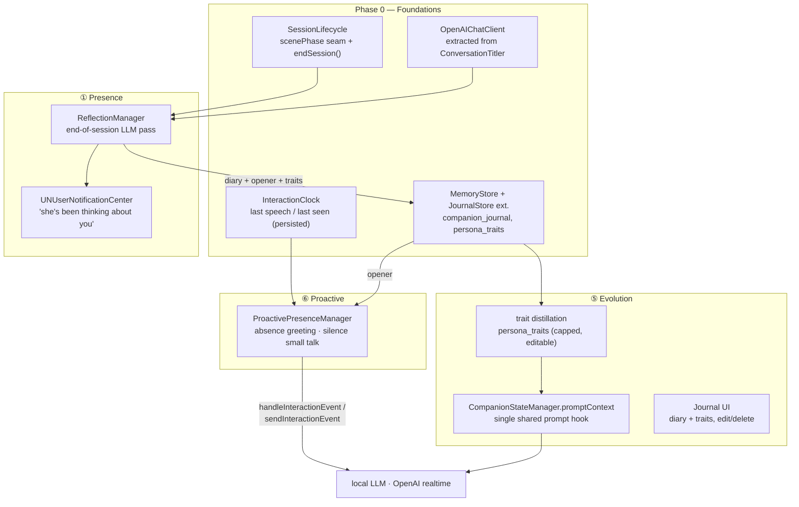

# Living Companion Plan

Competitive response to **Animates** (animation.inc, Aug 2026 — the studio behind Grok's
companions): real-time voice + animated presence + "keeps thinking about you between
sessions". NeuraLink already wins on privacy (fully local pipeline), character import
(VRM), camera vision, and song recognition. This plan closes the gaps, in the agreed
priority order:

> **P1** ① Between-session presence · ⑤ Personality evolution · ⑥ Time-based proactive
> engagement — then **P2** ④ Shared activities · **P3** ③ Speech-synced motion ·
> **P4** ② Cross-session context carry-over.

## Architecture at a glance



---

## Phase 0 — Foundations (prerequisite for everything above) ✅ DONE 2026-09-07

Exploration found these seams **do not exist yet** and are shared by ①⑤⑥:

### 0.1 Session lifecycle seam
`NeuraLinkApp.swift` is 37 lines with no scenePhase and no AppDelegate; the only
background observer in the app is the Metal pause in `VRMMetalState.swift:135`.
`ConversationStore` has **no "ended" concept** — rows are created lazily on the first
message and only `startNewChat()` exists.

- Add `@Environment(\.scenePhase)` handling in `NeuraLinkApp` (or a small
  `SessionLifecycleObserver` using `UIApplication.didEnterBackgroundNotification`, the
  existing house pattern).
- New `ConversationStore.endSession()` — called from scenePhase `.background`,
  `ContentView.startNewChatSession()`, and the character-switch path
  (`VRMSceneView.swift:196`). It snapshots `activeConversationID` and hands it to
  `ReflectionManager`.

### 0.2 InteractionClock
The only "last user spoke" timestamp is `ProactiveVisionManager.lastUserSpeechAt` —
private, in-memory, OpenAI-only. Add a tiny `Core/Utils/InteractionClock.swift`:
`lastUserSpeechAt` (fed from the two existing `notifyUserSpoke()` call sites:
`LocalLLMManager.swift:275`, `OpenAIRealtimeManager+Handlers.swift:49`) and
`lastSeenAt` persisted to UserDefaults on background. ⚠️ SQLite `messages.timestamp`
is UTC (`CURRENT_TIMESTAMP`) while `UserSettings.systemPromptContext` is local time —
compute "hours since last seen" from one clock only.

### 0.3 Schema
Per house pattern: add `CREATE TABLE IF NOT EXISTS` to the single `createTableQuery`
in `MemoryStore.swift:193`, CRUD in a **new** extension file
(`MemoryStore+Journal.swift` — existing extensions are near the 495-line lint limit).

```sql
companion_journal (id, character, conversation_id, created_at,
                   diary TEXT, opener TEXT, notification_line TEXT,
                   notified INTEGER DEFAULT 0, opener_used INTEGER DEFAULT 0)
persona_traits    (id, character, trait TEXT, weight REAL,
                   created_at, updated_at)
```

### 0.4 OpenAIChatClient
Four hand-rolled `chat/completions` clients already exist (`ConversationTitler:66`,
`VisionAnalyzer:19`, two TTS callers). Reflection would be the fifth — extract one
`Data/DataSources/OpenAI/OpenAIChatClient.swift` (endpoint, bearer auth, JSON parse)
and migrate `ConversationTitler` to it as proof.

**Effort: ~2 days.**

---

## Phase 1 — ① Between-session presence (the Animates headline) ✅ DONE 2026-09-07

**Behavior**: when a session ends, the companion "reflects": writes a 1–2-sentence
diary entry about the conversation, an opener for next time, and a notification line.
Hours later a local push arrives ("Dedicatus has been thinking about what you said…").
Next launch, the persona greets with the opener (delivered via Phase 3's manager).

### Design
- `Data/DataSources/ReflectionManager.swift`, modeled **directly on
  `ConversationTitler`** (the proven shape: `NSLock` in-flight dedupe,
  `Task.detached(.background)`, dual-engine routing):
  - OpenAI enabled + key → `OpenAIChatClient` (`gpt-4o-mini`, `max_tokens ~160`).
  - Else local → `LocalLLMManager.runSilentGeneration(prompt:maxTokens:)`
    (`+Compaction.swift:65` — no UI/TTS side effects, serialized behind the engine lock).
- Transcript source: `ConversationStore.messages(conversationID:)`, last ~16 turns.
- Output format: three labeled lines (`DIARY:` / `OPENER:` / `NOTIFY:`) — labeled-line
  parsing, not JSON; 1–2B local models can't be trusted with JSON. Parser is fully
  unit-testable.
- **Background budget**: wrap in `beginBackgroundTask` (pattern:
  `LocalModelDownloadManager.swift:382`). No `UIBackgroundModes` exist and we are NOT
  adding BGTaskScheduler in v1 — if the ~30 s window is missed or the model isn't
  loaded, mark the conversation `pending_reflection` and run **catch-up on next
  launch** before the greeting. Notification then schedules from launch instead.
- **Notifications** (greenfield — zero UserNotifications usage today):
  `Core/Utils/CompanionNotificationScheduler.swift`. Request authorization lazily the
  first time the toggle is enabled. Default delivery: 6 h after session end, clamped
  out of quiet hours (22:00–09:00 local); one pending notification max (replace, don't
  stack); cancel on next app open.
- **Guards**: ≥4 user turns in the conversation, one reflection per conversation,
  respects a master `isPresenceEnabled` toggle.
- 4 GB devices: reflection runs *after* `whisperManager.shutdown()` state (session is
  over), `maxTokens ≤160`, single call — jetsam-safe.

### Settings (Autonomy section, `AISettingsView.swift:156`)
`isPresenceEnabled` (default off → opt-in), `isPresenceNotificationsEnabled`.
⚠️ Use the `OpenAISettings` idiom — explicit `_backing` + `access`/`withMutation`,
**never `didSet`** (the `@Observable`+MainActor init-clobber bug, `OpenAISettings.swift:12-21`).

**Effort: ~4 days. Test plan**: parser round-trip, guard logic, journal CRUD, quiet-hour
clamping (all swift-testing, no device needed); device test for notification delivery.

---

## Phase 2 — ⑤ Personality evolution ✅ DONE 2026-09-08

**Behavior**: the companion visibly changes with the relationship — its prompt carries
distilled traits ("teases the user about coffee", "knows they work night shifts"), the
current relationship stage, and its latest diary thought. The user can read and edit
everything (trust + App Store safety).

### Design
- **Unify the two relationship systems first.** `CompanionStateStore` (UI meter,
  turns/40 curve) and `CompanionStateManager` (prompt, turns<5/<25 curve) disagree
  today and the score never reaches any prompt. Make `CompanionStateManager` read
  `CompanionStateStore.shared.score` and derive one label set from one curve.
- **Trait distillation**: a fourth labeled line in the reflection call (`TRAIT:`,
  optional) proposing at most one new/updated trait per session. Upsert into
  `persona_traits`: cap 5 per character, weight decay on unused traits, replace lowest
  weight when full. No separate LLM call — rides Phase 1's.
- **Prompt injection point**: `CompanionStateManager.promptContext(characterName:)` —
  already injected into **both** engines (`LocalLLMMemoryHierarchy.swift:261`,
  `OpenAIRealtimeManager+Handlers.swift:380`) and already returns `""` when empty.
  Extend its `[Companion State]` block with `Stage:`, up to 3 traits, and the latest
  diary line. ⚠️ Do **not** touch `LocalLLMPromptStore.effectivePrompt` — a user-saved
  prompt replaces the default wholesale (emotion tag included), so layering there
  would clobber user edits.
- **Token budget**: block capped at ~120 tokens; on `.llama1b` (minimal-prompt tier,
  `LocalLLMPromptStore.swift:82-97`) include stage + 2 traits only; skipped for JP
  (buildSystemContent's JP branch already omits companion state).
- **KV-cache note**: the block changes at most once per session (computed at
  session start, frozen after) so the warm prefix stays valid within a session.
- **Journal UI**: tapping `RelationshipMeterBarOverlay` opens a sheet
  (`Presentation/Views/AI/CompanionJournalView.swift`): diary timeline
  (newest first), traits list with swipe-to-delete, "Reset personality" button.

**Effort: ~4 days** (1 unification, 1 distillation+storage, 2 UI). **Tests**: trait
cap/decay/upsert, unified label curve, prompt-block budget, empty-state returns "".

---

## Phase 3 — ⑥ Time-based proactive engagement ✅ DONE 2026-09-08

**Behavior**: the companion speaks first. Returning after ≥6 h → greeted with the
Phase 1 opener ("I kept thinking about that book you mentioned…"). Going quiet ≥90 s
mid-session → one situational line (time of day, a known fact). Never spammy.

### Design
- `Data/DataSources/ProactivePresenceManager.swift`, copying
  `ProactiveVisionManager`'s loop + guard structure — but **engine-agnostic**
  (vision is OpenAI-only today; guards 6–7 are WebRTC-specific):
  - inject via `OpenAIRealtimeManager.sendInteractionEvent(_:)` when connected, else
    `LocalLLMManager.handleInteractionEvent(_:)` — both already exist, zero new plumbing.
- **Trigger A — absence greeting** (fires once, at session-ready): hours since
  `InteractionClock.lastSeenAt` ≥ threshold **and** an unused opener exists in
  `companion_journal` → event `*greet the user back: <opener>*`; mark `opener_used`.
  This is Phase 1's payoff and replaces a generic cold "hello".
- **Trigger B — silence small talk** (loop, 15 s tick): `status == .ready`,
  `now - lastUserSpeechAt ≥ silenceThreshold` (default 90 s), max 2 per session,
  exponential backoff (90 s → 5 min), dedupe via the `normalize()` pattern
  (`ProactiveVisionManager.swift:123`). Topic seed: time-of-day + one random
  `knowledge_graph` fact + relationship stage.
- **Trigger C — time-of-day flavor**: not a separate timer; a context line folded
  into A/B prompts ("it's late — maybe ask if they should sleep").
- Guards mirrored from vision: master toggle, foreground/PiP rule, protected-data,
  `status == .ready`, mic-gate awareness (skip while `SongRecognitionManager` listens).
- Settings: `isProactivePresenceEnabled`, silence-threshold DropDownSelector,
  absence-threshold DropDownSelector — same Autonomy section.

**Effort: ~3 days.** **Tests**: trigger threshold math, backoff, per-session caps,
opener consumption (mark-used exactly once).

---

## Phase 4 — ④ Shared activities

### 4a Co-listening (cheapest — rides the song-recognition work)
Continuous mode on `SongRecognitionManager`: after a match, instead of stopping,
re-arm recognition every ~90 s; on **track change** (normalize + dedupe on
title/artist) update the capsule, keep `startListeningDance()` running, inject one
short per-track persona comment (rate-limited). Auto-stop: 30 min, backgrounding,
route change, battery < 20%. Entry: long-press the Identify Song FAB or an
`identify_song` argument (`"mode": "session"`).

### 4b Mini-games
`Domain/Entities/Skills/PlayGameSkill.swift` (`play_game`, enum: `twenty_questions`,
`trivia`, `word_chain`) + a `GameSessionManager` state machine so rules live in code,
not in the model. ⚠️ The local reply cap is `maxTokens = 60`
(`LocalLLMManager.swift:310`) — parameterize per-turn maxTokens so game turns get ~120.
Adding a tool bumps `AppFunctionTests.testToolSchemas` count 11 → 12.

### 4c Co-watching commentary (stretch)
PiP + `VisionAnalyzer` on a cadence, reusing ProactiveVision's PiP guards. OpenAI-only
(needs gpt-4o vision). Defer until 4a/4b prove the "together" loop.

**Effort: 4a ~2 days, 4b ~3 days, 4c ~3 days (deferred).**

---

## Phase 5 — ③ Speech-synced gesture layer

**Behavior**: the avatar gestures *while speaking* — today motion is idle clips only.

- `Core/Engine/VRM/Animation/GestureOverlayController.swift`, modeled on the
  **look-back overlay** (`VRMMetalState+Actions.swift:144-175`): additive upper-body
  bone blend over the base animation with an attack/release envelope — never
  interrupts idle/dance/pose clips.
- Triggers: emotion-tag onset (`parseAndTriggerEmotion` seam), TTS chunk start
  (`speakChunk`), RMS peaks from `reportAmplitude` — throttled to ≤1 gesture / 4 s.
- Upper-body bone mask only (hips/legs untouched); VRM 0.x + 1.0 both, per RULES.md.
- **Content dependency**: 6–10 short (1–2 s) upper-body VRMA clips (nod, hand-tilt,
  emphasis, shrug, chuckle) — needs authoring, same pipeline as `dancing.vrma`.
- Long-term successor: ARDY generative motion (assessed 2026-08-29: server-side
  feasible; on-device ≥5 GB) — this layer is the bridge, not a throwaway.

**Effort: ~5 days engineering + animation authoring.**

---

## Phase 6 — ② Cross-session context carry-over

Cheap once Phase 1 exists: at session start, fetch the newest `companion_journal.diary`
(< 7 days old) and inject a `[Previously]` one-liner into
`LocalLLMMemoryHierarchy.buildSystemContent` and the OpenAI `finalInstructions`.
⚠️ Changes the KV-cache prefix — it's stable *within* a session (computed once at
start), but the persisted cross-launch KV cache (`LocalLLMManager+KVCache`) will miss
whenever the diary changed; that's the expected cost, warmup re-prefills.

**Effort: ~1 day.**

---

## Rollout & effort summary

| Order | Phase | Ships | Est. |
|---|---|---|---|
| 1 | P0 Foundations | lifecycle seam, clock, tables, HTTP client | 2 d |
| 2 | ① Presence | reflection, diary, notifications | 4 d |
| 3 | ⑤ Evolution | unified relationship, traits → prompt, journal UI | 4 d |
| 4 | ⑥ Proactive | absence greeting (uses ① opener), silence small talk | 3 d |
| 5 | ④a Co-listening | continuous song session + comments | 2 d |
| 6 | ④b Mini-games | play_game tool + state machine | 3 d |
| 7 | ③ Gestures | speech-synced overlay (+ VRMA authoring) | 5 d |
| 8 | ② Carry-over | [Previously] block | 1 d |
| — | ④c Co-watching | deferred stretch | (3 d) |

≈ 24 dev-days. Phases 2–4 form one coherent release ("your companion has a life");
5–8 can ship independently.

## Cross-cutting risks

- **Two fact stores** (`knowledge_graph` S/P/O vs `memories.source='fact'`): traits are
  a third text corpus — keep them in `persona_traits` only, never mirrored, or dedup
  becomes unsolvable.
- **Background reflection on 4 GB devices**: single small call, whisper already
  unloaded; if the engine is cold, defer to launch catch-up rather than loading a
  model in the background window.
- **Notification etiquette / App Store**: opt-in toggle, quiet hours, one pending max.
  Companion apps get review scrutiny — keep copy warm but not manipulative.
- **User trust**: everything the companion "remembers/becomes" is visible and
  deletable in the Journal UI. Reflection prompts must forbid inventing facts.
- **Timezone**: SQLite timestamps are UTC; absence math uses `InteractionClock` only.
- Every new settings property: `OpenAISettings` explicit-backing idiom, never `didSet`.
