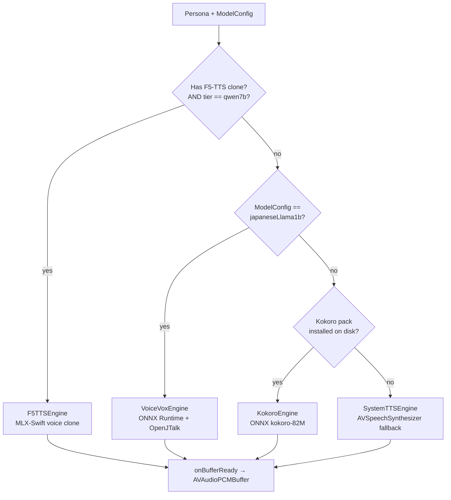
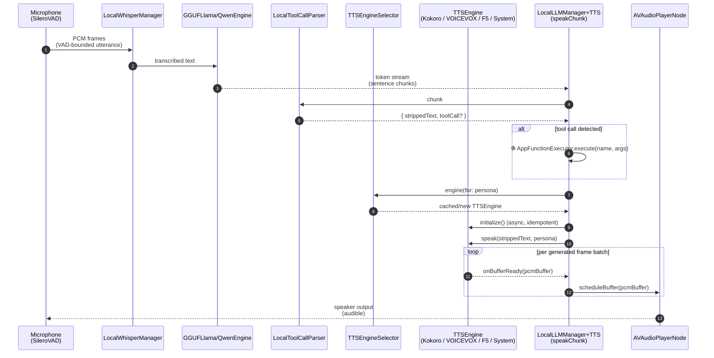
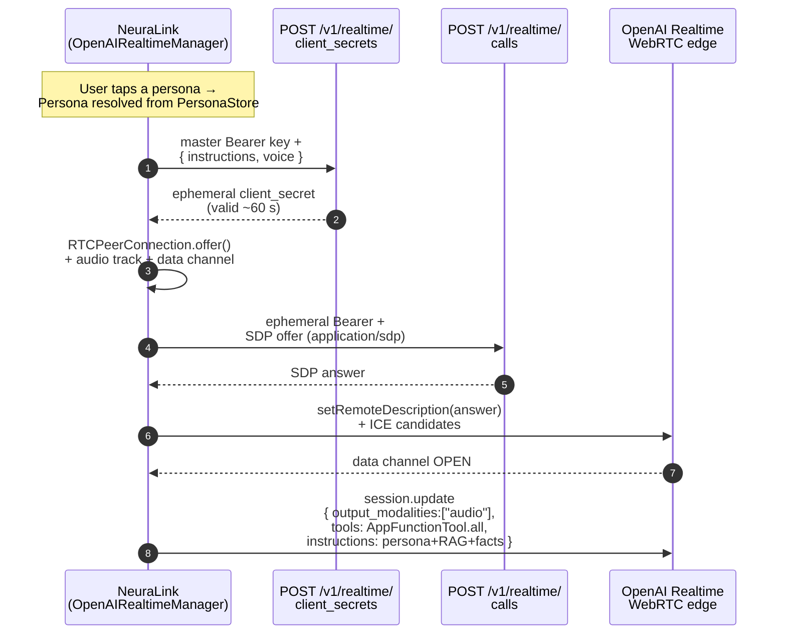
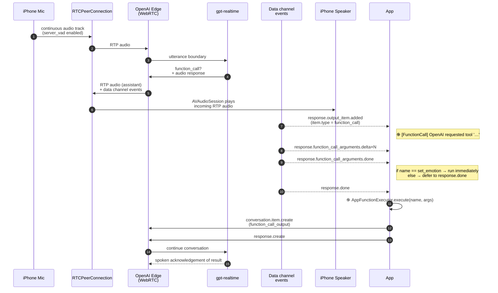

# Voice Architecture — Local SLMs vs. OpenAI Realtime

NeuraLink runs **two completely different audio stacks** depending on whether you've enabled the cloud realtime path or the on-device path in AI Settings. They share nothing at the network/codec level — the only common thread is the `AVAudioEngine` that ultimately drives the iPhone speaker.

This doc explains how each pipeline turns a model's output into spoken audio, and is intended to be read alongside the source files it cites.

## Quick comparison

| | **Local SLM path** | **OpenAI Realtime path** |
|---|---|---|
| **What runs on-device** | LLM inference, text emission, TTS synthesis | Microphone capture, audio playback, function-call dispatch |
| **What runs in the cloud** | nothing | LLM inference, audio synthesis, transcription |
| **Audio transport** | direct CPU → `AVAudioPCMBuffer` → `AVAudioPlayerNode` | WebRTC RTP audio track → `RTCAudioTrack` |
| **Tool calls** | regex-parsed `<tool>` blocks in the LLM's text output | structured `function_call` events on the WebRTC data channel |
| **Persona voice** | per-persona override in `PersonaVoiceStore` (VOICEVOX speaker, Kokoro preset) or `KokoroVoicePreset.builtInDefault` | one of OpenAI's named voices (alloy / shimmer / marin / etc.) set at session-mint time |
| **Latency profile** | bounded by on-device synthesis (~100–500 ms for first chunk) | bounded by network RTT (~150–400 ms) |

## Local SLM path

When `OpenAISettings.isLocalLLMEnabled = true`, the LLM runs on-device via [`LocalLLMManager`](../NeuraLink/Data/DataSources/LocalLLM/LocalLLMManager.swift). Generated text is split into sentence chunks and handed to a TTS engine resolved by [`TTSEngineSelector`](../NeuraLink/Data/DataSources/TTS/TTSEngineSelector.swift) based on the active persona and model tier.

### Engine selection rules



Each engine conforms to [`TTSEngineProtocol`](../NeuraLink/Domain/Interfaces/TTSEngineProtocol.swift), which is a push-streaming contract: the engine calls back into `onBufferReady` with each PCM buffer as it's synthesised, so the iPhone can start playing before the full sentence has finished synthesising. That callback is what keeps first-audio latency low even when the LLM is producing text faster than the TTS can synthesise it.

### End-to-end flow



Notes on the flow:

- **Chunking**: `LocalLLMManager+Engine.swift` accumulates tokens into sentence chunks. A chunk is flushed to `speakChunk` (in [`LocalLLMManager+TTS.swift`](../NeuraLink/Data/DataSources/LocalLLM/LocalLLMManager+TTS.swift)) on punctuation boundaries (`.`, `!`, `?`, `。`) or after `n_predict` tokens.
- **Tool stripping**: Before the chunk reaches TTS, [`LocalToolCallParser.strippedText`](../NeuraLink/Data/DataSources/LocalToolCallParser.swift) removes any `<tool name="…">{…}</tool>` block so the model's tool-call syntax never gets spoken aloud. If a tool block is present, `AppFunctionExecutor.execute` runs in parallel and the spoken response is the tool's result.
- **Persona voice resolution**: Each engine consults [`PersonaVoiceStore`](../NeuraLink/Data/DataSources/Memory/PersonaVoiceStore.swift) at synthesis time, so changing the picker in `PersonaSettingsView` and saving immediately changes the voice for the next chunk without requiring an app restart.
- **Buffer scheduling**: All four engines emit `AVAudioPCMBuffer`s in their native sample rates (Kokoro & F5-TTS at 24 kHz, VOICEVOX at 24 kHz, System at iOS-locale-dependent). [`scheduleBuffer`](../NeuraLink/Data/DataSources/LocalLLM/LocalLLMManager+TTS.swift) re-connects the player node with the right format on the fly when consecutive chunks have differing rates.

### Voice cache & invalidation

`TTSEngineSelector` caches one engine instance per persona. The cache is invalidated by `invalidateCache(for:)` whenever:

1. The user saves a new voice in `PersonaSettingsView` (so the next synthesis sees the updated `PersonaVoiceStore` entry).
2. The user clears the override via Reset.
3. The user switches the active LLM model (the F5-TTS qwen-7b path is no longer available if you downgrade to qwen-3b, etc.).

## OpenAI Realtime path

When `OpenAISettings.isEnabled = true` and a valid API key is set, audio is shipped to OpenAI's `gpt-realtime` model over a WebRTC peer connection. The on-device synthesizers above don't run at all — OpenAI both *speaks* the AI's reply and *transcribes* the user's microphone.

### Two-step handshake



Why two steps:

- The master API key never touches the SDP endpoint. `client_secrets` mints a short-lived (~1 minute) token that's used as Bearer auth for the SDP exchange. If the WebRTC handshake leaks or is intercepted, the attacker gets a token that's already expired by the time they replay it.
- The session's **voice** and **base instructions** are frozen at mint time. GA `gpt-realtime` rejects `audio.output.voice` updates once any assistant audio is in flight (`cannot_update_voice`), so they have to be seeded in the `client_secrets` body.
- The **tools array**, RAG-augmented context, and Knowledge-Graph facts are sent in the follow-up `session.update` over the data channel after it opens. That's where `AppFunctionTool.all` is injected so the model can call `set_emotion`, `remember_fact`, `analyze_camera`, etc.

### Per-turn audio flow



A few load-bearing details:

- **No PCM round-trip on the iPhone side**: incoming RTP is decoded by `RTCAudioTrack` and routed straight to the playback `AVAudioSession`. NeuraLink never sees the floats. This is the opposite of the local path, where the app owns the entire PCM pipeline.
- **`set_emotion` is synchronous**: the model emits `set_emotion` *before* speaking, so we trigger the avatar's expression on `response.function_call_arguments.done` instead of waiting for `response.done`. Every other tool defers until the response is complete, otherwise we'd interrupt the model mid-speech and confuse it.
- **Deferred UI actions**: tools like `play_music`, `open_app`, `search_web`, and `create_note` store an `() -> Void` in `AppFunctionExecutor.pendingUIAction` rather than firing immediately. The `schedulePendingUIAction` task in [`OpenAIRealtimeManager+Handlers.swift`](../NeuraLink/Data/DataSources/OpenAI/OpenAIRealtimeManager+Handlers.swift) waits for the AI to finish speaking the *result* before opening the app, so the spoken "Opening Music for you" doesn't get cut off when iOS backgrounds the app.
- **Tool-call observability**: every dispatch logs with the `֎` glyph (see "Logging" below).

## Where the two pipelines converge

Both pipelines feed into the same downstream subsystems:

- **`AppFunctionExecutor`** — single registry of `Skill` implementations. Whether a tool call arrives as `<tool name="…">{json}</tool>` from a local LLM or as a `function_call` event from OpenAI, dispatch goes through the same code path.
- **`ChatTimelineStore`** — every user message, AI reply, and tool call is persisted into the SQLite `chat_events` table, visible in the **Memory** sheet under "Timeline".
- **`KnowledgeGraphManager`** + **`RAGManager`** — structured facts (`remember_fact` tool) and unstructured memory chunks both end up in the SQLite store and are surfaced to the next session's prompt.

## Logging

Every function-call event across both paths logs with `֎` as the prefix glyph (Armenian hyphen, U+058E). This makes it trivial to filter the Xcode console for just the function-call traffic when debugging "the AI isn't using my tool":

```
֎ [FunctionCall] OpenAI requested tool 'remember_fact' (call_id=abc123) — streaming args…
֎ [FunctionCall] args complete for 'remember_fact' (call_id=abc123) — deferring to response.done
֎ [FunctionCall] dispatch name=remember_fact args={"subject":"User","predicate":"has_sister","object":"Manohy"}
֎ [FunctionCall] remember_fact storing → subject="User" predicate="has_sister" object="Manohy"
֎ [KnowledgeGraph] Inserted into knowledge_graph: User — has_sister — Manohy
֎ [FunctionCall] done name=remember_fact result="Got it! I'll always remember that User has_sister Manohy."
```

For the local LLM path the equivalent log starts at `֎ [FunctionCall] LocalLLM emitted <tool name="…">` instead of `OpenAI requested tool …`. If the AI never produces a function-call event, none of these lines fire — that's the signal that the model didn't choose to call the tool, and the fix is in the prompt (see `sendInitialSessionUpdate` for the explicit trigger instruction for OpenAI personas).

## Implementation pointers

- **Local TTS engines**: [`TTSEngineProtocol.swift`](../NeuraLink/Domain/Interfaces/TTSEngineProtocol.swift), [`KokoroEngine.swift`](../NeuraLink/Data/DataSources/TTS/Kokoro/KokoroEngine.swift), [`VoiceVoxEngine.swift`](../NeuraLink/Data/DataSources/TTS/VoiceVoxEngine.swift), [`F5TTSEngine.swift`](../NeuraLink/Data/DataSources/TTS/F5TTSEngine.swift), [`SystemTTSEngine.swift`](../NeuraLink/Data/DataSources/TTS/SystemTTSEngine.swift).
- **Engine selection & caching**: [`TTSEngineSelector.swift`](../NeuraLink/Data/DataSources/TTS/TTSEngineSelector.swift).
- **Voice picker + preview**: [`PersonaSettingsView.swift`](../NeuraLink/Presentation/Views/AI/PersonaSettingsView.swift).
- **OpenAI handshake**: [`OpenAIRealtimeManager.swift`](../NeuraLink/Data/DataSources/OpenAI/OpenAIRealtimeManager.swift) (mint + SDP exchange), [`OpenAIRealtimeManager+Handlers.swift`](../NeuraLink/Data/DataSources/OpenAI/OpenAIRealtimeManager+Handlers.swift) (`sendInitialSessionUpdate`, data-channel event dispatch).
- **Shared tool dispatch**: [`AppFunctionExecutor.swift`](../NeuraLink/Data/DataSources/AppFunctionExecutor.swift).
