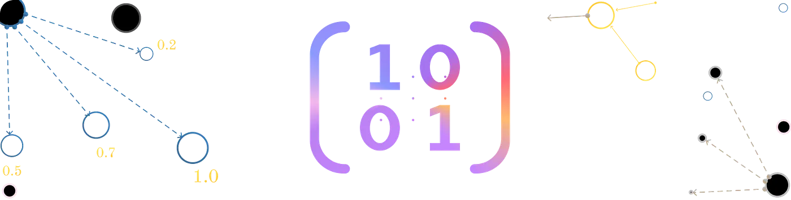
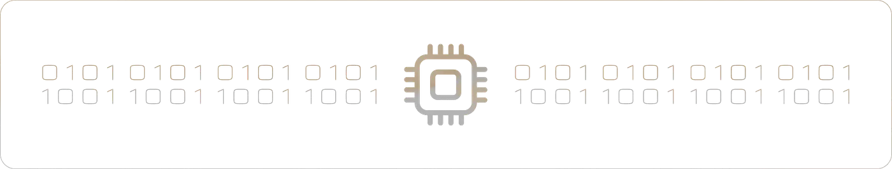
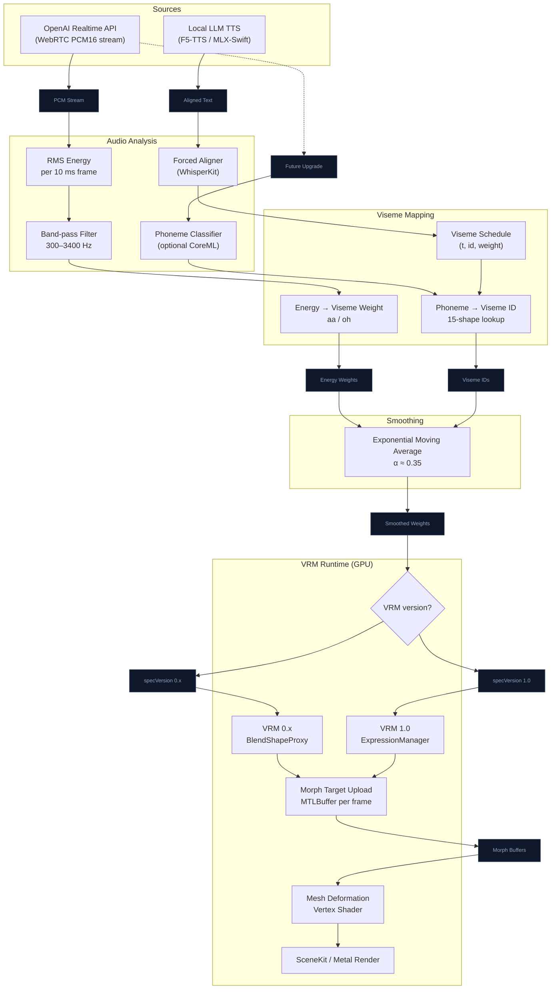

# Lip-Sync Matrices & Real-Time Processing

<p align="center">
    
</p>

In mathematics, a matrix is a rectangular array or table of numbers, symbols, or expressions, with elements or entries arranged in rows which is used to represent a mathematical object or property of such an object.

Imagine a digital painting as a grid, where each pixel is represented by a number corresponding to a specific color. Similarly, in natural language processing, words in a sentence can be converted into numbers and arranged in a matrix, where these numbers capture different aspects of the words, like their meaning or position.

In artificial intelligence, especially in deep learning, [*+ ] matrix multiplication and addition are crucial for working with data.

Neural networks use matrices of numbers to make predictions and recognize patterns. Each layer in the network processes a matrix and transforms it into a new matrix through multiplication, which helps the network understand complex data relationships.

<p align="center">
    
</p>


## 1. VRM Viseme System

VRM models use **blend shape morph targets** to deform the mesh for lip movement.  
The API changed significantly between VRM 0.x and VRM 1.0 — both are supported by NeuraLink.

---

### 1.1 VRM 0.x — BlendShapeProxy

VRM 0.x (`.vrm` files with `"specVersion": "0.0"`) exposes mouth shapes through **BlendShapeProxy**.  
Preset names use uppercase single letters matching the Japanese phoneme tradition.

| BlendShapeGroup | Phoneme(s)      | Mouth Description           | Key in `BlendShapeKey` |
|-----------------|-----------------|-----------------------------|------------------------|
| `A`             | "ah", "father"  | Jaw dropped, wide open      | `.a`                   |
| `I`             | "ih", "ee"      | Narrow, lips apart          | `.i`                   |
| `U`             | "oo", "blue"    | Tight rounded pucker        | `.u`                   |
| `E`             | "eh", "bed"     | Mid-open, slight smile      | `.e`                   |
| `O`             | "oh", "go"      | Rounded, mid-open           | `.o`                   |

Only the 5 Japanese vowel shapes (`A I U E O`) are part of the VRM 0.x spec.  
Consonant visemes require extra custom BlendShapeGroups added to the model.

**VRM 0.x API:**
```swift
// Set mouth weights via BlendShapeProxy
let proxy = vrm0.blendShapeProxy
proxy?.setValues([
    BlendShapeBinding(blendShape: .preset(.a), weight: 0.8),
    BlendShapeBinding(blendShape: .preset(.o), weight: 0.2),
])
proxy?.apply()   // flushes all pending values to the morph targets
```

> `apply()` must be called **once per frame**, after all `setValues` calls for that tick.

---

### 1.2 VRM 1.0 — ExpressionManager

VRM 1.0 (`"specVersion": "1.0"`) replaces BlendShapeProxy with **ExpressionManager**.  
Preset names are lowercase and follow the ARKit/Oculus naming convention.

| Expression key | Phoneme(s)      | Mouth Description           |
|----------------|-----------------|-----------------------------|
| `aa`           | "ah", "father"  | Jaw dropped, wide open      |
| `ih`           | "ih", "bit"     | Narrow, lips slightly apart |
| `ou`           | "oo", "blue"    | Tight rounded pucker        |
| `ee`           | "eh", "bed"     | Mid-open, slight smile      |
| `oh`           | "oh", "go"      | Rounded, mid-open           |

**VRM 1.0 API:**
```swift
let mgr = vrm1.expressionManager
mgr?.setWeight(for: "aa", weight: 0.72)
mgr?.setWeight(for: "oh", weight: 0.18)
mgr?.update(deltaTime: dt)  // single flush per frame
```

---

### 1.3 Unified Viseme Set (cross-version)

NeuraLink maps audio analysis to a shared 15-shape viseme set, then translates to the correct API at runtime:

| Viseme ID | Phoneme(s)        | Mouth Description          | VRM 0.x key | VRM 1.0 key |
|-----------|-------------------|----------------------------|-------------|-------------|
| `sil`     | silence / pause   | Lips closed, at rest       | all → 0     | all → 0     |
| `aa`      | "ah", "father"    | Jaw dropped, wide open     | `A`         | `aa`        |
| `E`       | "eh", "bed"       | Mid-open, slight smile     | `E`         | `ee`        |
| `I`       | "ih", "bit"       | Narrow, lips slightly apart| `I`         | `ih`        |
| `O`       | "oh", "go"        | Rounded, mid-open          | `O`         | `oh`        |
| `U`       | "oo", "blue"      | Tight rounded pucker       | `U`         | `ou`        |
| `PP`      | p, b, m           | Lips pressed together      | custom      | custom      |
| `FF`      | f, v              | Upper teeth on lower lip   | custom      | custom      |
| `TH`      | th                | Tongue tip between teeth   | custom      | custom      |
| `DD`      | d, t, n           | Tongue tip behind teeth    | custom      | custom      |
| `kk`      | k, g, ng          | Back of tongue to palate   | custom      | custom      |
| `CH`      | ch, sh, j         | Lips forward, wide tight   | custom      | custom      |
| `SS`      | s, z              | Teeth close, narrow slit   | custom      | custom      |
| `nn`      | n, ng (nasal)     | Soft nasal closure         | custom      | custom      |
| `RR`      | r                 | Rounded, slight lip curl   | custom      | custom      |

> **VRM 0.x and 1.0** both only guarantee the 5 vowel shapes in their spec presets.  
> Consonant visemes require custom blend shapes added to the model's mesh in Blender.

---

### 1.2 Blend Shape Weight Matrix

Each viseme is a **weight vector** over all morph target vertices.  
At runtime we maintain a `[String: Float]` dictionary of active weights (0–1), then upload the combined morph to the GPU each frame.

```
visemeWeights: {
  "aa": 0.0,   // jaw open
  "ee": 0.0,   // wide smile
  "ih": 0.0,   // narrow
  "oh": 0.0,   // rounded
  "ou": 0.0,   // puckered
}
```

Weights are **mutually blended** — multiple can be non-zero (e.g., a diphthong "ai" blends `aa` + `I`).  
A short **exponential smoothing** pass (`alpha ≈ 0.35`) prevents snapping between frames.

The `visemeWeights` dict uses the unified keys from section 1.3 and is translated to the correct API per model version at apply-time.

---

## 2. Real-Time Lip-Sync Sources

### 2.1 OpenAI Realtime API (WebRTC Audio)

The Realtime API streams **PCM16 audio** over the WebRTC data channel.  
We do not receive phoneme timestamps from OpenAI — so we drive lip-sync from **audio energy analysis**.

**Pipeline:**

1. **Capture** — `RTCAudioSource` delivers 10 ms PCM16 frames.
2. **RMS energy** — Compute root-mean-square amplitude of each frame.
3. **Band-pass** — A simple 300–3400 Hz filter emphasizes speech frequencies.
4. **Viseme mapping** — Energy → jaw-open weight (`aa`/`oh`) with thresholding.
5. **Smoothing** — Exponential moving average damps rapid changes.
6. **Apply** — `VRMExpressionManager.setWeight(for:, weight:)` each render tick.

> For higher fidelity, a future upgrade could run **on-device phoneme classification** (e.g., a small CoreML mel-spectrogram model) to produce full 15-viseme output.

---

### 2.2 Local LLM TTS (MLX-Swift / F5-TTS)

Local TTS generates a full audio buffer before playback.  
This gives us **word timestamps** that can be aligned to phonemes.

**Pipeline:**

1. **Generate** — TTS produces PCM audio + optional word/phoneme alignment.
2. **Forced alignment** (optional) — `WhisperKit` or `Piper` forced-aligner maps words → phonemes → timestamps.
3. **Viseme schedule** — Build a timeline of `(timestamp, visemeID, weight)` events.
4. **Playback** — `AVAudioPlayer` plays audio; a `DisplayLink` timer advances the viseme schedule in sync.
5. **Apply** — Same `VRMExpressionManager` path as OpenAI.

---

## 3. Processing Pipeline — Mermaid Graph



---

## 4. Smoothing & Timing Parameters

| Parameter         | Value     | Description                                  |
|-------------------|-----------|----------------------------------------------|
| Frame size        | 10 ms     | PCM16 frame from WebRTC / AVAudioEngine      |
| EMA alpha (open)  | 0.35      | Smoothing speed for jaw opening              |
| EMA alpha (close) | 0.20      | Smoothing speed for jaw closing (softer)     |
| Silence threshold | 0.012 RMS | Below this → drive weight toward 0           |
| Max jaw weight    | 0.85      | Prevents unnatural full-open at loud volumes |
| Crossfade         | 2 frames  | Blend between consecutive viseme weights     |

---

## 5. Version-Specific Expression API

### VRM 0.x — BlendShapeProxy

```swift
// Called every render tick
let proxy = vrm0.blendShapeProxy
proxy?.setValues([
    BlendShapeBinding(blendShape: .preset(.a), weight: 0.72),
    BlendShapeBinding(blendShape: .preset(.o), weight: 0.18),
])
proxy?.apply()  // single flush per frame — must not be called more than once
```

### VRM 1.0 — ExpressionManager

```swift
// Called every render tick
let mgr = vrm1.expressionManager
mgr?.setWeight(for: "aa", weight: 0.72)
mgr?.setWeight(for: "oh", weight: 0.18)
mgr?.update(deltaTime: dt)  // single flush per frame — must not be called more than once
```

Both APIs follow the same rule: accumulate all weight changes first, then flush **once** per frame.  
Calling `apply()` / `update()` multiple times in one tick will overdrive the morph targets.
