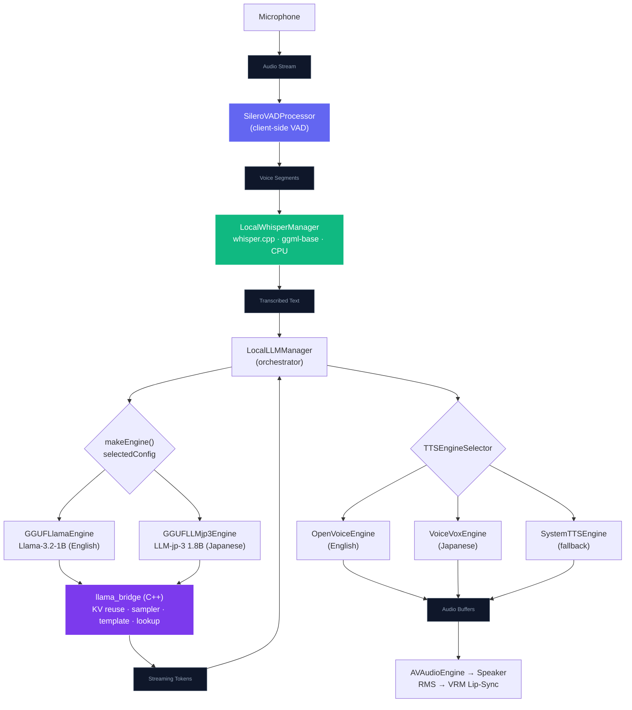

# On-Device LLM (Local SLM) Architecture

NeuraLink runs a fully **offline** AI loop on the device as an alternative to the
OpenAI Realtime (cloud) path. This document covers the local Small Language Model
(SLM) stack: which models ship, where they actually run, and the inference
pipeline from microphone to spoken reply.

> **Where it runs — no ANE.** Despite earlier plans, the on-device LLM does **not**
> use the Apple Neural Engine. It runs through **llama.cpp**: on the **Metal GPU**
> for devices with ≥ 5 GB RAM, and **CPU-only** on the 4 GB tier (iPhone 11/12/13),
> where `LLMRuntimeProfile` forces `gpuLayers = 0` to stay clear of the jetsam
> budget. Speech-to-text (whisper.cpp) always runs on the **CPU**.

## Why llama.cpp (and not CoreML / ANE)

The original local pipeline used a CoreML build of Llama-3.2-1B. It hit an
**unfixable hardware constraint on the H12 ANE** (iPhone 11/12/13): the model's
GQA head-dim layout (8 heads × fp16 = 16 B) violates the ANE's mandatory 64-byte
channel alignment. The consequences were fatal:

- ANE blocked → CPU-only → ~11,500 ms/token (unusable).
- `cpuAndGPU` doubled DRAM → instant jetsam on 4 GB devices.
- The CoreML state allocator crashed when the ANE fell back to a null engine.

**llama.cpp** bypasses CoreML entirely, drives Metal directly (or runs on CPU),
ships single-file GGUF weights, and has no ANE dependency — so one backend serves
every tier.

## Shipped models

Two models ship today — one English, one Japanese. Both are sized to stay
**memory-resident** on a 4 GB device (see "Memory residency" below).

| Model | Params | Quant | Size | Language | TTS engine |
| :--- | :--- | :--- | :--- | :--- | :--- |
| **Llama-3.2-1B** | 1.2 B | Q4_K_M | ~0.81 GB | English (default) | OpenVoice |
| **LLM-jp-3 1.8B instruct** | 1.8 B | Q3_K_M | ~0.96 GB | Japanese | VOICEVOX |

`LocalModelDownloadManager.defaultConfigForCurrentDevice()` defaults **every**
device to Llama-3.2-1B; the Japanese model is opt-in via Settings. Models are
downloaded on-demand from the shared Hugging Face dataset (`LocalModelDownloadManager`
→ `GGUF…Downloader` → `GGUF…ModelAccess`), and the **matching voice pack is bundled
into the same download** (VOICEVOX dict + speaker for Japanese, OpenVoice
MeloTTS + converter for English) so the user never fetches voices separately.

## Pipeline

1. **Voice detection** — `SileroVADProcessor` bounds the utterance client-side.
2. **Speech-to-text** — `LocalWhisperManager` runs the multilingual `ggml-base`
   model via whisper.cpp on the **CPU** (`use_gpu = false`; the A13 Metal whisper
   encoder is broken and CPU keeps STT off the GPU shared with the avatar/LLM).
3. **Inference** — `LocalLLMManager.makeEngine()` picks the engine for the selected
   model. All engines share the `llama_bridge` C++ layer.
4. **Text-to-speech & lip-sync** — tokens are chunked into sentences and routed by
   `TTSEngineSelector` (English → OpenVoice, Japanese → VOICEVOX, else System TTS);
   PCM buffers feed `AVAudioEngine` and drive VRM lip-sync via RMS amplitude.

## llama_bridge (shared C++ layer)

Both engines call into `NeuraLink/Core/Bridge/llama_bridge.{h,cpp}`:

- **KV-cache prefix reuse** — the system prompt + persona prefix aren't re-prefilled
  every turn; only the new suffix is decoded, cutting multi-turn first-token latency.
- **Tuned sampler chain** (top-k 40, top-p 0.9, temp 0.7, repetition penalty)
  instead of greedy argmax, which avoids the loop/repetition pathologies of small
  models.
- **`llama_chat_apply_template`** — prompts are formatted with the chat template
  baked into each model's GGUF metadata, so the app never drifts from the format the
  model was trained on. (`LocalLLMManager` hand-rolls a Llama-3 fallback only if a
  model has no embedded template.)
- **Prompt-lookup decoding (PLD)** — a lightweight speculative pass, tuned per model
  (the Japanese model uses a smaller n-gram window since JP subwords repeat less).

## Memory residency (the 4 GB constraint)

On the 4 GB tier the LLM is CPU-only and **memory-bandwidth bound**, so the
single biggest factor is whether the model's weights stay **resident in RAM**:

- llama.cpp `mmap`s the GGUF. If the model is too large to stay resident alongside
  the avatar, environment, and TTS engines, iOS evicts its clean pages and re-reads
  them from flash on **every forward pass** — which collapses decode to ~0.15 tok/s.
- A model that **fits** stays resident and decodes at RAM bandwidth (multiple tok/s
  on the A13 CPU). That's why both shipped models are quantized to ≲ 1 GB.
- `mmap` is kept on (a `use_mmap = false` "force-resident" experiment jetsam-crashed
  on 4 GB and was reverted — see `llama_bridge.cpp`). With a model that fits, plain
  mmap keeps it resident **and** degrades gracefully (briefly streams) under pressure
  instead of crashing.

Per-model runtime parameters (context length, threads, `gpuLayers`, KV quant, flash
attention, PLD window) live in one place: `LLMRuntimeProfile.resolve(for:)`.

## Cold-start latency

First-token latency is minimized in `LocalLLMManager.startListening()`:

- **`tryRestoreKVCache()`** — a previous session's prefilled persona prefix is
  restored from disk, so the first turn reuses it (~instant first token from the 2nd
  launch onward).
- **`warmupPrefill()`** — on a first-ever launch the persona prefix is prefilled in
  the background at launch (it overlaps Whisper setup), so it's warm before the user
  finishes speaking their first turn.

KV-cache blobs are AES-256-GCM encrypted on disk and namespaced per model (so a model
swap never restores an incompatible blob). See `LocalLLMKVCache`.

## Key source files

- **Orchestrator** — `Data/DataSources/LocalLLM/LocalLLMManager.swift` (+ extensions)
- **Engines** — `Data/DataSources/GGUF/Llama/GGUFLlamaEngine.swift`,
  `Data/DataSources/GGUF/LLMjp3/GGUFLLMjp3Engine.swift`
- **C++ bridge** — `Core/Bridge/llama_bridge.{h,cpp}` (over the prebuilt
  `llama.xcframework`)
- **Runtime profile** — `Data/DataSources/LocalLLM/LLMRuntimeProfile.swift`
- **STT** — `Data/DataSources/LocalWhisperManager.swift` (whisper.cpp)
- **Download + voice bundling** — `Data/DataSources/LocalModelDownloadManager.swift`
- **TTS routing** — see [LLM_VOICE.md](./LLM_VOICE.md)
