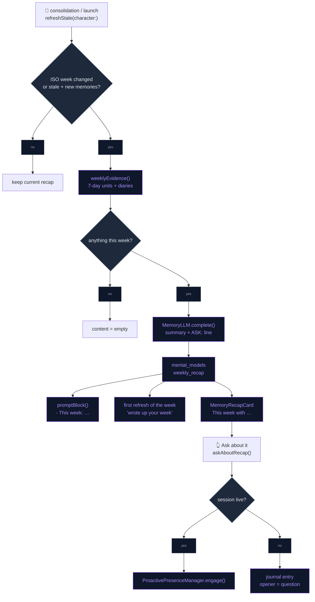
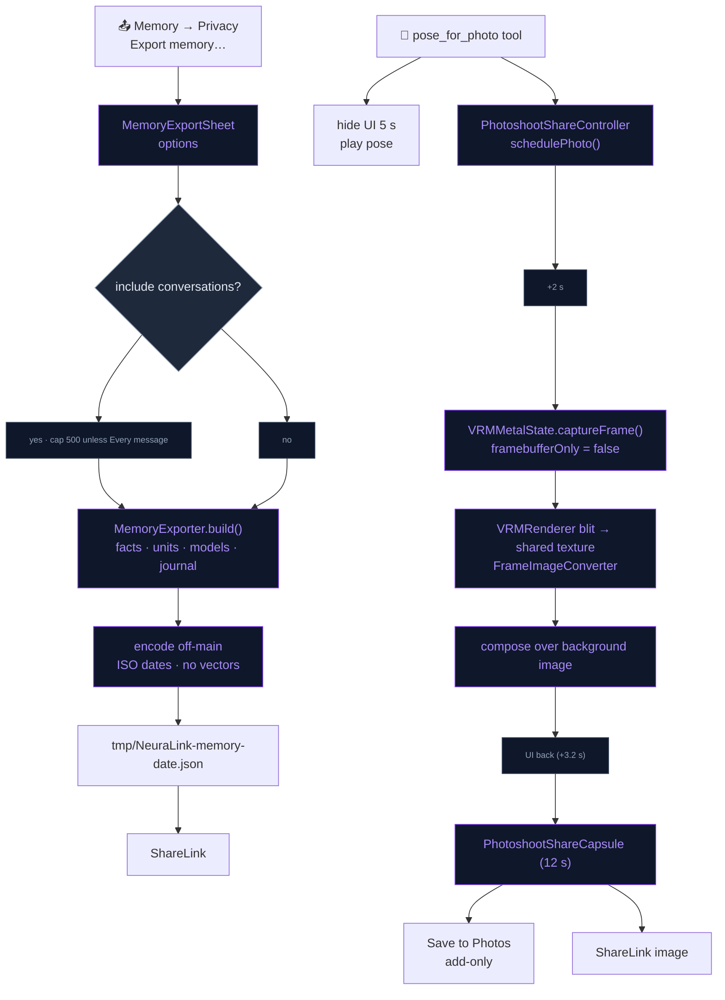
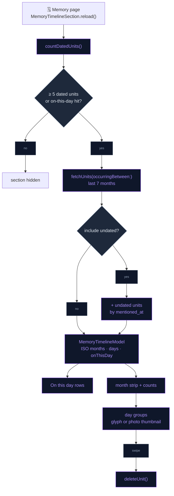

# Memory Ownership

The agentic memory layer ([AGENTIC_MEMORY.md](AGENTIC_MEMORY.md)) shows up
for the user as three things beyond a list of facts:

- a **weekly recap** card the companion writes about the last seven days,
- a **timeline** of dated memories,
- **ownership**: memory exports as one JSON file, and transcripts and
  photoshoot pictures go to the share sheet.

Nothing leaves the device unless the user exports or shares it.

## Weekly recap

A third standing mental-model question, slug `weekly_recap`, exists per
character next to the user profile and the relationship
(`MemoryMentalModels.ensureDefaults`). It asks for two or three short
sentences on the past seven days. A final line `ASK: <question>` carries one
thing worth asking next time. `recapParts` splits the answer into summary and
ask.

- **Evidence** (`weeklyEvidence`): units with an occurred date or mention in
  the last 7 days (`fetchUnits(occurringBetween:…, includeUndated: true)`,
  `raw` excluded, capped at 16). Observations are preferred over the facts
  they already cover. Up to 5 diary entries from the week are added. An empty
  week clears the recap instead of calling the LLM.
- **Refresh**: `refreshStale` treats the recap as due when the **ISO week
  changed** since `lastRefreshed` (`weekKey`, e.g. `2026-W39`). It is also due
  under the usual rule: stale, with memories newer than `lastMemoryID`. It
  runs with the other mental models, after consolidation and at launch. It
  needs an LLM tier other than `.none`.
- **Notification**: on the first refresh of a new week that changes the
  content, with Presence → Notifications on, the user gets "<Name> wrote up
  your week" through `CompanionNotificationScheduler.schedule`.
- **Card** (`MemoryRecapCard`): "This week with <character>" sits above the
  hero card on the Memory page. It shows the summary, an **Ask about it**
  button when an `ASK:` line exists, and a close button that dismisses it for
  the current ISO week (`UserDefaults`).
- **Ask about it** (`askAboutRecap`): during a live session
  (`ready/listening/thinking/speaking`), the question goes in through
  `ProactivePresenceManager.engage`. Otherwise it is saved as a journal entry
  whose `opener` is the question, so the next session's greeting uses it.
- **Prompt**: `promptBlock` adds the summary as `- This week: …` (≤ 240
  chars), and the reflect ladder labels it "This week". The companion can
  therefore refer to it in conversation. The Insights list leaves the recap
  out, because the card shows it.

## Export and share

**Memory export**: Memory → Privacy → **"Export memory…"** (disabled when
Memory is off) opens `MemoryExportSheet`:

| Option | Effect |
|---|---|
| Include conversations (default on) | Adds every chat with its messages |
| Every message (default off) | Off keeps only the last 500 messages per chat |

**Prepare export** builds the file, and a `ShareLink` hands it over.
`MemoryExporter` gathers the data on the main actor and encodes it off-main
as pretty-printed, key-sorted JSON with ISO-8601 dates, written to
`tmp/NeuraLink-memory-YYYY-MM-DD.json`. Changing an option discards the
prepared file. The `MemoryExport` payload (`formatVersion` 1) contains:

- `exportedAt`, `appVersion`, `characters`
- `facts`: knowledge-graph triplets
- `memories` / `observations`: units with type, bank, dates, entities,
  source, proof count and source ids. **No vectors.**
- `mentalModels` for the active character
- `journal`: up to 200 entries per character
- `conversations`: optional, see the options above

**Transcript share**: the read-only transcript screen
(`ConversationTranscriptView`) has a toolbar **Share** button. It shares
plain text: the title, then `[date] You: …` / `[date] <Character>: …`, with
tool rows left out (`transcriptText`).

**Photoshoot share**: `pose_for_photo` (`PhotoshootSkill`) strikes the pose
and hides the UI for 5 s, as before. It now also calls
`PhotoshootShareController.schedulePhoto()`, and the following happens:

1. **2 s** into the pose, the controller posts `.photoshootCaptureRequested`.
   The scene owner answers it with `VRMMetalState.captureFrame`.
2. `captureFrame` sets `framebufferOnly = false` for that one frame.
   `VRMRenderer.requestFrameCapture` blits the drawable into a shared-storage
   texture, and `FrameImageConverter` turns the BGRA bytes into a `UIImage`.
3. The transparent scene is composited over the current background image
   (scaled to fill).
4. About 3 s later, once the UI is back, `PhotoshootShareCapsule` ("Nice
   shot!") appears for 12 s. It offers **Save to Photos**
   (`PHPhotoLibrary`, add-only authorization), **Share** (`ShareLink`) and
   dismiss.

## Timeline

The Memory page has a **"When"** section (`MemoryTimelineSection`). It stays
hidden until at least **5** units have an occurred date, or until an "on this
day" hit exists.

- **On this day**: up to three units whose `occurredStart` falls on today's
  month and day in an earlier year. Each is prefixed "On this day, <year>:".
- **Timeline** (collapsed `DisclosureGroup`): a strip of the last **7 months**
  with a count per month. Tapping a month lists its units grouped by day,
  newest first. Each row has a fact-type glyph (seal = fact, sparkles =
  insight, bubble = moment), or the photo thumbnail for photo memories.
  Swiping a row forgets that memory.
- **Include undated memories** toggle (default off): also shows units with no
  occurred date, placed by `mentioned_at`.
- **Query**: `MemoryStore.fetchUnits(occurringBetween:and:includeUndated:)`
  returns `world`/`experience`/`observation` units whose occurred span
  overlaps the range, plus undated units mentioned in the range when asked.
  `countDatedUnits` drives visibility. The pure `MemoryTimelineModel` buckets
  months and days on the ISO calendar, and places each unit by
  `occurredStart ?? mentionedAt`.

## Flow

### Weekly recap

### Export and photoshoot share

### Timeline

## Files

| File | Role |
|---|---|
| `Data/DataSources/Memory/Agentic/MemoryMentalModels+WeeklyRecap.swift` | `weekly_recap` question, `recapParts`, `weekKey`, `isRecapDue`, `weeklyEvidence`, `askAboutRecap` |
| `Data/DataSources/Memory/Agentic/MemoryMentalModels.swift` | Seeds the recap, runs the due check, sends the weekly notification, adds the "This week" prompt line |
| `Data/DataSources/Memory/Agentic/MemoryReflect.swift` | "This week" label in the reflect ladder |
| `Presentation/Views/AI/MemoryRecapCard.swift` | Card + per-week `Dismissal` |
| `Presentation/Views/AI/MemoryTimelineView.swift` | Memory page: hosts the recap card, the timeline section and "Export memory…" |
| `Data/DataSources/Memory/Agentic/MemoryExporter.swift` | `MemoryExport` Codable payload + `MemoryExporter` (build, encode, temp file) |
| `Presentation/Views/AI/MemoryExportSheet.swift` | Options, prepare, `ShareLink` |
| `Presentation/Views/AI/ConversationTranscriptView.swift` | Transcript Share button, `transcriptText` |
| `Domain/Entities/Skills/PhotoshootSkill.swift` | `pose_for_photo`: pose, hide UI, schedule the photo |
| `Data/DataSources/PhotoshootShareController.swift` | Capture timing, capsule lifetime, Save to Photos |
| `Presentation/Views/AI/PhotoshootShareCapsule.swift` | "Nice shot!" capsule (save / share / dismiss) |
| `Core/Engine/VRM/UI/VRMMetalState+Capture.swift` | `captureFrame`, background composite |
| `Core/Engine/VRM/Rendering/VRMRenderer+Capture.swift` | One-shot drawable blit + `FrameImageConverter` |
| `Data/DataSources/Memory/Agentic/MemoryStore+Timeline.swift` | Date-range query, `countDatedUnits`, pure `MemoryTimelineModel` |
| `Presentation/Views/AI/MemoryTimelineSection.swift` | "When" section: on this day, month strip, day list, forget |
| `../NeuraLinkTests/MemoryOwnershipTests.swift` | Export round-trip / no vectors / conversations toggle, recap parsing + weeks, timeline buckets, range query, BGRA capture conversion |

## Integration notes

- **Info.plist**: `NSPhotoLibraryAddUsageDescription` covers Save to Photos.
  The app asks for add-only authorization only.
- **Banks**: the export includes every bank and labels each unit with its
  `bank`. Mental models are exported for the active character.
- **Offline tier**: the recap needs an LLM (`refreshStale` returns at tier
  `.none`, so no card appears). Export and the timeline need no LLM.
- **Timeline and follow-ups share the query**:
  `fetchUnits(occurringBetween:…)` also feeds the follow-up planner
  ([COMPANION_DEPTH.md](COMPANION_DEPTH.md)) and the recap evidence.
- **Capture is opt-in per frame**: the drawable is readable only for the
  captured frame. `framebufferOnly` returns to `true` straight after.

## Known device-test items

- Photoshoot capture: Metal readback cannot be tested on CI. On device,
  confirm the picture matches the pose, includes the background, and lands
  in Photos.
- After a real week of use, check that the recap reads naturally and that
  its `ASK:` question matches something that actually happened.
- Export with conversations on a long history: confirm the spinner and the
  file size stay reasonable, and that the JSON opens in Files.
