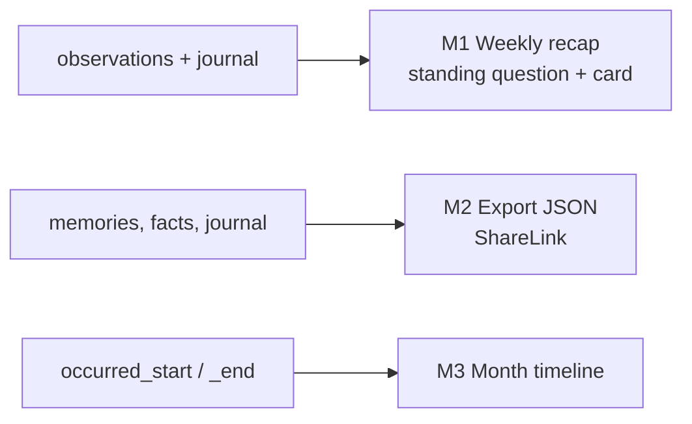

# Making Memory Something the User Can See and Own — Plan

Goal: the agentic memory layer (docs/AGENTIC_MEMORY.md) now stores dated,
entity-linked facts, consolidated observations and per-character mental
models — but the user only meets it as a list in the Memory page. This plan
gives memory three visible payoffs and one guarantee of ownership.

| # | Item | Effort | Value |
|---|---|---|---|
| M1 | Weekly recap card | M | High |
| M2 | Memory export (and share sheet for transcripts / photos) | S | High |
| M3 | Dated facts on a timeline | M | Med |

Order: **M2 → M1 → M3**. M2 is small and builds trust; M1 reuses the
mental-model refresh path; M3 is UI over data that already exists.

Seams cited as file:line on 2026-09-26. Follow [SKILL.md](../SKILL.md).

---

## M1. Weekly recap card — `M`

**Problem.** Consolidation produces observations and mental models in the
background; the user never sees "what changed" and has no reason to open
the Memory page.

**Seams.** Standing questions and delta refresh:
`MemoryMentalModels` (`ensureDefaults`, `refreshStale`, `refresh`,
`Agentic/MemoryMentalModels.swift`), `mental_models` table
(`MemoryStore+MentalModels.swift`); journal entries
(`MemoryStore.journalEntries(character:limit:)`,
`MemoryStore+Journal.swift:108`); dated units
(`MemoryStore.fetchUnits(factTypes:banks:)` with `occurredStart`);
the hero card (`MemoryHeroCard`, `MemoryInsightsSection.swift`); the
session-end hook `SessionLifecycle.sessionDidEnd`.

**Design.**
1. **A third standing question** per character, slug `weekly_recap`:
   "Summarise the past 7 days with the user: what you talked about, what
   changed in their life, one thing worth asking about next time. Three
   short sentences." Evidence for it is built by a dedicated evidence
   function (not the generic recall): observations changed in the window
   (`mentioned_at ≥ now − 7 d`), world/experience facts with
   `occurred_start` in the window, and the week's journal diaries. Budget
   900 tokens as the other models.
2. **Refresh cadence.** Delta mode like the others, plus a weekly anchor:
   `MemoryMentalModels.refreshStale` marks `weekly_recap` stale when the
   ISO week changed since `last_refreshed` (so a quiet week still produces
   "we didn't talk much this week"). Runs after consolidation and at launch
   catch-up (`ReflectionManager.catchUpAfterLaunch` pattern).
3. **Card.** In the Memory page above the hero card: "This week with
   Sonya", three sentences, a "Ask about it" button that starts a session
   with the recap's follow-up question injected as the opener (reuse the
   opener path: write it into `companion_journal.opener` of a synthetic
   entry, or simpler, a `pendingOpener` on `ProactivePresenceManager`).
   Dismissable per week (`UserDefaults` week key).
4. **Notification (optional, behind Presence → Notifications):** Sunday
   evening local time, "Sonya wrote up your week" using
   `CompanionNotificationScheduler.schedule(characterName:body:)`
   (`CompanionNotificationScheduler.swift:84`). Only when the recap changed.
5. **Prompt integration.** The recap joins `promptBlock` as "This week"
   (compact, ≤ 240 chars) so the companion can reference it in conversation.

**Tasks.** Slug + question + evidence function → weekly staleness rule →
card view + dismiss state → "Ask about it" opener → notification →
prompt block → tests → docs (`AGENTIC_MEMORY.md` §Mental models).

**Verification.** Unit: evidence function windowing (facts dated inside /
outside the week, journal entries), staleness on ISO-week change,
`cleanAnswer` handling of the three-sentence format; harness-style test
with a scripted LLM produces a non-empty recap from fixture facts. Device:
after a week of use the card reads naturally and the follow-up question
matches something that actually happened.

**Risks.** Local 1B cannot write three coherent sentences from 900 tokens of
evidence; on the local tier limit the recap to observations only and
`maxTokens 120`, or show the top three observations verbatim as bullets
when the LLM tier is `.none`.

---

## M2. Memory export and share sheet — `S`

**Problem.** Every memory is on-device (a selling point), but there is no
way to take it out, and the app has no `ShareLink` anywhere — not for a
transcript, not for a photoshoot picture.

**Seams.** Units `MemoryStore.fetchUnits`, KG facts
`MemoryStore.fetchAllFacts` (`MemoryStore+Queries.swift:246`), journal
`journalEntries`, mental models `fetchMentalModels`, conversations
`fetchConversations` + `fetchMessages` (`MemoryStore+Conversations.swift`);
transcript screen `ConversationTranscriptView`
(`ConversationTranscriptView.swift:16`); photoshoot `PhotoshootSkill`
hides the UI for a screenshot but the app never captures or shares an
image itself; VRM thumbnails are rendered with `UIGraphicsImageRenderer`
(`VRMImportService.swift:426`).

**Design.**
1. **`MemoryExporter`** (Data/DataSources/Memory): builds a `Codable`
   `MemoryExport` (version, exported at, app version, character list,
   `facts` (KG triplets), `memories` (units without vectors: text, type,
   bank, dates, entities, source), `observations`, `mentalModels`,
   `journal`, optionally `conversations` with messages). Vectors are
   excluded (implementation detail, large, model-specific). Writes JSON to
   a temporary file `NeuraLink-memory-YYYY-MM-DD.json`; the Memory page's
   Privacy section gets "Export memory…" → `ShareLink(item: url)` plus a
   "Include conversations" toggle in a small options sheet.
2. **Transcript share.** `ConversationTranscriptView` toolbar `ShareLink`
   with a plain-text rendering ("You: … / Sonya: …", dated) and a
   "Copy" action.
3. **Photoshoot share.** After `pose_for_photo` hides the UI, offer a
   "Save / Share" capsule for 5 s: capture the Metal view (`MTKView`
   drawable → `UIImage`; the renderer already has a readback path for
   thumbnails), `ShareLink` with the image, and `PHPhotoLibrary` save
   (needs `NSPhotoLibraryAddUsageDescription`). The character name and
   date go into the image metadata, not on the image.
4. **Import (later).** Out of scope now; the export version field makes a
   future import feasible. Document the format in `AGENTIC_MEMORY.md`.

**Tasks.** Exporter + Codable model → Privacy section entry + options →
transcript ShareLink → photoshoot capture + share + save → plist key →
tests → docs (`APP_SECURITY.md`: what leaves the device and only on user
action).

**Verification.** Unit: export round-trips through `JSONDecoder`, contains
no `vector` key, respects the conversations toggle, marker rows appear
and are deleted after. Device: share to Files, open the JSON; share a
transcript to Notes; photoshoot image lands in Photos.

**Risks.** Large histories → build the JSON off-main with a progress
spinner; cap conversations to the last 500 messages per chat unless
"everything" is chosen.

---

## M3. Dated facts on a timeline — `M`

**Problem.** Facts carry `occurred_start / occurred_end` since the Hindsight
port, and the temporal arm answers "what happened in May", but the Memory
page shows facts as an undated list.

**Seams.** `MemoryUnit.occurredStart/End`, `MemoryStore.fetchUnits`;
`MemoryTimelineView` sections (`factsSection`, `observationsSection`);
`MemoryTemporalParser` month/week helpers for bucketing; recall's
`MemoryRecallQuery(now:)` for "on this day".

**Design.**
1. **`MemoryStore.fetchUnits(occurringBetween:)`** — units with an
   occurred span overlapping a date range, plus raw/world units by
   `mentioned_at` when they have no occurred span (toggle "include
   undated", default off).
2. **Timeline section** in the Memory page (between hero card and
   controls, collapsed by default): a horizontal month strip (last 6
   months + current) with a dot count per month; tapping a month lists
   its units grouped by day, newest first, each with the fact type glyph
   (seal = fact, sparkles = insight, bubble = moment) and swipe-to-forget.
   Facts spanning a month ("in March 2025") show under their start day
   with a "→ end" suffix.
3. **"On this day"** row at the top when any unit occurred on today's
   day-of-year in a previous year — a small, delightful use of the dates
   the model already extracts.
4. **Prompt tie-in.** None needed: the temporal arm already answers dated
   questions; the timeline is purely for the user.

**Tasks.** Store query → month bucketing helper (pure, tested with the
ISO calendar from `MemoryTemporalParser`) → strip + day list views →
"On this day" → include-undated toggle → docs.

**Verification.** Unit: bucketing across year boundaries and multi-month
spans; "on this day" ignores the current year. Device: after the eval
harness fixture is loaded on a device (`-nl.debug.memoryEval YES` leaves
nothing behind, so use a real week of use), May shows the puppy, September
shows the marathon.

**Risks.** Sparse data for new users — hide the section until at least
five dated units exist so the page doesn't open on an empty strip.

---

## Cross-cutting

- **Privacy copy.** M2 changes the "stored on this device only" story to
  "…and leaves only when you export or share it" — update the Memory
  page ⓘ and `APP_SECURITY.md`.
- **Banks.** All three respect `MemoryBanks.readable` for the active
  character when sharing is off; the export includes every bank and says
  which is which.
- **Local tier.** M1 degrades to verbatim bullets; M2 and M3 need no LLM.
