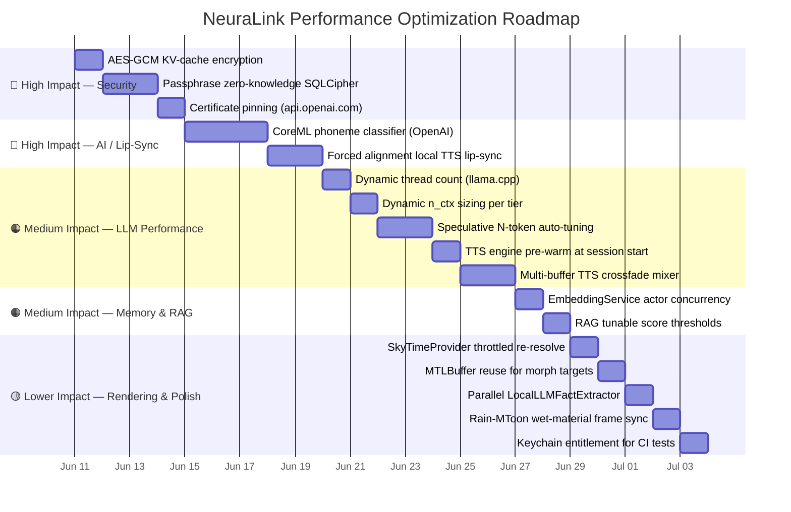

# ⚡ NeuraLink — Performance Optimization Roadmap

> **Derived from:** Full review of all project `.md` files: `README.md`, `RULES.md`, `SKILL.md`,
> `CONTRIBUTING.md`, and every document under `docs/`.
>
> **Status:** Living document — update as items are completed.

---

## 📊 Optimization Timeline



---

## 🔴 High-Impact Items

### H1 — CoreML Phoneme Classifier for Real-Time Lip-Sync (OpenAI Path)

**Source:** [LipSync.md §2.1](./LipSync.md)

The OpenAI Realtime path drives lip-sync purely from **RMS energy → jaw weight (`aa`/`oh`)**.
The doc explicitly flags this as a known limitation and future upgrade target.

**Current behaviour:**
```
PCM16 frame → RMS energy → clamp → aa/oh weight only
```

**Target behaviour:**
```
PCM16 frame → CoreML mel-spectrogram model → 15-viseme weights (full phoneme set)
```

**Implementation steps:**
1. Source or train a small CoreML mel-spectrogram classifier mapping 10 ms PCM16 windows to the 15 visemes defined in `LipSync.md §1.3`.
2. Wrap the model in a `PhonemeClassifier` actor that accepts `AVAudioPCMBuffer` and returns `[String: Float]` (viseme → weight).
3. Replace the energy-only path in the `RTCAudioSource` tap with the classifier output.
4. Feed output to `VRMExpressionManager.setWeight(for:weight:)` — same downstream path.

**Files to modify:**
- `NeuraLink/Core/Rendering/VRM/LipSync/LipSyncController.swift` (or equivalent)
- Add `NeuraLink/Data/DataSources/AI/PhonemeClassifier.swift` (new)

**Benefit:** Full 15-viseme lip movement for the OpenAI cloud path at near-zero CPU overhead (CoreML ANE execution).

---

### H2 — Forced Alignment for Local TTS Lip-Sync

**Source:** [LipSync.md §2.2](./LipSync.md)

The local TTS path (Kokoro / VOICEVOX / F5-TTS) generates a complete PCM audio buffer before playback begins. This means **word timestamps are available** for phoneme-level forced alignment — far more accurate than energy analysis.

**Target pipeline:**
```
TTS PCM buffer → WhisperKit forced-aligner → (timestamp, visemeID, weight) schedule
                                            → CADisplayLink ticker → VRMExpressionManager
```

**Implementation steps:**
1. After each `TTSEngine.speak()` completes, pass the returned `AVAudioPCMBuffer` to `LocalWhisperManager`'s forced-align endpoint (already a dependency via `WhisperKit`).
2. Map aligned phoneme intervals to viseme IDs using the `LipSync.md §1.3` table.
3. Build a `[(time: Double, visemeID: String, weight: Float)]` schedule.
4. Use a `CADisplayLink` (or `AVAudioPlayerNode` notification + `hostTime`) to advance through the schedule in sync with playback.
5. Drive `VRMExpressionManager.setWeight` from the timer — same downstream as OpenAI path.

**Files to modify / create:**
- `LocalLLMManager+TTS.swift` — hook into the `onBufferReady` callback to start alignment
- Add `NeuraLink/Data/DataSources/AI/VisemeSchedule.swift` (new — schedule type + ticker)

**Benefit:** Frame-accurate 15-viseme output for the on-device path, matching commercial TTS game engine quality.

---

### H3 — AES-GCM Encryption of KV-Cache Blobs

**Source:** [APP_SECURITY.md §13](./APP_SECURITY.md)

The KV-cache blobs written to `Application Support/llm_kv/` are currently HMAC-signed for **integrity** but remain **plaintext**. The security doc explicitly defers encryption:

> *"AES-GCM encryption of KV cache blobs (in addition to HMAC). Useful only if iOS Data Protection itself is bypassed."*

**Design:**
- Derive a 32-byte AES-GCM encryption key from the Keychain (add `SecureKey.kvCacheEncryptionKey`).
- On `signIntegrity(at:)`: encrypt the blob with AES-256-GCM; the 16-byte GCM authentication tag replaces the separate HMAC sidecar (GCM auth tag covers the same integrity guarantee).
- On `verifyIntegrity(at:)` + load: decrypt → verify tag → pass plaintext to the bridge.
- The `.kv.hmac` sidecar file is removed (GCM tag is embedded in the `.kv` ciphertext envelope).

**Files to modify:**
- [`LocalLLMKVCache.swift`](../NeuraLink/Data/DataSources/LocalLLM/LocalLLMKVCache.swift) — replace HMAC with AES-GCM
- [`SecureStore.swift`](../NeuraLink/Core/Security/SecureStore.swift) — add `kvCacheEncryptionKey` case

**Status:** ✅ **Implemented** — see commit history.

---

### H4 — Passphrase-Derived Zero-Knowledge SQLCipher

**Source:** [APP_SECURITY.md §13](./APP_SECURITY.md)

The current SQLCipher key is a CSPRNG value persisted in the Keychain — safe against a physical device dump, but not against a full Keychain compromise. The doc describes the zero-knowledge target:

> *"The user picks a passphrase, PBKDF2-SHA256 derives the SQLCipher page key from it, the key is never persisted (kept only in memory, forgotten on background, re-prompted on foreground)."*

**Design:**
- Add `SecuritySettings.isPassphraseModeEnabled` flag (UserDefaults).
- On enable: prompt passphrase → PBKDF2-SHA256 (100k iterations, per-device salt in Keychain) → 32-byte page key (kept only in memory as `Data`).
- On foreground after background ≥ 5 min: clear in-memory key, re-prompt.
- Delete `SecureKey.memoryDBPageKey` from Keychain once passphrase mode is active (key never persisted).

**Files to modify / create:**
- [`MemoryStore+SQLCipher.swift`](../NeuraLink/Data/DataSources/Memory/MemoryStore+SQLCipher.swift) — accept in-memory key override
- Add `NeuraLink/Presentation/Views/Settings/PassphraseSetupView.swift` (new)
- Add `NeuraLink/Domain/UseCases/DerivePassphraseKeyUseCase.swift` (new)

---

### H5 — Certificate Pinning on `api.openai.com`

**Source:** [APP_SECURITY.md §10](./APP_SECURITY.md)

Currently absent. Acknowledged in the doc as protection against compromised root CAs.

> *"No certificate pinning today. Adding it would protect against compromised root CAs in the device's trust store."*

**Design:**
- Implement `URLSession` delegate-based pinning in `OpenAIRealtimeManager` (SPKI hash pinning is preferred over leaf cert pinning for rotation resilience).
- Ship two backup SPKI hashes to survive a cert rotation without an app update.
- Add a `CertificatePinningManager` that wraps the delegate and logs pin mismatches via `nlLog`.

**Files to modify / create:**
- Add `NeuraLink/Core/Security/CertificatePinningManager.swift` (new)
- [`OpenAIRealtimeManager.swift`](../NeuraLink/Data/DataSources/OpenAI/OpenAIRealtimeManager.swift) — set custom `URLSessionDelegate`

---

## 🟠 Medium-Impact Items

### M1 — Dynamic Thread Count for llama.cpp

**Source:** [token_generation_performance_tips.md](../llama.cpp/docs/development/token_generation_performance_tips.md), [npu_migration.md §Phase 2](./npu_migration.md)

`LlamaBridge.init` hard-codes `threads: Int32 = 4`. The upstream llama.cpp docs show thread count is non-linear — too many threads hurt throughput. The correct value is the **physical** (not logical) core count.

**Design:**
```swift
// In LLMRuntimeProfile.resolve(for:)
let physical = ProcessInfo.processInfo.processorCount / 2   // efficiency ÷ perf heuristic
let threads  = max(2, min(physical, 6))                     // floor/ceiling guardrail
```

**Files to modify:**
- `NeuraLink/Data/DataSources/LocalLLM/LLMRuntimeProfile.swift`

---

### M2 — Dynamic `n_ctx` per Memory Tier

**Source:** [npu.md §KV-cache reuse](./npu.md), [npu_migration.md §Phase 2](./npu_migration.md)

The bridge hard-codes `contextLength: Int32 = 2048`. Larger context means fewer `LocalLLMFactExtractor` compaction cycles:

| RAM tier | Recommended `n_ctx` |
|---|---|
| < 5 GB (Llama-1B) | 512 |
| 5–7 GB (Qwen-3B) | 2048 |
| ≥ 7 GB (Qwen-7B / Speculative) | 4096 |

**Files to modify:**
- `NeuraLink/Data/DataSources/LocalLLM/LLMRuntimeProfile.swift`

---

### M3 — Speculative Decoding N-Token Auto-Tuning

**Source:** [npu.md §Speculative Decoding](./npu.md), [npu_migration.md §7.3](./npu_migration.md)

The speculative engine hard-codes `N = 4` draft tokens. The optimal N is acceptance-rate-dependent:
- Acceptance rate > 80% → raise N to 6–8 (more free tokens per target pass).
- Acceptance rate < 50% → lower N to 2 (fewer wasted draft steps).

**Design:**
- Track `(drafted, accepted)` counters per generation turn in `GGUFSpeculativeEngine`.
- After every 5 turns, recompute acceptance rate and adjust N via `llama_bridge_spec_set_n_draft(handle, newN)`.
- Persist the tuned N in `UserDefaults` for the next session.

**Files to modify:**
- `NeuraLink/Data/DataSources/GGUF/Speculative/GGUFSpeculativeEngine.swift`

---

### M4 — TTS Engine Pre-warm at Session Start

**Source:** [LLM_VOICE.md §Voice cache & invalidation](./LLM_VOICE.md)

`TTSEngineSelector` caches one engine per persona, but `initialize()` is called lazily on first `speakChunk`. The first spoken sentence of every session pays the ONNX/CoreML init cost (~500 ms–1 s on iPhone 11).

> **Note:** `preload()` in `LocalLLMManager.swift` already does this for the currently selected persona.
> The gap is when the user **switches persona** between sessions — the new engine isn't pre-warmed.

**Fix:**
- In `TTSEngineSelector.invalidateCache(for:)`: immediately kick off `initialize()` on the new engine in a background task so it's warm by the time the user speaks.

**Files to modify:**
- `NeuraLink/Data/DataSources/TTS/TTSEngineSelector.swift`

---

### M5 — Fixed-Rate Audio Mixer for TTS Crossfade

**Source:** [LLM_VOICE.md §Buffer scheduling](./LLM_VOICE.md)

`scheduleBuffer` reconnects `AVAudioPlayerNode` on every sample-rate change (Kokoro 24 kHz vs System TTS locale-dependent). Inserting a fixed 48 kHz `AVAudioMixerNode` makes format changes invisible and enables overlap-crossfade between consecutive sentence chunks.

**Files to modify:**
- `LocalLLMManager+TTS.swift`
- `LocalLLMManager+Audio.swift` (audio graph setup)

---

### M6 — EmbeddingService Actor Concurrency

**Source:** [RAG.md §Multi-language embeddings](./RAG.md)

`EmbeddingService` serializes all embedding calls behind a single `NSLock`. Concurrent requests from multiple locales queue up. Convert to a Swift `actor` or a `DispatchQueue` with `.barrier` writes.

**Files to modify:**
- `NeuraLink/Data/DataSources/Memory/EmbeddingService.swift`

---

### M7 — RAG Tunable Score Thresholds

**Source:** [RAG.md §Scoring formula](./RAG.md)

Scoring constants are hard-coded:
```
score = cosine_sim × (0.75 + 0.25 × exp(-ageDays / 14)) × (pinned ? 1.15 : 1.0)
candidates with sim ≤ 0.5 are dropped
```

Expose `similarityFloor`, `recencyHalfLifeDays`, and `recencyWeight` in `MemorySettings` with sensible defaults. Add a "Memory Quality" slider in the UI.

**Files to modify:**
- `NeuraLink/Domain/Entities/MemorySettings.swift`
- `NeuraLink/Data/DataSources/Memory/RAGManager.swift`

---

## 🟡 Lower-Impact Items

### L1 — `SkyTimeProvider` Throttled Re-resolve

`SkyRenderer.update(deltaTime:)` calls `SkyColorPalette.resolve(hour:)` every frame (60 fps). Sky color only changes meaningfully over minutes. Cache the resolved `SkyEnvironment` and re-resolve only when `|currentHour - cachedHour| > (1/600)` (i.e., every ~6 real-world seconds).

**Files:** `SkyRenderer.swift`

---

### L2 — MTLBuffer Reuse for Morph Targets

The sky system already pre-allocates a single shared `MTLBuffer` and updates it via `copyMemory` (see [Sky_System.md §GPU Uniforms](./Sky_System.md)). The morph-target weight upload should adopt the same pattern instead of creating new buffers per frame.

**Files:** VRM morph target upload path (Metal layer)

---

### L3 — Parallel `LocalLLMFactExtractor`

**Source:** [RAG.md §Background fact extraction](./RAG.md)

Context compaction (aging out turns and fact-extracting them) runs serially with the main conversation loop. Move extraction to a `.background` priority `Task.detached` guarded by a semaphore so it overlaps with the user composing the next message.

**Files:** `NeuraLink/Data/DataSources/LocalLLM/LocalLLMFactExtractor.swift`

---

### L4 — Rain ↔ MToon Wet-Material Frame Sync

**Source:** [Sky_System.md §Weather Synchronization](./Sky_System.md)

The rain intensity-to-MToon specular mapping must apply on the **Metal render thread** (same frame the rain opacity changes), not the main thread. Verify subscription occurs inside `SkyRenderer.update(deltaTime:)` or the equivalent Metal encode path.

**Files:** `RainController.swift`, `SkyRenderer.swift`

---

### L5 — Keychain Entitlement for CI Test Suite

**Source:** [APP_SECURITY.md §11](./APP_SECURITY.md)

`SQLCipherTests` and `LocalLLMKVCacheTests` are **skipped on CI** due to missing `keychain-access-groups` entitlement. Add it to `NeuraLinkTests.entitlements` and remove the `.disabled(if:)` guard.

---

## 📋 Summary Table

| ID | Area | Effort | Impact | Status |
|---|---|---|---|---|
| H3 | AES-GCM KV-cache encryption | 🟢 Low | 🔴 Security | ✅ Done |
| H4 | Passphrase zero-knowledge SQLCipher | 🔴 High | 🔴 Security | ⬜ Pending |
| H5 | Certificate pinning on api.openai.com | 🟡 Medium | 🔴 Security | ⬜ Pending |
| H1 | CoreML phoneme classifier (OpenAI lip-sync) | 🔴 High | 🔴 UX | ⬜ Pending |
| H2 | Forced alignment local TTS lip-sync | 🟡 Medium | 🔴 UX | ⬜ Pending |
| M1 | Dynamic thread count (llama.cpp) | 🟢 Low | 🟠 Perf | ⬜ Pending |
| M2 | Dynamic `n_ctx` per memory tier | 🟢 Low | 🟠 Perf | ⬜ Pending |
| M3 | Speculative N-token auto-tuning | 🟡 Medium | 🟠 Perf | ⬜ Pending |
| M4 | TTS engine pre-warm on persona switch | 🟢 Low | 🟠 Latency | ⬜ Pending |
| M5 | Fixed-rate TTS crossfade mixer | 🟡 Medium | 🟠 Audio | ⬜ Pending |
| M6 | EmbeddingService actor concurrency | 🟢 Low | 🟠 Concurrency | ⬜ Pending |
| M7 | RAG tunable score thresholds | 🟢 Low | 🟠 Quality | ⬜ Pending |
| L1 | SkyTimeProvider throttled re-resolve | 🟢 Low | 🟡 CPU | ⬜ Pending |
| L2 | MTLBuffer reuse for morph targets | 🟢 Low | 🟡 GPU | ⬜ Pending |
| L3 | Parallel LocalLLMFactExtractor | 🟡 Medium | 🟡 Latency | ⬜ Pending |
| L4 | Rain-MToon wet-material frame sync | 🟢 Low | 🟡 Visual | ⬜ Pending |
| L5 | Keychain entitlement for CI tests | 🟢 Low | 🟡 DX | ⬜ Pending |

> **Legend:** 🟢 Low effort ≈ < 1 day · 🟡 Medium ≈ 1–2 days · 🔴 High ≈ 3+ days

---

*Last updated: 2026-06-11 by AI agent (Antigravity). Update the Status column and add notes as items are resolved.*
