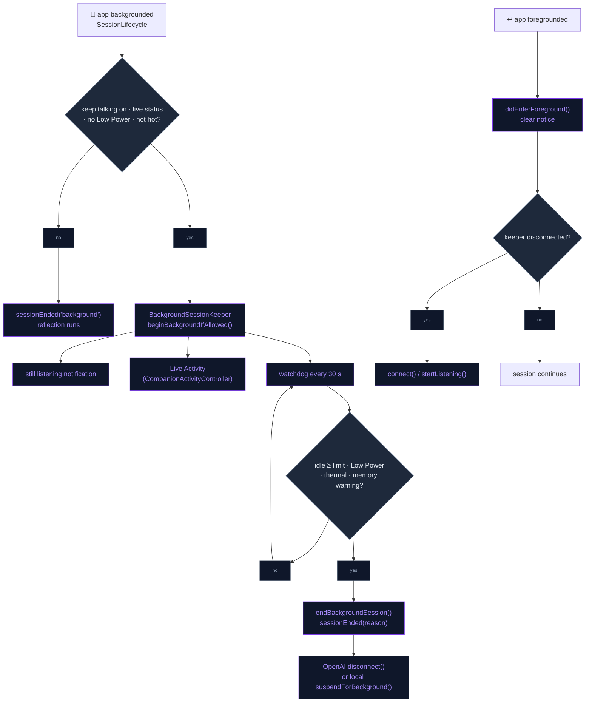
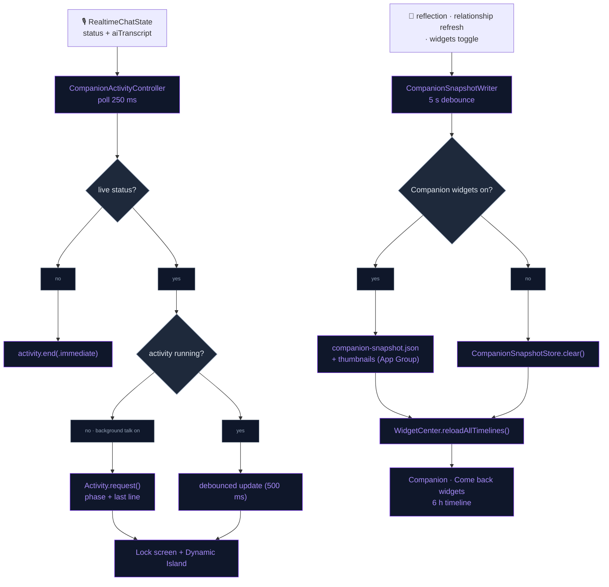
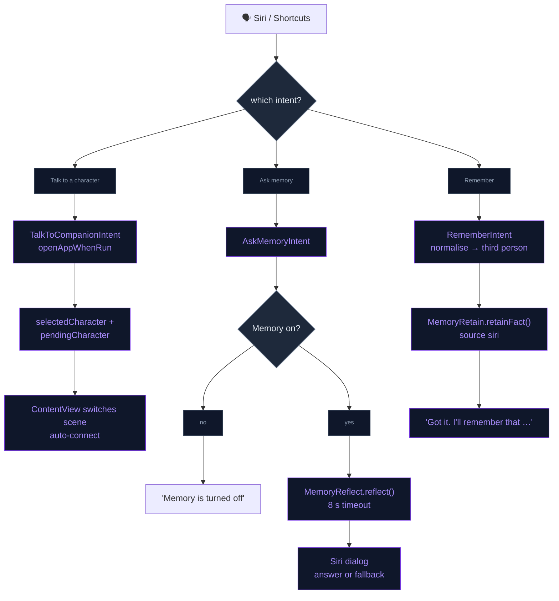

# Presence Beyond the App

The companion stays with the user outside the app screen:

- the voice conversation keeps running with the screen off or in other apps,
- a Live Activity mirrors the session on the lock screen and Dynamic Island,
- home and lock-screen widgets show the greeting and how long since the last
  chat,
- Siri can start a conversation, answer a memory question, or store a fact
  without opening the app.

## Keep talking in the background

**Autonomy → "Keep talking in background"**
(`PresenceSettings.keepTalkingInBackground`, default **off**) lets a live
voice session survive backgrounding. `UIBackgroundModes` includes `audio`,
which keeps the active audio session alive. `BackgroundSessionKeeper` decides
whether it should stay alive.

- **On background**: `SessionLifecycle` calls
  `BackgroundSessionKeeper.beginBackgroundIfAllowed()`.
  `BackgroundSessionPolicy.onBackground` (pure) keeps the session alive only
  when all of these hold:
  - the toggle is on,
  - the status is `ready/listening/thinking/speaking/reconnecting`,
  - Low Power Mode is off,
  - thermal state is below `.serious`.

  When the session is kept alive, `sessionDidEnd` is **not** posted, so
  reflection waits for the real end. Otherwise the boundary fires as usual.
- **Visible state**: a local notification, "<Name> is still listening",
  appears on background. It is removed on return.
- **Watchdog**: every **30 s**, `shouldEnd` checks the time since the user
  last spoke (`InteractionClock.secondsSinceUserSpoke`, or time since
  backgrounding if they never spoke). The idle limit is **"End after
  silence"**: 5 / 10 / 20 / 30 min, default 10 (`backgroundIdleMinutes`).
  Low Power Mode, thermal `.serious/.critical` and a memory warning end the
  session immediately. Power-state, thermal and memory-warning notifications
  also trigger a check.
- **Ending**: `endBackgroundSession` fires `SessionLifecycle.sessionEnded`
  (`backgroundIdle` / `backgroundGuard`) and stops the engine:
  - OpenAI: `disconnect()`.
  - Local: `LocalLLMManager.suspendForBackground()` stops capture, VAD and
    playback, and pauses the engine **without unloading models**.
- **Return**: `didEnterForeground` stops the watchdog and clears the notice.
  If the keeper had disconnected, the session reconnects
  (`startListening()` / `connect()`).
- **Bluetooth**: the local audio session includes `.allowBluetoothHFP`, so
  AirPods' microphone is used. The Realtime session already had it.

## Live Activity and Dynamic Island

`CompanionActivityController` mirrors the voice session in a Live Activity.
It is started once from `NeuraLinkApp.autoConnectAI`, and polls
`RealtimeChatState` every **250 ms**.

- **Start**: the activity starts on the first live status, and only while
  "Keep talking in background" is on and Live Activities are enabled. That is
  the only case where a session exists with the app hidden. The character's
  thumbnail is copied into the App Group for the extension.
- **Content** (`CompanionActivityAttributes`):
  - static: character, display name, thumbnail file, start time.
  - dynamic: `phase` (listening / thinking / speaking / reconnecting, each
    with a label and SF Symbol) and `lastLine`, the last assistant line,
    flattened and trimmed to 80 characters.
- **Updates**: debounced **500 ms** and skipped when the state is unchanged.
  They are local only (`pushType: nil`).
- **End**: any non-live status (disconnect, error) ends the activity with
  `.immediate` dismissal.
- **Views** (`CompanionLiveActivity`, widget extension): a lock-screen
  banner and the Dynamic Island compact, expanded and minimal
  presentations. Tapping opens the app.

## Home and lock-screen widgets

The widget extension cannot open the protected, possibly encrypted memory
database. It reads a **snapshot** instead: a small JSON file in the App Group
`group.com.dedicatus.NeuraLink`.

- **Snapshot** (`CompanionSnapshot`, version 1): character + display name,
  relationship label and score 0…1 (`CompanionAffinity`), the next unused
  opener, one "memory of the day", last chat date, thumbnail file, and
  `updatedAt`. It holds no transcript and no facts.
  - The memory of the day is an observation of ≤ 140 characters, rotated by
    day index.
  - The last chat date is the last user speech, else `lastSeenAt`.
- **Writes** (`CompanionSnapshotWriter`, **5 s** debounce): triggered after
  `CompanionStateStore.refresh()` (which runs on relationship changes and
  character switches), after each reflection, and when the widgets toggle
  changes. Every write calls `WidgetCenter.reloadAllTimelines()`.
- **Privacy switch**: **Autonomy → Presence → "Companion widgets"**
  (`PresenceSettings.showWidgets`). Turning it off deletes the snapshot and
  thumbnails, and the widgets fall back to an empty state.
- **Widgets** (`NeuraLinkWidgets` extension):

  | Widget | Families | Shows |
  |---|---|---|
  | **Companion** | `systemSmall`, `systemMedium` | Thumbnail, relationship bar, opener (or the memory of the day), time since last chat |
  | **Come back** | `accessoryCircular`, `accessoryRectangular` | Relationship gauge, time since last chat, opener |

- **Timeline**: four entries 6 h apart with `.atEnd`, so "3 h ago" stays
  current without the app writing anything.

## Siri and App Shortcuts

`App/AppIntents/CompanionIntents.swift` lives in the app target, with no
extension. It provides:

- **Talk to a character** (`TalkToCompanionIntent`, `openAppWhenRun`): opens
  the app, which connects as it does on any launch. With a character it sets:
  - `UserSettings.selectedCharacter`, for a cold launch,
  - `AppIntentRequests.pendingCharacter`, for a running app. `ContentView`
    consumes it and switches the scene.

  Characters come from `CharacterEntity` / `CharacterQuery`, backed by
  `VRMModelRegistry` (built-in and imported). Matching is case-insensitive on
  the id or display name, including a display-name prefix.
- **Ask memory** (`AskMemoryIntent`, no app launch): calls
  `MemoryReflect.reflect(question:character:)` behind an **8 s**
  `IntentTimeout`, then speaks the answer as a Siri dialog. The fallback is
  "I don't have anything about that yet." With Memory off it answers "Memory
  is turned off in NeuraLink."
- **Remember something** (`RememberIntent`): `normalise` rewrites first-person
  dictation into a third-person fact ("my dentist is on Friday" → "User's
  dentist is on Friday."). The fact is stored with `MemoryRetain.retainFact`
  (source `siri`), the instructions are refreshed, and Siri confirms in the
  second person.
- **Phrases** (`NeuraLinkShortcuts`): "Talk to <character> in NeuraLink",
  "Ask NeuraLink what I said", "Remember this in NeuraLink", plus variants.

## Flow

### Background session

### Live Activity and widgets

### Siri

## Files

| File | Role |
|---|---|
| `Data/DataSources/BackgroundSessionKeeper.swift` | Pure `BackgroundSessionPolicy` + keeper (watchdog, guards, notice, reconnect) |
| `Data/DataSources/SessionLifecycle.swift` | Defers `sessionDidEnd` while the keeper holds the session |
| `Data/DataSources/LocalLLM/LocalLLMManager+Audio.swift` | `.allowBluetoothHFP`, `suspendForBackground()` |
| `Data/DataSources/PresenceSettings.swift` | `keepTalkingInBackground`, `backgroundIdleMinutes`, `showWidgets` |
| `Presentation/Views/AI/AutonomySettingsView.swift` | Background audio section, "Companion widgets" toggle |
| `Data/DataSources/CompanionActivityController.swift` | Starts, updates and ends the Live Activity |
| `../NeuraLinkShared/CompanionActivityAttributes.swift` | Activity payload (app + extension) |
| `../NeuraLinkShared/CompanionSnapshot.swift` | `CompanionSnapshot` + `CompanionSnapshotStore` (App Group JSON, thumbnails) |
| `Data/DataSources/CompanionSnapshotWriter.swift` | Builds and writes the snapshot, memory of the day, reloads widgets |
| `../NeuraLinkWidgets/NeuraLinkWidgetsBundle.swift` | Extension entry point |
| `../NeuraLinkWidgets/CompanionWidgets.swift` | Companion + Come back widgets, 6 h timeline provider |
| `../NeuraLinkWidgets/CompanionLiveActivity.swift` | Lock-screen banner + Dynamic Island views |
| `App/AppIntents/CompanionIntents.swift` | Intents, `CharacterEntity`, `IntentTimeout`, `NeuraLinkShortcuts` |
| `App/ContentView.swift` | Consumes `AppIntentRequests.pendingCharacter` |
| `../NeuraLinkTests/BackgroundSessionTests.swift` | Keep-alive policy |
| `../NeuraLinkTests/CompanionSnapshotTests.swift` | Snapshot model |
| `../NeuraLinkTests/AppIntentTests.swift` | Character matching, first → third person normalisation, timeout |

## Integration notes

- **Info.plist**: `UIBackgroundModes = [audio, fetch]` and
  `NSSupportsLiveActivities = YES`.
- **Targets**: `NeuraLinkWidgets` (`com.dedicatus.NeuraLink.Widgets`) is
  embedded through "Embed Foundation Extensions". It shares
  `NeuraLinkShared/` with the app and has no llama or WebRTC dependencies.
  Both entitlements files carry the App Group
  `group.com.dedicatus.NeuraLink`.
- **Data protection**: the App Group snapshot is the only companion data
  outside the protected sandbox. It is plaintext by design, so it holds only
  labels, the opener and one short observation.
- **App Review honesty**: background audio is opt-in, and it ends on
  silence, Low Power Mode, heat or memory pressure. It is never left
  running idle.
- **Reflection boundary**: a kept-alive session still gets exactly one
  `sessionDidEnd`, when the keeper ends it or the next foreground/new-chat
  boundary fires.

## Known device-test items

- Lock the screen mid-conversation with AirPods, on both engines. Confirm the
  orange indicator, continued replies, the idle disconnect, and reconnect on
  return. Confirm that a phone call pauses and resumes cleanly.
- The local 1B model on a 4 GB device may be jetsammed in the background. A
  memory warning ends the session, but check how often it happens.
- Live Activity: it appears on lock, phase changes show within about a
  second, "Reconnecting…" shows during a reconnect, and the activity ends on
  disconnect. It never appears with background talking off.
- Widgets: add each one, end a session, and confirm the opener updates
  within seconds.
