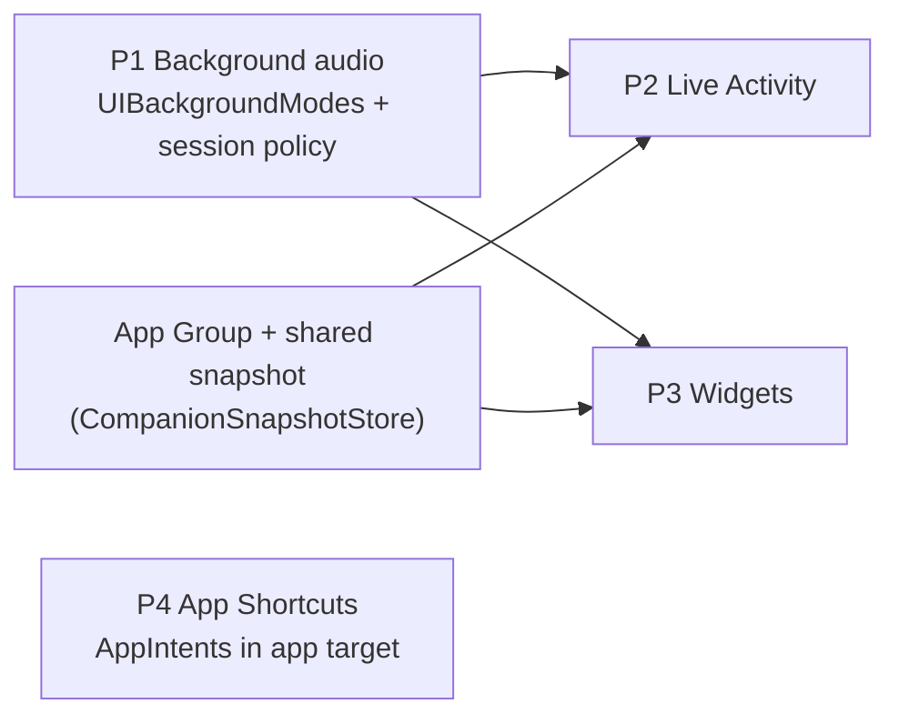

# Presence Beyond the App Screen — Plan

Goal: NeuraLink should keep being a companion when the app is not in front of
the user — on a walk with AirPods, on the lock screen, in the Dynamic Island,
and through Siri. Today every one of these is missing: `Info.plist` declares
no `UIBackgroundModes`, the entitlements file holds only the
communication-notifications key, and there is no widget, Live Activity, App
Intent or App Group in the project (single app target + two test bundles).

Four items, in recommended order. Each lists seams (file:line as of
2026-09-26), design, tasks, verification, risks. Follow [SKILL.md](../SKILL.md)
before finishing any of them.

| # | Item | Effort | Value | Needs new target? |
|---|---|---|---|---|
| P1 | Background audio (keep the session alive with the screen off) ✅ 2026-09-27 (device check pending) | M | High | no |
| P2 | Live Activity + Dynamic Island for the active session ✅ 2026-09-27 (device check pending) | M | Med | yes (widget extension) |
| P3 | Home / lock-screen widgets (opener, relationship, come-back nudge) ✅ 2026-09-27 (device check pending) | M | High | yes (same extension as P2) |
| P4 | Siri + App Shortcuts ✅ 2026-09-27 | S | Med | no |

Order: **P1 → P4 → P3 → P2**. P1 is pure app-target work and unlocks the
others' value; P4 needs no extension; P3 and P2 share one extension target
and an App Group, so do P3 first (it also forces the shared data snapshot
P2 reuses).

---

## P1. Background audio — `M` — ✅ CODE DONE 2026-09-27, device check pending

`UIBackgroundModes = audio`; `PresenceSettings.keepTalkingInBackground`
(default off) + `backgroundIdleMinutes` (5/10/20/30, default 10) in Autonomy →
"Keep talking in background"; `BackgroundSessionPolicy` (pure, tested) +
`BackgroundSessionKeeper` (idle watchdog every 30 s from
`InteractionClock.secondsSinceUserSpoke`, Low Power / thermal serious /
memory-warning guards, "still listening" notification, auto-reconnect on
foreground after an idle disconnect); `SessionLifecycle` defers
`sessionDidEnd` while kept alive; local audio session adds
`.allowBluetoothHFP` and `suspendForBackground()` pauses capture without
unloading models. Tests: `BackgroundSessionTests`.

**Problem.** Locking the phone or switching apps ends the conversation. The
WebRTC session (`OpenAIRealtimeManager.setupAudioSession`,
`OpenAIRealtimeManager.swift:84-100`, category `.playAndRecord`, mode
`.videoChat`) and the local engine's `AVAudioEngine`
(`LocalLLMManager+Audio.swift:15-78`) both stop when iOS suspends the
process, and the B1 reconnect logic then has to rebuild the session on
return. `ReflectionManager` already notes "no UIBackgroundModes in this
app" (`ReflectionManager.swift:113`).

**Seams.** `Info.plist` (no `UIBackgroundModes`); `SessionLifecycle.start`
posts `sessionDidEnd` on `didEnterBackground` (`SessionLifecycle.swift:39-47`)
— that boundary drives reflection and must survive; the phantom-speech mic
gate (`OpenAIRealtimeManager.swift:221-253`); `PresenceSettings` for the
opt-in toggle pattern (`PresenceSettings.swift:44-60`); the `.speaking` /
`.listening` states in `RealtimeChatState`.

**Design.**
1. Add `UIBackgroundModes = [audio]`. This alone keeps an active audio
   session alive in the background; nothing else changes for users who
   don't opt in because the session is torn down on background by policy
   (below).
2. **Explicit opt-in** `PresenceSettings.keepTalkingInBackground` (default
   off) with an ⓘ: "Keeps the conversation going with the screen off or
   while you use other apps. The microphone stays on; iOS shows the orange
   indicator." When off, current behaviour is unchanged.
3. **Session policy on background** (in `SessionLifecycle`): when the
   toggle is on and a session is active (`status ∈ ready/listening/
   thinking/speaking`), do **not** post `sessionDidEnd`; post it on a new
   `backgroundSessionDidEnd` instead when the session later stops or after
   an inactivity timeout (no user speech for
   `PresenceSettings.backgroundIdleMinutes`, default 10) that disconnects
   to save battery. The OpenAI path keeps WebRTC alive; the local path
   keeps `AVAudioEngine` running (Whisper + Llama already run off-main).
4. **Audio session details.** Keep `.playAndRecord`; for the local path
   add `.allowBluetoothHFP` so AirPods' mic is used (the local session only
   sets `.allowBluetoothA2DP`, `+Audio.swift:18-19`, which is output-only).
   Handle `AVAudioSession.interruptionNotification` (a phone call) by
   pausing and resuming; the local manager already observes it
   (`LocalLLMManager.swift:123`).
5. **Visible state.** A `.background` sub-state is unnecessary; the
   P2 Live Activity is the visible surface. Until P2 exists, a local
   notification "Still listening — tap to return" is posted when the app
   backgrounds with the toggle on (cancelled on foreground).
6. **Battery guard.** Disconnect after the idle timeout, on Low Power Mode
   (`ProcessInfo.isLowPowerModeEnabled`), or when the thermal state reaches
   `.serious` (ties into backlog item 7).

**Tasks.** plist key → setting + ⓘ → `SessionLifecycle` policy + idle timer
→ local audio session options → interruption handling → notification
fallback → battery guards → docs (`Openai_Realtime_Chat.md`, `LLM_VOICE.md`).

**Verification.** Unit: a pure `BackgroundSessionPolicy` (inputs: toggle,
status, idle seconds, low power, thermal → keep/disconnect). Device: lock the
screen mid-conversation with AirPods on both engines; confirm the orange
indicator, continued replies, the 10-minute idle disconnect, and that a
phone call pauses and resumes cleanly. Measure battery over a 30-minute
background session on an iPhone 11.

**Risks.** App Review expects the audio mode to be used for real audio —
the opt-in and idle disconnect keep it honest. The local 1B on a 4 GB
device may be jetsammed in the background under memory pressure; the
policy should treat `didReceiveMemoryWarning` as a disconnect trigger.

---

## P2. Live Activity + Dynamic Island — `M` — ✅ CODE DONE 2026-09-27, device check pending

`NeuraLinkShared/CompanionActivityAttributes.swift` (phase + last line),
`NeuraLinkWidgets/CompanionLiveActivity.swift` (lock-screen banner, Dynamic
Island compact/expanded/minimal), `CompanionActivityController` in the app
(polls `RealtimeChatState` every 250 ms, starts when a live status appears
and "Keep talking in background" is on, 500 ms debounced updates, ends on
disconnect/error), `NSSupportsLiveActivities` in Info.plist. Started from
`NeuraLinkApp.autoConnectAI`. No push updates, no deep link yet (tapping
opens the app).

**Problem.** With P1, a session can run while the app is hidden, but nothing
shows its state (listening / speaking / reconnecting) or offers a way back.

**Seams.** Requires a widget extension target (also hosts P3) and
`ActivityKit`. State comes from `RealtimeChatState.status` (both engines),
`AIConnectionStatus.reconnecting` (B1), `RealtimeChatState.aiTranscript`.

**Design.**
1. `CompanionActivityAttributes` (static: character name, thumbnail asset
   name; dynamic `ContentState`: `phase` enum listening/thinking/speaking/
   reconnecting, `lastLine` ≤ 80 chars, `startedAt`).
2. Start the activity when a session becomes `.ready` **and** P1's toggle
   is on; update on status changes (debounced 500 ms) and on each completed
   assistant transcript; end it at teardown. Dynamic Island compact view:
   character thumbnail + a waveform glyph for speaking; expanded: last line
   + "Return" deep link; lock screen: same as expanded.
3. Thumbnails: reuse
   `CompanionNotificationScheduler.characterThumbnailData(for:)`
   (`CompanionNotificationScheduler.swift:202`) — write it into the App
   Group container once per character so the extension can load it.
4. Deep link `neuralink://session` handled in `NeuraLinkApp` to foreground
   the chat (no new screen).

**Tasks.** Extension target + App Group (shared with P3) → attributes +
views → start/update/end hooks in `OpenAIRealtimeManager` and
`LocalLLMManager` → thumbnail export → deep link → CI (`ios-ci.yml` builds
the scheme; the extension must build for the simulator with
`CODE_SIGNING_ALLOWED=NO`).

**Verification.** Device only: activity appears on lock, phase changes
within a second, reconnect shows "Reconnecting…", ends on disconnect;
no activity is started when P1's toggle is off.

**Risks.** Live Activities need a paid developer profile with the
`push`-less local start; update budget is limited — hence the debounce.

---

## P3. Home and lock-screen widgets — `M` — ✅ CODE DONE 2026-09-27, device check pending

New `NeuraLinkWidgets` extension target (`com.dedicatus.NeuraLink.Widgets`,
embedded via "Embed Foundation Extensions", Info.plist excluded from the
synchronized folder) sharing `NeuraLinkShared/` with the app; App Group
`group.com.dedicatus.NeuraLink` in both entitlements files;
`CompanionSnapshot` + `CompanionSnapshotStore` (JSON + thumbnails in the
group container, ISO dates); `CompanionSnapshotWriter` in the app (5 s
debounce, write points: `CompanionStateStore.refresh`, reflection insert,
the "Companion widgets" toggle in Autonomy → Presence which clears the file
when off); widgets: *Companion* (small/medium: thumbnail, relationship bar,
opener or memory-of-the-day, last chat) and *Come back* (accessory circular
gauge / rectangular). Tests: `CompanionSnapshotTests`. Device: add the
widgets, end a session, confirm the opener updates.

**Problem.** The reflection pipeline already writes an opener, a
notification line and a diary per session (`companion_journal`,
`MemoryStore+Journal.swift:25-56`), and `CompanionAffinity` computes the
relationship meter — but nothing shows any of it outside the app.

**Seams.** Data lives in the SQLCipher-capable DB under the protected App
Support directory (`MemoryStore.resolveDBPath`), which an extension cannot
open (different sandbox, possibly encrypted, and `SecureStore` keychain
access groups would be needed). So the widget reads a **snapshot**, not the DB.

**Design.**
1. **App Group** `group.com.dedicatus.NeuraLink` in both targets.
   `CompanionSnapshotStore` (app target) writes a small JSON
   (`CompanionSnapshot`: character, display name, opener, notification line,
   relationship label + score 0…1, last conversation date, thumbnail file
   name, `updatedAt`) into the group container. Written after every
   reflection (`ReflectionManager.performReflection`), after
   `CompanionStateStore.refresh()`, and at character switch. Nothing
   sensitive: no transcript, no facts.
2. **Widgets** (same extension as P2):
   - *Companion* (small/medium): thumbnail, relationship meter, opener line
     ("I kept thinking about that book…"). Tap → opens the app and marks
     the opener used (the app already consumes `latestUnusedOpener` in
     `ProactivePresenceManager.swift:129`).
   - *Come back* (lock screen accessory): character initial + time since
     last chat, from `lastSeenAt`.
   - *Memory of the day* (medium, optional): one observation text chosen
     daily by the app when it writes the snapshot (rotates; user-facing
     wording "Something I remember").
3. **Refresh.** `WidgetCenter.reloadTimelines` after each snapshot write;
   timeline entries every 6 h otherwise so "time since" stays fresh.
4. Privacy switch: "Show companion widgets" under Autonomy → Presence;
   off clears the snapshot file.

**Tasks.** App Group + entitlements → `CompanionSnapshot(+Store)` + write
points → extension views → reload hooks → privacy toggle → tutorial hint
(the tour can point at "add a widget").

**Verification.** Unit: snapshot encoding round trip; write points fire
(spy store). Device: add each widget, end a session, confirm the opener
updates within seconds and the tap consumes it.

**Risks.** SQLCipher users: the snapshot is plaintext by design — keep it to
the opener/labels only and say so in the ⓘ.

---

## P4. Siri and App Shortcuts — `S` — ✅ DONE 2026-09-27

`App/AppIntents/CompanionIntents.swift`: `CharacterEntity` (registry-backed
string query), `TalkToCompanionIntent` (sets `UserSettings.selectedCharacter`
for cold launch and `AppIntentRequests.pendingCharacter` for a running app,
consumed by ContentView), `AskMemoryIntent` (`MemoryReflect.reflect` behind
an 8 s `IntentTimeout`), `RememberIntent` (first→third person
normalisation, `MemoryRetain.retainFact`, instruction refresh), and
`NeuraLinkShortcuts` phrases. Tests: `AppIntentTests`.

**Problem.** Starting a conversation means opening the app and waiting for
the scene; asking a memory question means being in a session.

**Seams.** `Info.plist` already lists `INSendMessageIntent` under
`NSUserActivityTypes` (communication notifications). Connect flow:
`OpenAIRealtimeManager.connect()` / `LocalLLMManager.startListening()`
(chosen in `VRMSceneView.startAIConnection`, `VRMSceneView.swift:260-266`).
Memory question answering without a session: `MemoryReflect.reflect(question:character:)`
(one LLM call over the retrieval ladder) — returns text.

**Design** (`AppIntents`, app target, no extension):
1. `TalkToCompanionIntent` ("Talk to Sonya" / "Open NeuraLink and talk"):
   opens the app (`openAppWhenRun = true`), sets the character if given,
   and asks `VRMSceneView` to auto-connect (a pending-intent flag consumed
   after the scene loads, like the tutorial's launch arguments).
2. `AskMemoryIntent` ("What did I tell Ekaterina about Kyoto?"): runs
   `MemoryReflect.reflect` in the background and returns the answer as a
   Siri dialog (no app launch). Falls back to "I don't have anything about
   that yet." Requires the memory toggle on; respects `MemoryBanks`.
3. `RememberIntent` ("Remember that my dentist is on Friday"): stores a
   world fact via `MemoryRetain.retainFact` and confirms. Cheap and the most
   Siri-natural of the three.
4. `AppShortcutsProvider` with phrases per character name (personas from
   `CharacterPersona.forCharacter`, imported characters by slug).

**Tasks.** Intents + provider → pending-connect flag in the scene → Siri
dialog strings (EN; JP when localization lands) → docs (`Function_Call.md`).

**Verification.** Unit: intent perform() on stubs (reflect stub, retain
into the shared store with a marker). Device: Shortcuts app shows the
three actions; "Hey Siri, talk to Sonya" opens the app connected.

**Risks.** `AskMemoryIntent` triggers an LLM call from Siri — cap at the
text model with `maxTokens 120` and time out at 8 s so Siri does not hang.

---

## Cross-cutting

- **New extension target** (P2/P3) touches `project.pbxproj` and CI: keep
  it Swift-only, no llama/WebRTC dependencies, and add it to the scheme so
  `xcodebuild build-for-testing` still builds everything.
- **Data protection.** The App Group snapshot is the only thing outside
  the protected sandbox; it must never contain transcript text or facts.
- **Docs to update.** `APP_SECURITY.md` (snapshot + background mic),
  `LIVING_COMPANION_PLAN.md` (P3 is the missing "between-session" surface).
