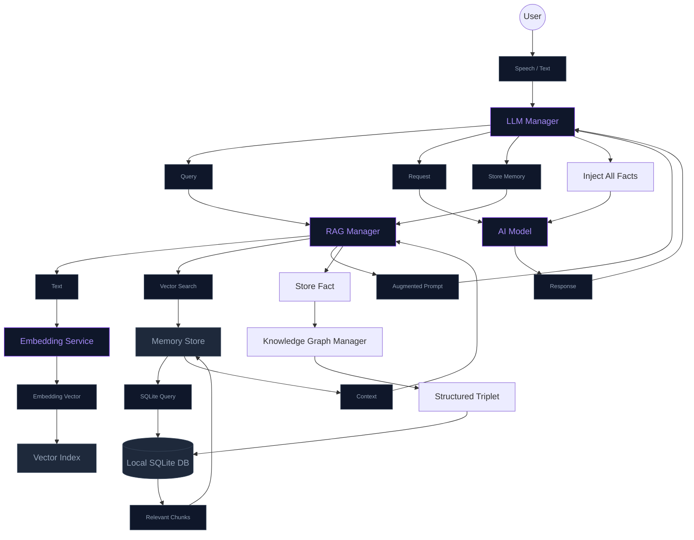

# Persistent Long-Term Memory (RAG)

The NeuraLink RAG (Retrieval-Augmented Generation) system provides the AI with a persistent "memory" of past interactions. This allows the AI to remember facts about the user, past topics of discussion, and shared context even after the app is restarted.

## How it Works

1.  **Ingestion**: Every time the user speaks or the AI responds, the text is sent to the `RAGManager`.
2.  **Embedding**: The `EmbeddingService` uses Apple's native `NaturalLanguage` framework (`NLEmbedding`) to convert the text into a 512-dimensional vector.
3.  **Storage**: The text and its corresponding vector are stored in a local SQLite database (`neuralink_memory.sqlite`).
4.  **Retrieval**: When a new query is received, the system generates an embedding for the query and searches the database for the most similar past entries using **Cosine Similarity**.
5.  **Augmentation**: The top relevant results are injected into the LLM's system prompt as "[Long-term Memory Context]".

## Semantic Knowledge Graph

In addition to vector-based memory, NeuraLink implements a **Structured Knowledge Graph**. While RAG is great for fuzzy context, the Knowledge Graph is designed for **explicit facts**.

- **Structure**: (Subject, Predicate, Object) triplets stored in SQLite.
- **Precision**: Facts like "User has a cat named Rex" are stored exactly, preventing hallucinations during recall.
- **Integration**: The AI can explicitly store facts using the `remember_fact` tool.
- **Recall**: All stored facts are formatted as a bulleted list and injected into the AI's system instructions at the start of every session.

This dual-memory system provides both "fuzzy" situational context and "perfect" factual recall.

## System Architecture

## Privacy

All memory data is stored **locally on-device**. Vector generation happens locally via Apple's built-in frameworks. No text or embeddings are sent to external servers for storage or processing (except for the context injected into cloud-based LLM prompts like OpenAI).

## Technical Details

- **Embedding Model**: `NLEmbedding.sentenceEmbedding(for: .english)`
- **Vector Dimension**: 512
- **Similarity Metric**: Cosine Similarity
- **Database**: SQLite3
- **File Limit Compliance**: Implemented using extensions and modular services to stay under the 500-line limit per file.
