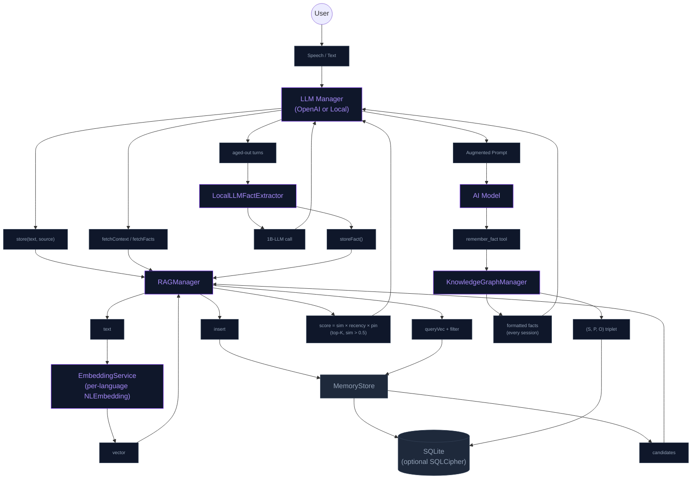

# Persistent Long-Term Memory (RAG)

The NeuraLink RAG (Retrieval-Augmented Generation) system gives the AI a persistent "memory" of past interactions so the character remembers facts about the user, past topics, and shared context across app launches. The system supports both the OpenAI Realtime cloud path and the local LLM path; the local path additionally uses RAG as Tier 3 of its 3-tier memory hierarchy (see [local_llm_memory_plan.md](local_llm_memory_plan.md) §3.2 for the canonical spec).

## How it Works

`RAGManager` exposes four methods that together cover both fuzzy context retrieval and structured fact storage:

| Method | Purpose | Caller |
|---|---|---|
| `store(text:source:)` | Append an interaction to long-term memory. Generates a vector embedding and persists `{text, vector, source, timestamp}` in SQLite. Honours user settings (`isEnabled`, `autoForgetDays`). Both user transcripts and AI responses are always stored when memory is enabled. | `OpenAIRealtimeManager+Handlers` after every user transcript and AI response; `LocalLLMManager+Engine` for the local path |
| `fetchContext(for:limit:)` | Returns the top-K *general* memories most relevant to a query, formatted as a `[Long-term Memory Context]` block ready to inject into a system prompt. | OpenAI session init (`sendInitialSessionUpdate`) for grounding |
| `storeFact(_:)` | Persists an atomic, user-stated fact tagged with `source: "fact"`. Same table, distinct tag — facts are retrieved separately from general dialogue chunks. | `LocalLLMFactExtractor.extractAndStore(...)` during background compaction; also any tool that wants to durably remember something (`remember_fact` tool ultimately calls into KnowledgeGraphManager — see Knowledge Graph section) |
| `fetchFacts(relevantTo:limit:)` | Returns top-K facts most relevant to a query, filtered to `source = "fact"` only. Used to repopulate Tier 3 of the local LLM prompt on each turn. | `LocalLLMMemoryHierarchy.buildMessages` |

All four use the **same scoring formula**: cosine similarity × recency weight × pin boost. Concretely (from [`RAGManager.rankedMemories`](../NeuraLink/Data/DataSources/Memory/RAGManager.swift)):

```
score = cosineSimilarity(queryVec, memoryVec)
        × ((1 − w) + w × exp(-ageDays / halfLife))   ← exponential recency boost
        × (memory.pinned ? 1.15 : 1.0)               ← pinned memories get a small boost

candidates with sim ≤ similarityFloor are dropped as irrelevant
```

The floor, half-life, and recency weight `w` are user-tunable via
[`MemorySettings`](../NeuraLink/Data/DataSources/Memory/MemorySettings.swift)
(`similarityFloor` / `recencyHalfLifeDays` / `recencyWeight`, defaults 0.5 / 14 / 0.25 —
the previously hard-coded values). The floor is surfaced in the UI as the
**Memory Quality** slider in User Settings → Memory.

### Multi-language embeddings

`EmbeddingService` detects each input's dominant language via `NLLanguageRecognizer` and picks the matching `NLEmbedding.sentenceEmbedding(for: language)`. Embeddings are cached per language under an `NSLock`. If the system has no embedding model for the detected language (rare on Apple devices), it falls back to English. In `DEBUG` simulator builds where no NL model is available, `generateVector` returns a zero-vector so RAG code paths can still be unit-tested.

### Background fact extraction (local LLM only)

When a conversation grows past ~80% of the local LLM's `n_ctx`, the oldest 2 dialogue turns aren't simply dropped — they're handed to [`LocalLLMFactExtractor`](../NeuraLink/Data/DataSources/LocalLLM/LocalLLMFactExtractor.swift), which runs a small focused prompt against the local model:

> *"Summarise the user's stated facts from this exchange into 1–2 short statements. If none, output `NONE`."*

The extractor's `parseFacts(_:)` strips response artifacts ("Sure, here are the facts:", numbered list markers, restated prompt headers) and rejects garbage outputs that don't look like genuine first-person facts. Surviving lines are persisted via `RAGManager.storeFact(_:)`. The next prompt build retrieves them through `fetchFacts(relevantTo:limit:)` and surfaces any that are relevant to the new user turn.

Result: a user who said "I live in Tokyo and I'm allergic to peanuts" at turn 1 still gets accurate responses about Tokyo or peanut warnings at turn 30, even though those exact turns aged out of the verbatim window long ago.

## Semantic Knowledge Graph (orthogonal to RAG)

In addition to vector-based memory, NeuraLink runs a structured Knowledge Graph for **exact** factual recall. RAG is great for fuzzy context ("we were talking about ramen"); the Knowledge Graph is for facts that must not drift ("user's cat is named Rex").

- **Structure**: `(Subject, Predicate, Object)` triplets stored in SQLite via [`KnowledgeGraphManager`](../NeuraLink/Data/DataSources/Memory/KnowledgeGraphManager.swift).
- **Ingestion**: The AI explicitly stores facts via the `remember_fact` tool (see [Function_Call.md](Function_Call.md)).
- **Recall**: All stored facts are formatted as a bulleted list and concatenated into the AI's system instructions at the start of every session — no retrieval ranking, the model sees them all.

This dual-memory system provides both "fuzzy" situational context (RAG) and "perfect" factual recall (KG). RAG facts (from `LocalLLMFactExtractor`) and KG triplets (from the `remember_fact` tool) are distinct stores — they don't overwrite each other.

## System Architecture



## Privacy

All memory data is stored **locally on-device**. Vector generation runs against Apple's bundled `NLEmbedding` models — no text or embeddings leave the device for storage or processing. Cloud LLMs (OpenAI) still receive the retrieved context as part of the system prompt they're sent, but storage and retrieval themselves never touch the network.

### Encryption (opt-in)

The memory database can be transparently encrypted at the page level via SQLCipher (AES‑CBC + per‑page HMAC) — see [`MemoryStore+SQLCipher.swift`](../NeuraLink/Data/DataSources/Memory/MemoryStore+SQLCipher.swift). The cipher key lives in the iOS Keychain. Off by default; users opt in through `MemorySettings.isSQLCipherEnabled`. First-time enable triggers a one-shot plaintext-to-encrypted migration on the next launch. See [APP_SECURITY.md](APP_SECURITY.md) for the full security model.

## Technical Details

| Aspect | Implementation |
|---|---|
| Embedding model | `NLEmbedding.sentenceEmbedding(for: language)` — language detected per text via `NLLanguageRecognizer`, English fallback |
| Vector dimension | Depends on the per-language model (English sentence embedding is 512-dim; other languages may differ). Mismatched-dimension candidates are filtered out at retrieval time |
| Similarity metric | Cosine similarity over `Double` vectors |
| Ranking | `sim × ((1−w) + w × exp(-ageDays/halfLife)) × (pinned ? 1.15 : 1.0)`; candidates with `sim ≤ similarityFloor` dropped. Tunables in `MemorySettings` (defaults `w=0.25`, `halfLife=14`, `floor=0.5`) |
| Database | SQLite via [`MemoryStore`](../NeuraLink/Data/DataSources/Memory/MemoryStore.swift); optional SQLCipher encryption |
| Auto-forget | Memories and chat messages older than `MemorySettings.autoForgetDays` are pruned on every store (0 disables) |
| File-size compliance | Each file ≤500 lines per project rule; `MemoryStore` is split via `+SQLCipher.swift` and `+Queries.swift` extensions |

## Cross-references

- [local_llm_memory_plan.md](local_llm_memory_plan.md) §3.2 — the canonical spec for the 3-tier memory hierarchy that consumes `fetchFacts`.
- [Function_Call.md](Function_Call.md) §`remember_fact` — the tool that writes to the Knowledge Graph (distinct from `storeFact` which writes to RAG).
- [APP_SECURITY.md](APP_SECURITY.md) — encryption model, Keychain key storage, threat model for the memory database.
