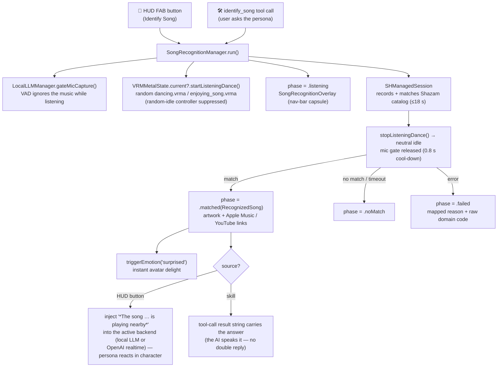

# Song Recognition

"What song is this?" — like Google's song search, but with a lively persona reaction.
The song itself is identified by **ShazamKit** (the LLM is text-only and cannot hear);
the LLM's job is the *interaction*: reacting to the match in character.

## Flow

## Files

| File | Role |
|---|---|
| `Domain/Entities/RecognizedSong.swift` | Framework-free entity; builds Apple Music / YouTube links |
| `Data/DataSources/SongRecognitionManager.swift` | `@Observable` singleton; ShazamKit session, phase machine, persona-reaction injection |
| `Presentation/Views/AI/SongRecognitionOverlay.swift` | Nav-bar principal capsule: pulsing listening state → artwork + link pills |
| `Core/Engine/VRM/UI/VRMMetalState+Actions.swift` | `startListeningDance()` / `stopListeningDance()` (listening-dance extension) |
| `Domain/Entities/Skills/IdentifySongSkill.swift` | `identify_song` tool (awaits the result and returns it to the AI) |
| `Data/DataSources/AppFunctionTool.swift` | `identifySongTool` schema |

## Integration notes

- **Mic coordination**: during a listen the manager calls
  `LocalLLMManager.gateMicCapture(forSeconds:)` so the shared mic tap drops
  frames and the VAD doesn't treat the music as user speech; the gate is
  released to the normal 0.8 s cool-down when recognition finishes.
- **Reaction gating (local path)**: the persona reaction is only injected when
  `RealtimeChatState.status` is `.ready`/`.listening` — never barging in on an
  in-flight generation.
- **Links**: Apple Music uses the exact catalog URL from the match when
  present (`SHMatchedMediaItem.appleMusicURL`), else a
  `music.apple.com/search` universal link. YouTube uses an `https` results
  URL — neither needs an `LSApplicationQueriesSchemes` entry.
- **Permissions**: reuses the existing `NSMicrophoneUsageDescription`.
  ShazamKit catalog matching needs network access and the ShazamKit app
  service enabled for the App ID in the developer portal.

## Troubleshooting

A failure shows as "Couldn't listen" with the mapped reason **and the raw
`[domain code]`** appended (the card is the only surface in Release —
`nlLog` compiles to a no-op there; attach Xcode with a Debug build for the
full `[SongID]` log line including the underlying error).

| Code (`com.apple.ShazamKit`) | Meaning | Usual cause |
|---|---|---|
| 202 `matchAttemptFailed`, 500 `internalError` | catalog query failed | **ShazamKit app service not enabled for the App ID** (developer portal → Identifiers → App Services), or no network |
| 100/101/200/201 (audio format / discontinuity / signature) | recorder produced unusable audio | mic contention with the always-running LocalLLM engine (voice processing) |

## Known device-test items

- The local pipeline enables voice processing (AEC/NS/AGC) on the shared
  audio session; this can degrade the music signal `SHManagedSession`
  captures. If matching is poor on device, consider temporarily disabling
  `setVoiceProcessingEnabled` for the listen window.
- Persona TTS playing while listening will pollute the sample; the UI makes
  this unlikely (recognition is user-initiated) but it is not hard-blocked.
