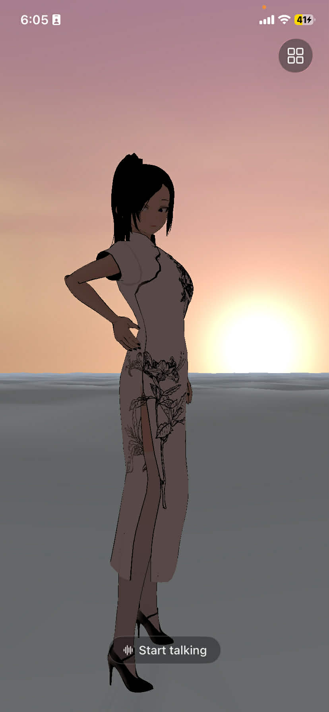
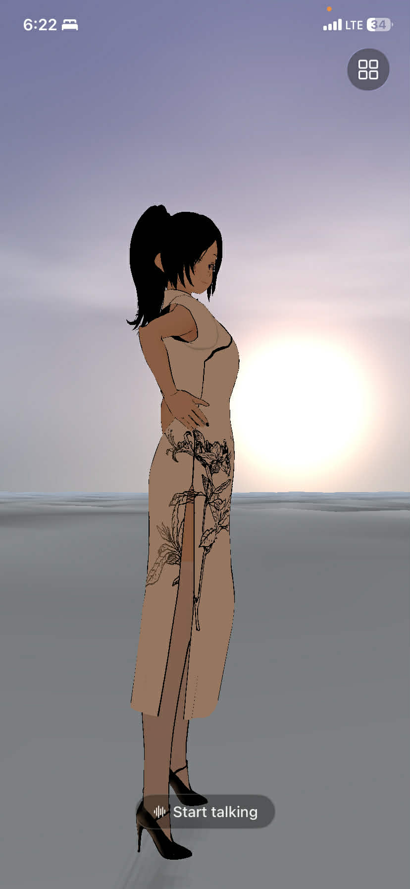
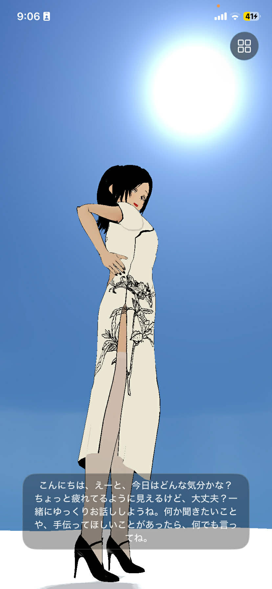
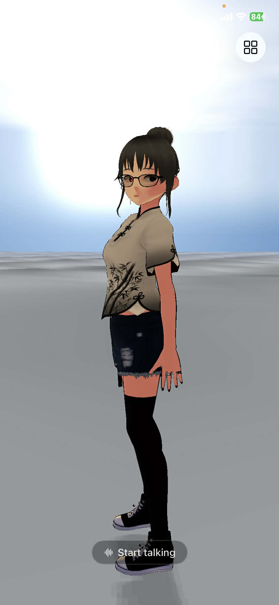
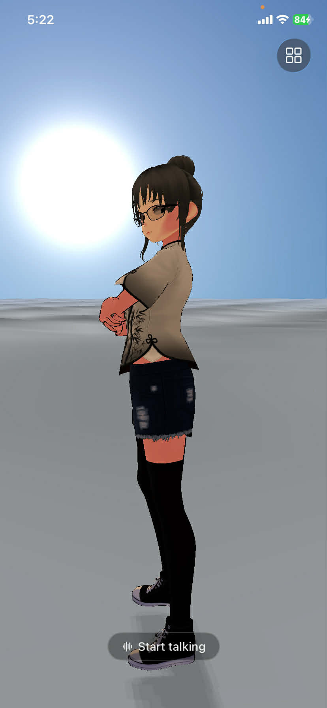
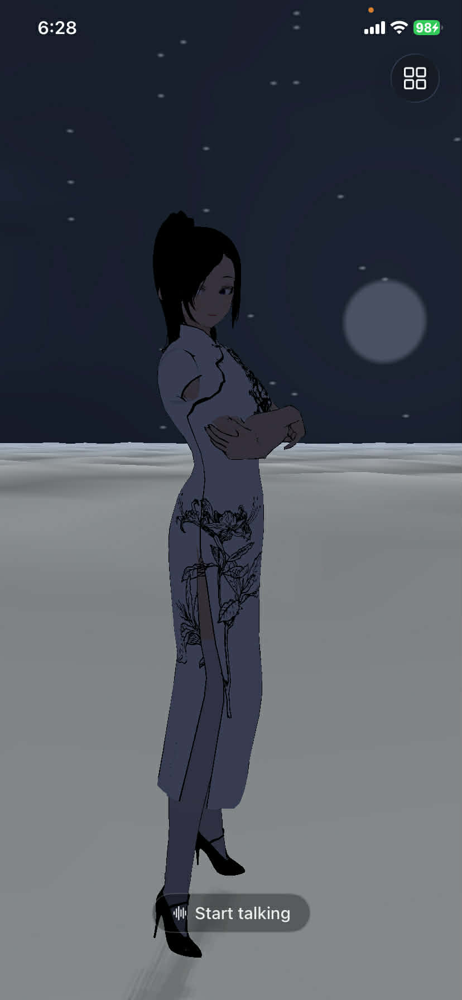
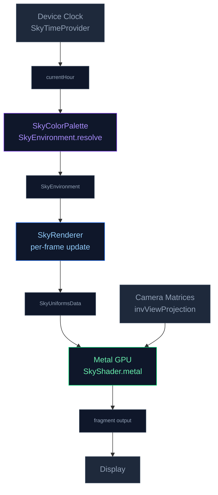

# 🌤️ Realtime Sky System

NeuraLink features a fully procedural, physically-inspired sky rendered entirely on the GPU using **Metal**. The sky reacts to the device's **real local clock** — what you see in the app matches the time of day outside your window, from the inky darkness of midnight to the golden warmth of a summer afternoon.

---

## Gallery

<p align="center">
  
  
  
  
  
  
</p>
<p align="center">
  
  
  
</p>

*From left to right: sunrise · early morning · afternoon · evening (phase 1) · evening (phase 2) · sunset · early night · night*

---

## Architecture Overview

The sky system is composed of four tightly-coupled Swift files and one Metal shader:

```
NeuraLink/Sky/
├── SkyTimeProvider.swift   — Reads the device clock → current local hour [0, 24)
├── SkyColorPalette.swift   — Maps the hour to a full SkyEnvironment (colours + lighting)
├── SkyUniforms.swift       — Defines the 144-byte GPU uniform struct (Swift ↔ Metal bridge)
└── SkyRenderer.swift       — Drives the per-frame update → uniform upload → draw call

NeuraLink/VRM/Shaders/
└── SkyShader.metal         — Fullscreen-triangle vertex + fragment shader
```



---

## 1. Time Provider — `SkyTimeProvider`

`SkyTimeProvider` is the entry point into the sky simulation. Every frame, it reads **the device's local calendar** and converts the current wall-clock time into a continuous floating-point hour value.

```swift
func currentHour() -> Float   // returns [0, 24) — e.g. 14.5 = 2:30 PM
func dayFraction() -> Float   // returns [0, 1]  — e.g. 0.604 = 2:30 PM
```

The `now` closure is **injectable**, so unit tests can freeze time to a deterministic value without touching the system clock.

---

## 2. Sky Environment — `SkyColorPalette`

`SkyEnvironment.resolve(hour:)` is the heart of the system. It takes a single float (the hour) and produces the complete physical state of the sky for that moment in time.

### Sun Positioning

The sun sweeps across the sky on a circular arc anchored at noon:

```swift
let angle  = (h - 12.0) * .pi / 12.0            // hour → angle; 0 = noon
let sunDir = SIMD3<Float>(-sin(angle), cos(angle), 0.0)  // unit vector toward sun
```

| Hour | `sunDir.y` | Position |
|------|-----------|----------|
| 0:00 (midnight) | –1.0 | Directly below horizon |
| 6:00 (sunrise)  | ≈ 0.0 | On the horizon (East) |
| 12:00 (noon)    | +1.0 | Directly overhead |
| 18:00 (sunset)  | ≈ 0.0 | On the horizon (West) |

### Transition Factors

Two smoothstep-based factors drive every colour interpolation:

| Factor | Formula | Meaning |
|--------|---------|---------|
| `dayFactor` | `skySmooth(-0.15, 0.20, sunDir.y)` | 0 = full night → 1 = full day |
| `sunsetFactor` | `clamp(1 – |sunDir.y| × 3.5, 0, 1)` | Peaks at sunrise/sunset, 0 mid-day & night |

The `skySmooth` helper is a classic **smoothstep** (`t² (3−2t)`) giving a perceptually natural S-curve transition instead of a harsh linear ramp.

### Sky Gradient Palette

The horizon-to-zenith gradient cycles through three colour keyframes:

| Phase | Horizon (`skyColorLow`) | Zenith (`skyColorHigh`) |
|-------|------------------------|------------------------|
| **Night** | `#0d1321` (dark navy) | `#1c2331` (midnight blue) |
| **Dawn/Dusk** | `#ffc832` (warm gold) | `#996666` (soft rose/purple) |
| **Day** | `#87ceeb` (sky blue) | `#264899` (deep blue) |

Transitions between phases use the `tDawn` and `tDay` smooth factors computed from `sunDir.y`.

### Three-Point Lighting for VRM Models

The resolved `SkyEnvironment` also drives the three-point light rig that illuminates the VRM character so the model always looks natural against the sky:

| Light | Source | Day colour | Night colour |
|-------|--------|-----------|-------------|
| **Key** | Sun (or moon at night) | Warm white `#fff5db` → orange at horizon | Cool blue `#8c99d9` |
| **Fill** | Opposite side of key, angled from sky | Sky blue `#73 99d9` | Dim blue `#40475a` |
| **Rim** | Fixed above-behind the model | Cool white `#d9e5ff` | Cool white `#d9e5ff` |

> **Why a moon key light?** At night `dayFactor` = 0, so the key light smoothly transitions to a 50%-intensity cool-blue moonlight, keeping the character visible without breaking the night-sky illusion.

---

## 3. GPU Uniforms — `SkyUniforms`

`SkyUniformsData` is a **144-byte flat struct** shared between Swift and Metal. The layout is fixed and must match `SkyUniforms` in `SkyShader.metal` exactly:

| Field | Bytes | Offset | Description |
|-------|-------|--------|-------------|
| `invViewProjection` | 64 | 0 | Camera inverse VP matrix — maps NDC → world ray |
| `sunDirectionAndIntensity` | 16 | 64 | `xyz` = toward-sun unit vector, `w` = key intensity |
| `sunColorAndSize` | 16 | 80 | `xyz` = disc colour, `w` = disc exponent (300 = tight) |
| `skyColorLow` | 16 | 96 | Horizon gradient colour |
| `skyColorHigh` | 16 | 112 | Zenith gradient colour |
| `cloudParams` | 16 | 128 | `x` = elapsed time · `y` = scroll speed · `z` = coverage · `w` = star visibility |

The buffer is allocated once with `.storageModeShared` (CPU-visible Metal memory) and updated every frame via `copyMemory`.

---

## 4. Sky Renderer — `SkyRenderer`

`SkyRenderer` owns the Metal pipeline and orchestrates the two-phase render:

### Per-Frame Update (Main Thread)
```swift
func update(deltaTime: Float)
```
- Advances `cloudTime` (the cloud animation clock).
- Calls `SkyEnvironment.resolve(hour: timeProvider.currentHour())` to get a fresh environment.

### Render Thread Preparation
```swift
func prepareForEncoding(invViewProjection: simd_float4x4)
```
Packs the latest `SkyEnvironment` into `SkyUniformsData` and `copyMemory`s it into the shared Metal buffer. This must be called from the render thread, immediately before `encode`.

### Draw Call
```swift
func encode(encoder: MTLRenderCommandEncoder)
```
Issues a **single 3-vertex draw** — a fullscreen triangle. No vertex buffer is needed; vertex positions are hardcoded in the vertex shader using the `vertex_id` built-in. The depth state is set to **always pass / no write**, ensuring the sky only fills pixels behind all other geometry.

> The sky must be encoded **before** VRM draw calls so it renders behind the model without a depth conflict.

---

## 5. Metal Shader — `SkyShader.metal`

The fragment shader reconstructs a **world-space view ray** from the screen UV using the inverse view-projection matrix, then composites five visual layers from back to front:

### Layer Stack (back → front)

```
┌─────────────────────────────────────────────┐
│  1. Vertical Gradient       (always)        │
│  2. Below-Horizon Darkening (always)        │
│  3. Star Field              (night only)    │
│  4. Dome Clouds — two layers                │
│  5. Sun Disc + Bloom        (above horizon) │
│  6. Moon Disc + Glow        (opposite sun)  │
└─────────────────────────────────────────────┘
```

#### ① Vertical Gradient
```metal
float gradT  = clamp(viewDir.y * 0.5 + 0.5, 0, 1);
float3 colour = mix(skyColorLow, skyColorHigh, gradT);
```
A simple horizon-to-zenith lerp driven by the view ray's Y component.

#### ② Below-Horizon Darkening
Rays pointing below the horizon are darkened to 22% of the horizon colour using a `smoothstep`, producing a subtle ground-sky boundary.

#### ③ Star Field
Stars are generated procedurally from a 250×250 cell hash grid mapped to spherical UV coordinates. Each cell has a 4% chance of containing a star. Visibility is gated on `starVis` (which reaches 1 only when the sun is well below the horizon) and a slow time flicker.

#### ④ Dome Clouds (two layers)
Two independent FBM (fractal Brownian motion) noise layers are dome-projected and animated by `cloudTime × cloudSpeed`:

| Layer | Projection | Density | Alpha cap |
|-------|------------|---------|-----------|
| Low   | `xz / max(y, 0.20)` — near-horizon | 2.0 | ~88 % |
| High  | `xz / (y + 0.45)` — near-zenith flat | 1.5 | ~75 % |

The two masks are composited with `low + high × (1 − low)` to avoid double-counting. Cloud coverage increases slightly at sunset (`0.50 + sunsetFactor × 0.10`), and the horizontal scroll speed peaks at noon (`0.008 + dayFactor × 0.018`).

#### ⑤ Sun Disc + Bloom
```metal
float disc  = pow(dot(viewDir, sunDir), discExponent);   // tight disc
float bloom = pow(dot(viewDir, sunDir), 18.0) * 0.35;   // wide corona
colour += sunColor * (disc + bloom);
```
`discExponent` is hardcoded to **300** giving a physically small but bright disc. The lower-exponent bloom adds a realistic atmospheric glow halo.

#### ⑥ Moon Disc + Glow
The moon is positioned exactly opposite the sun (`moonDir = −sunDir`). A `smoothstep` over the very tight cosine range `[0.9988, 0.9992]` draws a crisp disc, and a separate low-exponent pow adds a soft glow ring. Both are modulated by `moonVis = clamp(−sunDir.y × 2, 0, 1)` so the moon only appears when the sun is below the horizon.

---

## Time-of-Day Reference

| Time   | Sky appearance              | Star field    | Clouds          |
|--------|-----------------------------|---------------|-----------------|
| 00:00  | Deep navy — full night      | Fully visible | Slow drift      |
| 05:30  | Dark → warming golden horizon | Fading        | Thickening slightly |
| 06:00  | Golden sunrise — rose zenith  | Gone          | Peak sunset coverage |
| 08:00  | Bright blue, low sun disc   | Off           | Normal          |
| 12:00  | Sky blue horizon → deep blue zenith | Off | Fastest scroll |
| 16:00  | Afternoon blue, sun moving west | Off | Normal |
| 18:30  | Orange-gold horizon, purple zenith | Emerging | Thickening |
| 19:00  | Deep sunset orange | Fading in | Peak coverage |
| 20:00  | Dark transition | Brightening | Slowing |
| 22:00  | Full night sky | Fully visible | Slow drift |

---

## Integration Points

The sky system integrates with the rest of the engine at two places:

1. **`SkyRenderer.update(deltaTime:)`** — called once per frame on the main thread alongside the VRM physics update.
2. **Lighting** — the `currentEnvironment` property is read by the VRM render pass to apply `keyLight`, `fillLight`, and `rimLight` to the MToon material shader, ensuring the character is always lit consistently with the sky.
