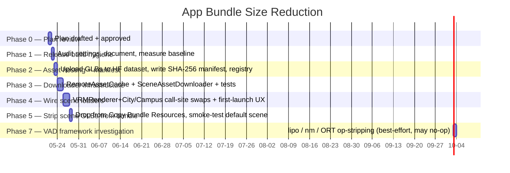

# App Bundle Size Reduction Plan

> **Author:** Dedicatus
>
> **Drafted:** 2026-05-21
>
> **Scope:** App bundle composition only. No changes to LLM inference, audio, VRM rendering math, or any user-visible feature.

---

## 1. Goal

Reduce the installed app bundle from **~1.16 GB (Release, measured 2026-05-29)** down to a **target ceiling of ≤200 MB**.

Measured via `du -sh NeuraLink.app` on `Build/Products/Release-iphoneos/NeuraLink.app`.

> **Target revised 2026-05-29.** The original 80–100 MB band was set against the plan's 290 MB Release estimate, which assumed a 5–8 MB stripped binary. The actual stripped binary is **62 MB** (MLX-Swift kernels, WhisperKit, generated Swift concurrency code), so the 80 MB target is unreachable without binary surgery that's out of scope here. ≤200 MB is the iOS "large download over cellular" warning threshold (raised from 150 MB in iOS 13) — clearing it removes the user-visible install friction without forcing the binary refactor. Aggressive binary work is tracked as an out-of-scope follow-up in §10.

Target rationale: ≤200 MB removes the iOS cellular-install warning and brings the App Store install footprint into the same band as comparable voice-AI apps.

Out of scope: peak runtime RAM (covered by [local_llm_memory_plan.md](local_llm_memory_plan.md)), download speed of optional models (already on-demand), VRM render performance, model quality, binary-size surgery (see §10).

---

## 2. Inventory — where the bundle weight lives

### Current inventory — Release build, 2026-05-29

Measured against `Build/Products/Release-iphoneos/NeuraLink.app` (**1,212,532 KB ≈ 1.16 GB total**):

| Group | Files | Size | Cuttable via |
|---|---|---:|---|
| **Kokoro TTS data** | `kokoro.onnx` (328 MB) + `voices.bin` (51 MB) + `cmu.txt` (3.5 MB) | **382 MB** | §4.5 |
| **VOICEVOX TTS data** | 6× `.vvm` (~57 MB each = ~345 MB) + `sys.dic` (98 MB, part of Open JTalk dict) | **343 MB** | §4.5 |
| **Scene GLBs** | `city.glb` (97 MB) + `campus.glb` (79 MB). `tree.glb` and `grass.glb` are NOT in the Release bundle | **176 MB** | §4.2 |
| **App binary** | `NeuraLink` (stripped) | **62 MB** | Out of scope — see §10 |
| **VRM characters** | `Ekaterina.vrm` (14 MB) + `Sonya.vrm` (15 MB) | **29 MB** | No — VRMs stay bundled (see §4.3) |
| **RealTimeCutVAD framework** | `RealTimeCutVADCXXLibrary.framework` | **26 MB** | §4.4 (best-effort) |
| **voicevox_onnxruntime framework** | static ORT binary used by VOICEVOX | **12 MB** | No — runtime dep |
| **WebRTC framework** | OpenAI realtime path | **11 MB** | No — runtime dep |
| **llama framework** | `llama` (local LLM) | **5 MB** | No — runtime dep |
| **Assets.car, metallibs, smaller bits** | various | ~10 MB | No |

**Five files account for >75% of the bundle:** `kokoro.onnx` (328), `voices.bin` (51), `city.glb` (97), `campus.glb` (79), and `sys.dic` (98). Plus the six VVMs collectively at ~345 MB. The four ≥50 MB single files alone are 553 MB.

### Math against the ≤200 MB target

| Phase | Action | MB saved |
|---|---|---:|
| §4.2 | Scenes on-demand (`city.glb` + `campus.glb`) | −176 |
| ~~§4.3~~ | ~~`Sonya.vrm` on-demand~~ — dropped (VRMs stay bundled) | 0 |
| §4.5 | Kokoro on-demand (`kokoro.onnx` + `voices.bin` + `cmu.txt`) | −382 |
| §4.5 | VOICEVOX on-demand (6 VVMs + JTalk dict) | −343 |
| §4.4 | RealTimeCutVAD framework slim (best-case ~5–10 MB) | −5 to −10 |
| **Subtotal** | | **≈ −921 to −926** |
| **Remaining bundle** | | **≈ 285–290 MB** |

That's ~85 MB above the ≤200 MB target. The closeable gap, in priority order:

- **MLX-Swift binary contribution to the 62 MB executable** — only F5-TTS uses MLX on the 8 GB tier. Lazy-loading via `dlopen` or a separate framework target would cut ~20–30 MB from the binary on tiers that never run F5-TTS. Out of scope here, tracked in §10.
- **Compress JTalk dict** — `sys.dic` is 98 MB of mostly text; a one-shot recompression at build-time could reclaim 30–50 MB. Adds CPU at TTS init; needs a feasibility test.
- **Compress `kokoro.onnx`** — int8 quant exists upstream (~80 MB vs 328 MB). Quality is "slightly degraded" per the model card; A/B before adopting. Tracked in [local_llm_tts_plan.md](local_llm_tts_plan.md) §9.

For Phases 1–5 of this plan, the **≤290 MB intermediate** is a clear win. Reaching the ≤200 MB ceiling needs one of the three follow-ups above; they can be sequenced after Phase 5 ships.

### Pre-TTS inventory (preserved for context)

The 2026-05-21 inventory below is the pre-TTS picture; refer to the table above for current numbers.

| Category | Files | Size | Cuttable? |
|---|---|---:|---|
| **Scene `.glb` assets** | `city.glb`, `campus.glb`, `tree.glb`, `grass.glb` | **201 MB** | Yes — move on-demand |
| Debug binary | `NeuraLink.debug.dylib` | 36 MB | Yes — Release strip drops to ~5–8 MB |
| **VRM characters** | `Sonya.vrm`, `Ekaterina.vrm` | **29 MB** | No — VRMs stay bundled (decision recorded in §4.3) |
| RealTimeCutVADCXXLibrary framework | (statically-linked ONNX Runtime) | 26 MB | Possibly — investigate arch slices |
| WebRTC framework | `WebRTC` | 11 MB | No — needed at launch for OpenAI realtime |
| llama framework | `llama` | 5 MB | No — needed at launch for local LLM |
| Silero VAD ONNX bundle | `silero_vad_v5.onnx`, `silero_vad.onnx` | 4 MB | No — VAD must run from launch |
| WhisperKit + ArgmaxCore + TTSKit + SpeakerKit | (frameworks) | 9 MB | No — small, all needed |
| `Assets.car`, `.vrma` animations, `.png` thumbnails, `default.metallib`, etc. | various | ~10 MB | No — fine |
| SQLCipher | (framework) | 1.4 MB | No |

**Five files account for 230 MB / 68% of the bundle.** That's where this plan focuses.

---

## 3. Scope boundaries

### In scope

| Layer | File(s) |
|---|---|
| Scene loaders | [VRMRenderer+City.swift](../NeuraLink/Core/Engine/VRM/Rendering/VRMRenderer+City.swift), [VRMRenderer+Campus.swift](../NeuraLink/Core/Engine/VRM/Rendering/VRMRenderer+Campus.swift) — the two `Bundle.main.url(forResource:withExtension:"glb")` call sites |
| Character registry | [ContentView.swift](../NeuraLink/App/ContentView.swift) — `VRMModelRegistry` enum (lines 127+) and the `selectedModelURL` state |
| Build settings | `NeuraLink.xcodeproj/project.pbxproj` — drop the four GLB files and one VRM from "Copy Bundle Resources" |
| New code | `NeuraLink/Data/DataSources/Assets/SceneAssetRegistry.swift`, `SceneAssetDownloader.swift`, `RemoteAssetCache.swift` (VRM downloader dropped — see §4.3) |
| First-launch UX | New view (under `Presentation/Views/Overlays/`) for progress + retry |

### Out of scope

- LLM inference, audio pipeline, VAD, WhisperKit, TTS — none touched.
- The `.vrma` animation files (~3 MB total) — too small to bother.
- Asset Catalog (`Assets.car` is already optimised at 2.6 MB).
- llama / WebRTC / WhisperKit framework binaries — already as small as they get without upstream changes.
- Default Ekaterina VRM stays bundled so first launch has a working avatar without network.

A failing assertion of this scope: if a change touches code outside the "In scope" list — and especially the inference or audio paths — it is mis-scoped.

---

## 4. Solution overview

Three concurrent levers, applied in order of risk:

### 4.1 Release build hygiene (zero code changes)

Verify and document Release build settings:

- `STRIP_INSTALLED_PRODUCT = YES`
- `DEAD_CODE_STRIPPING = YES`
- `SWIFT_OPTIMIZATION_LEVEL = -O`
- `GCC_OPTIMIZATION_LEVEL = s` (size, not speed — already default in Release)
- `LLVM_LTO = YES_THIN` (thin LTO)
- `ENABLE_BITCODE` — leave off (deprecated by Apple anyway)

Expected: `NeuraLink.debug.dylib` 36 MB → ~5–8 MB stripped Release binary. **Bundle: 338 → ~310 MB.**

### 4.2 On-demand scene downloads (the main lever)

The four GLB scene files total 201 MB. They are environment backgrounds — only one is active at a time. Move them to a remote repository and download on first selection. Pattern mirrors the existing [LocalModelDownloadManager](../NeuraLink/Data/DataSources/LocalModelDownloadManager.swift) GGUF flow:

- Storage: a HuggingFace dataset repo or any HTTPS bucket. URL + SHA-256 manifest baked into `SceneAssetRegistry`.
- Cache location: `Application Support/scenes/<id>.glb`.
- Loader: `VRMRenderer+City.swift:90` and `VRMRenderer+Campus.swift:89` currently do `Bundle.main.url(forResource:)`. Replace with `RemoteAssetCache.shared.url(for: .city)` — async; returns the cached file URL or downloads if missing.
- UX: a download progress overlay on first scene switch. Background download permitted via `URLSessionConfiguration.background` so the user can leave the app.
- Failure mode: if download fails, fall back to a tiny bundled "loading" scene (~1 MB plane + sky) so the avatar still has somewhere to stand. This stays bundled as a permanent safety net.

Expected: **−176 MB.** Largest single-phase cut among §4.2 / §4.4.

### 4.3 ~~On-demand character VRMs~~ — dropped 2026-05-29

> **Decision: VRMs stay bundled.** `Ekaterina.vrm` (14 MB) and `Sonya.vrm` (15 MB) — and any future character — ship inside the app permanently. Same rule applies to `.vrma` animation files and any persona thumbnail PNGs.
>
> Rationale: VRMs are user-recognisable identity assets. First-launch UX should always offer a working set of characters without a download; making *every* character on-demand pushes initial install friction into the chrome that the user notices most. The asset categories that DO move on-demand (scenes, TTS data) are background machinery the user doesn't directly identify with.
>
> Net target impact: +15 MB to the post-cut floor (Sonya stays). Still within the ≤200 MB ceiling once §10 follow-ups close the remaining gap.
>
> The §4.5 in-scope list explicitly excludes `.vrm` / `.vrma` / images for the same reason.

### 4.4 Investigate RealTimeCutVADCXXLibrary (26 MB)

Silero VAD's own ONNX models are 4 MB combined and live next to the framework. The framework being 26 MB suggests static-linked ONNX Runtime plus possibly dual arch slices. Investigations to run:

- `lipo -info` on `RealTimeCutVADCXXLibrary` — confirm only arm64 ships in Release (no x86_64 simulator slice).
- `nm -gU | wc -l` for symbol count — if it's tens of thousands, dead-strip may help.
- Check whether ORT can be configured to drop unused operators (microphone-VAD uses a tiny subset).

Worst-case outcome: no change. Best case: another 5–10 MB. Not required to hit target — strictly a bonus pass.

### 4.5 On-demand TTS assets (planned — separate future phase)

> **Status: planning only.** This section captures the inventory + strategy so it isn't lost; execution is deferred until the §4.2 / §4.3 work establishes the `RemoteAssetCache` infrastructure that this phase will reuse. No code change in this round.

The TTS engines added between 2026-05-21 and 2026-05-28 contributed **~830 MB of data files** that the 2026-05-21 inventory in §2 doesn't reflect. None of these need to ship inside the bundle — they map cleanly to the on-demand pattern §4.2 establishes for scenes.

Per-asset on-demand strategy:

| Asset | Size | Trigger to download | Cache location | Notes |
|---|---:|---|---|---|
| `kokoro.onnx` | 328 MB | First time English persona resolves to `KokoroEngine` AND user has explicitly enabled local LLM | `Application Support/tts/kokoro/kokoro.onnx` | One-time. ~13 MB int8 quant is a separate quality call — out of scope here |
| `voices.bin` | 51 MB | Same as `kokoro.onnx` (bundle-fetch together) | `Application Support/tts/kokoro/voices.bin` | Useless without `kokoro.onnx`; co-download |
| `cmu.txt` | 3.5 MB | Same as `kokoro.onnx` | `Application Support/tts/kokoro/cmu.txt` | Pronunciation dict — small but co-download for atomicity |
| `2.vvm` (Sonya/Dedicatus → Metan) | 56 MB | First time the persona resolves to that VOICEVOX speaker | `Application Support/tts/voicevox/<id>.vvm` | Per-speaker download; user owns the choice in PersonaSettings |
| `3.vvm` / `8.vvm` / `9.vvm` / `14.vvm` / `20.vvm` | ~57 MB each | Same — when the persona maps to that ID | `Application Support/tts/voicevox/<id>.vvm` | Average user only ever downloads 1–2 of the 6 |
| Open JTalk dict (`open_jtalk_dic_utf_8-1.11/`) | 102 MB | First time the user enables `.japaneseLlama1b` AND any VOICEVOX speaker resolves | `Application Support/tts/voicevox/open_jtalk_dic/` | Required for JP linguistic analysis; one-time per user. ~100 MB is unavoidable for the dict |

Expected reduction: **−725 MB** of bundled TTS data (382 MB Kokoro + 343 MB VOICEVOX). Combined with §4.2 / §4.4, the bundle floor lands at **~300 MB** — clears the iOS cellular-install threshold with room for ongoing growth, ~100 MB above the ≤200 MB ceiling. Closing that gap needs one of the §10 follow-ups (binary surgery, JTalk dict compression, or Kokoro int8 quant).

Implementation notes (for the future phase):

- **Mirror §4.2's `RemoteAssetCache`.** Same pattern, same SHA-256 manifest, same first-launch overlay. The TTS phase only adds three new `Asset` enum cases and three downloader call-sites.
- **VVM-aware persona picker.** `PersonaSettingsView`'s voice picker today shows all 6 VOICEVOX speakers as instantly-selectable. After this phase, unselected speakers show a download badge (~57 MB) — same pattern as `ModelLibraryView` already uses for GGUFs.
- **First-use download UX.** Selecting a persona that needs a TTS asset triggers the download overlay; speech happens silently in the background using `SystemTTSEngine` until the download completes (per §3.1 of [local_llm_tts_plan.md](local_llm_tts_plan.md)'s fallback rule).
- **Hosting.** HF dataset repo same as scenes. VVMs are MIT-licensed redistributable; the bundled Kokoro ONNX is Apache-2.0; Open JTalk dict is BSD-style. No re-licensing risk.
- **Resume + integrity.** SHA-256 verify each asset after download — particularly important for `kokoro.onnx` because a truncated 328 MB file would fail to load with a cryptic ORT error.
- **Eager vs lazy in-memory.** Orthogonal to bundle size — covered separately in the TTS perf work (Kokoro slowness investigation). Bundle eviction here is purely about file-system bytes.

Risks specific to this phase:

| Risk | Mitigation |
|---|---|
| User on cellular installs the app, picks Japanese persona, eats 56 MB for the speaker plus 102 MB for JTalk dict in one go | Single combined progress overlay surfaces the 158 MB total up front, same warning shape as the GGUF model download flow today |
| First English speak with local LLM enabled hits a 379 MB download (kokoro + voices) before any audio plays | Detect offline / pre-download condition and fall back to `SystemTTSEngine` for that utterance; queue the Kokoro download in the background so subsequent turns use Kokoro |
| Removing 830 MB from "Copy Bundle Resources" must be done without breaking the existing `KokoroModelAccess` / `VoiceVoxModelAccess` path resolvers | Both classes already have a single source of truth for file paths; widen them to check `Application Support/tts/` first, fall through to `Bundle.main` second. Keeps the local dev flow (assets in source repo) working |

---

## 5. Phased plan

Total active work: ~9 days excluding review. No external dependencies beyond uploading assets to a hosting bucket.

---

## 6. File-level map

### New files

| File | Lines (est.) | Purpose |
|---|---:|---|
| `Data/DataSources/Assets/SceneAssetRegistry.swift` | ~80 | Enum of remote scenes (`city`, `campus`, `tree`, `grass`) with URL + SHA-256 |
| `Data/DataSources/Assets/RemoteAssetCache.swift` | ~150 | Single-flight async URL resolver, on-disk cache, integrity verification |
| `Data/DataSources/Assets/SceneAssetDownloader.swift` | ~120 | Background `URLSession` download + progress reporting |
| `Presentation/Views/Overlays/AssetDownloadOverlay.swift` | ~120 | Progress UI + retry / error states |

### Modified files

| File | Δ | Change |
|---|---|---|
| [VRMRenderer+City.swift](../NeuraLink/Core/Engine/VRM/Rendering/VRMRenderer+City.swift) | ~+10 | Replace `Bundle.main.url(...)` with async `RemoteAssetCache.url(for:)` |
| [VRMRenderer+Campus.swift](../NeuraLink/Core/Engine/VRM/Rendering/VRMRenderer+Campus.swift) | ~+10 | Same |
| [ContentView.swift](../NeuraLink/App/ContentView.swift) | ~+20 | `VRMModelRegistry.Entry` gains `remoteURL: URL?`; `selectedModelURL` resolves through `RemoteAssetCache` |
| `NeuraLink.xcodeproj/project.pbxproj` | small | Remove four `.glb` + one `.vrm` from synced bundle membership |

**Rule-7 verification (≤500 lines/file):** new files all ~150 lines or less; no modified file approaches the limit.

---

## 7. Validation

### Per-phase gates

1. `xcodebuild -scheme NeuraLink -destination "generic/platform=iOS"` — Release variant green.
2. `swiftlint lint --strict` — zero violations on touched files.
3. `du -sh NeuraLink.app` after each phase — record measurement. Must trend toward target.
4. On-device smoke test after Phase 4: first launch with no scenes cached, switch to each scene, verify download → render. Force-quit mid-download and retry to exercise the resume path.

### End-to-end acceptance (Phase 7)

| Check | Target |
|---|---|
| `du -sh NeuraLink.app` (Release) | **≤ 300 MB** after §4.2 / §4.4 / §4.5; **≤ 200 MB** is the post-§10 goal |
| First-launch flow with no network | App opens, default Ekaterina avatar visible, "default" scene renders, scene picker shows "(download required)" badges |
| First scene download on cellular | Completes without iOS "large download" warning (the 200 MB warning threshold) |
| Existing functionality | Local LLM inference unchanged on iPhone 11; OpenAI realtime unchanged; VRM animation parity |

### Rollback plan

The bundled scene GLBs are simply re-added to Copy Bundle Resources. The `RemoteAssetCache` returns `Bundle.main.url(...)` as a first-check before going remote — so re-bundling is a single Xcode toggle, no code change. Worst-case revert: ~3 minutes.

---

## 8. Risks & mitigations

| Risk | Mitigation |
|---|---|
| Asset hosting cost / availability — bucket goes down or moves | Use HF datasets (free tier, well-known availability profile). Manifest in-code so we can swap the URL in one place. |
| First-launch UX feels broken if the only scene is downloaded | Bundle a tiny default scene (~1 MB plane + sky) so the avatar always has somewhere to stand. Reuse for offline-failure fallback. |
| User on cellular eats data — surprise 100 MB download | Gate non-default scene downloads behind an explicit user tap. Same pattern as the GGUF model picker in `ModelLibraryView` — never automatic. |
| Background download interrupted mid-flight | `URLSessionConfiguration.background` resumes automatically. SHA-256 manifest check catches truncated files. |
| GLB file integrity — bad CDN cache serving a corrupted file | SHA-256 verify after download; on mismatch, delete and re-attempt once before failing visibly. |
| App Store review flags large on-demand downloads | Apple's "App Thinning" + "On-Demand Resources" is the sanctioned mechanism. Investigate whether ODR could host the GLBs instead of a third-party bucket — gets Apple-side bandwidth and review-friendliness, at the cost of being App Store-only (no TestFlight off-line installs of new scene packs). |
| GLB compression (Draco/KTX2) might be needed to make downloads faster | Out of scope here. If 97 MB city.glb feels too slow to download on average user connection, a separate compression pass can be added. The bundle target is independent of download speed. |

---

## 9. Rules compliance checklist

| Rule | How this plan complies |
|---|---|
| 1. ≤500 lines/file | All new files ≤200 lines; no modified file approaches the limit. |
| 2. Clean Architecture | New code lives under `Data/DataSources/Assets/` — Data layer; depends only on Foundation + URLSession. No SwiftUI/Presentation references except the overlay view in `Presentation/Views/Overlays/`. |
| 5. Don't break what works | Bundle.main lookup remains as a first-check in `RemoteAssetCache.url(for:)` — if a developer still has the GLB locally, it loads instantly. All-or-nothing migration avoided. |
| 7. swiftlint --strict | Runs at end of each phase. |
| 12. Build succeeds | `xcodebuild` runs at the end of every phase. |

---

## 10. Out-of-scope follow-ups

Tracked here so they don't get lost:

0. **On-demand TTS assets (§4.5)** — planned future phase, ~725 MB potential reduction (382 Kokoro + 343 VOICEVOX). Execution deferred until §4.2 / §4.3 land the `RemoteAssetCache` infrastructure this phase will reuse. Cross-reference: [local_llm_tts_plan.md](local_llm_tts_plan.md) §4 already anticipates `.vvm` downloads; this is the bundle-side counterpart.

1. **Lazy-load MLX-Swift to shrink the 62 MB app binary** — MLX is only used by F5-TTS on the 8 GB tier. On every other tier, the MLX kernels embedded in the executable are dead weight. Plausible save: 20–30 MB from the executable. Approach: extract F5-TTS into a separate framework target loaded via `dlopen` only when a clone-trained persona resolves on `.qwen7b`. The single biggest closeable gap toward the ≤200 MB target after Phases 1–5 ship.

2. **Recompress VOICEVOX Open JTalk dictionary** — `sys.dic` is 98 MB of mostly text. A one-shot gzip / xz pass at build time + runtime decompression on JTalk init could reclaim 30–50 MB. Adds ~100–300 ms to JP-TTS init on iPhone 11; needs a feasibility test that the JTalk C library can be patched to read decompressed bytes from disk vs. an in-memory buffer.

3. **Kokoro int8 quantization** — upstream Kokoro publishes an int8 quant (~80 MB vs 328 MB). Quality is "slightly degraded" per the model card; A/B against the current f32 model required before adoption. Tracked separately in [local_llm_tts_plan.md](local_llm_tts_plan.md) §9.

4. **Draco mesh compression + KTX2 texture compression** on the GLB files. Typical 60–80% reduction. Would shrink download time (not bundle size, which is the focus here). Likely a Phase 8 if scene downloads feel too slow in practice.

5. **On-Demand Resources (Apple)** as a replacement for the third-party bucket. Apple-managed CDN, App Store-aware, but more setup and only works on App Store builds. Worth considering once we have a feel for the hosting cost on whichever bucket we pick.

6. **Lazy framework loading** for the OpenAI path (WebRTC at 11 MB) — only load WebRTC.framework when the user first selects OpenAI mode. Requires `dlopen` plumbing; same pattern as the MLX lazy-load above.

7. **Strip simulator slices from third-party `.xcframework`s** at archive time. Build setting `ONLY_ACTIVE_ARCH = YES` for Release usually handles this, but `RealTimeCutVADCXXLibrary` is suspiciously large and may not be honoring it — flagged for Phase 7 investigation.

8. **Enable LLVM thin LTO** (`LLVM_LTO = YES_THIN`) — typically 3–8% binary reduction at modest build-time cost. Deferred until after §4.2 / §4.3 / §4.5 land so we can A/B the binary delta cleanly without confounding asset changes. Worth ~2–5 MB off the 62 MB binary.

---

## 11. Cross-references

- [local_llm_iphone11_plan.md](local_llm_iphone11_plan.md) — companion plan for runtime perf. App size is the other axis on the same device tier (4 GB RAM, limited storage on entry-level iPhones).
- [npu_migration.md](npu_migration.md) — historical precedent for moving heavy assets (CoreML model chunks → llama.cpp GGUF download) out of the bundle. Same pattern applied to scenes/VRMs here.
- [local_llm_tts_plan.md](local_llm_tts_plan.md) — the TTS plan explicitly notes ~107 MB Open JTalk dictionary + ~600 MB F5-TTS weights — both intended to download on demand. This plan establishes the infrastructure (`RemoteAssetCache`) that the TTS plan can reuse for its `.vvm` / `.onnx` / weight downloads.
