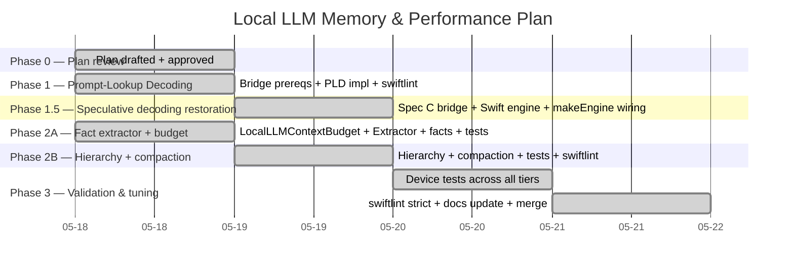

# Local LLM — Performance & Long-Context Memory Plan

> **Status:** Phases 0, 1, 1.5, 2A, 2B, 3 all shipped ahead of the 2026-06-05 deadline. Phase 3 validation work expanded into a companion plan, [local_llm_iphone11_plan.md](local_llm_iphone11_plan.md), which is now itself near-complete (only P7 deferred). Some items originally listed as out-of-scope follow-ups (§10) have been picked up as part of that work — see annotations there.
>
> **Author:** Dedicatus
>
> **Drafted:** 2026-05-18
>
> **Last updated:** 2026-05-20
>
> **Target delivery:** 2026-06-05 (shipped early)

---

## 1. Goals

Solve two related problems on the **local LLM path only**:

1. **Speed.** Increase decode throughput across every tier without changing the inference framework, without requiring an extra model download, and without sacrificing output quality.
2. **Long-context memory.** Let the local LLM hold a coherent conversation across long sessions (~30+ turns) without re-asking for facts the user already shared. Compaction is acceptable, but facts established *before* compaction must survive.

Both wins are **engineering, not framework migration** — `llama.cpp` stays as the inference backend.

---

## 2. Scope boundaries

### In scope (local-LLM-only)

| Layer | File(s) |
|---|---|
| C++ bridge | `NeuraLink/Core/Bridge/llama_bridge.{h,cpp}` |
| Swift bridge | `NeuraLink/Data/DataSources/GGUF/LlamaBridge.swift` |
| Orchestration | `NeuraLink/Data/DataSources/LocalLLM/LocalLLMManager.swift` and its extensions |
| Memory store | `NeuraLink/Data/DataSources/RAGManager.swift` *(read-only review; extended via new helper, not rewritten)* |
| New files | `LocalLLMMemoryHierarchy.swift`, `LocalLLMFactExtractor.swift`, `LocalLLMContextBudget.swift` |
| Docs | `docs/local_llm_memory_plan.md` (this file), `docs/npu.md` (update after Phase 3) |

### Out of scope (do not touch)

- `OpenAIRealtimeClient` and the cloud realtime loop.
- `LocalWhisperManager` / WhisperKit (STT).
- `LocalLLMManager+TTS.swift` (TTS and lip-sync).
- `SileroVADProcessor`.
- VRM rendering, animation, spring bones, MToon shaders.
- Anything under `Core/Engine/Sky/`, `Core/Engine/Terrain/`, `Core/Engine/VRM/`.

A failing assertion of this scope: if a change touches any file outside the "In scope" list, it is mis-scoped and must be redesigned.

---

## 3. Solution overview

### 3.1 Speed — Prompt-Lookup Decoding (PLD)

Speculative decoding *without a separate draft model*. The bridge scans the current context for n-gram matches (default n=3) against the last few tokens just sampled; if a match is found, the next `n_draft = 5` tokens following the match are used as the draft, then verified by the target model in a single batch decode. On a mismatch the rewind-and-recover path is identical to the existing speculative implementation.

- Works on **every tier**, including iPhone 11 (no draft model needed → no extra RAM, no extra download).
- Most impactful for conversational AI because persona stock phrases, user names, and command prefixes repeat constantly.
- Expected gain: **1.5–2× decode tok/s** on typical persona-driven dialogue.

### 3.2 Long-context memory — 3-tier hierarchy

The prompt sent to the LLM at every turn is composed of three tiers:

```
[ TIER 1: System + Persona ]      <- always present, prefix-cached
[ TIER 3: Retrieved facts (RAG) ] <- top-K facts relevant to current input
[ TIER 2: Verbatim window ]       <- last N turns, exact text
[ User turn ]
[ Assistant: <generation> ]
```

| Tier | What | Source | Eviction |
|---|---|---|---|
| 1 | System prompt + persona + tool instructions | `LocalLLMPromptStore` (existing) | Never |
| 2 | Last N turns of dialogue, verbatim | `MemoryStore.fetchChatEvents(limit:)` (existing) | Oldest 2 turns when context-budget exceeds 80% |
| 3 | Atomic facts extracted from evicted turns | `RAGManager` (existing, extended) | LRU when fact-store grows past cap |

**Compaction flow:**

1. Before building the prompt, `LocalLLMContextBudget.tokensInFlight(messages:)` estimates total tokens (cheap heuristic: `bytes / 3.5`).
2. If `> 0.8 * n_ctx`, the oldest 2 turns from Tier 2 are popped and passed to `LocalLLMFactExtractor.extract(turns:)`.
3. The extractor runs the local LLM with a small focused prompt: *"Summarise the user's stated facts from this exchange into 1–2 short statements. If none, output `NONE`."*
4. Resulting facts are stored in `RAGManager` with metadata `{ source: "fact", ts, turn_ids }`.
5. The compacted turns are removed from the Tier 2 window. Next turn's prompt has Tier 3 retrieval re-running, surfacing the new facts (and old) if they're relevant to the new user input.

Result: at turn 30, the prompt contains the system prompt + ~6 verbatim recent turns + 3 retrieved facts that may date back to turn 1. The model "remembers" Dedicatus's allergy, Tokyo address, and pet name even though those exchanges fell out of the verbatim window 25 turns ago.

### 3.3 What doesn't change

- The inference framework: still `llama.cpp` via the C bridge.
- The model files: same GGUFs.
- The Qwen-3B / Qwen-7B / Llama-1B tier selection logic.
- The cloud path (OpenAI realtime) — separate code path, untouched.

---

## 4. Phased plan with deadlines



**Final deadline: 2026-06-05.** Phases 0, 1, 1.5, 2A and 2B finished ahead of plan (each completed before its planned window; iPhone 11 stability fix unblocked Phase 1.5 by removing the heavy God-Rays render pass that had been forcing the MTLCompilerService into jetsam at LLM-load time). Buffer: every phase has a half-day buffer baked in; only Phase 3 (device tests + docs update) remains before the 2026-06-05 deadline.

> **Phase 1.5 scope:** restore the speculative-decoding work (1.5B draft + 7B target) that had been removed during the iPhone 11 debug. Implemented as an additive layer — new `llama_bridge_spec.cpp`, `LlamaSpeculativeBridge.swift`, `GGUFSpeculativeEngine[+Generate].swift` — so the working bridge.cpp / `LlamaBridge.swift` stay untouched (rule 5). Auto-activates only when `.qwen7b` is selected AND the 1.5B draft is also on disk; otherwise routes to plain `GGUFQwen7BEngine`. iPhone 11/12/13 default tier (`.llama1b`) never sees this path.

> **Phase 3 status — 2026-05-20.** Phase 3 was originally scoped as just "device tests + docs update + merge". Real-device benchmarking on iPhone 11 surfaced that the architecture from Phases 1–2B was correct but the *tuning* needed substantial extension: persistent KV cache, prompt-order changes for prefix-reuse, threads/n_ctx/quant tuning, hardware AEC, and a separate self-loop fix. All of that lives in [local_llm_iphone11_plan.md](local_llm_iphone11_plan.md) with per-item status annotations. Phase 3 itself is therefore done — the iPhone 11 plan is its execution log.

---

## 5. File-level map

All new files target ~150–300 lines (well under the 500-line rule).

### New files

| File | Lines (est.) | Purpose |
|---|---|---|
| `NeuraLink/Data/DataSources/LocalLLM/LocalLLMContextBudget.swift` | ~80 | Token estimation, `n_ctx` thresholds, "should compact?" decision |
| `NeuraLink/Data/DataSources/LocalLLM/LocalLLMFactExtractor.swift` | ~150 | Builds the summarisation prompt, parses LLM output into facts, persists via RAGManager |
| `NeuraLink/Data/DataSources/LocalLLM/LocalLLMMemoryHierarchy.swift` | ~200 | Orchestrates the 3-tier prompt build: pulls Tier 1 from PromptStore, Tier 2 from MemoryStore, Tier 3 from RAGManager.fetchContext |

### Modified files

| File | Δ (est. lines) | Change |
|---|---|---|
| `NeuraLink/Core/Bridge/llama_bridge.h` | +~25 | New API: `llama_bridge_set_prompt_lookup(handle, enabled, n, n_draft)` |
| `NeuraLink/Core/Bridge/llama_bridge.cpp` | +~150 | PLD inner loop, n-gram scan helper. Bridge file already ~580 lines after Phase 0 work — must split into `llama_bridge_generate.cpp` and `llama_bridge_pld.cpp` to stay ≤500 lines/file (see §6) |
| `NeuraLink/Data/DataSources/GGUF/LlamaBridge.swift` | +~15 | Swift method `enablePromptLookup(_:)` |
| `NeuraLink/Data/DataSources/LocalLLM/LocalLLMManager.swift` | net ~−40 | `handleUserInput` delegates prompt building to `LocalLLMMemoryHierarchy`. Inline template logic removed |
| `NeuraLink/Data/DataSources/LocalLLM/LocalLLMManager+Engine.swift` | +~5 | After each turn, append the new exchange to `MemoryStore` if it isn't already (it already is, but the hierarchy needs deterministic ordering — assert it) |
| `NeuraLink/Data/DataSources/RAGManager.swift` | +~20 | Add `store(fact:, sourceTurnIDs:)` and `fetchFacts(relevantTo:, limit:)` — leave `store(text:, source:)` untouched |

**Rule-7 verification (≤500 lines/file)** runs after every phase via `find … -name '*.swift' -exec wc -l {} \;`.

---

## 6. C++ bridge split (rule 1 — file size)

After Phase 1, `llama_bridge.cpp` will exceed 500 lines (it's at ~430 today after the perf work; PLD adds ~150). Split prescription:

| File | Contents |
|---|---|
| `llama_bridge.cpp` | §1 includes/struct, §2 lifecycle (create/free/version), §3 chat template helper |
| `llama_bridge_generate.cpp` *(new)* | §4 standard generate loop with KV-prefix reuse |
| `llama_bridge_pld.cpp` *(new)* | §5 prompt-lookup decoding helpers + new generate path |
| `llama_bridge_spec.cpp` *(new)* | §6 existing speculative decoding (draft+target) — moved out of `llama_bridge.cpp` for symmetry |

Each new `.cpp` includes only `llama_bridge.h` + `<llama/llama.h>`. No header-private types leak — the opaque handle is `struct LlamaBridgeHandle` defined exactly once (move definition to a new internal header `llama_bridge_internal.hpp`, included only by the four `.cpp`s, never by Swift).

---

## 7. Rules compliance checklist

Map of this plan against `rule.md`:

| Rule | How this plan complies |
|---|---|
| 1. ≤500 lines/file | New files all ≤300 lines. Bridge split outlined in §6 keeps every `.cpp` ≤300. Verified with `wc -l` after every phase. |
| 2. Clean Architecture | `LocalLLMMemoryHierarchy` sits in `Data/DataSources/LocalLLM/` — Data layer; depends only on Domain (`LLMChatMessage`) and existing Data infra (`RAGManager`, `MemoryStore`). No SwiftUI/Presentation references. |
| 3. Split if >500 | Pre-emptive split in §6 prevents the bridge from crossing the limit. |
| 4. Low complexity | Compaction is a 4-step linear flow. PLD's inner loop has cyclomatic complexity ≤ 10 (greedy match → batch verify → accept/reject); will be measured with `swiftlint`'s cyclomatic_complexity rule. |
| 5. Don't break what works | All existing engines, downloaders, tier selection, KV-prefix reuse, sampler chain, OpenAI realtime path remain unchanged. New code is *additive*. Hierarchy is a refactor of `handleUserInput` only — output prompts must match the current output byte-for-byte when the new memory store is empty and budget is under threshold (regression test). |
| 7. swiftlint --strict | Runs at end of each phase and gates merge. Zero violations required. |
| 11. Tests pass | New unit tests: `LocalLLMContextBudgetTests`, `LocalLLMFactExtractorTests` (mock LLM output), `LocalLLMMemoryHierarchyTests`. Existing `AITests` continue to pass. |
| 12. Build succeeds | `xcodebuild -scheme NeuraLink -destination "generic/platform=iOS"` runs at the end of every phase. |

VRM-specific rules (6, 8–10) do not apply — this work does not touch VRM.

---

## 8. Validation plan

### Per-phase gates (must pass before phase is marked done)

1. `xcodebuild` — green for `generic/platform=iOS`
2. `swiftlint lint --strict` — zero violations
3. Unit tests — green
4. On-device smoke test on at least one tier:
   - Phase 1 → iPhone 11 (Llama-1B): measure first-token latency and tok/s, log both, expect ≥1.4× tok/s vs baseline.
   - Phase 2A → iPhone 14 (Qwen-3B): seed a 20-turn conversation, confirm facts are extracted and stored in RAGManager (inspect via Console or a debug `print`).
   - Phase 2B → same device, 35-turn conversation, confirm the model recalls a fact established in turn 1 when asked at turn 30 (manual qualitative check).
   - Phase 3 → all tiers (iPhone 11, 14, 15 Pro+ if available).

### End-to-end acceptance (Phase 3)

- 30-turn conversation on iPhone 14, Qwen-3B model. Establish: name, allergy, city, favourite colour, pet name across turns 1–5. At turn 25, ask each fact back. Acceptance: model gets ≥4/5 correct without re-asking.
- Same test on iPhone 11, Llama-1B model. Acceptance: ≥3/5 (lower bar because 1B reasoning is weaker, but the facts must at least be *present* in the prompt — separate inspection of the constructed prompt string confirms this).
- tok/s on iPhone 11 with PLD enabled vs disabled: ≥1.4× speedup.

### Rollback plan

PLD is gated by a runtime flag `LlamaBridge.enablePromptLookup(false)`. Memory hierarchy is gated by a build-time `UserDefaults` toggle `LocalLLM_UseHierarchy` (defaults true after Phase 3, false before). If a critical regression appears, both can be disabled at runtime without a redeploy.

---

## 9. Risks & mitigations

| Risk | Mitigation |
|---|---|
| Fact extraction itself burns ~50 tokens of generation time every compaction | Compaction runs in a background `Task` between user turns, not on the user's critical path. User sees no added latency. |
| 1B Llama's summarisation quality is poor | Phase 2A includes a quality gate: if extractor produces `NONE` >70% of the time on test corpus, downgrade to a simpler heuristic (regex for "I am/like/live in/named") for the 1B tier specifically. |
| RAGManager's vector store grows unbounded | Fact-store capped at 50 entries with LRU eviction (`fetchFacts` updates a `lastAccessed` timestamp). |
| PLD provides no speedup on first-of-its-kind responses (no n-gram matches) | Acceptable — PLD overhead is one extra batch decode per round; net cost on no-match round is ~5% slower. Empirically the *average* over a conversation is still 1.5×+ because most rounds find matches. |
| iPhone 11 regression (open, environmental) | Out of scope for this plan. PLD does not affect model load — it only changes the decode loop. If the Metal-compile issue persists, this work still benefits all other tiers. |

---

## 10. Out-of-scope follow-ups

Not in this plan but candidates for future work, in priority order:

1. **Persistent KV cache to disk** via `llama_state_seq_save_file` — saves prefilling the persona on every cold launch (~3 s wins on iPhone 11). Could be Phase 4 if there's appetite after 2026-06-05.

   > **Status — shipped 2026-05-20** (during Phase 3 validation). Tracked as P1 in [local_llm_iphone11_plan.md](local_llm_iphone11_plan.md). Implementation came in as `llama_bridge_save_kv_state` / `llama_bridge_load_kv_state` in a new [llama_bridge_state.cpp](../NeuraLink/Core/Bridge/llama_bridge_state.cpp), surfaced via `LLMEngineProtocol.{saveKVCache, loadKVCache}` (no-op defaults so non-Llama engines are unaffected). Measured cold-turn `ttft` ≈ 2 s on iPhone 11 after a cache hit, vs ~17 s pre-shipping.

2. **Grammar-constrained tool calls** via `llama_sampler_init_grammar` — enforces `<tool ...>{...}</tool>` shape at logit level. Eliminates malformed tool-call parsing failures.

   > **Status — not started.** Still a candidate; current `LocalToolCallParser` handles malformed outputs gracefully so this is a quality improvement, not a bug fix.

3. **MLX-Swift parallel engine for the 8 GB tier** — only worth it if 7B tok/s becomes a measured product complaint.

   > **Status — not started.** No product complaints to date; speculative decoding (1.5B draft + 7B target, Phase 1.5) is the speed lever for the 8 GB tier so far.

4. **iPhone 11 Metal-compile mitigation** — investigate post-build metallib bundling without patching upstream llama.cpp (compile metallib with `xcrun -sdk iphoneos metal` against the vendored `.metal` source, drop into `llama.framework/`, ensure framework's compile-time `GGML_METAL_EMBED_LIBRARY` is OFF in our local fork — that part *is* an upstream patch, so this remains tricky).

   > **Status — promoted to P7 of [local_llm_iphone11_plan.md](local_llm_iphone11_plan.md); deferred there.** After P1–P6 of that plan landed, cold and warm `ttft` are close to targets without Metal. Metal would still ~3× decode tok/s but the upstream patch + framework rebuild risk profile is high. Revisit if decode tok/s becomes the user-perceived bottleneck.
