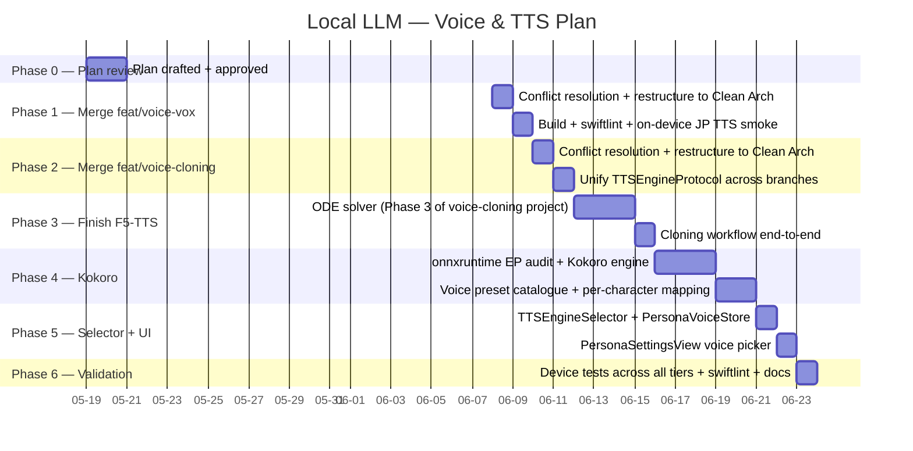

# Local LLM — Voice & TTS Plan (addendum)

> **Status:** Proposed. Awaiting approval before implementation.
>
> **Author:** Dedicatus
>
> **Drafted:** 2026-05-19
>
> **Target delivery:** 2026-06-26
>
> **Sequenced after** [`docs/local_llm_memory_plan.md`](local_llm_memory_plan.md) (memory hierarchy ships 2026-06-05).

---

## 1. Goal

Give every character (Ekaterina, Sonya, future personas) a distinct, recognisable voice across every device tier. Where the device can run it, the voice is a **true clone** from a 3-second reference sample. Where it can't, the voice is still a curated character preset that doesn't sound like a screen reader.

This is **additive on the local-LLM path only** — the OpenAI realtime cloud path keeps its existing voices and is not touched by this work.

---

## 2. Scope boundaries

### In scope (local-LLM TTS only)

| Layer | File(s) |
|---|---|
| **Domain protocol** | `NeuraLink/Domain/Interfaces/TTSEngineProtocol.swift` (new — unified successor to the two incompatible protocols on `feat/voice-vox` and `feat/voice-cloning`) |
| **Data / engines** | `NeuraLink/Data/DataSources/TTS/SystemTTSEngine.swift`, `VoiceVoxEngine.swift`, `F5TTSEngine.swift`, `KokoroEngine.swift`, `AudioDataConverter.swift` |
| **Data / orchestration** | `NeuraLink/Data/DataSources/TTS/TTSEngineSelector.swift` (new — same pattern as `LocalLLMManager.makeEngine()`) |
| **Data / persistence** | `NeuraLink/Data/DataSources/Memory/PersonaVoiceStore.swift` (new — per-character voice preference) |
| **Frameworks** | `voicevox_core.xcframework`, `voicevox_onnxruntime.xcframework`, `onnxruntime.xcframework` (Kokoro), MLX-Swift (already a dep) |
| **Resources** | Open JTalk dictionary (~107 MB bundled), `.vvm` per character (~50–58 MB each, downloaded on demand), Kokoro `.onnx` (~80 MB), F5-TTS weights (~600 MB, downloaded for clone-capable tier) |
| **Integration point** | `LocalLLMManager+TTS.swift` (modified — calls `TTSEngineSelector.shared.engine(for: persona)` instead of binding to `AVSpeechSynthesizer` directly) |

### Out of scope (do not touch)

- `OpenAIRealtimeClient` and the cloud realtime loop. The realtime API has its own voices selected server-side.
- llama.cpp bridge, GGUF engines, KV cache, sampler, PLD, speculative decoding — the memory plan owns the LLM-bridge layer.
- `LocalLLMMemoryHierarchy` and Phase 2B work — finishes before this plan starts.
- `LocalWhisperManager` / WhisperKit (STT).
- VRM rendering, animation, MToon shaders, terrain, sky.
- Function calling / tool execution.

A failing assertion of this scope: if a change touches any file outside the "In scope" list, it is mis-scoped and must be redesigned.

### Explicitly skipped from `jamiepine/voicebox`

The repo is a Tauri/Rust **desktop application** that bundles multiple Python-backend TTS engines (Qwen3-TTS, Chatterbox, Kokoro, HumeAI TADA, etc.). It is not a portable library and cannot be lifted to iOS as-is. Only **Kokoro** is brought in independently — it has an ONNX export with iOS-friendly footprint (~80 MB, >100× realtime on A13+). Everything else from voicebox's catalogue is too large, too slow on iPhone, or duplicates F5-TTS's role at higher cost.

---

## 3. Solution overview

### 3.1 Three engines, one selector

```
                       TTSEngineSelector
                              │
            ┌─────────────────┼──────────────────┬────────────────────┐
            ▼                 ▼                  ▼                    ▼
       F5TTSEngine      KokoroEngine       VoiceVoxEngine      SystemTTSEngine
       (MLX-Swift)      (onnxruntime)      (voicevox_core)     (AVSpeechSynthesizer)
       True clone       Preset voices      Character VVMs      Fallback
       8 GB tier        any tier           JP only             always
```

Selection rules at runtime:

1. If the user has a **trained F5-TTS clone** for the persona AND the device is on the 8 GB tier (`selectedConfig == .qwen7b`) → `F5TTSEngine`.
2. Else, if the active local LLM is `.japaneseLlama1b` → `VoiceVoxEngine` with the persona's mapped speaker.
3. Else, if Kokoro voices are downloaded → `KokoroEngine` with the persona's preset (e.g. Ekaterina → `af_bella`, Sonya → `af_sky`).
4. Else → `SystemTTSEngine` (AVSpeechSynthesizer fallback, zero download, zero latency).

### 3.2 Per-tier engine selection (final state)

| Tier | Default config | Default TTS | Per-character TTS override |
|---|---|---|---|
| iPhone 11 / 12 / 13 (4 GB) | `.llama1b` | `KokoroEngine` (English) | — (F5-TTS infeasible on A13) |
| iPhone 11 / 12 / 13 with JP override | `.japaneseLlama1b` | `VoiceVoxEngine` | Speaker ID per persona |
| iPhone 14 / 15-base / Plus (6 GB) | `.qwen3b` | `KokoroEngine` | — (F5-TTS borderline on A16) |
| iPhone 15 Pro+ / 16 / 17 (8 GB) | `.qwen7b` | `F5TTSEngine` if a clone is trained, else `KokoroEngine` | Per-character reference samples |
| Any tier, anything fails | any | `SystemTTSEngine` | iOS Premium voices |

### 3.3 Clean Architecture alignment

The TTS layer mirrors the LLM layer exactly:

- **Domain layer** (`Domain/Interfaces/TTSEngineProtocol.swift`) — pure protocol + error type. No imports beyond `Foundation` and `AVFoundation`.
- **Data layer — engines** (`Data/DataSources/TTS/*Engine.swift`) — concrete implementations. May import MLX-Swift, voicevox_core, onnxruntime; never import Presentation.
- **Data layer — orchestration** (`Data/DataSources/TTS/TTSEngineSelector.swift`) — singleton that resolves which engine to use for the current persona + tier. Same role for TTS as `LocalLLMManager.makeEngine()` plays for LLMs.
- **Data layer — persistence** (`Data/DataSources/Memory/PersonaVoiceStore.swift`) — UserDefaults-backed map of `personaID → TTSEngineKind + voicePresetID + optional cloneRefURL`.
- **Presentation layer** (`Presentation/Views/AI/PersonaSettingsView.swift`) — binds to engines only through `TTSEngineProtocol`. Never reaches into concrete engines.

### 3.4 Unified protocol (resolves a real merge conflict)

`feat/voice-cloning` ships `TTSProtocol` with an `onBufferReady: ((AVAudioPCMBuffer) -> Void)?` push-streaming callback. `feat/voice-vox` ships `TTSEngineProtocol` with a pull `synthesize(text:speakerID:) async throws -> Data`. They are incompatible. The merged protocol adopts the **streaming push model** (lower first-audio latency, matches the existing `LocalLLMManager+TTS` sentence-chunked playback) while exposing a one-shot pull as a default-implemented extension for callers that want bytes:

```swift
protocol TTSEngineProtocol: AnyObject, Sendable {
    var isReady: Bool { get }
    var onBufferReady: ((AVAudioPCMBuffer) -> Void)? { get set }
    func initialize() async throws
    func speak(_ text: String, persona: PersonaIdentifier) async throws
    func stop()
    func shutdown()
}
```

---

## 4. Phased plan with deadlines



**Final deadline: 2026-06-26.** Phase 0 starts today; Phases 1–6 are scheduled to start 2026-06-08 so they don't compete with the memory plan's Phase 2B / Phase 3 (2026-06-01 → 2026-06-05). If the memory plan ships early, Phase 1 can pull in. Half-day buffer per phase; ≥1 day slip pushes deadline to 2026-06-30 (Tuesday).

---

## 5. File-level map

All new files target ≤300 lines (well under the 500-line ceiling in `rule.md`). Each engine implementation is one file; engine internals (e.g. F5-TTS's `DiT`, `Vocos`) sit in a subfolder.

### New files

| File | Lines (est.) | Purpose |
|---|---|---|
| `NeuraLink/Domain/Interfaces/TTSEngineProtocol.swift` | ~50 | Unified protocol + `TTSError` + `PersonaIdentifier` typealias |
| `NeuraLink/Data/DataSources/TTS/SystemTTSEngine.swift` | ~80 | AVSpeechSynthesizer wrapper, fallback for any tier |
| `NeuraLink/Data/DataSources/TTS/VoiceVoxEngine.swift` | ~200 | Brought from `feat/voice-vox`, restructured |
| `NeuraLink/Data/DataSources/TTS/VoiceVox/VoiceVoxModelAccess.swift` | ~80 | Path resolution for VVM files |
| `NeuraLink/Data/DataSources/TTS/VoiceVox/VoiceVoxModelManager.swift` | ~150 | Download + cache management for VVMs |
| `NeuraLink/Data/DataSources/TTS/VoiceVox/VoiceVoxSpeaker.swift` | ~60 | Speaker ID enum + persona → speaker mapping |
| `NeuraLink/Data/DataSources/TTS/F5TTSEngine.swift` | ~200 | Brought from `feat/voice-cloning`, restructured |
| `NeuraLink/Data/DataSources/TTS/F5TTS/F5TTS.swift` | ~370 | MLX-Swift F5-TTS implementation |
| `NeuraLink/Data/DataSources/TTS/F5TTS/DiT.swift` | ~220 | Diffusion Transformer block |
| `NeuraLink/Data/DataSources/TTS/F5TTS/Modules.swift` | ~70 | Shared building blocks |
| `NeuraLink/Data/DataSources/TTS/F5TTS/ODESolver.swift` | ~150 | Phase 3 work — Euler/midpoint solver |
| `NeuraLink/Data/DataSources/TTS/F5TTS/Vocos/Audio.swift` | ~90 | Mel ↔ waveform helpers |
| `NeuraLink/Data/DataSources/TTS/F5TTS/Vocos/Model.swift` | ~110 | Vocos vocoder |
| `NeuraLink/Data/DataSources/TTS/F5TTS/CloneSampleStore.swift` | ~80 | Persists user-supplied reference samples per persona |
| `NeuraLink/Data/DataSources/TTS/KokoroEngine.swift` | ~200 | ONNX Runtime inference + CoreML EP |
| `NeuraLink/Data/DataSources/TTS/Kokoro/KokoroModelAccess.swift` | ~70 | Path resolution for kokoro.onnx |
| `NeuraLink/Data/DataSources/TTS/Kokoro/KokoroDownloader.swift` | ~70 | HuggingFace download for kokoro-82M |
| `NeuraLink/Data/DataSources/TTS/Kokoro/KokoroVoicePreset.swift` | ~100 | Catalogue of ~50 preset voice IDs + persona mapping |
| `NeuraLink/Data/DataSources/TTS/AudioDataConverter.swift` | ~80 | PCM ↔ AVAudioPCMBuffer (single source of truth — reconcile two branches' versions) |
| `NeuraLink/Data/DataSources/TTS/TTSEngineSelector.swift` | ~120 | Selection logic per §3.1; mirrors `LocalLLMManager.makeEngine` shape |
| `NeuraLink/Data/DataSources/Memory/PersonaVoiceStore.swift` | ~80 | UserDefaults-backed per-persona voice preference |
| `NeuraLink/Dependencies/VOICEVOX/*` | — | Bundled xcframeworks + JTalk dict (carry over from `feat/voice-vox`) |
| `NeuraLink/Dependencies/Kokoro/*` | — | Bundled onnxruntime xcframework (or reuse voicevox_onnxruntime if API-compatible — see §7) |

### Modified files

| File | Δ (est.) | Change |
|---|---|---|
| `NeuraLink/Data/DataSources/LocalLLM/LocalLLMManager+TTS.swift` | ~−40, +~30 | Replace direct `AVSpeechSynthesizer` calls with `TTSEngineSelector.shared.engine(for: persona).speak(...)` |
| `NeuraLink/Presentation/Views/AI/PersonaSettingsView.swift` | +~120 | Voice-picker UI: choose engine + preset, or upload reference sample for clone |
| `NeuraLink/Data/DataSources/LocalModelDownloadManager.swift` | +~30 | New `TTSAsset` enum (kokoro / voicevox-pack / f5tts-weights), reuses existing download state machine |
| `docs/npu.md` | +~20 | New subsection "TTS engine selection" mirroring the LLM tier matrix |

### Branch merges (Phase 1 + Phase 2)

Both branches were created against an older layout (`NeuraLink/AI/TTS/`, `NeuraLink/AI/VOICEVOX/`). The clean-architecture refactor in commit `2f07317` reorganised the tree. The merges must therefore **move files**, not just merge contents:

| Source (branch) | Destination (main) |
|---|---|
| `NeuraLink/AI/TTS/F5TTSEngine.swift` | `NeuraLink/Data/DataSources/TTS/F5TTSEngine.swift` |
| `NeuraLink/AI/TTS/InternalF5/F5TTS/*` | `NeuraLink/Data/DataSources/TTS/F5TTS/*` |
| `NeuraLink/AI/TTS/InternalF5/Vocos/*` | `NeuraLink/Data/DataSources/TTS/F5TTS/Vocos/*` |
| `NeuraLink/AI/TTS/SystemTTSEngine.swift` | `NeuraLink/Data/DataSources/TTS/SystemTTSEngine.swift` |
| `NeuraLink/AI/TTS/AudioDataConverter.swift` (×2, conflicting) | `NeuraLink/Data/DataSources/TTS/AudioDataConverter.swift` (reconciled) |
| `NeuraLink/AI/TTS/TTSProtocol.swift` / `TTSEngineProtocol.swift` (×2, conflicting) | `NeuraLink/Domain/Interfaces/TTSEngineProtocol.swift` (unified — see §3.4) |
| `NeuraLink/AI/VOICEVOX/*` | `NeuraLink/Data/DataSources/TTS/VoiceVox/*` |
| `NeuraLink/Dependencies/VOICEVOX/*` | same path (already under `NeuraLink/Dependencies/`) |
| `NeuraLink/UI/AI/PersonaSettingsView.swift` | `NeuraLink/Presentation/Views/AI/PersonaSettingsView.swift` (manual merge) |

---

## 6. Rules compliance (`rule.md`)

Every applicable rule from `rule.md`, mapped to this plan:

| # | Rule | Plan compliance |
|---|---|---|
| 1 | ≤ 500 lines / file | Every new file targets ≤ 300 lines (largest is `F5TTS.swift` at 370). `wc -l` runs after every phase. |
| 2 | Clean Architecture | §3.3 maps each file to a layer. Domain (`TTSEngineProtocol.swift`) imports nothing beyond `Foundation` / `AVFoundation`; Data layer engines never import Presentation; Presentation binds only to the protocol. Identical pattern to the LLM layer. |
| 3 | Split > 500 line files | F5-TTS internals are already split into `F5TTS.swift` / `DiT.swift` / `Modules.swift` / `ODESolver.swift` / `Vocos/*` on the source branch — no consolidation that would create oversized files. |
| 4 | Low cognitive + cyclomatic complexity | Engines wrap their underlying C/ONNX/MLX APIs in a thin Swift facade. The selector is a 4-branch decision (§3.1). No function exceeds 10 branches; measured by `swiftlint --strict` (cyclomatic_complexity rule). |
| 5 | Don't break what's already working | TTS work is **purely additive** at the LocalLLMManager seam: `LocalLLMManager+TTS.swift` currently calls `AVSpeechSynthesizer` directly; after the merge it calls `TTSEngineSelector.shared.engine(...).speak(...)`, and the selector's bottom branch is `SystemTTSEngine` which wraps the same `AVSpeechSynthesizer`. If every new engine is uninstalled or fails, behaviour matches today exactly. |
| 6 | VRM references for VRM work | N/A — no VRM changes in this plan. |
| 7 | `swiftlint lint --strict` zero violations | Runs at end of every phase as a gate. |
| 8–10 | VRM Spec, MToon, Spring-Bone | N/A — no VRM changes in this plan. |
| 11 | All tests pass | New unit tests for `TTSEngineSelector` (selection logic), `PersonaVoiceStore` (round-trip persistence), `KokoroVoicePreset` (persona mapping). F5-TTS ODE solver gets correctness tests against a small reference output. Existing tests continue to pass. |
| 12 | Build succeeds + swiftlint | `xcodebuild -scheme NeuraLink -destination "generic/platform=iOS"` runs at the end of every phase. |

The "Important note" at the end of `rule.md` is acknowledged: every fix, feature, and refactor in this plan respects all 12 rules above.

---

## 7. Risks & mitigations

| Risk | Mitigation |
|---|---|
| `voicevox_onnxruntime.xcframework` may be a custom build incompatible with stock Kokoro ONNX models | Phase 4 starts with an EP audit: try Kokoro against the existing voicevox-shipped onnxruntime. If incompatible, build a fresh `onnxruntime.xcframework` with `--use_coreml` for Kokoro's use, leaving the voicevox one untouched. ~30–60 min build job. |
| F5-TTS on A13/A14 too slow (0.1–0.3× realtime per §3.2) | Selector gates F5-TTS to `.qwen7b` (8 GB tier) only. Lower tiers never reach the F5-TTS code path even if the user installs the weights. |
| F5-TTS weights are ~600 MB | Downloaded on demand only when the user explicitly creates a clone in PersonaSettings. Default behaviour ships zero F5-TTS bytes. |
| Two-branch protocol conflict | Resolved deliberately in §3.4 with the streaming-push protocol. Both branches' callers can adapt — `feat/voice-vox`'s `synthesize → Data` becomes a default-impl extension that buffers `onBufferReady` calls into a single `Data`. |
| VOICEVOX adds ~430 MB resources (Open JTalk dict bundled, VVMs downloaded) | Open JTalk dict is unavoidable (required for JP linguistic analysis). VVMs are downloaded per character — same on-demand pattern as the GGUF models. |
| Compaction / synthesis competing for memory on iPhone 11 (the God-Rays incident pattern) | TTS does not run during LLM compaction (memory plan §3.2's compaction runs between turns, when TTS is idle). VOICEVOX synthesis (~150–200 MB transient) stacks with Llama-1B (~800 MB resident) — well under the ~2.7 GB jetsam ceiling, but Phase 6 device tests must verify on iPhone 11. |
| Selector cycles between engines mid-utterance | Selector caches the engine per persona for the current `LocalLLMManager` session. Engine swap only happens between sessions or on explicit user change in `PersonaSettingsView`. |
| Voicebox attribution traps | Skipping voicebox entirely (§2) avoids this. Kokoro is brought in directly from its own upstream repo (Apache-2.0 license), not via voicebox. |
| Cloning ethics / consent for reference samples | Reference samples are user-supplied only. UI explicitly warns against uploading non-consenting voices. No bundled non-original voices. |

---

## 8. Validation plan

### Per-phase gates (must pass before phase is marked done)

1. `xcodebuild` — green for `generic/platform=iOS`
2. `swiftlint lint --strict` — zero violations
3. Unit tests — green (incl. new tests added in the phase)
4. Phase-specific on-device smoke test (see below)

### On-device smoke tests by phase

| Phase | Device | Test |
|---|---|---|
| 1 | iPhone 11 + JP override | VOICEVOX speaks a 3-sentence Japanese utterance, first-audio latency logged, no Whisper / LLM regression |
| 2 | Build only on all destinations | Branch merged cleanly, unified protocol compiles |
| 3 | iPhone 15 Pro (if available) or simulator with MLX | F5-TTS clones a reference sample and speaks a 2-sentence English utterance |
| 4 | iPhone 11 / iPhone 14 | Kokoro speaks an English utterance, log generation tok/s; expect >100× realtime |
| 5 | All available devices | User selects voice per character in PersonaSettings; selection persists across launches |
| 6 | iPhone 11, 14, 15 Pro (if available) | End-to-end: enable local LLM, speak, listen — voice matches the persona's stored preference; no regression in LLM tok/s or memory hierarchy |

### End-to-end acceptance (Phase 6)

- 30-turn English conversation on iPhone 14 with Qwen-3B + Kokoro for Ekaterina → voice consistent across all turns, no audible artefacts.
- Japanese conversation on iPhone 11 with `.japaneseLlama1b` + VOICEVOX → voice consistent, first-audio latency < 2 s.
- iPhone 15 Pro+ (when available): clone test — user supplies a 5-second reference sample for a new persona, F5-TTS reproduces it in subsequent conversation. Acceptance: voice is recognisably similar to the reference.

### Rollback plan

The `TTSEngineSelector`'s bottom-branch fallback is `SystemTTSEngine` (= existing AVSpeechSynthesizer behaviour). Disabling any one engine in code reduces gracefully. A build-time toggle `TTS_USE_LEGACY_AVSPEECH` skips the selector entirely and restores pre-merge behaviour byte-for-byte if needed.

---

## 9. Out-of-scope follow-ups

Candidates for a future plan, in priority order:

1. **Kokoro int8 quantization** — ~1.5–2× extra throughput on ANE for slight quality cost.
2. **Multi-language VOICEVOX equivalent** — not yet identified. Kokoro covers most languages but its Japanese quality is below VOICEVOX's.
3. **Pipeline-parallel synthesis** — overlap phoneme prep for sentence N+1 with vocoder of N. ~1.3× speedup, more invasive.
4. **Voice training on-device** — currently F5-TTS uses inference-time cloning (no training). True per-persona fine-tuning would require LoRA-style training on iOS; out of scope.
5. **Per-character emotion / style modifiers** — VOICEVOX supports style IDs already; surfacing them in UI is a fast follow.

---

## 10. Approval

This plan is ready for review. Before any code is written:

- [ ] Scope (§2) confirmed: no work touches files outside the in-scope list.
- [ ] Engine selection rules (§3.1) accepted, or revised.
- [ ] Per-tier defaults (§3.2) accepted, or revised.
- [ ] Unified protocol (§3.4) accepted as the post-merge contract.
- [ ] Deadlines (§4) accepted, or new dates agreed.
- [ ] Risk list (§7) acknowledged; mitigations acceptable.
- [ ] Validation criteria (§8) accepted as the bar for "done".

Once all seven boxes are checked, Phase 1 starts on 2026-06-08 (or sooner if the memory plan finishes early).
