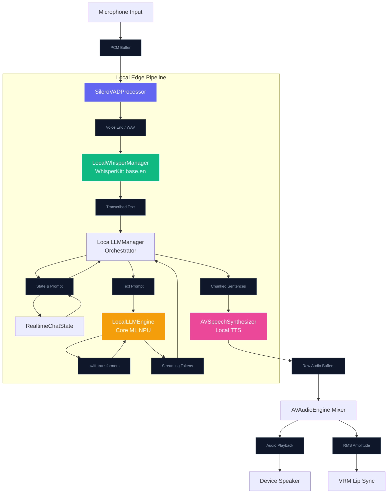

# NPU Integration in NeuraLink

NeuraLink currently leverages cloud infrastructure (OpenAI Realtime API) for its core AI loop, while performing edge processing like Silero VAD and rendering (Metal GPU) locally. However, modern iOS devices (A12 Bionic and newer) are equipped with the **Apple Neural Engine (ANE)**, a highly efficient Neural Processing Unit (NPU) designed to accelerate machine learning tasks with minimal battery impact.

This document outlines how we can integrate and leverage the NPU in NeuraLink to move towards a more performant, power-efficient, and potentially fully offline AI companion.

---

## Current Architecture vs. NPU Potential

Currently, the Apple Neural Engine is largely unutilized in the project:
- **Audio/VAD**: `RealTimeCutVADLibrary` likely runs ONNX/C++ inference on the **CPU**.
- **LLM & Speech**: Cloud-dependent (OpenAI servers).
- **Rendering & Physics**: Hardware-accelerated on the **GPU** (Metal).

By integrating Apple's **Core ML** and **MLX** frameworks, we can offload neural network workloads directly to the NPU.

## Offline AI Architecture (Implemented)

NeuraLink features a fully implemented local AI loop that operates entirely offline by aggressively utilizing the Apple Neural Engine. This provides a private, zero-latency fallback to the OpenAI Cloud API.

### How the Local Pipeline Works
1. **Voice Detection**: The `SileroVADProcessor` listens to the microphone. When speech ends, it packages the audio into a WAV buffer.
2. **Speech-to-Text**: The WAV buffer is passed to `LocalWhisperManager`, which uses **WhisperKit** to run transcription directly on the NPU, returning text almost instantly.
3. **Local LLM Inference**: The transcribed text is combined with the character's persona and fed into `LocalLLMEngine`. 
   - We utilize `swift-transformers` for native BPE tokenization.
   - The engine uses `MLState` (iOS 17+) to run stateful generation of a `.mlpackage` Small Language Model (SLM) like **Llama-3.2-1B-Instruct**. This offloads the KV cache and matrix math directly to the NPU/GPU.
4. **Text-to-Speech & Lip-Sync**: As tokens stream out, `LocalLLMManager` chunks them into sentences and synthesizes speech using `AVSpeechSynthesizer`. Using advanced audio tap techniques, the generated audio buffers are routed through `AVAudioEngine` to extract amplitude curves, ensuring the 3D VRM model's lips perfectly synchronize with the offline voice!

---

## Hardware Requirements
Because Local LLMs require significant Unified Memory:
- **iPhone 11 (4GB RAM)**: Limited to 1B parameter models (e.g., Llama-3.2-1B) at 4-bit quantization.
- **iPhone 15 Pro / iPads (8GB+ RAM)**: Can comfortably run 3B to 7B parameter models (e.g., Mistral-7B).

By moving these workloads to the NPU, NeuraLink achieves its goal of being a high-performance, private, and deeply native iOS application.
