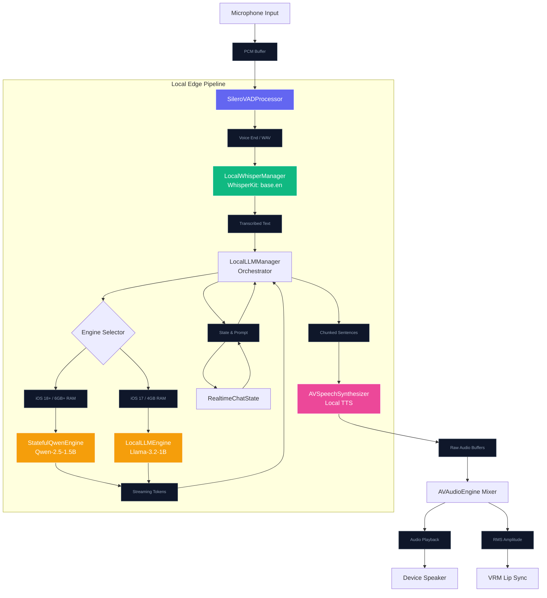

# NPU Integration in NeuraLink

NeuraLink currently leverages cloud infrastructure (OpenAI Realtime API) for its core AI loop, while performing edge processing like Silero VAD and rendering (Metal GPU) locally. However, modern iOS devices (A12 Bionic and newer) are equipped with the **Apple Neural Engine (ANE)**, a highly efficient Neural Processing Unit (NPU) designed to accelerate machine learning tasks with minimal battery impact.

This document outlines how we leverage the NPU in NeuraLink for a performant, power-efficient, and fully offline AI companion.

---

## Local AI Architecture (Orchestrated)

NeuraLink features a modular local AI loop that operates entirely offline. The system automatically selects the best Small Language Model (SLM) for your hardware, providing a private, zero-latency fallback to the OpenAI Cloud API.

```mermaid
graph TD
    %% Input
    Mic["Microphone Input"] --> D1["PCM Buffer"] --> VAD["SileroVADProcessor"]

    %% Local Pipeline
    subgraph Local Edge Pipeline
        direction TB

        VAD --> D2["Voice End / WAV"] --> Whisper["LocalWhisperManager\nWhisperKit: base.en"]
        Whisper --> D3["Transcribed Text"] --> Manager["LocalLLMManager\nOrchestrator"]
        
        %% Model Selection
        Manager --> Selector{"Engine Selector"}
        
        Selector --> C1["iOS 18+ / 6GB+ RAM"] --> Qwen["StatefulQwenEngine\nQwen-2.5-1.5B"]
        Selector --> C2["iOS 17 / 4GB RAM"] --> Llama["LocalLLMEngine\nLlama-3.2-1B"]
        
        %% State loop
        Manager --> D10["State & Prompt"] --> UI["RealtimeChatState"]
        UI --> D10 --> Manager
        
        %% LLM flow
        Qwen --> D5["Streaming Tokens"]
        Llama --> D5
        D5 --> Manager
        
        %% TTS
        Manager --> D6["Chunked Sentences"] --> TTS["AVSpeechSynthesizer\nLocal TTS"]
    end
    
    %% Output
    TTS --> D7["Raw Audio Buffers"] --> Mixer["AVAudioEngine Mixer"]
    Mixer --> D8["Audio Playback"] --> Speaker["Device Speaker"]
    Mixer --> D9["RMS Amplitude"] --> VRM["VRM Lip Sync"]

    %% Core component styles
    style Qwen fill:#f59e0b,stroke:#ffffff,color:#ffffff
    style Llama fill:#f59e0b,stroke:#ffffff,color:#ffffff
    style Whisper fill:#10b981,stroke:#ffffff,color:#ffffff
    style VAD fill:#6366f1,stroke:#ffffff,color:#ffffff
    style TTS fill:#ec4899,stroke:#ffffff,color:#ffffff

    %% Data / flow nodes (including conditions)
    classDef data fill:#0f172a,stroke:#334155,color:#94a3b8,font-size:11px
    class D1,D2,D3,D5,D6,D7,D8,D9,D10,C1,C2 data
```

### How the Local Pipeline Works
1. **Voice Detection**: The `SileroVADProcessor` listens to the microphone. When speech ends, it packages the audio into a WAV buffer.
2. **Speech-to-Text**: The WAV buffer is passed to `LocalWhisperManager`, which uses **WhisperKit** to run transcription directly on the NPU, returning text almost instantly.
3. **Engine Orchestration**: The `LocalLLMManager` selects the inference engine:
   - **`StatefulQwenEngine`**: Utilizes new iOS 18 stateful MLX/Core ML features for high-performance inference of the Qwen-2.5-1.5B model.
   - **`LocalLLMEngine`**: A memory-optimized engine for Llama-3.2-1B, split into 6 chunks to stay within the ANE's memory limits on older devices.
4. **Local LLM Inference**: Transcribed text is formatted using model-specific chat templates and fed into the selected engine. Both engines utilize `MLState` (iOS 17+) to manage KV-caches efficiently on-device.
5. **Text-to-Speech & Lip-Sync**: As tokens stream out, `LocalLLMManager` chunks them into sentences and synthesizes speech using `AVSpeechSynthesizer`. The generated audio buffers are routed through `AVAudioEngine` to extract amplitude curves, ensuring the 3D VRM model's lips synchronize perfectly with the offline voice.

---

## Supported Local SLMs

| Model | Parameters | Quantization | Min. iOS | Min. RAM | Notes |
| :--- | :--- | :--- | :--- | :--- | :--- |
| **Llama-3.2-1B** | 1.2B | 4-bit | iOS 17.0 | 4 GB | Multi-chunk, CPU-optimized for stability. |
| **Qwen-2.5-1.5B** | 1.5B | 4-bit | iOS 18.0 | 6 GB | Stateful, higher reasoning capabilities. |

### Model Downloader Architecture
To ensure a small initial binary size, models are downloaded on-demand from Hugging Face via the `LocalModelDownloadManager`. Each model has a dedicated downloader type (`LlamaModelDownloader`, `QwenModelDownloader`) that handles:
- Snapshot acquisition via `HubApi`.
- Bundle verification and layout normalization.
- Path resolution via model-specific `Access` helpers.

---

## Hardware Requirements
Because Local LLMs require significant Unified Memory:
- **iPhone 11, 12 or 13 (4GB RAM)**: Limited to **Llama-3.2-1B**. The engine is locked to `.cpuOnly` to prevent `ENOMEM` crashes when the NPU/GPU maps large weight files.
- **iPhone 15 Pro and higher, or iPads (8GB+ RAM)**: Can comfortably run **Qwen-2.5-1.5B** and larger models with full NPU acceleration.

By moving these workloads to the NPU, NeuraLink achieves its goal of being a high-performance, private, and deeply native iOS application.

