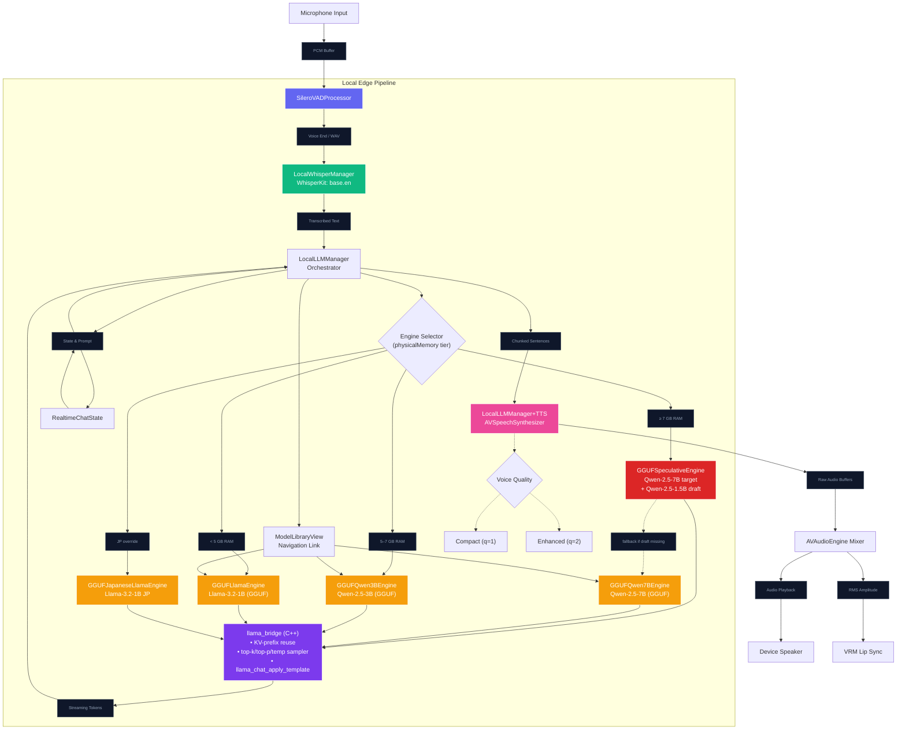

# NPU Integration in NeuraLink

NeuraLink currently leverages cloud infrastructure (OpenAI Realtime API) for its core AI loop, while performing edge processing like Silero VAD and rendering (Metal GPU) locally. However, modern iOS devices (A12 Bionic and newer) are equipped with the **Apple Neural Engine (ANE)**, a highly efficient Neural Processing Unit (NPU) designed to accelerate machine learning tasks with minimal battery impact.

This document outlines how we leverage the NPU in NeuraLink for a performant, power-efficient, and fully offline AI companion.

---

## Local AI Architecture (Orchestrated)

NeuraLink features a modular local AI loop that operates entirely offline. The system automatically selects the best Small Language Model (SLM) for your hardware, providing a private, zero-latency fallback to the OpenAI Cloud API.

```mermaid
graph TD
    %% Input
    Mic["Microphone Input"] --> D1["PCM Buffer"] --> VAD["SileroVADProcessor"]

    %% Local Pipeline
    subgraph Local Edge Pipeline
        direction TB

        VAD --> D2["Voice End / WAV"] --> Whisper["LocalWhisperManager\nWhisperKit: base.en"]
        Whisper --> D3["Transcribed Text"] --> Manager["LocalLLMManager\nOrchestrator"]

        %% Model Selection (RAM-bucketed defaults)
        Manager --> Selector{"Engine Selector\n(physicalMemory tier)"}

        Selector --> T8["≥ 7 GB RAM"] --> Spec["GGUFSpeculativeEngine\nQwen-2.5-7B target\n+ Qwen-2.5-1.5B draft"]
        Spec -.-> Fallback["fallback if draft missing"] -.-> Qwen7B["GGUFQwen7BEngine\nQwen-2.5-7B (GGUF)"]
        Selector --> T6["5–7 GB RAM"] --> Qwen3B["GGUFQwen3BEngine\nQwen-2.5-3B (GGUF)"]
        Selector --> T4["< 5 GB RAM"] --> Llama["GGUFLlamaEngine\nLlama-3.2-1B (GGUF)"]
        Selector --> TJP["JP override"] --> JLlama["GGUFJapaneseLlamaEngine\nLlama-3.2-1B JP"]

        %% State loop
        Manager --> D10["State & Prompt"] --> UI["RealtimeChatState"]
        UI --> D10 --> Manager

        %% Shared C bridge (llama.cpp)
        Spec --> Bridge["llama_bridge (C++)\n• KV-prefix reuse\n• top-k/top-p/temp sampler\n• llama_chat_apply_template"]
        Qwen7B --> Bridge
        Qwen3B --> Bridge
        Llama --> Bridge
        JLlama --> Bridge

        %% LLM flow
        Bridge --> D5["Streaming Tokens"] --> Manager

        %% Model Library
        Manager --> Lib["ModelLibraryView\nNavigation Link"]
        Lib --> Qwen7B
        Lib --> Qwen3B
        Lib --> Llama

        %% TTS
        Manager --> D6["Chunked Sentences"] --> TTS["LocalLLMManager+TTS\nAVSpeechSynthesizer"]
        TTS -.-> QTier{"Voice Quality"}
        QTier -.-> Q1["Compact (q=1)"]
        QTier -.-> Q2["Enhanced (q=2)"]
    end

    %% Output
    TTS --> D7["Raw Audio Buffers"] --> Mixer["AVAudioEngine Mixer"]
    Mixer --> D8["Audio Playback"] --> Speaker["Device Speaker"]
    Mixer --> D9["RMS Amplitude"] --> VRM["VRM Lip Sync"]

    %% Core component styles
    style Spec fill:#dc2626,stroke:#ffffff,color:#ffffff
    style Qwen7B fill:#f59e0b,stroke:#ffffff,color:#ffffff
    style Qwen3B fill:#f59e0b,stroke:#ffffff,color:#ffffff
    style Llama fill:#f59e0b,stroke:#ffffff,color:#ffffff
    style JLlama fill:#f59e0b,stroke:#ffffff,color:#ffffff
    style Bridge fill:#7c3aed,stroke:#ffffff,color:#ffffff
    style Whisper fill:#10b981,stroke:#ffffff,color:#ffffff
    style VAD fill:#6366f1,stroke:#ffffff,color:#ffffff
    style TTS fill:#ec4899,stroke:#ffffff,color:#ffffff

    %% Data / flow nodes (including conditions)
    classDef data fill:#0f172a,stroke:#334155,color:#94a3b8,font-size:11px
    class D1,D2,D3,D5,D6,D7,D8,D9,D10,T4,T6,T8,TJP,Fallback data
```

### How the Local Pipeline Works
1. **Voice Detection**: The `SileroVADProcessor` listens to the microphone. When speech ends, it packages the audio into a WAV buffer.
2. **Speech-to-Text**: The WAV buffer is passed to `LocalWhisperManager`, which uses **WhisperKit** to run transcription directly on the NPU, returning text almost instantly.
3. **Engine Orchestration**: The `LocalLLMManager` selects the inference engine based on `ProcessInfo.physicalMemory` buckets:
   - **`GGUFSpeculativeEngine`** (≥ 7 GB): Qwen-2.5-7B target accelerated by Qwen-2.5-1.5B draft. Yields 2–3× decode throughput; falls back to `GGUFQwen7BEngine` if the draft model is not on disk.
   - **`GGUFQwen3BEngine`** (5–7 GB): Stronger reasoning than 1B-class models, fits the iPhone 14 / 15-base memory budget.
   - **`GGUFLlamaEngine`** (< 5 GB): Memory-optimized Llama-3.2-1B for iPhone 11 / 12 / 13.
   - **`GGUFJapaneseLlamaEngine`**: User-selectable JP-oriented Llama-3.2-1B for Japanese conversation.
4. **Local LLM Inference**: All engines share the same `llama_bridge` C++ layer, which provides:
   - **KV-cache prefix reuse** across turns — system prompt + persona are not re-prefilled every message, cutting first-token latency on multi-turn conversations.
   - **A tuned sampler chain** (top-k=40, top-p=0.9, temp=0.7, repetition penalty=1.1/64) replacing greedy argmax — eliminates the loop/repetition pathologies common with small models.
   - **`llama_chat_apply_template`** — prompts are formatted using the template baked into each model's GGUF metadata, so we never drift from the format the model was trained on. Manager passes role/content pairs; the C bridge applies the right template per model.
5. **Text-to-Speech & Lip-Sync**: As tokens stream out, `LocalLLMManager` (via its [TTS extension](../NeuraLink/AI/LocalLLMManager+TTS.swift)) chunks them into sentences. It uses `AVSpeechSynthesizer` to select the best available local voice. By default, iOS compact voices (`q=1`) are used, but the system is optimized for **Enhanced/Premium** voices (`q=2`) which can be downloaded in iOS Accessibility settings. The generated audio buffers are routed through `AVAudioEngine` to extract amplitude curves for real-time VRM lip-sync.

> [⚠️NOTE]
>
> NeuraLink recently migrated its local AI pipeline from a CoreML-based architecture to a unified `GGUF` backend using `llama.cpp`. This resolved memory crashes and improved compatibility across iOS 17+. For a detailed technical breakdown of this migration, see the [NPU Migration Guide](npu_migration.md).

---

## Supported Local SLMs

| Model | Parameters | Format | File size (Q4_K_M) | Min. iOS | Min. RAM | Notes |
| :--- | :--- | :--- | :--- | :--- | :--- | :--- |
| **Llama-3.2-1B** | 1.2B | GGUF | ~0.8 GB | iOS 17.0 | 4 GB | Memory-efficient baseline for iPhone 11 / 12 / 13. |
| **Llama-3.2-1B (JP)** | 1.2B | GGUF | ~0.8 GB | iOS 17.0 | 4 GB | Japanese-oriented build (`grapevine-AI` upload). |
| **Qwen-2.5-1.5B** | 1.5B | GGUF | ~1.1 GB | iOS 17.0 | 6 GB | Legacy small Qwen. Also acts as the **draft model** for speculative 7B. |
| **Qwen-2.5-3B** | 3B | GGUF | ~1.9 GB | iOS 17.0 | 6 GB | Sweet spot for iPhone 14 / 15 base / Plus. |
| **Qwen-2.5-7B** | 7B | GGUF | ~4.7 GB | iOS 17.0 | 8 GB | Top quality for iPhone 15 Pro / 16 family. Auto-uses speculative decoding when the 1.5B draft is also downloaded. |

### Model Downloader Architecture
To ensure a small initial binary size, models are downloaded on-demand from Hugging Face via the `LocalModelDownloadManager`. Each model has a dedicated downloader type (`GGUFLlamaDownloader`, `GGUFQwenDownloader`, `GGUFQwen3BDownloader`, `GGUFQwen7BDownloader`, `GGUFJapaneseLlamaDownloader`) that handles:
- Snapshot acquisition via `HubApi`.
- Single-file verification and layout normalization.
- Path resolution via model-specific `GGUF...ModelAccess` helpers.

### Speculative Decoding (8 GB tier)

When the user has both Qwen-2.5-7B (`.qwen7b`) and Qwen-2.5-1.5B (`.qwen2b`) downloaded, `LocalLLMManager.makeEngine()` returns `GGUFSpeculativeEngine` instead of plain `GGUFQwen7BEngine`. The C++ bridge runs the classical speculative algorithm:

1. The 1.5B **draft** model generates N=4 greedy tokens, advancing its own KV cache.
2. The 7B **target** model batch-decodes those 4 tokens in a single pass — roughly 1.5× the cost of one target token, regardless of N.
3. The target's sampler chain picks its preferred token at each verified position. Each match is accepted; the first mismatch falls back to the target's choice and rewinds both KV caches via `llama_memory_seq_rm`.
4. Vocab parity (both Qwen-2.5) is enforced at create-time so token ids are interchangeable.

Expected: 2–3× decode throughput on iPhone 15 Pro+ / 16, with output quality identical to plain 7B (target's sampler is the source of truth at every position).

---

## Hardware Requirements

Because Local LLMs require significant Unified Memory, the engine selector auto-buckets by `ProcessInfo.processInfo.physicalMemory`:

| Device | RAM | Default tier | Notes |
| :--- | :--- | :--- | :--- |
| iPhone 11 / 12 / 13 / SE 3 | 4 GB | `.llama1b` | Llama-3.2-1B. Larger models will OOM. |
| iPhone 12 Pro / 13 Pro / 14 family / 15 / 15 Plus | 6 GB | `.qwen3b` | Qwen-2.5-3B comfortably. |
| iPhone 15 Pro / Pro Max / 16 family | 8 GB | `.qwen7b` | Auto-promotes to speculative decoding when the 1.5B draft is also downloaded. |
| iPads (8 GB+) | 8 GB+ | `.qwen7b` | Same as Pro tier. |

The user can manually override the default via `ModelLibraryView` — the warning banner in `AISettingsView` flags downgrades vs the device's recommended tier.

### Engine routing matrix

`LocalLLMManager.makeEngine()` returns one of five engines depending on the user's selected configuration and what's downloaded. Speculative decoding for `.qwen7b` activates only when its 1.5B draft pair (`.qwen2b`) is also on disk.

| Device | Default config | Engine returned |
| :--- | :--- | :--- |
| iPhone 11 / 12 / 13 (4 GB) | `.llama1b` | `GGUFLlamaEngine` (CPU-only via the `<5 GB` fallback in `LlamaBridge.init?`) |
| iPhone 14 / 15-base / Plus (6 GB) | `.qwen3b` | `GGUFQwen3BEngine` |
| iPhone 15 Pro+ / 16 / 17 (8 GB), 7B downloaded only | `.qwen7b` | `GGUFQwen7BEngine` |
| iPhone 15 Pro+ / 16 / 17 (8 GB), 7B **+** 1.5B downloaded | `.qwen7b` | **`GGUFSpeculativeEngine`** (2–3× decode tok/s) |
| Any tier, user-selected JP override | `.japaneseLlama1b` | `GGUFJapaneseLlamaEngine` |

By moving these workloads to the NPU and Metal GPU, NeuraLink achieves its goal of being a high-performance, private, and deeply native iOS application.

