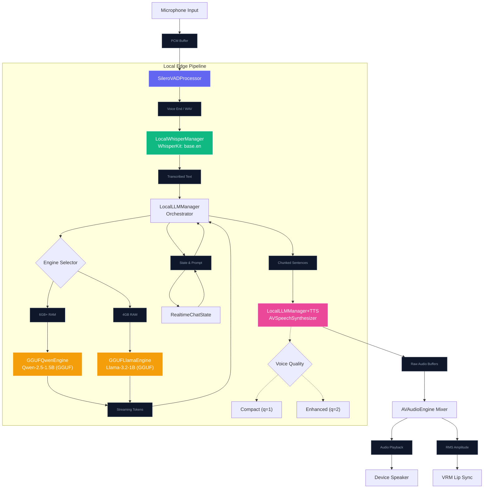

# NPU Integration in NeuraLink

NeuraLink currently leverages cloud infrastructure (OpenAI Realtime API) for its core AI loop, while performing edge processing like Silero VAD and rendering (Metal GPU) locally. However, modern iOS devices (A12 Bionic and newer) are equipped with the **Apple Neural Engine (ANE)**, a highly efficient Neural Processing Unit (NPU) designed to accelerate machine learning tasks with minimal battery impact.

This document outlines how we leverage the NPU in NeuraLink for a performant, power-efficient, and fully offline AI companion.

---

## Local AI Architecture (Orchestrated)

NeuraLink features a modular local AI loop that operates entirely offline. The system automatically selects the best Small Language Model (SLM) for your hardware, providing a private, zero-latency fallback to the OpenAI Cloud API.

```mermaid
graph TD
    %% Input
    Mic["Microphone Input"] --> D1["PCM Buffer"] --> VAD["SileroVADProcessor"]

    %% Local Pipeline
    subgraph Local Edge Pipeline
        direction TB

        VAD --> D2["Voice End / WAV"] --> Whisper["LocalWhisperManager\nWhisperKit: base.en"]
        Whisper --> D3["Transcribed Text"] --> Manager["LocalLLMManager\nOrchestrator"]
        
        %% Model Selection
        Manager --> Selector{"Engine Selector"}
        
        Selector --> C1["6GB+ RAM"] --> Qwen["GGUFQwenEngine\nQwen-2.5-1.5B (GGUF)"]
        Selector --> C2["4GB RAM"] --> Llama["GGUFLlamaEngine\nLlama-3.2-1B (GGUF)"]
        
        %% State loop
        Manager --> D10["State & Prompt"] --> UI["RealtimeChatState"]
        UI --> D10 --> Manager
        
        %% LLM flow
        Qwen --> D5["Streaming Tokens"]
        Llama --> D5
        D5 --> Manager
        
        %% TTS
        Manager --> D6["Chunked Sentences"] --> TTS["LocalLLMManager+TTS\nAVSpeechSynthesizer"]
        TTS -.-> QTier{"Voice Quality"}
        QTier -.-> Q1["Compact (q=1)"]
        QTier -.-> Q2["Enhanced (q=2)"]
    end
    
    %% Output
    TTS --> D7["Raw Audio Buffers"] --> Mixer["AVAudioEngine Mixer"]
    Mixer --> D8["Audio Playback"] --> Speaker["Device Speaker"]
    Mixer --> D9["RMS Amplitude"] --> VRM["VRM Lip Sync"]

    %% Core component styles
    style Qwen fill:#f59e0b,stroke:#ffffff,color:#ffffff
    style Llama fill:#f59e0b,stroke:#ffffff,color:#ffffff
    style Whisper fill:#10b981,stroke:#ffffff,color:#ffffff
    style VAD fill:#6366f1,stroke:#ffffff,color:#ffffff
    style TTS fill:#ec4899,stroke:#ffffff,color:#ffffff

    %% Data / flow nodes (including conditions)
    classDef data fill:#0f172a,stroke:#334155,color:#94a3b8,font-size:11px
    class D1,D2,D3,D5,D6,D7,D8,D9,D10,C1,C2 data
```

### How the Local Pipeline Works
1. **Voice Detection**: The `SileroVADProcessor` listens to the microphone. When speech ends, it packages the audio into a WAV buffer.
2. **Speech-to-Text**: The WAV buffer is passed to `LocalWhisperManager`, which uses **WhisperKit** to run transcription directly on the NPU, returning text almost instantly.
3. **Engine Orchestration**: The `LocalLLMManager` selects the inference engine:
   - **`GGUFQwenEngine`**: Utilizes `llama.cpp` for high-performance GGUF inference of the Qwen-2.5-1.5B model, accelerated by the Metal GPU and NPU.
   - **`GGUFLlamaEngine`**: A memory-optimized GGUF engine for Llama-3.2-1B, utilizing Metal acceleration for stable performance on all devices.
4. **Local LLM Inference**: Transcribed text is formatted and fed into the selected engine. Both engines utilize the `llama.cpp` backend for efficient token generation.
5. **Text-to-Speech & Lip-Sync**: As tokens stream out, `LocalLLMManager` (via its [TTS extension](../NeuraLink/AI/LocalLLMManager+TTS.swift)) chunks them into sentences. It uses `AVSpeechSynthesizer` to select the best available local voice. By default, iOS compact voices (`q=1`) are used, but the system is optimized for **Enhanced/Premium** voices (`q=2`) which can be downloaded in iOS Accessibility settings. The generated audio buffers are routed through `AVAudioEngine` to extract amplitude curves for real-time VRM lip-sync.

> [⚠️NOTE]
>
> NeuraLink recently migrated its local AI pipeline from a CoreML-based architecture to a unified `GGUF` backend using `llama.cpp`. This resolved memory crashes and improved compatibility across iOS 17+. For a detailed technical breakdown of this migration, see the [NPU Migration Guide](npu_migration.md).

---

## Supported Local SLMs

| Model | Parameters | Format | Min. iOS | Min. RAM | Notes |
| :--- | :--- | :--- | :--- | :--- | :--- |
| **Llama-3.2-1B** | 1.2B | GGUF | iOS 17.0 | 4 GB | Memory efficient, Metal-accelerated. |
| **Qwen-2.5-1.5B** | 1.5B | GGUF | iOS 17.0 | 6 GB | High-performance, better reasoning. |

### Model Downloader Architecture
To ensure a small initial binary size, models are downloaded on-demand from Hugging Face via the `LocalModelDownloadManager`. Each model has a dedicated downloader type (`GGUFLlamaDownloader`, `GGUFQwenDownloader`) that handles:
- Snapshot acquisition via `HubApi`.
- Single-file verification and layout normalization.
- Path resolution via model-specific `GGUF...ModelAccess` helpers.

---

## Hardware Requirements
Because Local LLMs require significant Unified Memory:
- **iPhone 11, 12 or 13 (4GB RAM)**: Limited to **Llama-3.2-1B**. The engine is locked to `.cpuOnly` to prevent `ENOMEM` crashes when the NPU/GPU maps large weight files.
- **iPhone 15 Pro and higher, or iPads (8GB+ RAM)**: Can comfortably run **Qwen-2.5-1.5B** and larger models with full NPU acceleration.

By moving these workloads to the NPU, NeuraLink achieves its goal of being a high-performance, private, and deeply native iOS application.

