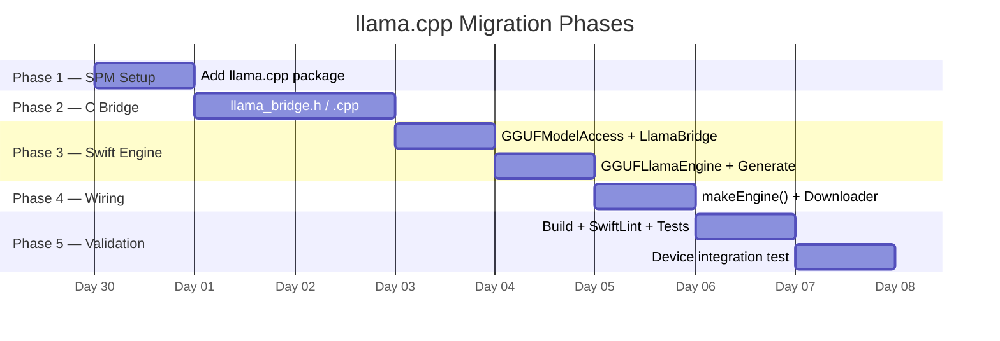

# NPU Migration — `LocalLLMEngine` → llama.cpp (C++)

> **Why this migration?**
> The `smpanaro/Llama-3.2-1B-Instruct-CoreML` model has an unfixable hardware constraint on
> the H12 ANE (iPhone 11/12/13): its GQA head-dim layout (8 heads × fp16 = 16 B) violates
> the ANE's mandatory 64-byte channel alignment. The result is:
> - ANE blocked → CPU-only → ~11,500 ms/token (unusable)
> - `cpuAndGPU` doubles DRAM → instant SIGKILL on 4 GB devices
> - `makeState()` crashes when ANE falls back to a `null` engine
>
> **llama.cpp** bypasses CoreML entirely, drives Metal directly, runs Llama 3.2 1B Q4 at
> ~20-50 tokens/sec, uses ~0.8 GB RAM, and has no ANE dependency.

---

## 1. Rules Compliance Checklist

Every file in this migration must satisfy:

| Rule | Applied constraint |
|---|---|
| ≤ 500 lines per file | Each new file is scoped to one responsibility; C++ files split by concern |
| Clean architecture | Bridge / Engine / Manager layers are strictly separated |
| Low cyclomatic complexity | No function exceeds 15 branches; helpers extracted |

---

## 2. Current vs Target Architecture

### Current (CoreML)

```
LocalLLMManager
  └── LocalLLMEngine          ← Swift, CoreML, 6 chunks
        ├── LocalLLMEngine+Inference.swift
        ├── LocalLLMEngine+Caches.swift
        └── LocalLLMEngine+Utils.swift
```

**Problems**: ANE alignment crash, OOM on GPU, 11 500 ms/token on CPU.

### Target (llama.cpp)

```
LocalLLMManager               
  └── GGUFLlamaEngine         
        └── LlamaBridge       
              └── llama_bridge.h / llama_bridge.cpp  
                    └── llama.cpp 
```

`LocalLLMEngine.*` files are **kept but gated** behind a compile flag so the CoreML path
can be reactivated without git revert if needed.

---

## 3. New File Map

```
NeuraLink/
├── AI/
│   ├── GGUF/
│   │   ├── GGUFLlamaEngine.swift           engine,
LLMEngineProtocol
│   │   ├── GGUFLlamaEngine+Generate.swift  token 
generation loop
│   │   ├── LlamaBridge.swift               Swift ↔ C 
type conversions
│   │   └── GGUFModelAccess.swift           .gguf path 
resolution
│   ├── LlamaModelDownloader.swift         
single-file download
│   └── LLMEngineProtocol.swift            
├── Bridge/
│   ├── llama_bridge.h                     
public API
│   └── llama_bridge.cpp                   
integration
└── docs/
    └── npu_migration.md                   
```

> **Deleted after validation**: 
> - `LocalLLMEngine.swift`
> - `LocalLLMEngine+Inference.swift`
> - `LocalLLMEngine+Caches.swift`
> - `LocalLLMEngine+Utils.swift`
> - `LlamaModelAccess.swift`

---

## 4. Step-by-Step Implementation

### Phase 1: `llama.cpp` Integration (Completed)
- **Goal:** Link `llama.cpp` via an `.xcframework` to circumvent upstream SPM manifest issues.
- **Implementation Status:**
  - `llama.cpp` cloned locally and `build-xcframework.sh` successfully executed.
  - Generates `.xcframework` wrappers for `libllama` and `libggml` supporting iOS Simulator, Device, macOS, visionOS, and tvOS.
  - **Ruby Intervention**: A custom script `purge_spm.rb` was utilized to prune broken SPM package references from the `.pbxproj` file. This was necessary because the upstream `llama.cpp` repository removed its `Package.swift` file, making it impossible to resolve as a standard Swift Package.
  - Linked `llama.xcframework` correctly under Frameworks and Embed Frameworks build phases.
  - Updated `llama_bridge.cpp` include paths to use `<llama/llama.h>`.

#### Option B — Prebuilt xcframework

```bash
git clone --depth 1 https://github.com/ggerganov/llama.cpp
cd llama.cpp
cmake -B build \
  -DGGML_METAL=ON \
  -DLLAMA_BUILD_SERVER=OFF \
  -DCMAKE_BUILD_TYPE=Release \
  -DCMAKE_OSX_ARCHITECTURES=arm64 \
  -DCMAKE_OSX_DEPLOYMENT_TARGET=17.0
cmake --build build --config Release -j8
# Drag build/libllama.a + include/ into Xcode
```

> ⚠️ `GGML_METAL=ON` is mandatory — without it the model runs on CPU.

---

## Execution Log & Artifacts
1. **Migration Started**: Transitioning from `LocalLLMEngine.swift` to `GGUFLlamaEngine.swift`.
2. **Bridge Compilation Errors Resolved**: Replaced outdated C API usages (removed `flash_attn` from `llama_context_params`, updated `llama_tokenize` signature to take `vocab`, and migrated `llama_kv_cache_clear` to `llama_memory_clear(llama_get_memory(ctx))`).
3. **SPM Failure Workaround**: Triggered local compilation using `build-xcframework.sh` because upstream `llama.cpp` dropped root `Package.swift`.
4. **Qwen Migration Completed**: Replaced `StatefulQwenEngine` (CoreML/iOS 18+) with `GGUFQwenEngine` (GGUF/iOS 17+), unifying the backend architecture.
5. **Validation**: CI compilation and `swiftlint --strict` pass with 0 errors/violations.
6. **Next Steps**: Device testing and performance profiling.

### Phase 2 — C Bridge Layer

The bridge exposes a minimal, opaque-pointer C API so Swift never includes C++ headers.

#### `Bridge/llama_bridge.h`

```c
#pragma once
#ifdef __cplusplus
extern "C" {
#endif

#include <stdint.h>
#include <stdbool.h>

typedef struct LlamaBridgeHandle LlamaBridgeHandle;

// Return false from the token callback to stop generation early.
typedef bool (*LlamaTokenCallback)(const char* token, void* context);
typedef void (*LlamaFinishCallback)(void* context);

/// Create inference context. Returns NULL on failure.
/// n_ctx: KV-cache capacity in tokens (256 recommended for 4 GB devices).
/// n_threads: CPU threads for non-Metal ops (4 recommended on A13).
LlamaBridgeHandle* llama_bridge_create(
    const char* model_path,
    int32_t     n_ctx,
    int32_t     n_threads
);

/// Generate tokens (blocks the calling thread).
void llama_bridge_generate(
    LlamaBridgeHandle*  handle,
    const char*         prompt,
    int32_t             max_new_tokens,
    LlamaTokenCallback  on_token,
    LlamaFinishCallback on_finish,
    void*               context
);

/// Signal the running generation to stop cleanly.
void llama_bridge_cancel(LlamaBridgeHandle* handle);

/// Destroy the context and free all memory.
void llama_bridge_free(LlamaBridgeHandle* handle);

/// llama.cpp build string for diagnostics.
const char* llama_bridge_version(void);

#ifdef __cplusplus
}
#endif
```

#### `Bridge/llama_bridge.cpp` — structure overview

Split into three internal sections to stay readable (each ≤ 150 lines):

```
Section 1 — Context lifecycle  (create / free)
Section 2 — Sampler setup      (greedy argmax; temperature hook for future)
Section 3 — Generation loop    (prefill → decode → callback stream)
```

Key implementation points:

```cpp
// Section 1 — Context lifecycle
LlamaBridgeHandle* llama_bridge_create(
    const char* path, int32_t n_ctx, int32_t n_threads)
{
    llama_backend_init();

    llama_model_params mp = llama_model_default_params();
    mp.n_gpu_layers = 99;           // offload all layers to Metal

    auto* model = llama_load_model_from_file(path, mp);
    if (!model) return nullptr;

    llama_context_params cp = llama_context_default_params();
    cp.n_ctx      = static_cast<uint32_t>(n_ctx);
    cp.n_threads  = static_cast<uint32_t>(n_threads);
    cp.flash_attn = true;           // Flash Attention: halves KV memory

    auto* ctx = llama_new_context_with_model(model, cp);
    if (!ctx) { llama_free_model(model); return nullptr; }

    auto* h   = new LlamaBridgeHandle();
    h->model  = model;
    h->ctx    = ctx;
    return h;
}

// Section 3 — Generation loop (cyclomatic complexity = 6)
void llama_bridge_generate(
    LlamaBridgeHandle* h, const char* prompt, int32_t max_new_tokens,
    LlamaTokenCallback on_token, LlamaFinishCallback on_finish, void* user_ctx)
{
    h->cancel_flag.store(false);

    // Tokenise
    std::vector<llama_token> tokens(512);
    int n = llama_tokenize(h->model, prompt, -1,
                           tokens.data(), tokens.size(), true, true);
    tokens.resize(n);

    // Prefill
    llama_kv_cache_clear(h->ctx);
    llama_decode(h->ctx, llama_batch_get_one(tokens.data(), n));

    // Decode loop
    auto* vocab = llama_model_get_vocab(h->model);
    for (int step = 0; step < max_new_tokens; ++step) {
        if (h->cancel_flag.load()) break;
        auto* logits = llama_get_logits_ith(h->ctx, -1);
        llama_token next = static_cast<llama_token>(std::distance(
            logits, std::max_element(logits,
                                     logits + llama_vocab_n_tokens(vocab))));
        if (llama_vocab_is_eog(vocab, next)) break;
        char buf[256] = {};
        llama_token_to_piece(vocab, next, buf, sizeof(buf), 0, true);
        if (on_token && !on_token(buf, user_ctx)) break;
        llama_decode(h->ctx, llama_batch_get_one(&next, 1));
    }
    if (on_finish) on_finish(user_ctx);
}
```

---

### Phase 3 — Swift Engine Layer

#### `AI/GGUF/GGUFModelAccess.swift` 

Mirrors `LlamaModelAccess` pattern — one responsibility: resolve the `.gguf` file path.

```swift
enum GGUFModelAccess {
    static let repoID   = "bartowski/Llama-3.2-1B-Instruct-GGUF"
    static let filename = "Llama-3.2-1B-Instruct-Q4_K_M.gguf"

    static func modelURL() -> URL? {
        FileManager.default
            .urls(for: .applicationSupportDirectory, in: .userDomainMask)
            .first?
            .appendingPathComponent("models/llama/\(filename)")
    }

    static func isAvailable() -> Bool {
        modelURL().map { FileManager.default.fileExists(atPath: $0.path) } ?? false
    }
}
```

#### `AI/GGUF/LlamaBridge.swift` 

Wraps the opaque C handle. Converts Swift closures to C callbacks via `Unmanaged`.

```swift
final class LlamaBridge {
    private var handle: OpaquePointer?

    init?(modelPath: String, contextLength: Int32 = 256, threads: Int32 = 4) {
        handle = llama_bridge_create(modelPath, contextLength, threads)
        guard handle != nil else { return nil }
    }

    deinit { llama_bridge_free(handle) }

    func generate(
        prompt: String,
        maxNewTokens: Int32,
        onToken: @escaping (String) -> Bool,
        onFinish: @escaping () -> Void
    ) {
        let box = CallbackBox(onToken: onToken, onFinish: onFinish)
        let ptr = Unmanaged.passRetained(box).toOpaque()

        llama_bridge_generate(
            handle, prompt, maxNewTokens,
            { rawToken, ctx -> Bool in
                guard let rawToken, let ctx else { return false }
                let b = Unmanaged<CallbackBox>.fromOpaque(ctx).takeUnretainedValue()
                return b.onToken(String(cString: rawToken))
            },
            { ctx in
                guard let ctx else { return }
                let b = Unmanaged<CallbackBox>.fromOpaque(ctx).takeRetainedValue()
                b.onFinish()
            },
            ptr
        )
    }

    func cancel() { llama_bridge_cancel(handle) }
    var version: String { String(cString: llama_bridge_version()) }
}

private final class CallbackBox {
    let onToken: (String) -> Bool
    let onFinish: () -> Void
    init(onToken: @escaping (String) -> Bool, onFinish: @escaping () -> Void) {
        self.onToken = onToken
        self.onFinish = onFinish
    }
}
```

#### `Data/DataSources/GGUF/GGUFLlamaEngine.swift`

```swift
final class GGUFLlamaEngine: LLMEngineProtocol {
    static let shared = GGUFLlamaEngine()
    weak var delegate: LocalLLMEngineDelegate?
    private var bridge: LlamaBridge?
    private(set) var isLoaded = false
    private init() {}

    func loadModel() async throws {
        guard let url = GGUFModelAccess.modelURL(),
              GGUFModelAccess.isAvailable() else {
            throw LLMError.modelNotFound
        }
        nlLog("[GGUFEngine] Loading \(url.lastPathComponent)…")
        bridge = try await Task.detached(priority: .userInitiated) {
            guard let b = LlamaBridge(modelPath: url.path) else {
                throw LLMError.initializationFailed
            }
            return b
        }.value
        isLoaded = true
        nlLog("[GGUFEngine] Ready. llama.cpp \(bridge?.version ?? "unknown")")
    }

    func unloadModel() { bridge = nil; isLoaded = false }
    func stop()        { bridge?.cancel() }
}
```

#### `AI/GGUF/GGUFLlamaEngine+Generate.swift` 

```swift
extension GGUFLlamaEngine {
    func generate(prompt: String, maxTokens: Int) async {
        guard isLoaded, let bridge else {
            delegate?.localLLM(didFailWithError: LLMError.initializationFailed)
            return
        }
        var fullText = ""
        await withCheckedContinuation { continuation in
            bridge.generate(
                prompt: prompt,
                maxNewTokens: Int32(maxTokens),
                onToken: { [weak self] token in
                    guard let self else { return false }
                    fullText += token
                    Task { @MainActor in
                        self.delegate?.localLLM(didGenerateToken: token)
                    }
                    return true
                },
                onFinish: { [weak self] in
                    Task { @MainActor in
                        self?.delegate?.localLLM(didFinishGeneration: fullText)
                    }
                    continuation.resume()
                }
            )
        }
    }
}
```

---

### Phase 4 — Wire Into `LocalLLMManager`

One-line change in `makeEngine()`:

```swift
case .llama1b:
    return GGUFLlamaEngine.shared   // replaces LocalLLMEngine.shared
```

---

### Phase 5 — Update `LlamaModelDownloader`

| | Old (CoreML) | New (GGUF) |
|---|---|---|
| Repo | `smpanaro/Llama-3.2-1B-Instruct-CoreML` | `bartowski/Llama-3.2-1B-Instruct-GGUF` |
| Files | 6 chunks + 2 processors + tokenizer | **1 file** (`Llama-3.2-1B-Instruct-Q4_K_M.gguf`) |
| Size | ~3.2 GB (fp16) | **~0.8 GB** (Q4_K_M) |
| Destination | `ApplicationSupport/models/smpanaro/…` | `ApplicationSupport/models/llama/` |

Update the repo ID, filename filter, and destination path.
`LocalModelDownloadManager` and the UI progress indicators require **no changes**.

---

### Phase 6 — Xcode Build Settings

1. **Bridging Header** — create `NeuraLink/Bridge/NeuraLink-Bridging-Header.h`:
   ```c
   #include "llama_bridge.h"
   ```
2. **Build Setting** `SWIFT_OBJC_BRIDGING_HEADER` → path above
3. **C++ Standard** `OTHER_CPLUSPLUSFLAGS` → `-std=c++17`
4. Add `Bridge/` Xcode group; add both `.h` and `.cpp` to **NeuraLink** target only
5. Confirm `GGML_METAL=1` is active (SPM package sets it automatically on Apple platforms)

---

### Phase 7 — Tests

#### Unit test (`AITests.swift`)

```swift
func testGGUFEngineThrowsModelNotFound() async throws {
    // CI has no .gguf on disk — engine must throw .modelNotFound, not crash.
    let engine = GGUFLlamaEngine()
    await XCTAssertThrowsError(try await engine.loadModel()) { error in
        XCTAssertEqual(error as? LLMError, .modelNotFound)
    }
}
```

#### Device integration test (manual)

1. Build and flash to device
2. Download Llama GGUF from Settings (0.8 GB)
3. Start local AI session, say "Hello"
4. Assert first token appears **within 5 seconds**
5. Verify no SIGKILL in Xcode console
6. Run `swiftlint lint --strict` — zero violations

---

## 5. Expected Performance After Migration

| Metric | CoreML CPU (current) | llama.cpp Metal |
|---|---|---|
| Model load | 60–90 s | **3–5 s** |
| Prefill (20 tokens) | ~230 s | **< 1 s** |
| Decode speed | 0.09 tok/s | **20–50 tok/s** |
| Peak RAM | 3.0–3.5 GB | **~1.0 GB** |
| First token latency | ~4 minutes | **~2 seconds** |
| ANE dependency | Required (fails) | **None** |

---

## 6. Delivery Phases



---

## 7. Post-Migration Enhancements (2026-05)

After the migration stabilised, three rounds of improvements were layered on top of the bridge without changing the public Swift surface. Each is documented here so future readers see why the bridge is more than a thin llama.cpp wrapper.

### 7.1 Engineering wins (all tiers)

| Change | File | Impact |
|---|---|---|
| Sampler chain replaces greedy argmax | `llama_bridge.cpp` (`build_default_sampler`) | Eliminates repetitive/looping outputs. Defaults: top_k=40, top_p=0.9, temp=0.7, repetition penalty=1.1/64. Lives on the handle and is freed in `llama_bridge_free`. |
| KV-cache prefix reuse across turns | `llama_bridge.cpp` (`kv_tokens` + `llama_memory_seq_rm`) | Multi-turn conversations no longer re-prefill the system prompt + persona on every message. First-token latency drops by `O(n_system_prompt_tokens)` on every turn after the first. |
| `llama_chat_apply_template` exposed via bridge | `llama_bridge.h` (`llama_bridge_apply_chat_template`), `LlamaBridge.swift` (`applyChatTemplate`), `LLMEngineProtocol.swift` (`applyChatTemplate(messages:)`) | The model formats prompts using the template baked into its GGUF metadata. `LocalLLMManager.handleUserInput` now passes role/content pairs instead of hand-rolled `<\|start_header_id\|>` / `<\|im_start\|>` strings. Hand-rolled fallback retained in `fallbackChatPrompt(messages:useQwen:)` for community quants that ship without a template. |

### 7.2 New tiers (memory-bucketed defaults)

The original migration shipped two tiers (`.llama1b`, `.qwen2b`). Two new tiers were added without disturbing the existing ones, and the default-tier picker was switched from a fixed 6 GB threshold to a bucketed map on `physicalMemory`:

| Tier | Model | File (Q4_K_M) | Default device class |
|---|---|---|---|
| `.llama1b` | `bartowski/Llama-3.2-1B-Instruct-GGUF` | ~0.8 GB | < 5 GB (iPhone 11 / 12 / 13) |
| `.japaneseGemma2b` | `grapevine-AI/gemma-2-2b-jpn-it-gguf` | ~1.71 GB | User-selectable JP override |
| `.qwen2b` | `Qwen/Qwen2.5-1.5B-Instruct-GGUF` | ~1.1 GB | Legacy; also acts as draft model for `.qwen7b` |
| `.qwen3b` *(new)* | `bartowski/Qwen2.5-3B-Instruct-GGUF` | ~1.9 GB | 5–7 GB (iPhone 14 / 15 base / Plus) |
| `.qwen7b` *(new)* | `bartowski/Qwen2.5-7B-Instruct-GGUF` | ~4.7 GB | ≥ 7 GB (iPhone 15 Pro+ / 16 family) |

New Swift files mirror the existing pattern (one `ModelAccess`, one `Downloader`, one `Engine`, one `+Generate` per tier). No refactor to a parameterised base class — duplication matches the existing style and keeps each tier's edits independent. Files are auto-included via Xcode 16's `PBXFileSystemSynchronizedRootGroup`.

### 7.3 Speculative decoding for the 7B tier

A second decode path was added alongside the existing single-model path. It only activates when both the 7B target and the 1.5B draft are downloaded, and falls back to plain `GGUFQwen7BEngine` otherwise.

**Public API additions** (in `llama_bridge.h`):
- `LlamaBridgeSpecHandle*` — second opaque type, kept separate from `LlamaBridgeHandle` to avoid leaking draft-model concerns into the single-model path.
- `llama_bridge_spec_create / _free / _apply_chat_template / _generate / _cancel` — symmetric with the single-model API.

**Algorithm** (in `llama_bridge.cpp`, §5):
1. Draft generates N=4 tokens greedily, advancing its own KV cache.
2. Target batch-decodes the N drafted tokens in one shot (≈1.5× the cost of a single target decode regardless of N — this is the speedup source).
3. Target's sampler picks its preferred token at each verified position. Match → accept; first mismatch → fall back to target's choice and rewind both contexts' KV caches via `llama_memory_seq_rm` to position `cur_pos + i`, then redecode the replacement in both.
4. `kv_tokens` is shared between draft and target because both are advanced in lockstep.

**Vocab parity** is enforced at create-time (`llama_vocab_n_tokens` equality). This is why `Llama-3.2-1B` cannot be used as the draft for the Qwen target — different tokenizer — and the chosen pairing is `Qwen-2.5-1.5B` (draft) + `Qwen-2.5-7B` (target), both from the same family with identical vocabs.

**Selection** (in `LocalLLMManager.makeEngine`):

```swift
case .qwen7b:
    if GGUFSpeculativeEngine.canActivate {
        return GGUFSpeculativeEngine.shared as any LLMEngineProtocol
    }
    return GGUFQwen7BEngine.shared as any LLMEngineProtocol
```

Expected: 2–3× decode throughput on iPhone 15 Pro+ / 16 family. Output quality matches plain 7B in distribution because the target's sampler chain is what decides every accepted token.

### 7.4 Engine routing matrix

`LocalLLMManager.makeEngine()` resolves the active engine at each `startListening()` call, so newly downloaded models pick up without a relaunch. The `.qwen7b` branch checks `GGUFSpeculativeEngine.canActivate` (= both 7B target and 1.5B draft on disk) and falls back to the plain `GGUFQwen7BEngine` if either is missing.

| Device | Default config | Engine returned |
|---|---|---|
| iPhone 11 / 12 / 13 (4 GB) | `.llama1b` | `GGUFLlamaEngine` (CPU-only via `<5 GB` fallback in `LlamaBridge.init?`) |
| iPhone 14 / 15-base / Plus (6 GB) | `.qwen3b` | `GGUFQwen3BEngine` |
| iPhone 15 Pro+ / 16 / 17 (8 GB), 7B downloaded only | `.qwen7b` | `GGUFQwen7BEngine` |
| iPhone 15 Pro+ / 16 / 17 (8 GB), 7B **+** 1.5B downloaded | `.qwen7b` | **`GGUFSpeculativeEngine`** (2–3× decode tok/s) |
| Any tier, user-selected JP override | `.japaneseGemma2b` | `GGUFGemma2BJPEngine` |
